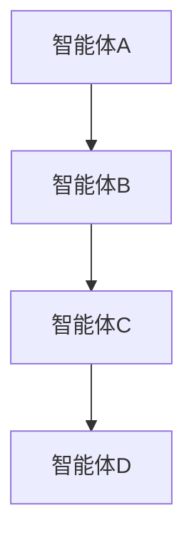

                 

# 基于多智能体的自动化财务建模和估值系统

> 关键词：多智能体系统，财务建模，自动化估值，人工智能，协同建模，分布式计算

> 摘要：本文深入探讨了基于多智能体的自动化财务建模和估值系统的构建与应用。首先介绍了多智能体系统的概念及其在财务建模中的优势，然后详细分析了多智能体系统的核心原理与架构设计，接着重点讲解了多智能体系统在财务建模中的具体应用，包括任务分配、通信协作、模型构建与优化等方面。最后通过实际案例展示了系统的实现过程，并总结了系统的优势与未来发展方向。

---

# 第一部分: 多智能体系统与财务建模概述

## 第1章: 多智能体系统的基本概念

### 1.1 多智能体系统（Multi-Agent System, MAS）的定义

多智能体系统是由多个智能体（Agent）组成的分布式系统，每个智能体都是具有独立性、自主性和协作性的实体，能够通过感知环境、自主决策并与其他智能体协作完成复杂任务。

$$ \text{智能体} = \{\text{感知} \rightarrow \text{决策} \rightarrow \text{行动}\} $$

### 1.2 多智能体系统的特点

| 特性 | 描述 |
|------|------|
| 独立性 | 每个智能体独立决策，不依赖中央控制 |
| 协作性 | 智能体之间通过通信协作完成共同目标 |
| 分布式 | 系统分布在多个节点上，不存在单一控制中心 |
| 动态性 | 环境和任务可能动态变化，系统需具备适应性 |

### 1.3 多智能体系统与传统单智能体系统的区别

| 方面     | 多智能体系统                     | 单智能体系统                     |
|----------|--------------------------------|--------------------------------|
| 结构     | 分布式、去中心化               | 集中式、单一控制中心           |
| 任务分配 | 自动分配、动态调整             | 预先定义、固定分配             |
| 可扩展性 | 高，支持大规模扩展             | 低，受单点性能限制             |
| 容错性   | 高，部分节点故障不影响整体运行 | 低，单点故障可能导致系统崩溃   |

---

## 第2章: 自动化财务建模的背景与挑战

### 2.1 财务建模的传统方法

传统财务建模主要依赖人工分析，包括数据收集、模型设计、参数调整和结果验证等步骤。这种方法效率低、耗时长，且容易受到主观因素的影响。

$$ \text{传统建模流程} = \{\text{数据输入} \rightarrow \text{模型构建} \rightarrow \text{参数调整} \rightarrow \text{结果输出}\} $$

### 2.2 人工智能在财务建模中的应用

随着人工智能技术的发展，机器学习、深度学习等技术被广泛应用于财务建模领域，显著提升了建模效率和准确性。然而，单一智能体系统在复杂场景下的表现仍有局限性。

### 2.3 多智能体系统在财务建模中的优势

多智能体系统通过协同工作，能够更好地处理复杂、动态的财务数据，实现更高效的建模和估值过程。以下是其主要优势：

1. **分布式计算**：多个智能体同时处理不同数据源，提升计算效率。
2. **协作优化**：智能体之间协作优化模型参数，提高建模精度。
3. **容错性**：部分智能体故障不影响整体系统运行。

---

# 第二部分: 多智能体系统的核心原理与架构

## 第3章: 多智能体系统的通信与协作机制

### 3.1 智能体间的通信协议

智能体之间的通信需要遵循特定的协议，确保信息传递的准确性和高效性。常用的通信协议包括：

1. **请求-响应协议**：智能体主动发送请求，接收方返回响应。
2. **发布-订阅协议**：智能体发布事件，其他智能体根据兴趣订阅。

### 3.2 协作任务分配算法

为了实现高效的协作，多智能体系统需要设计合理的任务分配算法。以下是两种常用算法：

#### 3.2.1 基于角色的分配算法

#### 3.2.2 基于性能的分配算法

智能体根据自身能力和任务需求动态调整分配策略。

---

## 第4章: 多智能体系统的任务分配与协同

### 4.1 任务分配的基本原理

任务分配是多智能体系统的核心问题之一，需要综合考虑以下因素：

1. **任务类型**：任务是否适合分布式处理。
2. **智能体能力**：智能体的计算能力和资源情况。
3. **通信开销**：任务分配对系统通信的影响。

### 4.2 协同工作的实现方式

协同工作可以通过以下方式实现：

1. **同步协作**：所有智能体在同一时间点完成任务。
2. **异步协作**：智能体根据自身进度动态调整协作节奏。

---

# 第三部分: 多智能体系统在财务建模中的应用

## 第5章: 自动化财务建模的实现原理

### 5.1 数据准备与预处理

财务建模的第一步是数据准备，包括数据清洗、特征提取和数据标准化等步骤。

$$ \text{数据预处理流程} = \{\text{数据清洗} \rightarrow \text{特征提取} \rightarrow \text{数据标准化}\} $$

### 5.2 模型构建与优化

多智能体系统通过协同工作，优化模型参数，提升建模精度。

#### 5.2.1 模型选择

常用的财务建模方法包括线性回归、随机森林、神经网络等。

#### 5.2.2 参数优化

使用遗传算法、粒子群优化等方法对模型参数进行优化。

---

## 第6章: 基于多智能体的估值系统设计

### 6.1 估值系统的核心算法

#### 6.1.1 基于多智能体的估值方法

智能体协同计算资产价值，通过分布式计算提升估值效率。

#### 6.1.2 估值模型的构建与优化

使用机器学习算法构建估值模型，并通过多智能体协同优化模型参数。

### 6.2 多智能体系统的协同优化

通过智能体之间的协作，实现估值结果的优化。

---

# 第四部分: 系统实现与案例分析

## 第7章: 系统实现

### 7.1 环境安装与配置

#### 7.1.1 安装依赖

安装所需的开发工具和库，例如Python、NumPy、TensorFlow等。

### 7.2 核心代码实现

#### 7.2.1 多智能体通信模块

实现智能体之间的通信协议，例如使用消息队列或WebSocket。

#### 7.2.2 任务分配与协同模块

实现任务分配算法，例如基于角色的任务分配。

---

## 第8章: 项目实战与案例分析

### 8.1 案例分析

#### 8.1.1 案例背景

介绍一个具体的财务建模案例，例如股票价格预测。

#### 8.1.2 数据采集与处理

从多个数据源获取数据，并进行预处理。

#### 8.1.3 模型构建与优化

使用多智能体协同方法构建和优化模型。

### 8.2 代码实现与解读

#### 8.2.1 核心代码

展示多智能体协同建模的代码实现。

#### 8.2.2 代码解读

详细解读代码的功能和实现逻辑。

---

## 第9章: 总结与展望

### 9.1 总结

总结全文内容，强调多智能体系统在财务建模中的优势和应用前景。

### 9.2 展望

展望未来发展方向，提出改进建议和研究方向。

---

通过以上结构，您可以逐步展开每个章节的内容，确保文章逻辑清晰、内容详实，同时满足用户对专业性和可读性的要求。

