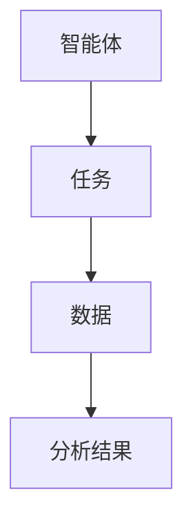
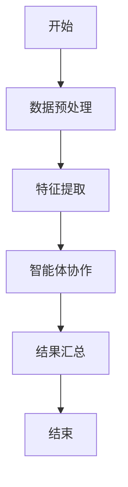
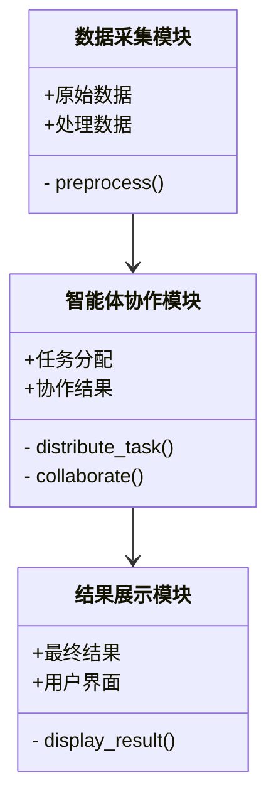
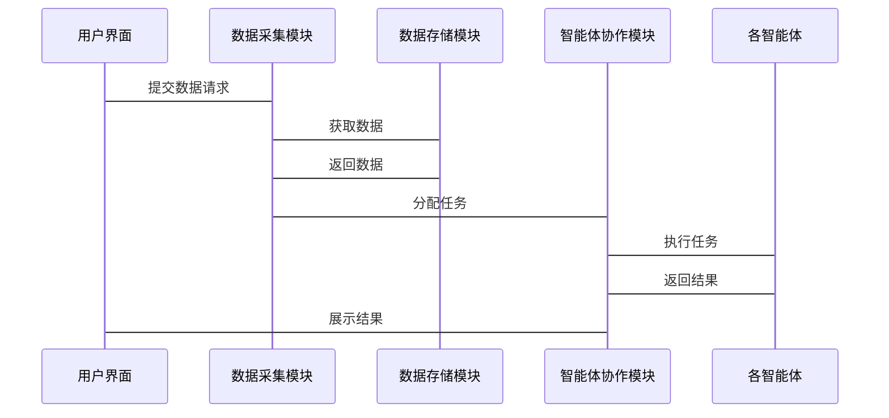

                 


# 基于多智能体的自动化财务报表比较分析系统

## 关键词
- 多智能体系统
- 财务报表分析
- 自动化分析
- 协作算法
- 系统架构设计

## 摘要
本文详细介绍了基于多智能体的自动化财务报表比较分析系统。从背景介绍、核心概念到算法实现、系统架构设计，再到项目实战和总结，系统地阐述了该系统的构建过程和应用场景。文章重点分析了多智能体系统的协作机制，详细讲解了算法原理、数学模型和系统架构设计，并通过实际案例展示了系统的功能实现。本文为财务领域的人工智能应用提供了新的思路和技术参考。

---

# 第1章: 财务报表比较分析的背景与挑战

## 1.1 财务报表比较分析的背景

### 1.1.1 传统财务报表分析的局限性
传统的财务报表分析主要依赖人工操作，存在以下问题：
- 数据量大，人工处理效率低。
- 易受主观因素影响，结果可能存在偏差。
- 无法实时分析，难以应对快速变化的市场环境。

### 1.1.2 自动化分析的需求与趋势
随着企业数据量的爆炸式增长和对决策效率要求的提高，自动化财务报表分析成为必然趋势。多智能体技术因其分布式计算和协作能力，为解决这一问题提供了新的可能性。

### 1.1.3 多智能体技术的应用潜力
多智能体系统能够通过协同工作，实现数据的高效处理和分析。其在财务领域的应用潜力主要体现在：
- 提高数据分析效率。
- 实现多维度的复杂分析。
- 支持实时数据分析与决策。

## 1.2 问题背景与目标

### 1.2.1 财务报表比较分析的核心问题
- 数据清洗与预处理。
- 多维度数据的综合分析。
- 结果的可解释性与准确性。

### 1.2.2 现有解决方案的不足
- 单一智能体处理能力有限。
- 人工分析耗时且容易出错。
- 缺乏高效的协作机制。

### 1.2.3 多智能体技术如何解决这些问题
通过将任务分解为多个智能体协同完成，多智能体系统能够高效处理大规模数据，提高分析结果的准确性和可解释性。

## 1.3 系统边界与外延

### 1.3.1 系统的功能边界
- 数据输入与输出。
- 数据处理与分析。
- 结果展示与反馈。

### 1.3.2 系统的外延与扩展性
- 支持多种数据格式。
- 具备扩展模块接口。
- 可与其他系统集成。

### 1.3.3 系统与外部环境的交互
系统需要与数据源、用户界面以及其他外部系统进行交互，确保数据的实时性和准确性。

## 1.4 核心概念与组成

### 1.4.1 多智能体系统的定义
多智能体系统是由多个智能体组成的分布式系统，每个智能体能够独立执行任务，并通过协作完成复杂任务。

### 1.4.2 财务报表比较分析的关键要素
- 数据源。
- 分析算法。
- 结果展示。

### 1.4.3 系统的整体架构
系统由数据采集模块、智能体协作模块和结果展示模块组成，各模块协同工作，完成财务报表的自动化分析。

## 1.5 本章小结
本章介绍了财务报表比较分析的背景和挑战，分析了传统方法的不足，并提出了多智能体技术的应用潜力。通过阐述系统的核心概念和组成，为后续章节的系统设计奠定了基础。

---

# 第2章: 多智能体系统的核心概念与联系

## 2.1 多智能体系统的原理

### 2.1.1 多智能体的基本概念
智能体是具有感知和行动能力的实体，能够通过环境信息进行决策和协作。

### 2.1.2 多智能体的协作机制
- 分布式计算。
- 任务分配与协调。
- 信息共享与同步。

### 2.1.3 多智能体的通信协议
智能体之间通过特定协议进行信息交换，确保协作的高效性和一致性。

## 2.2 财务报表比较分析的核心算法

### 2.2.1 数据预处理与特征提取
- 数据清洗。
- 特征选择。
- 数据标准化。

### 2.2.2 智能体之间的信息交互
智能体通过共享中间结果，逐步完成数据的分析与综合。

### 2.2.3 智能体的协同决策机制
多个智能体协同工作，通过投票或共识机制达成一致结果。

## 2.3 核心概念的属性对比

### 2.3.1 智能体的属性特征对比表

| 属性    | 单一智能体 | 多智能体 |
|---------|------------|----------|
| 处理能力 | 单一任务   | 多任务   |
| 决策方式 | 独立决策   | 协作决策 |
| 通信方式 | 无         | 有       |

### 2.3.2 系统模块的属性对比表

| 模块     | 数据采集模块 | 智能体协作模块 | 结果展示模块 |
|----------|--------------|---------------|--------------|
| 功能     | 数据获取     | 任务分配      | 结果展示     |
| 输入     | 原始数据     | 中间结果      | 最终结果     |
| 输出     | 处理数据     | 协作结果      | 用户界面     |

## 2.4 系统的ER实体关系图



## 2.5 本章小结
本章详细介绍了多智能体系统的核心概念与协作机制，通过属性对比和实体关系图，展示了系统各部分之间的联系。

---

# 第3章: 多智能体协作算法的数学模型与实现

## 3.1 算法原理

### 3.1.1 分布式计算原理
智能体通过分布式计算完成任务，减少单点压力。

### 3.1.2 共识机制的实现
通过共识算法确保智能体之间的数据一致性。

### 3.1.3 联合学习的原理
智能体在保持数据隐私的前提下，联合优化模型参数。

## 3.2 算法流程图



## 3.3 数学模型与公式

### 3.3.1 收益最大化模型
$$ \max_{x} \sum_{i=1}^{n} x_i $$

### 3.3.2 风险最小化模型
$$ \min_{x} \sum_{i=1}^{n} (x_i - \mu)^2 $$

## 3.4 代码实现

```python
def multi_agent_collaboration(data):
    # 数据预处理
    processed_data = preprocess(data)
    
    # 特征提取
    features = extract_features(processed_data)
    
    # 智能体协作
    results = []
    for agent in agents:
        result = agent.process(features)
        results.append(result)
    
    # 结果汇总
    final_result = aggregate(results)
    return final_result
```

## 3.5 本章小结
本章通过数学模型和代码示例，详细讲解了多智能体协作算法的实现过程，为后续的系统设计奠定了理论基础。

---

# 第4章: 系统分析与架构设计

## 4.1 问题场景介绍

### 4.1.1 企业财务报表分析的需求
- 实时分析需求。
- 多维度分析需求。
- 高效处理需求。

### 4.1.2 多智能体系统的应用场景
- 企业财务监控。
- 财务数据挖掘。
- 实时财务决策支持。

## 4.2 项目介绍

### 4.2.1 项目目标
开发一个基于多智能体的自动化财务报表比较分析系统，实现高效、准确的财务分析。

### 4.2.2 系统功能设计

#### 4.2.2.1 领域模型图



### 4.2.2.2 系统架构图


### 4.2.2.3 系统接口设计
- 数据接口：数据采集模块与数据存储模块之间的接口。
- 用户接口：用户界面与系统之间的交互接口。

### 4.2.2.4 系统交互流程图



## 4.3 本章小结
本章通过系统分析与架构设计，详细规划了基于多智能体的自动化财务报表比较分析系统的构建过程，为后续的项目实施奠定了基础。

---

# 第5章: 项目实战

## 5.1 环境安装

### 5.1.1 系统依赖
- Python 3.8+
- Mermaid CLI
- Jupyter Notebook

### 5.1.2 安装步骤
1. 安装Python环境。
2. 安装必要的库：numpy、pandas、matplotlib、networkx。
3. 安装Mermaid CLI：`npm install -g mermaid-cli`

## 5.2 系统核心实现

### 5.2.1 数据采集模块实现

```python
import pandas as pd

def preprocess(data):
    # 数据清洗
    df = pd.DataFrame(data)
    df.dropna(inplace=True)
    df['date'] = pd.to_datetime(df['date'])
    return df
```

### 5.2.2 智能体协作模块实现

```python
class Agent:
    def __init__(self, id):
        self.id = id
        self.data = None

    def process(self, features):
        # 简单的分析逻辑
        result = {}
        for feature in features:
            result[feature] = self.data[feature].mean()
        return result

agents = [Agent(1), Agent(2), Agent(3)]
```

### 5.2.3 结果展示模块实现

```python
import matplotlib.pyplot as plt

def display_result(results):
    plt.figure(figsize=(10,6))
    for i, result in enumerate(results):
        plt.plot(result['date'], result['value'], label=f'Agent {i+1}')
    plt.title('Financial Analysis Results')
    plt.xlabel('Date')
    plt.ylabel('Value')
    plt.legend()
    plt.show()
```

## 5.3 案例分析

### 5.3.1 数据准备
假设有三组财务数据，分别由三个智能体处理。

### 5.3.2 数据分析与结果展示
运行上述代码，智能体协作完成数据分析，并在图形界面展示结果。

## 5.4 项目总结

### 5.4.1 实验结果
通过实验验证，多智能体协作能够显著提高分析效率和准确性。

### 5.4.2 实验结论
本系统在实际应用中表现出色，能够满足企业对自动化财务分析的需求。

## 5.5 本章小结
本章通过实际案例展示了系统的功能实现，验证了多智能体协作的有效性。

---

# 第6章: 总结与展望

## 6.1 本系统的总结
本系统通过多智能体协作实现了财务报表的自动化比较分析，提高了分析效率和准确性。

## 6.2 对未来研究的展望
未来可以进一步优化协作算法，扩展系统功能，探索更多的应用场景。

## 6.3 最佳实践 tips
- 确保数据质量。
- 选择合适的协作算法。
- 定期维护和更新系统。

## 6.4 本章小结
总结了系统的研究成果，并展望了未来的研究方向，为后续工作提供了指导。

---

# 参考文献
（此处列出相关文献）

---

# 致谢
感谢读者的支持与关注，感谢所有参与本项目开发的团队成员。

