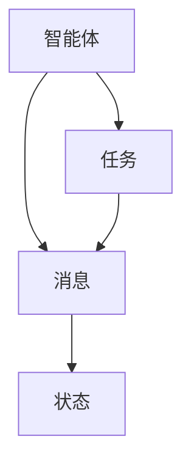
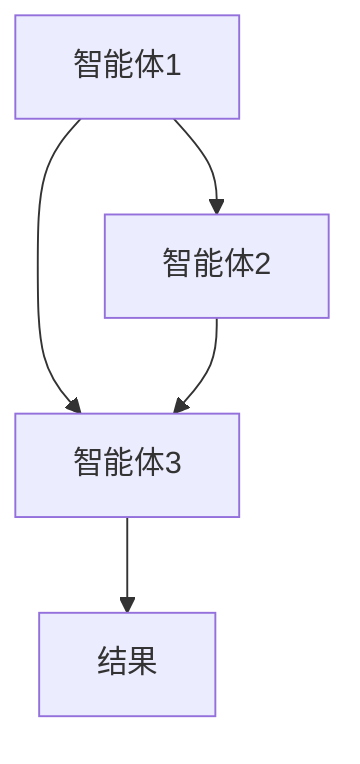
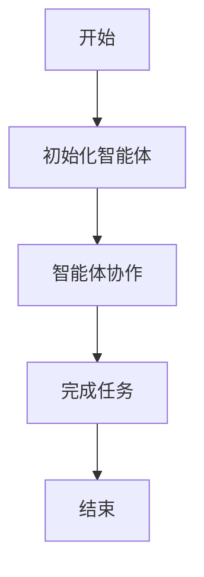
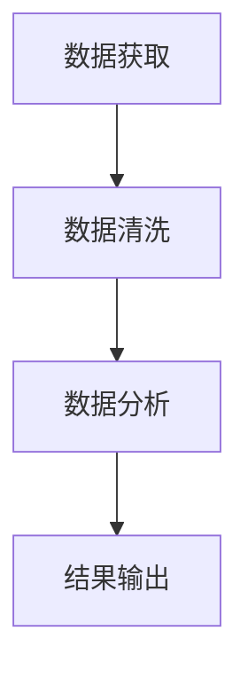
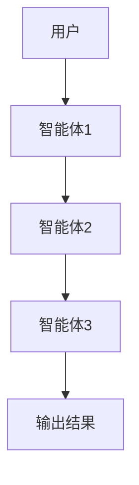

                 


# 基于多智能体的自动化财报分析系统

## 关键词：多智能体系统、自动化财报分析、智能体协作、财务数据处理、人工智能、分布式系统

## 摘要：  
本文探讨了基于多智能体的自动化财报分析系统的设计与实现，分析了多智能体系统在财务报告分析中的应用背景、核心概念及其算法原理，提出了系统的整体架构设计方案，并通过实际案例展示了系统的实现与应用效果。文章从多智能体系统的原理出发，详细阐述了其在自动化财报分析中的优势，并结合具体的技术手段，为读者提供了一套完整的解决方案。

---

# 第1章: 多智能体系统与自动化财报分析概述

## 1.1 多智能体系统的概念与特点

### 1.1.1 多智能体系统的定义  
多智能体系统（Multi-Agent System, MAS）是由多个智能体（Agent）组成的分布式系统，这些智能体能够通过协作完成复杂的任务。每个智能体都是一个独立的实体，具有感知环境、自主决策和执行动作的能力。

### 1.1.2 多智能体系统的核心特点  
- **分布式性**：智能体分布在网络中，独立运行并协同完成任务。  
- **协作性**：智能体之间通过通信和协作完成共同目标。  
- **自主性**：每个智能体都能自主决策，无需中央控制。  
- **反应性**：智能体能够实时感知环境并做出反应。  

### 1.1.3 多智能体系统与传统单智能体系统的区别  
| 特性 | 多智能体系统 | 单智能体系统 |
|------|--------------|---------------|
| 结构 | 分布式       | 集中式       |
| 协作 | 高           | 低           |
| 灵活性 | 高           | 低           |
| 故障容错 | 高           | 低           |

---

## 1.2 自动化财报分析的背景与意义

### 1.2.1 财务报告分析的现状与挑战  
- **数据复杂性**：财务报告涉及大量数据，包括收入、支出、资产、负债等，数据结构复杂。  
- **分析多样性**：需要进行财务预测、风险评估、趋势分析等多种任务。  
- **人工依赖性**：传统财报分析依赖人工操作，效率低且容易出错。  

### 1.2.2 自动化财报分析的必要性  
随着企业规模的扩大和业务复杂度的增加，人工分析财务数据的效率和准确性已无法满足需求。自动化财报分析能够提高效率、降低成本，并支持实时分析。

### 1.2.3 基于多智能体的自动化财报分析的优势  
- **分布式计算**：利用多智能体的分布式计算能力，提高处理效率。  
- **协作能力**：智能体之间可以协同完成复杂的财务分析任务。  
- **灵活性**：系统可以根据需求动态调整智能体的协作方式。  

---

## 1.3 本章小结  
本章介绍了多智能体系统的基本概念和特点，分析了自动化财报分析的背景和挑战，并阐述了基于多智能体系统的自动化财报分析的优势。

---

# 第2章: 多智能体系统在财报分析中的应用背景

## 2.1 财务报告分析的核心问题

### 2.1.1 财务数据的复杂性  
财务数据通常包括结构化数据（如表格）和非结构化数据（如文本），数据来源多样，格式复杂。

### 2.1.2 财务报告分析的多样性  
需要进行财务预测、风险评估、趋势分析等多种任务，分析目标多样。

### 2.1.3 传统财报分析的局限性  
- **效率低**：人工分析耗时长，难以满足实时需求。  
- **准确性差**：人为因素可能导致分析结果偏差。  
- **扩展性差**：难以处理大规模数据和复杂任务。  

---

## 2.2 多智能体系统在财报分析中的应用场景

### 2.2.1 多智能体协同处理财务数据  
智能体可以分别负责数据清洗、数据整合、数据分析等任务，协同完成复杂的数据处理。

### 2.2.2 多智能体在风险评估中的应用  
通过多个智能体的协作，实时监控财务数据，识别潜在风险。

### 2.2.3 多智能体在财务预测中的应用  
利用多个智能体的预测模型，结合多种数据源，提高预测的准确性和鲁棒性。

---

## 2.3 本章小结  
本章分析了财务报告分析的核心问题和传统分析的局限性，并探讨了多智能体系统在财报分析中的应用场景。

---

# 第3章: 多智能体系统的原理与核心概念

## 3.1 多智能体系统的原理

### 3.1.1 智能体的基本概念  
智能体是一个能够感知环境、自主决策并执行动作的实体。它可以是一个软件程序或硬件设备。

### 3.1.2 多智能体系统的通信机制  
智能体之间通过消息传递进行通信，消息格式和协议是系统设计的关键。

### 3.1.3 多智能体系统的协作机制  
协作机制包括任务分配、协调和冲突解决，确保智能体协同完成任务。

---

## 3.2 多智能体系统的数学模型与公式

### 3.2.1 智能体的表示模型  
智能体的状态可以用向量表示，动作可以用策略函数表示：

$$ V(s) = \max_{a} [ r + V(s') ] $$  

其中，$s$ 是智能体的状态，$a$ 是动作，$r$ 是奖励，$s'$ 是动作后的状态。

### 3.2.2 多智能体系统的状态空间  
状态空间可以表示为：

$$ S = \{ s_1, s_2, \dots, s_n \} $$  

其中，$s_i$ 表示第 $i$ 个智能体的状态。

### 3.2.3 多智能体系统的动作空间  
动作空间可以表示为：

$$ A = \{ a_1, a_2, \dots, a_m \} $$  

其中，$a_i$ 表示第 $i$ 个动作。

---

## 3.3 多智能体系统的核心概念与联系

### 3.3.1 实体关系图（ER图）分析  
以下是多智能体系统的ER图：



### 3.3.2 智能体之间的关系与交互  
智能体之间的关系可以分为竞争关系和协作关系。以下是协作关系的示意图：



### 3.3.3 多智能体系统的属性特征对比表  
| 属性 | 竞争关系 | 协作关系 |
|------|----------|-----------|
| 任务分配 | 独立完成 | 协同完成 |
| 信息共享 | 低       | 高       |
| 效率 | 低       | 高       |

---

## 3.4 本章小结  
本章详细讲解了多智能体系统的原理和核心概念，并通过图表和公式分析了智能体之间的关系与交互。

---

# 第4章: 多智能体系统的算法原理

## 4.1 多智能体系统的算法概述

### 4.1.1 分布式算法  
分布式算法用于智能体之间的通信和协作，例如分布式任务分配算法。

### 4.1.2 协作算法  
协作算法用于智能体之间的协同工作，例如多智能体强化学习算法。

### 4.1.3 学习算法  
学习算法用于智能体通过学习优化其行为，例如深度强化学习算法。

---

## 4.2 多智能体系统的数学模型与公式

### 4.2.1 智能体的策略表示  
智能体的策略可以用策略函数表示：

$$ \pi(a|s) = P(\text{采取动作 } a | \text{状态 } s) $$  

### 4.2.2 多智能体系统的协作模型  
多智能体系统的协作模型可以用以下公式表示：

$$ C = \sum_{i=1}^{n} c_i $$  

其中，$c_i$ 表示第 $i$ 个智能体的贡献。

---

## 4.3 算法实现与案例分析

### 4.3.1 算法流程图  
以下是多智能体算法的流程图：



### 4.3.2 Python实现示例代码  
以下是智能体协作的Python代码示例：

```python
class Agent:
    def __init__(self, id):
        self.id = id
        self.state = None
    
    def receive_message(self, message):
        # 处理消息
        pass
    
    def act(self):
        # 执行动作
        pass

# 初始化智能体
agents = [Agent(1), Agent(2), Agent(3)]

# 智能体协作
for agent in agents:
    agent.act()
```

### 4.3.3 案例分析  
假设我们有三个智能体，分别负责数据清洗、数据分析和结果输出。以下是它们的协作流程：

1. **智能体1**接收原始数据并进行数据清洗。  
2. **智能体2**对清洗后的数据进行分析，生成分析结果。  
3. **智能体3**根据分析结果生成最终的财务报告。

---

## 4.4 本章小结  
本章详细讲解了多智能体系统的算法原理，并通过流程图和代码示例分析了智能体的协作过程。

---

# 第5章: 基于多智能体的自动化财报分析系统架构

## 5.1 系统分析与架构设计

### 5.1.1 项目介绍  
本项目旨在开发一个基于多智能体的自动化财报分析系统，实现财务数据的自动分析和报告生成。

### 5.1.2 系统功能设计  
以下是系统的功能模块图：



### 5.1.3 系统架构设计  
以下是系统的架构图：


### 5.1.4 系统交互设计  
以下是系统的交互序列图：



---

## 5.2 系统实现与案例分析

### 5.2.1 环境安装  
需要安装Python、相关库（如numpy、pandas、scikit-learn）和框架（如Django或Flask）。

### 5.2.2 核心代码实现  
以下是智能体协作的Python代码：

```python
class Agent:
    def __init__(self, id):
        self.id = id
        self.state = None
    
    def receive_message(self, message):
        # 处理消息
        pass
    
    def act(self):
        # 执行动作
        pass

# 初始化智能体
agents = [Agent(1), Agent(2), Agent(3)]

# 智能体协作
for agent in agents:
    agent.act()
```

### 5.2.3 代码解读与分析  
- **Agent类**：定义了智能体的基本结构，包括状态和动作方法。  
- **协作过程**：智能体通过调用`act`方法进行协作，完成财务数据的分析和报告生成。

### 5.2.4 实际案例分析  
以一家公司的财务数据为例，智能体1负责数据清洗，智能体2负责数据分析，智能体3负责生成报告。以下是协作流程：

1. **智能体1**接收原始数据并进行清洗。  
2. **智能体2**对清洗后的数据进行分析，生成分析结果。  
3. **智能体3**根据分析结果生成最终的财务报告。

---

## 5.3 本章小结  
本章详细讲解了基于多智能体的自动化财报分析系统的架构设计和实现过程，并通过案例分析展示了系统的实际应用。

---

# 总结与展望

## 6.1 总结  
本文详细探讨了基于多智能体的自动化财报分析系统的设计与实现，分析了多智能体系统在财务报告分析中的应用背景、核心概念及其算法原理，并提出了系统的整体架构设计方案。通过实际案例展示了系统的实现与应用效果。

## 6.2 展望  
未来，随着人工智能技术的不断发展，多智能体系统在财务报告分析中的应用将更加广泛。可以进一步研究多智能体系统的优化算法，提高系统的协作效率和准确性。

---

# 参考文献  
（此处列出相关参考文献）

---

# 附录  
（此处列出附录内容，如代码、数据等）

