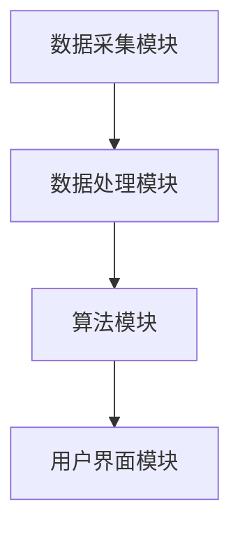
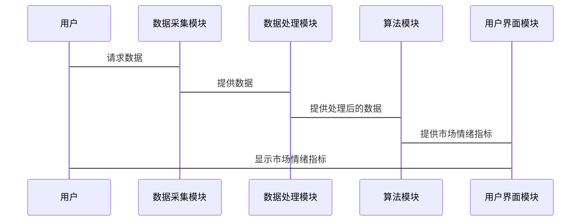

                 


# 基于多智能体的自适应市场情绪指标在价值投资中的应用

## 关键词：多智能体、自适应市场情绪指标、价值投资、协同学习、算法优化

## 摘要：本文探讨了在价值投资中应用基于多智能体的自适应市场情绪指标的方法。通过构建多智能体系统，利用协同学习算法优化市场情绪指标，从而为投资者提供更准确的市场情绪分析，提升投资决策的科学性和准确性。文章详细介绍了系统的架构设计、算法实现及实战案例，展示了该方法在金融投资中的实际应用价值。

---

## 第1章: 多智能体系统与市场情绪指标概述

### 1.1 多智能体系统的概念与特点

#### 1.1.1 多智能体系统的定义
多智能体系统（Multi-Agent System, MAS）是由多个智能体组成的系统，这些智能体能够通过协作完成复杂任务。智能体具备自主性、反应性、目标导向和社交能力等特点。

#### 1.1.2 多智能体系统的优点
- **分布式计算**：任务分配更灵活，提高系统的容错性和扩展性。
- **智能协同**：通过智能体之间的协作，实现复杂问题的分解与解决。
- **适应性**：能够根据环境变化动态调整策略。

#### 1.1.3 多智能体系统在金融领域的应用
- **市场分析**：通过多个智能体分析市场数据，捕捉市场趋势。
- **风险管理**：智能体协同工作，实时监控和预警风险。
- **交易决策**：基于多智能体的分析结果，优化交易策略。

### 1.2 市场情绪指标的定义与作用

#### 1.2.1 市场情绪指标的定义
市场情绪指标（Market Sentiment Index, MSI）是衡量市场参与者情绪的量化指标，反映了投资者对市场的乐观或悲观程度。

#### 1.2.2 市场情绪指标的作用
- **预测市场走势**：通过分析市场情绪，预测股票价格的波动。
- **辅助投资决策**：帮助投资者制定买卖策略。
- **风险评估**：评估市场的整体风险水平。

#### 1.2.3 市场情绪指标的分类
- **基于价格的指标**：如相对强弱指数（RSI）、平均趋向指数（ADX）。
- **基于成交量的指标**：如成交量动能指标（VMI）。
- **基于新闻和语料的指标**：如情绪分析指标（Sentiment Analysis Index, SAI）。

### 1.3 自适应市场情绪指标的提出

#### 1.3.1 自适应指标的概念
自适应市场情绪指标是一种能够根据市场环境动态调整的市场情绪指标，具备更强的适应性和准确性。

#### 1.3.2 自适应指标的优势
- **动态调整**：根据市场变化实时更新，避免静态指标的滞后性。
- **高准确性**：通过多智能体协同学习，提高指标的预测能力。
- **灵活性**：适用于不同市场环境和投资策略。

#### 1.3.3 自适应指标的应用场景
- **实时市场监控**：动态调整投资策略。
- **量化交易**：基于自适应指标生成交易信号。
- **风险控制**：实时评估市场风险，优化投资组合。

### 1.4 本章小结
本章介绍了多智能体系统的概念、特点及其在金融领域的应用，提出了自适应市场情绪指标的概念和优势，为后续章节的深入探讨奠定了基础。

---

## 第2章: 多智能体系统的设计

### 2.1 多智能体系统的体系结构

#### 2.1.1 分层体系结构
分层体系结构将系统划分为多个层次，每个层次负责不同的功能。例如，感知层负责数据采集，计算层负责数据分析，决策层负责策略制定。

#### 2.1.2 分布式体系结构
分布式体系结构将智能体分布在网络的不同节点上，通过通信机制实现协作。适用于大规模数据处理和分布式计算。

#### 2.1.3 集中式体系结构
集中式体系结构由一个中心节点统一协调所有智能体的行动。优点是易于管理和控制，缺点是中心节点的单点故障风险较高。

### 2.2 多智能体系统的协作机制

#### 2.2.1 通信机制
智能体之间通过消息传递实现信息共享和协同工作。常见的通信方式包括发布-订阅模式和点对点通信。

#### 2.2.2 任务分配机制
智能体根据自身能力和当前任务需求，动态分配任务。常见的任务分配算法包括基于规则的分配和基于优化的分配。

#### 2.2.3 决策机制
智能体通过协商和协作，共同制定决策。决策机制需要考虑各智能体的目标和约束条件，确保决策的最优性。

### 2.3 多智能体系统的实现步骤

#### 2.3.1 系统需求分析
明确系统的目标和功能需求，确定智能体的数量和类型。

#### 2.3.2 系统设计
设计系统的体系结构和协作机制，确定各智能体的功能模块。

#### 2.3.3 系统实现
根据设计文档，编写智能体的代码，实现各模块的功能，并进行集成测试。

### 2.4 本章小结
本章详细介绍了多智能体系统的体系结构和协作机制，为后续章节的系统设计和实现提供了理论基础。

---

## 第3章: 市场情绪指标的构建

### 3.1 市场情绪数据的来源

#### 3.1.1 市场数据
包括股票价格、成交量、指数等市场数据，反映市场的整体走势。

#### 3.1.2 行为数据
包括投资者的交易记录、订单簿数据，反映市场的微观结构。

#### 3.1.3 语料数据
包括新闻、社交媒体评论、机构研究报告，反映市场参与者的观点和情绪。

### 3.2 市场情绪指标的特征工程

#### 3.2.1 数据清洗
去除噪声数据，处理缺失值和异常值，确保数据的准确性和完整性。

#### 3.2.2 数据转换
对数据进行标准化、归一化处理，便于后续的分析和建模。

#### 3.2.3 特征选择
通过统计分析和特征重要性评估，选择对市场情绪影响较大的特征。

### 3.3 市场情绪指标的计算方法

#### 3.3.1 基于统计的方法
通过统计学方法计算市场情绪指标，如移动平均线、标准差等。

#### 3.3.2 基于机器学习的方法
使用机器学习算法，如支持向量机（SVM）、随机森林（RF）等，构建市场情绪预测模型。

#### 3.3.3 基于自然语言处理的方法
利用自然语言处理技术，对新闻和社交媒体文本进行情感分析，计算市场情绪。

### 3.4 本章小结
本章介绍了市场情绪数据的来源和处理方法，详细讲解了市场情绪指标的构建过程，为后续章节的自适应算法实现奠定了基础。

---

## 第4章: 自适应市场情绪指标的算法实现

### 4.1 自适应算法的基本原理

#### 4.1.1 自适应算法的定义
自适应算法是一种能够根据环境变化动态调整参数和策略的算法，适用于非静态和不确定的市场环境。

#### 4.1.2 自适应算法的核心思想
通过反馈机制，实时调整算法的参数和模型结构，以适应市场环境的变化。

#### 4.1.3 自适应算法的实现步骤
1. 初始化参数和模型。
2. 计算当前的市场情绪指标。
3. 根据市场反馈调整参数和模型。
4. 重复步骤2和3，直到达到终止条件。

### 4.2 多智能体协同学习算法

#### 4.2.1 协同学习的定义
协同学习是指多个智能体通过协作和共享知识，共同完成学习任务。

#### 4.2.2 协同学习的实现方法
- **知识共享**：智能体之间共享数据、模型和经验。
- **任务分配**：根据智能体的能力分配不同的学习任务。
- **协商与协调**：智能体通过协商确定各自的角色和任务。

#### 4.2.3 协同学习的优势
- **提高学习效率**：通过协作，智能体能够更快地学习和适应。
- **增强鲁棒性**：多个智能体的协同学习能够降低单一智能体的错误风险。

### 4.3 自适应优化算法

#### 4.3.1 自适应优化算法的定义
自适应优化算法是一种能够根据环境变化动态调整优化策略的算法，适用于复杂的优化问题。

#### 4.3.2 自适应优化算法的核心思想
通过实时监测环境变化，动态调整优化的目标和约束条件，以获得更好的优化效果。

#### 4.3.3 自适应优化算法的实现步骤
1. 初始化优化目标和约束条件。
2. 监测环境变化，获取实时反馈。
3. 根据反馈调整优化策略。
4. 重复步骤2和3，直到达到终止条件。

### 4.4 本章小结
本章详细介绍了自适应算法和协同学习算法的基本原理和实现方法，为后续章节的系统架构设计和项目实战提供了理论支持。

---

## 第5章: 系统架构设计与实现

### 5.1 系统架构设计

#### 5.1.1 系统模块划分
- **数据采集模块**：负责采集市场数据、行为数据和语料数据。
- **数据处理模块**：对数据进行清洗、转换和特征提取。
- **算法模块**：实现自适应市场情绪指标的计算和优化。
- **用户界面模块**：提供可视化界面，展示市场情绪指标和投资建议。

#### 5.1.2 系统架构图


### 5.2 系统接口设计

#### 5.2.1 数据接口
- **数据输入接口**：接收外部数据源的数据。
- **数据输出接口**：将处理后的数据输出到其他模块或存储系统。

#### 5.2.2 算法接口
- **算法调用接口**：允许其他模块调用算法模块的功能。
- **参数配置接口**：允许用户配置算法的参数和策略。

### 5.3 系统交互流程

#### 5.3.1 系统交互序列图


### 5.4 本章小结
本章详细介绍了系统的架构设计和接口设计，展示了系统各模块之间的协作关系和交互流程。

---

## 第6章: 项目实战——自适应市场情绪指标的实现

### 6.1 项目环境安装

#### 6.1.1 安装Python环境
建议使用Anaconda或Miniconda，安装Python 3.8或更高版本。

#### 6.1.2 安装依赖库
安装必要的依赖库，如numpy、pandas、scikit-learn、 nltk等。

#### 6.1.3 安装多智能体框架
可以使用Multi-Agent Frameworks for Python（MAFP）或其他适合的框架。

### 6.2 系统核心实现

#### 6.2.1 数据采集模块实现
编写代码采集市场数据、行为数据和语料数据。

```python
import requests

def fetch_market_data(symbol):
    url = f"https://api.example.com/stock/{symbol}"
    response = requests.get(url)
    return response.json()

# 示例：获取股票AAPL的价格数据
data = fetch_market_data("AAPL")
print(data)
```

#### 6.2.2 数据处理模块实现
对数据进行清洗、转换和特征提取。

```python
import pandas as pd

def preprocess_data(data):
    df = pd.DataFrame(data)
    df = df.dropna()
    df['normalized_price'] = df['price'].apply(lambda x: (x - df['price'].min()) / (df['price'].max() - df['price'].min()))
    return df

processed_data = preprocess_data(data)
print(processed_data)
```

#### 6.2.3 自适应算法实现

```python
import numpy as np

def adaptive_algorithm(data):
    # 初始化参数
    alpha = 0.5
    beta = 0.5
    sentiment = np.mean(data['sentiment_score'])
    # 自适应调整参数
    if sentiment > 0.6:
        alpha += 0.1
    elif sentiment < 0.4:
        beta -= 0.1
    # 计算自适应市场情绪指标
    adaptive_score = alpha * data['price'] + beta * data['volume']
    return adaptive_score

adaptive_score = adaptive_algorithm(processed_data)
print(adaptive_score)
```

### 6.3 项目小结
本章通过一个实战项目展示了自适应市场情绪指标的实现过程，从环境安装到代码实现，详细讲解了系统的各个模块，并给出了具体的代码示例。

---

## 第7章: 总结与展望

### 7.1 总结

#### 7.1.1 核心概念总结
本文提出了基于多智能体的自适应市场情绪指标，通过多智能体协同学习和自适应优化算法，提高了市场情绪指标的准确性和适应性。

#### 7.1.2 实践意义总结
自适应市场情绪指标在价值投资中具有重要的应用价值，能够帮助投资者更准确地预测市场走势，优化投资策略。

### 7.2 未来展望

#### 7.2.1 算法优化
进一步优化自适应算法，提高算法的收敛速度和预测精度。

#### 7.2.2 数据源扩展
引入更多的数据源，如社交媒体数据、新闻数据等，进一步提高市场情绪指标的准确性。

#### 7.2.3 应用场景扩展
将自适应市场情绪指标应用于更多的金融领域，如风险管理、量化交易等。

### 7.3 最佳实践 tips

#### 7.3.1 模型调优
定期监控和调优模型参数，确保模型的适应性和准确性。

#### 7.3.2 数据预处理
重视数据预处理环节，确保数据的干净和一致性。

#### 7.3.3 异常处理
建立完善的异常处理机制，确保系统的稳定性和可靠性。

### 7.4 本章小结
本章总结了全文的主要内容，并展望了未来的研究方向，为读者提供了进一步学习和实践的指导。

---

## 参考文献

1. 多智能体系统相关文献
2. 市场情绪指标相关文献
3. 自适应算法相关文献
4. 价值投资相关文献

---

通过以上章节的详细讲解，读者可以全面了解基于多智能体的自适应市场情绪指标在价值投资中的应用，从理论到实践，逐步掌握系统的构建和实现方法。

