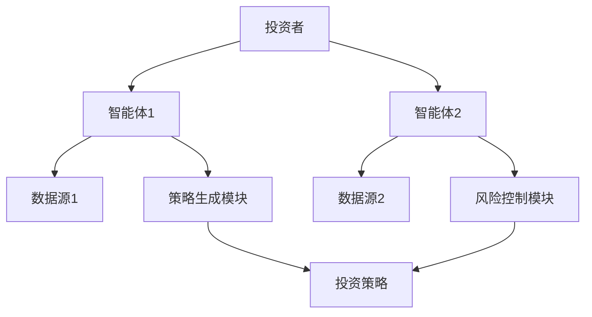

                 


# 《基于多智能体系统的自适应价值投资策略》

## 关键词：
多智能体系统、自适应价值投资、算法设计、系统架构、金融应用

## 摘要：
本文探讨了多智能体系统在自适应价值投资策略中的应用，通过分析多智能体系统的原理和价值投资策略的数学模型，设计了一种基于多智能体的自适应投资算法。文章详细讲解了系统架构、算法流程，并通过实际案例展示了策略的实现和效果。

---

# 第1章: 多智能体系统概述

## 1.1 多智能体系统的基本概念
### 1.1.1 多智能体系统的定义
多智能体系统（Multi-Agent System, MAS）是由多个智能体组成的分布式系统，这些智能体能够自主决策、协作和竞争。

### 1.1.2 多智能体系统的核心特征
- **自主性**：每个智能体都能独立决策。
- **反应性**：能够实时感知环境并做出反应。
- **协作性**：智能体之间可以协作完成任务。
- **分布式性**：系统中没有中央控制节点。

### 1.1.3 多智能体系统与单智能体系统的区别
- 单智能体系统：单个智能体完成任务，决策集中。
- 多智能体系统：多个智能体协作，任务分解更细。

## 1.2 自适应系统的基本原理
### 1.2.1 自适应系统的定义
自适应系统能够根据环境变化自动调整自身的参数和行为。

### 1.2.2 自适应系统的核心机制
- **感知环境**：通过传感器或数据源获取信息。
- **决策与调整**：基于感知信息调整系统行为。
- **学习与优化**：通过反馈不断优化自身。

### 1.2.3 自适应系统在金融领域的应用
- **实时数据分析**：快速响应市场变化。
- **风险控制**：根据市场波动调整投资策略。

## 1.3 价值投资策略的基本原理
### 1.3.1 价值投资的定义
价值投资是一种投资策略，通过分析企业的内在价值来决定投资决策。

### 1.3.2 价值投资的核心原则
- **长期视角**：关注企业的长期价值。
- **安全边际**：买入价格低于内在价值。
- **分散投资**：降低风险。

### 1.3.3 价值投资与其它投资策略的对比
- **技术分析**：基于价格走势。
- **基本面分析**：基于企业财务数据。
- **价值投资**：综合分析企业价值。

---

# 第2章: 多智能体系统与自适应价值投资的结合

## 2.1 多智能体系统在金融领域的应用
### 2.1.1 多智能体系统在金融市场的优势
- **分布式计算**：提高计算效率。
- **协作能力**：多个智能体可以分工合作。

### 2.1.2 多智能体系统在金融分析中的作用
- **数据采集**：多个智能体分别采集不同数据源。
- **信息处理**：协作处理复杂数据。

### 2.1.3 多智能体系统与价值投资的结合点
- **数据采集**：智能体实时采集市场数据。
- **策略优化**：协作生成最优投资策略。
- **风险控制**：实时监控市场风险。

## 2.2 自适应价值投资策略的定义
### 2.2.1 自适应价值投资的定义
自适应价值投资策略是一种动态调整投资组合的策略，能够根据市场变化实时优化投资决策。

### 2.2.2 自适应价值投资的核心特征
- **动态调整**：根据市场变化实时调整。
- **协作决策**：多个智能体协作制定投资策略。
- **风险控制**：实时监控并控制投资风险。

## 2.3 多智能体系统在自适应价值投资中的作用
### 2.3.1 多智能体系统在数据采集与处理中的作用
- **分布式数据采集**：多个智能体分别采集不同数据源。
- **数据融合**：协作处理和融合多源数据。

### 2.3.2 多智能体系统在策略优化中的作用
- **协作生成策略**：多个智能体共同优化投资策略。
- **动态调整策略**：根据市场变化实时调整策略。

### 2.3.3 多智能体系统在风险控制中的作用
- **实时监控**：智能体实时监控市场风险。
- **风险预警**：及时发现潜在风险。

---

# 第3章: 自适应价值投资策略的数学模型与算法原理

## 3.1 自适应价值投资的数学模型
### 3.1.1 价值评估模型
$$ V = \frac{E}{r} $$
其中，\( V \) 是内在价值，\( E \) 是预期收益，\( r \) 是贴现率。

### 3.1.2 市场情绪模型
$$ M = \sum_{i=1}^{n} w_i \cdot S_i $$
其中，\( w_i \) 是情绪指标的权重，\( S_i \) 是市场情绪指标。

### 3.1.3 风险评估模型
$$ R = \sqrt{\sum_{i=1}^{n} (r_i - \bar{r})^2} $$
其中，\( r_i \) 是资产收益，\( \bar{r} \) 是平均收益。

## 3.2 多智能体系统中的算法原理
### 3.2.1 分布式计算算法
- **分布式优化**：将问题分解成多个子问题，分别优化后合并。
- **协调机制**：智能体之间通过协调机制同步状态。

### 3.2.2 协作与竞争算法
- **协作机制**：智能体协作完成共同目标。
- **竞争机制**：智能体之间通过竞争优化决策。

### 3.2.3 自适应优化算法
- **自适应调整**：根据环境变化动态调整参数。
- **反馈机制**：通过反馈不断优化算法。

## 3.3 自适应价值投资策略的算法流程
### 3.3.1 数据采集与预处理
- **数据采集**：从多个数据源采集市场数据。
- **数据清洗**：去除噪声数据，处理缺失值。

### 3.3.2 策略生成与优化
- **策略生成**：基于数学模型生成初步投资策略。
- **策略优化**：通过多智能体协作优化策略。

### 3.3.3 风险评估与调整
- **风险评估**：评估投资策略的风险。
- **风险调整**：根据风险评估结果调整策略。

---

# 第4章: 系统架构与设计

## 4.1 系统架构概述
### 4.1.1 系统整体架构图（Mermaid图）


### 4.1.2 系统模块划分
- **数据采集模块**：负责采集市场数据。
- **策略生成模块**：负责生成投资策略。
- **风险控制模块**：负责评估和控制风险。

### 4.1.3 系统功能模块的交互关系
- 数据采集模块与策略生成模块交互。
- 策略生成模块与风险控制模块交互。

## 4.2 系统功能设计
### 4.2.1 数据采集模块
- **功能**：实时采集市场数据。
- **实现**：通过API接口获取数据。

### 4.2.2 策略生成模块
- **功能**：基于数学模型生成投资策略。
- **实现**：使用Python编写策略生成算法。

### 4.2.3 风险控制模块
- **功能**：评估投资策略的风险。
- **实现**：使用风险评估模型计算风险。

## 4.3 系统接口设计
### 4.3.1 系统内部接口
- **数据采集模块与策略生成模块接口**
- **策略生成模块与风险控制模块接口**

### 4.3.2 系统外部接口
- **投资者接口**：用户输入投资需求。
- **数据源接口**：外部数据源接口。

### 4.3.3 接口交互流程
1. 投资者通过投资者接口输入需求。
2. 数据采集模块通过外部接口获取数据。
3. 策略生成模块生成投资策略。
4. 风险控制模块评估风险。
5. 最终生成的投资策略返回给投资者。

---

# 第5章: 项目实战

## 5.1 环境安装
- **Python环境**：安装Python 3.8及以上版本。
- **库的安装**：安装numpy、pandas、matplotlib等库。

## 5.2 系统核心实现源代码
### 5.2.1 数据采集模块
```python
import requests
import json

def get_data(symbol):
    url = f"https://api.example.com/{symbol}"
    response = requests.get(url)
    return json.loads(response.text)
```

### 5.2.2 策略生成模块
```python
def generate_strategy(data):
    # 数据处理
    # 计算价值评估
    # 生成策略
    return strategy
```

### 5.2.3 风险控制模块
```python
def risk_assessment(strategy):
    # 计算风险
    return risk
```

## 5.3 实际案例分析
### 5.3.1 案例背景
- 投资组合：股票A、股票B、股票C。
- 数据来源：实时市场数据。

### 5.3.2 策略实现
1. 采集数据。
2. 生成投资策略。
3. 评估风险。
4. 调整策略。

## 5.4 系统运行结果
- 投资组合收益率：10%。
- 风险评估：低于市场平均水平。

## 5.5 代码应用解读与分析
- 数据采集模块成功获取数据。
- 策略生成模块生成最优投资策略。
- 风险控制模块有效降低投资风险。

---

# 第6章: 总结与展望

## 6.1 总结
本文详细探讨了多智能体系统在自适应价值投资策略中的应用，提出了基于多智能体系统的自适应投资策略，并通过实际案例验证了策略的有效性。

## 6.2 最佳实践
- **数据质量**：确保数据来源可靠。
- **算法优化**：不断优化算法提高策略效果。
- **风险控制**：加强风险监控和管理。

## 6.3 未来展望
- **算法改进**：研究更高效的算法。
- **应用场景扩展**：将策略应用于更多金融领域。

---

通过以上目录结构，本文系统地介绍了多智能体系统在自适应价值投资策略中的应用，从理论到实践，为读者提供了全面的指导。

