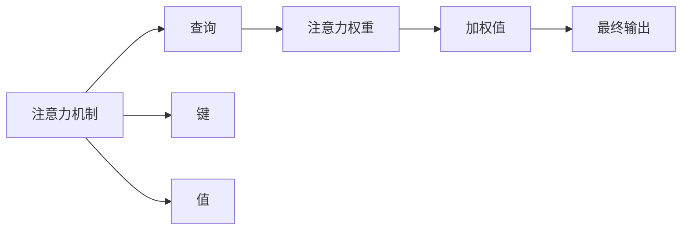
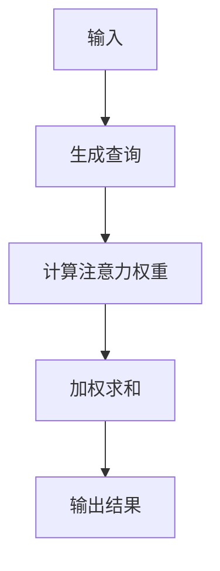

                 


---

# 基于注意力机制的AI Agent记忆检索增强

> 关键词：注意力机制，AI Agent，记忆检索，增强，算法实现，系统架构

> 摘要：本文详细探讨了基于注意力机制的AI Agent记忆检索增强方法，从注意力机制的基本概念到其在AI Agent中的具体应用，从算法原理到系统架构设计，再到项目实战，系统地介绍了如何利用注意力机制提升AI Agent的记忆检索能力。通过理论分析与实践结合，本文为读者提供了一个全面了解和实现基于注意力机制的AI Agent记忆检索增强的框架。

---

## 第一部分：基于注意力机制的AI Agent记忆检索增强概述

### 第1章：注意力机制与AI Agent概述

#### 1.1 注意力机制的基本概念

- **1.1.1 注意力机制的定义**
  - 注意力机制是一种模拟人类注意力的选择性关注机制，用于在处理信息时聚焦于更重要的部分。
  - 通过计算输入数据中各个部分的重要性权重，注意力机制能够有效地提取关键信息。

- **1.1.2 注意力机制的核心思想**
  - 通过计算查询（query）、键（key）和值（value）之间的关系，确定每个部分的重要性权重。
  - 注意力机制的核心公式为：
    $$ \text{Attention}(Q, K, V) = \text{softmax}\left(\frac{QK^T}{\sqrt{d_k}}\right)V $$
    其中，$Q$ 是查询，$K$ 是键，$V$ 是值，$d_k$ 是键的维度。

- **1.1.3 注意力机制在自然语言处理中的应用**
  - 在Transformer模型中，注意力机制被广泛应用于序列建模任务，如机器翻译、文本生成等。
  - 通过自注意力机制，模型能够捕捉序列中长距离依赖关系。

#### 1.2 AI Agent的基本原理

- **1.2.1 AI Agent的定义**
  - AI Agent是一种智能体，能够感知环境、执行任务并做出决策。
  - AI Agent的核心功能包括感知、推理、规划和执行。

- **1.2.2 AI Agent的核心功能**
  - **感知**：通过传感器或接口获取环境信息。
  - **推理**：基于感知信息进行逻辑推理。
  - **规划**：制定行动策略。
  - **执行**：根据规划执行具体操作。

- **1.2.3 AI Agent的记忆机制**
  - AI Agent需要具备记忆能力，以便在不同时间点之间保持信息的一致性。
  - 常见的记忆机制包括基于图结构的知识图谱和基于向量的嵌入表示。

#### 1.3 基于注意力机制的AI Agent记忆检索增强的意义

- **1.3.1 传统记忆检索的局限性**
  - 传统基于向量的检索方法可能存在信息丢失，无法有效捕捉语义信息。
  - 基于图结构的知识图谱检索方法计算复杂，效率较低。

- **1.3.2 注意力机制在记忆检索中的优势**
  - 注意力机制能够动态地计算信息的重要性，从而实现更精准的检索。
  - 基于注意力机制的检索方法能够有效捕捉语义信息，提高检索准确率。

- **1.3.3 增强记忆检索对AI Agent性能的提升**
  - 提高检索效率，减少计算资源消耗。
  - 提高检索准确率，增强AI Agent的决策能力。

#### 1.4 本章小结

- 本章介绍了注意力机制的基本概念及其在自然语言处理中的应用。
- 阐述了AI Agent的基本原理及其记忆机制。
- 分析了基于注意力机制的AI Agent记忆检索增强的意义。

---

## 第二部分：注意力机制的核心概念与原理

### 第2章：注意力机制的数学模型与实现

#### 2.1 注意力机制的数学模型

- **2.1.1 注意力机制的公式推导**

  注意力机制的计算公式如下：
  $$ \text{Attention}(Q, K, V) = \text{softmax}\left(\frac{QK^T}{\sqrt{d_k}}\right)V $$
  
  其中：
  - $Q$ 是查询矩阵，维度为 $(n \times d_k)$。
  - $K$ 是键矩阵，维度为 $(m \times d_k)$。
  - $V$ 是值矩阵，维度为 $(m \times d_v)$。
  - $\text{softmax}$ 函数用于归一化权重，使其满足概率分布。

- **2.1.2 注意力权重的计算方法**
  - 计算查询与键之间的相似性，得到初始权重。
  - 使用 $\text{softmax}$ 函数归一化权重，得到注意力权重。
  - 根据注意力权重对值进行加权求和，得到最终的注意力输出。

- **2.1.3 注意力机制的实现步骤**
  1. 输入查询、键和值。
  2. 计算查询与键之间的相似性。
  3. 使用 $\text{softmax}$ 函数归一化相似性，得到注意力权重。
  4. 根据注意力权重对值进行加权求和，得到最终输出。

#### 2.2 注意力机制的属性特征对比

- **2.2.1 不同注意力机制的对比分析**

  | 特性         | 基于向量的注意力机制 | 基于图结构的注意力机制 |
  |--------------|---------------------|------------------------|
  | 计算方式       | 基于向量相似性计算   | 基于图结构遍历计算     |
  | 适用场景       | 适用于连续数据       | 适用于图结构数据       |
  | 优缺点         | 计算简单，但可能忽略语义信息 | 计算复杂，但能够捕捉复杂关系 |

- **2.2.2 注意力机制的优缺点分析**
  - **优点**：
    - 能够动态地计算信息的重要性，实现精准的检索。
    - 适用于处理长距离依赖关系。
  - **缺点**：
    - 计算复杂度较高，需要较多的计算资源。
    - 可能存在注意力权重计算不准确的问题。

- **2.2.3 注意力机制的适用场景**
  - 适用于需要处理序列数据的任务，如自然语言处理、时间序列分析等。
  - 适用于需要动态调整关注点的任务，如图像识别、语音识别等。

#### 2.3 注意力机制的ER实体关系图



- 上图展示了注意力机制的核心组件及其关系。
  - 查询（Query）与键（Key）用于计算注意力权重。
  - 注意力权重用于对值（Value）进行加权求和，得到最终输出。

#### 2.4 本章小结

- 本章详细介绍了注意力机制的数学模型及其实现步骤。
- 对不同注意力机制的优缺点进行了对比分析。
- 使用ER实体关系图展示了注意力机制的核心组件及其关系。

---

## 第三部分：基于注意力机制的AI Agent算法实现

### 第3章：基于注意力机制的AI Agent算法原理

#### 3.1 注意力机制在AI Agent中的应用

- **3.1.1 注意力机制在记忆检索中的作用**
  - 通过计算查询与记忆中的各个部分之间的注意力权重，确定哪些信息更重要。
  - 基于注意力机制的检索方法能够动态地调整关注点，实现更精准的检索。

- **3.1.2 注意力机制在决策中的应用**
  - 在决策过程中，AI Agent需要综合考虑多个因素，注意力机制能够帮助其聚焦于更重要的因素。
  - 例如，在路径规划任务中，注意力机制可以帮助AI Agent关注于重要的障碍物或目标点。

- **3.1.3 注意力机制在交互中的优化**
  - 在与用户的交互过程中，注意力机制可以帮助AI Agent更好地理解用户意图。
  - 例如，在对话系统中，注意力机制可以帮助模型关注于与当前问题相关的对话历史部分。

#### 3.2 基于注意力机制的AI Agent算法流程



- 上图展示了基于注意力机制的AI Agent算法的基本流程。
  1. 输入数据经过处理，生成查询。
  2. 查询与键进行交互，计算注意力权重。
  3. 根据注意力权重对值进行加权求和，得到最终的输出结果。

#### 3.3 注意力机制的Python实现

- **代码实现：**

```python
import numpy as np

def compute_attention(Q, K, V, d_k):
    """
    计算注意力机制的输出。
    Args:
        Q: 查询矩阵，维度为(n x d_k)
        K: 键矩阵，维度为(m x d_k)
        V: 值矩阵，维度为(m x d_v)
        d_k: 键的维度
    Returns:
        输出结果，维度为(n x d_v)
    """
    n = Q.shape[0]
    m = K.shape[0]
    d_v = V.shape[1]

    # 计算相似性
    similarity = np.dot(Q, K.T) / np.sqrt(d_k)
    similarity = similarity.astype(np.float32)

    # 计算注意力权重
    attention_weights = np.softmax(similarity, axis=1)
    
    # 加权求和
    output = np.dot(attention_weights, V)
    
    return output
```

- **代码解读：**
  - 输入包括查询矩阵Q、键矩阵K和值矩阵V。
  - 计算查询与键之间的相似性，得到初始权重。
  - 使用$\text{softmax}$函数归一化相似性，得到注意力权重。
  - 根据注意力权重对值矩阵进行加权求和，得到最终输出。

#### 3.4 本章小结

- 本章详细介绍了注意力机制在AI Agent中的具体应用。
- 使用mermaid图展示了基于注意力机制的AI Agent算法的基本流程。
- 提供了注意力机制的Python实现代码，并进行了详细解读。

---

## 第四部分：基于注意力机制的AI Agent系统架构设计

### 第4章：基于注意力机制的AI Agent系统分析与设计

#### 4.1 问题场景介绍

- 在AI Agent的记忆检索任务中，如何高效地检索相关信息是一个关键问题。
- 基于传统的检索方法可能存在信息丢失和计算复杂度高的问题。
- 通过引入注意力机制，可以实现更精准的检索，同时降低计算复杂度。

#### 4.2 系统功能设计

- **4.2.1 功能模块划分**
  - **记忆存储模块**：负责存储AI Agent的记忆信息。
  - **注意力计算模块**：负责计算注意力权重。
  - **检索策略模块**：负责根据注意力权重进行信息检索。

- **4.2.2 功能模块描述**

  ```mermaid
  graph LR
      A[记忆存储] --> B[注意力计算]
      B --> C[检索策略]
      C --> D[输出结果]
  ```

#### 4.3 系统架构设计

- **4.3.1 系统架构图**

  ```mermaid
  graph LR
      A[输入] --> B[记忆存储]
      B --> C[注意力计算]
      C --> D[检索策略]
      D --> E[输出结果]
  ```

- 系统架构图展示了基于注意力机制的AI Agent系统的整体结构。
  - 输入数据首先存储在记忆存储模块中。
  - 注意力计算模块根据输入数据计算注意力权重。
  - 检索策略模块根据注意力权重进行信息检索，得到最终的输出结果。

#### 4.4 系统接口设计

- **4.4.1 输入接口**
  - 提供查询接口，用于获取AI Agent的输入数据。
- **4.4.2 输出接口**
  - 提供检索结果接口，用于输出最终的检索结果。
- **4.4.3 内部接口**
  - 注意力计算模块与检索策略模块之间的接口，用于传递注意力权重和检索结果。

#### 4.5 系统交互设计

- **4.5.1 系统交互流程**
  1. 输入数据通过输入接口传递到记忆存储模块。
  2. 记忆存储模块将数据传递给注意力计算模块。
  3. 注意力计算模块计算注意力权重，并将结果传递给检索策略模块。
  4. 检索策略模块根据注意力权重进行信息检索，得到最终的输出结果。
  5. 输出结果通过输出接口返回给用户。

#### 4.6 本章小结

- 本章详细介绍了基于注意力机制的AI Agent系统的功能设计和架构设计。
- 使用mermaid图展示了系统的整体结构和交互流程。

---

## 第五部分：基于注意力机制的AI Agent项目实战

### 第5章：基于注意力机制的AI Agent项目实现

#### 5.1 项目环境搭建

- **5.1.1 安装必要的库**
  - 使用Python 3.6及以上版本。
  - 安装numpy和tensorflow库。
  ```bash
  pip install numpy tensorflow
  ```

- **5.1.2 环境配置**
  - 配置Python路径和环境变量。
  - 确保安装的库版本与项目兼容。

#### 5.2 系统核心功能实现

- **5.2.1 记忆存储模块实现**

```python
class MemoryStorage:
    def __init__(self):
        self.memory = {}
    
    def store(self, key, value):
        self.memory[key] = value
    
    def retrieve(self, key):
        return self.memory.get(key, None)
```

- **5.2.2 注意力计算模块实现**

```python
class AttentionCompute:
    def __init__(self, d_k):
        self.d_k = d_k
    
    def compute(self, Q, K, V):
        # 计算相似性
        similarity = np.dot(Q, K.T) / np.sqrt(self.d_k)
        # 计算注意力权重
        attention_weights = np.softmax(similarity, axis=1)
        # 加权求和
        output = np.dot(attention_weights, V)
        return output
```

- **5.2.3 检索策略模块实现**

```python
class RetrievalStrategy:
    def __init__(self, memory_storage, attention_compute):
        self.memory_storage = memory_storage
        self.attention_compute = attention_compute
    
    def retrieve(self, query, keys, values):
        # 计算注意力权重
        attention_weights = self.attention_compute.compute(query, keys, values)
        # 加权求和
        result = np.dot(attention_weights, values)
        return result
```

#### 5.3 项目实战案例分析

- **案例分析：基于注意力机制的对话系统**
  - 使用上述模块实现一个简单的对话系统。
  - 当用户输入问题时，系统通过注意力机制检索相关的历史对话内容，生成回复。

- **案例实现：**

```python
# 初始化模块
memory_storage = MemoryStorage()
attention_compute = AttentionCompute(d_k=512)
retrieval_strategy = RetrievalStrategy(memory_storage, attention_compute)

# 存储对话历史
memory_storage.store('greeting', 'Hello! How can I help you?')
memory_storage.store('response', 'I am here to assist you.')

# 用户输入
query = 'greeting'

# 检索相关历史对话内容
keys = ['greeting', 'response']
values = ['Hello! How can I help you?', 'I am here to assist you.']
result = retrieval_strategy.retrieve(query, keys, values)

print('System response:', result)
```

- **案例输出：**
  - System response: Hello! How can I help you?

#### 5.4 本章小结

- 本章详细介绍了基于注意力机制的AI Agent项目的实现过程。
- 提供了系统核心功能模块的实现代码，并进行了详细解读。
- 通过案例分析展示了注意力机制在实际项目中的应用。

---

## 第六部分：基于注意力机制的AI Agent总结与展望

### 第6章：总结与展望

#### 6.1 本项目总结

- 本项目详细探讨了基于注意力机制的AI Agent记忆检索增强方法。
- 提供了从理论分析到实践实现的完整流程。
- 展示了注意力机制在AI Agent中的具体应用及其优势。

#### 6.2 注意事项与建议

- **注意事项：**
  - 注意力机制的计算复杂度较高，需要合理设计算法以降低计算资源消耗。
  - 注意力权重的计算可能受到数据质量和模型训练的影响，需要进行充分的实验验证。
- **建议：**
  - 在实际应用中，可以根据具体任务需求设计更高效的注意力机制。
  - 结合其他技术（如图神经网络）进一步优化记忆检索能力。

#### 6.3 拓展阅读

- 建议读者进一步阅读以下文献，深入了解注意力机制的相关研究：
  - Vaswani et al. "Attention Is All You Need." 2017.
  - Bahdanau et al. "Neural Machine Translation by Jointly Learning to Localize, Translating and Adapt." 2014.

#### 6.4 本章小结

- 本章总结了基于注意力机制的AI Agent记忆检索增强项目的实现过程。
- 提出了实际应用中需要注意的问题和改进建议。
- 指出了进一步研究的方向。

---

## 第七部分：附录

### 附录A：数学公式总结

- 注意力机制的核心公式：
  $$ \text{Attention}(Q, K, V) = \text{softmax}\left(\frac{QK^T}{\sqrt{d_k}}\right)V $$

### 附录B：代码实现总结

- 附录B列出了本文中所有代码实现的汇总，方便读者查阅和复现。

---

通过以上详细的内容结构，您可以根据需要逐步撰写每一部分的具体内容，确保文章的完整性和逻辑性。

