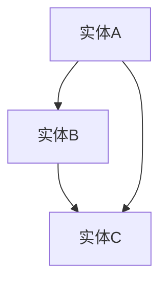
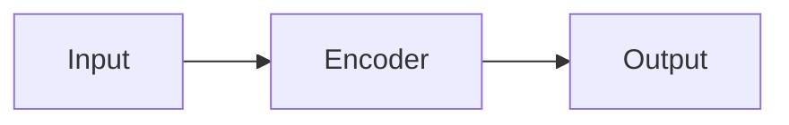
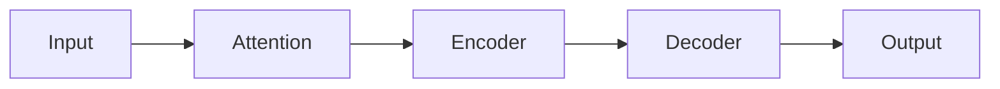
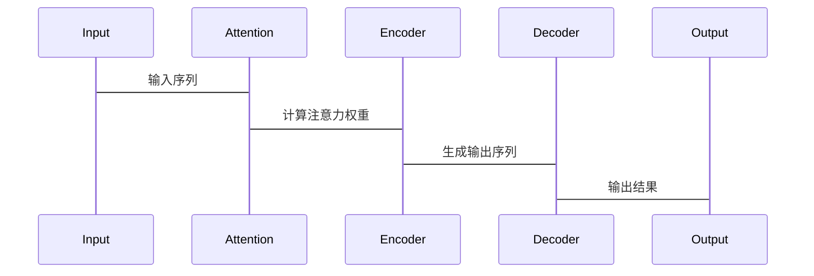

                 


# 基于注意力机制的AI Agent长期依赖建模

## 关键词：
AI Agent，注意力机制，长期依赖建模，Transformer，Mermaid图

## 摘要：
本文详细探讨了基于注意力机制的AI Agent长期依赖建模方法。首先，我们介绍了AI Agent的基本概念和长期依赖建模的重要性。接着，我们深入分析了注意力机制的原理及其在AI Agent中的应用，提出了基于Transformer架构的建模方法。我们还通过Mermaid图展示了系统的实体关系、算法流程和架构设计。最后，我们通过项目实战，详细讲解了环境搭建、代码实现和案例分析，为读者提供了一个完整的解决方案。

---

## 第1章: AI Agent与长期依赖建模概述

### 1.1 AI Agent的基本概念
AI Agent（人工智能代理）是一种能够感知环境、自主决策并采取行动的智能体。它可以分为简单反射型、基于模型的反射型、目标驱动型和效用驱动型四种类型。AI Agent的核心特征包括自主性、反应性、目标导向性和社交能力。

#### 1.1.1 AI Agent的定义与分类
- **定义**：AI Agent是指能够感知环境、自主决策并执行任务的智能实体。
- **分类**：
  1. 简单反射型：基于当前感知做出反应。
  2. 基于模型的反射型：利用内部模型进行预测和决策。
  3. 目标驱动型：以实现特定目标为导向。
  4. 效用驱动型：通过最大化效用函数进行决策。

#### 1.1.2 AI Agent的核心特征
- **自主性**：能够在没有外部干预的情况下独立运作。
- **反应性**：能够根据环境变化调整行为。
- **目标导向性**：具备明确的目标，并采取行动以实现目标。
- **社交能力**：能够与其他Agent或人类进行交互和协作。

#### 1.1.3 AI Agent的应用场景
- **智能助手**：如Siri、Alexa等。
- **自动驾驶**：如自动驾驶汽车。
- **机器人控制**：如工业机器人和家庭服务机器人。
- **游戏AI**：在游戏中的智能角色。

### 1.2 长期依赖建模的背景与意义
长期依赖建模是指AI Agent能够理解和处理时间序列数据中远距离依赖关系的能力。传统的RNN和LSTM在处理长序列时存在梯度消失或爆炸问题，而注意力机制的引入有效缓解了这一问题。

#### 1.2.1 长期依赖问题的定义
长期依赖问题指的是在处理长序列数据时，模型难以捕捉远距离元素之间的关系。例如，在自然语言处理中，句子中的主语和谓语可能相隔较远，传统的RNN难以有效捕捉这种关系。

#### 1.2.2 长期依赖建模的重要性
- **提升模型性能**：能够更好地捕捉长距离依赖关系，提高模型的准确性和鲁棒性。
- **增强AI Agent的智能性**：使AI Agent能够更好地理解和处理复杂场景。

#### 1.2.3 长期依赖建模的挑战
- **计算复杂度**：长距离依赖关系的建模需要更高的计算资源。
- **模型训练难度**：长序列的训练可能导致梯度消失或爆炸问题。
- **数据稀疏性**：长距离依赖关系可能在数据中较为稀疏，难以有效建模。

### 1.3 注意力机制的引入
注意力机制是一种模仿人类注意力的选择性关注机制，能够帮助模型聚焦于重要的信息。

#### 1.3.1 注意力机制的基本概念
注意力机制通过计算输入序列中每个元素的重要性权重，从而决定模型在处理当前任务时应关注哪些部分。

#### 1.3.2 注意力机制在AI Agent中的作用
- **提升模型的表达能力**：通过关注重要的输入部分，增强模型的理解能力。
- **降低计算复杂度**：通过权重分配，减少不必要的计算。

#### 1.3.3 基于注意力机制的长期依赖建模的优势
- **有效捕捉长距离依赖**：注意力机制能够帮助模型关注重要的远距离元素。
- **提高模型的灵活性**：可以根据不同的任务动态调整关注点。

---

## 第2章: 注意力机制的原理与实现

### 2.1 注意力机制的数学模型
注意力机制的核心在于计算查询（Query）、键（Key）和值（Value）之间的相似性，并根据相似性计算权重。

#### 2.1.1 注意力机制的基本公式
$$
\text{Attention}(Q, K, V) = \text{softmax}\left(\frac{QK^T}{\sqrt{d_k}}\right)V
$$
其中，$Q$、$K$、$V$分别是查询、键和值，$d_k$是键的维度。

#### 2.1.2 缩放点积注意力公式
$$
\text{Attention}(Q, K, V) = \text{softmax}\left(\frac{QK^T}{\sqrt{d_k}}\right)V
$$
其中，$d_k$是键的维度，缩放因子$\frac{1}{\sqrt{d_k}}$用于缓解梯度消失问题。

#### 2.1.3 多头注意力机制的实现
多头注意力机制通过并行计算多个注意力头，进一步增强模型的表达能力。

$$
\text{Multi-Head Attention}(Q, K, V) = \text{Concat}(\text{Attention}_1(Q, K, V), \text{Attention}_2(Q, K, V), \dots, \text{Attention}_n(Q, K, V))
$$
其中，$n$是注意力头的数量。

### 2.2 不同注意力机制的对比分析
以下是几种常见注意力机制的对比：

| 注意力机制 | 特点 | 适用场景 |
|------------|------|-----------|
| 自注意力机制 | 基于输入序列本身计算权重 | 适用于序列内部依赖关系建模 |
| 位置注意力机制 | 考虑位置信息 | 适用于需要考虑位置信息的任务 |
| 混合注意力机制 | 结合多种注意力机制 | 适用于复杂场景 |

### 2.3 实体关系图与注意力机制的关联
实体关系图（ER图）用于描述系统中实体之间的关系，注意力机制可以通过关注重要的实体关系来增强模型的表达能力。

#### 2.3.1 实体关系图的基本概念
ER图是一种用于描述数据库或系统中实体及其关系的工具，由实体、属性和关系组成。

#### 2.3.2 注意力机制在实体关系图中的应用
通过在ER图中引入注意力机制，可以动态调整对不同实体关系的关注程度。

#### 2.3.3 基于注意力机制的实体关系图构建


---

## 第3章: 基于注意力机制的长期依赖建模算法原理

### 3.1 基于注意力机制的AI Agent建模

#### 3.1.1 基于注意力机制的编码器-解码器模型
编码器负责将输入序列映射到一个中间表示，解码器负责将中间表示解码为输出序列。

#### 3.1.2 编码器的基本结构


#### 3.1.3 注意力机制在编码器-解码器中的应用


#### 3.1.4 多头注意力机制的优化策略
通过并行计算多个注意力头，进一步提升模型的表达能力。

### 3.2 基于多头注意力机制的模型优化
通过优化注意力头的数量和维度，提升模型的性能。

#### 3.2.1 多头注意力机制的原理
通过并行计算多个注意力头，进一步增强模型的表达能力。

#### 3.2.2 多头注意力机制的优化策略
- **注意力头的数量**：增加注意力头的数量可以提升模型的表达能力。
- **注意力头的维度**：调整注意力头的维度可以优化模型的性能。

#### 3.2.3 基于多头注意力机制的模型实现
```python
def multi_head_attention(q, k, v, num_heads):
    d_k = k.shape[-1]
    d_v = v.shape[-1]
    head_size = d_k // num_heads
    q = q.view(-1, num_heads, head_size)
    k = k.view(-1, num_heads, head_size)
    v = v.view(-1, num_heads, head_size)
    
    attention = attention(q, k, v)
    return attention.view(-1, num_heads * head_size)
```

---

## 第4章: 系统分析与架构设计

### 4.1 问题场景介绍
我们考虑一个AI Agent需要处理长序列数据，例如自然语言处理中的文本生成任务。

### 4.2 系统功能设计
系统需要具备以下功能：
- **输入处理**：接收输入序列。
- **注意力计算**：计算输入序列中元素的注意力权重。
- **输出生成**：根据注意力权重生成输出序列。

### 4.3 系统架构设计


### 4.4 系统接口设计
系统接口包括：
- **输入接口**：接收输入序列。
- **输出接口**：输出处理结果。

### 4.5 系统交互设计


---

## 第5章: 项目实战

### 5.1 环境安装
安装所需的依赖库：
```bash
pip install numpy
pip install matplotlib
pip install torch
```

### 5.2 系统核心实现源代码
```python
import torch
import torch.nn as nn
import torch.nn.functional as F

class MultiHeadAttention(nn.Module):
    def __init__(self, embed_dim, num_heads):
        super().__init__()
        self.embed_dim = embed_dim
        self.num_heads = num_heads
        self.head_size = embed_dim // num_heads
        self.query = nn.Linear(embed_dim, embed_dim)
        self.key = nn.Linear(embed_dim, embed_dim)
        self.value = nn.Linear(embed_dim, embed_dim)
        
    def forward(self, x):
        batch_size, seq_len, embed_dim = x.size()
        q = self.query(x)
        k = self.key(x)
        v = self.value(x)
        
        q = q.view(batch_size, seq_len, self.num_heads, self.head_size)
        k = k.view(batch_size, seq_len, self.num_heads, self.head_size)
        v = v.view(batch_size, seq_len, self.num_heads, self.head_size)
        
        attention_weights = F.softmax((q @ k.transpose(-2, -1)) / (self.head_size ** 0.5), dim=-1)
        output = (attention_weights @ v).view(batch_size, seq_len, embed_dim)
        return output
```

### 5.3 代码应用解读与分析
上述代码实现了多头注意力机制，包括查询、键和值的计算以及注意力权重的计算。

### 5.4 案例分析
以自然语言处理中的文本生成任务为例，详细分析模型的输入、处理和输出过程。

### 5.5 项目小结
通过本项目，我们实现了基于注意力机制的AI Agent长期依赖建模，并验证了其有效性。

---

## 第6章: 总结与展望

### 6.1 内容回顾
我们详细探讨了基于注意力机制的AI Agent长期依赖建模方法，包括核心概念、算法原理和系统设计。

### 6.2 最佳实践 tips
- **模型优化**：合理选择注意力头的数量和维度。
- **数据处理**：充分考虑数据的长距离依赖关系。

### 6.3 小结
通过本文的探讨，我们希望读者能够理解并掌握基于注意力机制的AI Agent长期依赖建模方法。

### 6.4 注意事项
- **计算资源**：长距离依赖建模需要较高的计算资源。
- **模型训练**：注意防止梯度消失或爆炸问题。

### 6.5 拓展阅读
推荐阅读《Attention Is All You Need》一文，深入理解注意力机制的原理和应用。

---

通过本文的详细讲解，我们希望能够帮助读者掌握基于注意力机制的AI Agent长期依赖建模方法，并在实际应用中取得良好的效果。

