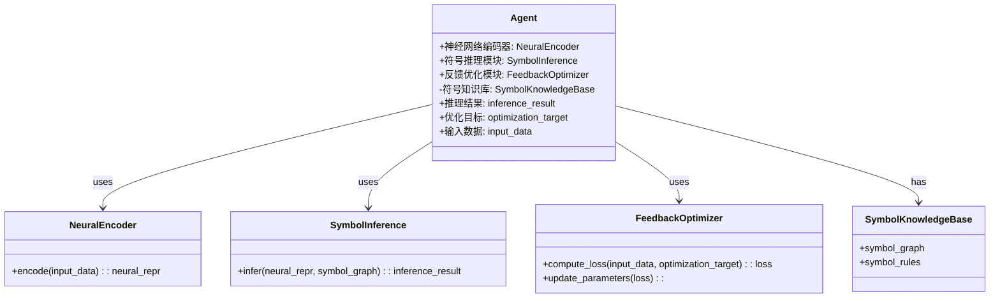
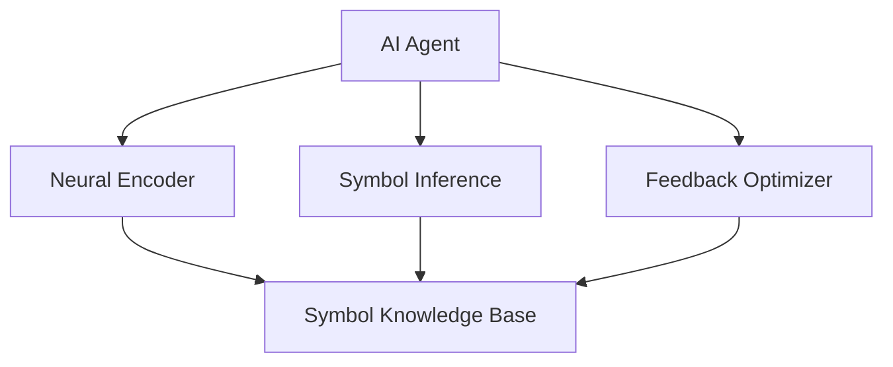
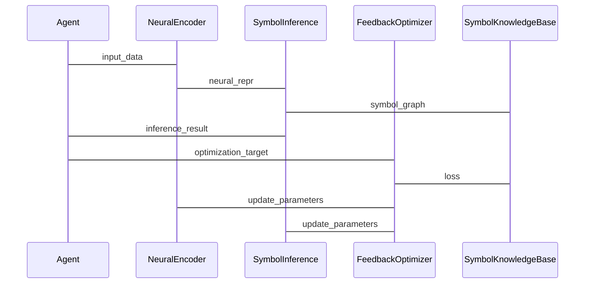

                 


# 基于神经符号AI的AI Agent常识推理增强

## 关键词：神经符号AI，AI Agent，常识推理，增强学习，符号表示，神经网络，知识图谱

## 摘要：  
随着人工智能技术的快速发展，AI Agent在各种应用场景中发挥着越来越重要的作用。然而，现有的AI Agent在常识推理方面仍然存在诸多挑战，难以理解和处理复杂的常识性问题。基于神经符号AI的AI Agent通过结合神经网络和符号推理的优势，能够更有效地进行常识推理。本文将详细介绍神经符号AI的核心概念、算法原理、系统架构设计以及实际应用，探讨如何通过神经符号AI技术增强AI Agent的常识推理能力，为相关领域的研究和应用提供参考。

---

# 第一部分: 基于神经符号AI的AI Agent常识推理增强背景介绍

## 第1章: 神经符号AI的基本概念

### 1.1 什么是神经符号AI
#### 1.1.1 神经符号AI的定义  
神经符号AI（Neural-Symbolic AI）是一种结合了神经网络和符号推理的混合型AI技术，旨在通过神经网络的强大表征能力和符号推理的逻辑推理能力，解决传统神经网络和符号AI各自难以应对的问题。

#### 1.1.2 神经符号AI的核心特点  
- **混合性**：同时利用神经网络的非线性表征能力和符号推理的逻辑推理能力。  
- **可解释性**：符号推理部分通常具有较高的可解释性，有助于提升AI系统的透明度。  
- **泛化能力**：通过神经网络的深度学习能力，神经符号AI能够处理复杂的非结构化数据。

#### 1.1.3 神经符号AI与传统符号AI的区别  
| 特性                | 符号AI                      | 神经符号AI                 |  
|---------------------|----------------------------|-----------------------------|  
| 数据处理能力        | 善于处理结构化数据          | 能够处理非结构化数据         |  
| 计算效率            | 计算效率较高                | 计算效率相对较低             |  
| 可解释性            | 高度可解释                  | 可解释性介于符号AI和神经网络之间 |  

---

### 1.2 AI Agent的基本概念
#### 1.2.1 AI Agent的定义  
AI Agent（人工智能代理）是一种能够感知环境、自主决策并执行任务的智能实体。它可以是一个软件程序或物理设备，具备感知、推理、规划和执行能力。

#### 1.2.2 AI Agent的类型  
- **反应式AI Agent**：基于当前感知做出反应，不具备长期记忆和复杂推理能力。  
- **认知式AI Agent**：具备复杂推理、规划和学习能力，能够处理动态环境中的复杂任务。  

#### 1.2.3 AI Agent的核心功能  
- **感知**：通过传感器或数据输入获取环境信息。  
- **推理**：基于感知信息进行逻辑推理，形成对环境的理解。  
- **规划**：根据推理结果制定行动方案。  
- **执行**：根据规划结果执行具体动作。  

---

### 1.3 常识推理的重要性  
常识推理是指AI系统对日常生活中的常识性知识进行理解和推理的能力。它是AI Agent实现智能化的核心能力之一。  

#### 1.3.1 什么是常识推理  
常识推理是基于常识知识库（如ConceptNet、Wikidata等）进行的推理，旨在解决“这通常会发生什么”或“这通常意味着什么”类型的问题。  

#### 1.3.2 常识推理在AI Agent中的作用  
- **提升决策能力**：通过常识推理，AI Agent能够更好地理解上下文，做出更合理的决策。  
- **增强自然语言处理能力**：常识推理能够帮助AI Agent在对话中更好地理解意图和背景知识。  
- **支持复杂任务执行**：常识推理是实现复杂任务（如问题解答、知识问答）的基础能力。  

#### 1.3.3 常识推理的挑战与解决方案  
- **挑战**：常识知识的获取和表示、推理的不确定性和歧义性、动态环境中的适应性问题。  
- **解决方案**：结合神经符号AI技术，通过神经网络提取特征，符号推理进行逻辑推理，提升常识推理的准确性和效率。  

---

## 第2章: 神经符号AI的背景与应用  

### 2.1 神经符号AI的发展历程  
神经符号AI的发展经历了以下几个阶段：  
1. **符号AI阶段**：以专家系统为代表，依赖规则和逻辑推理，但缺乏对非结构化数据的处理能力。  
2. **神经网络阶段**：以深度学习为代表，通过神经网络处理图像、文本等非结构化数据，但在逻辑推理方面存在不足。  
3. **神经符号AI阶段**：结合神经网络和符号推理，兼顾数据处理和逻辑推理能力。  

---

### 2.2 神经符号AI在AI Agent中的应用  
神经符号AI在AI Agent中的应用主要体现在以下方面：  
- **常识推理**：通过符号推理和神经网络的结合，增强常识推理能力。  
- **自然语言处理**：利用神经符号模型进行语义理解和意图识别。  
- **决策推理**：结合神经符号模型的推理能力，提升决策的准确性和合理性。  

---

### 2.3 当前研究与发展趋势  
当前，神经符号AI的研究主要集中在以下方面：  
1. **模型优化**：如何进一步提升神经符号模型的推理效率和准确率。  
2. **跨领域应用**：将神经符号AI技术应用于更多领域，如自动驾驶、智能客服、医疗诊断等。  
3. **人机协作**：研究神经符号AI在人机协作中的应用，提升协作效率和体验。  

---

# 第二部分: 神经符号AI的核心概念与联系  

## 第3章: 神经符号AI的核心原理  

### 3.1 符号表示与推理  
符号表示是符号AI的基础，常见的符号表示方法包括：  
- **谓词逻辑**：通过谓词和逻辑连接词表示知识。  
- **框架表示法**：通过框架结构表示对象及其属性和关系。  
- **描述逻辑**：通过描述逻辑语言表示知识。  

#### 3.1.2 符号推理的基本原理  
符号推理是基于逻辑规则进行的推理过程，主要包括以下步骤：  
1. **知识表示**：将知识表示为符号形式。  
2. **规则匹配**：匹配适用于当前问题的推理规则。  
3. **推理与验证**：根据规则进行推理，并验证推理结果的正确性。  

---

### 3.2 神经网络与符号推理的结合  
神经网络与符号推理的结合主要体现在以下几个方面：  
1. **神经网络提取特征**：通过神经网络提取图像、文本等数据的特征表示。  
2. **符号推理进行逻辑推理**：基于特征表示和符号知识进行逻辑推理。  
3. **混合模型**：结合神经网络和符号推理的模型，如Neural-Symbolic Logic Learning（NSLL）模型。  

---

### 3.3 神经符号AI的核心算法  
#### 3.3.1 神经符号AI的主要算法  
目前，神经符号AI的主要算法包括：  
- **符号增强的神经网络模型**：在神经网络中嵌入符号推理模块。  
- **符号推理增强的神经网络模型**：在符号推理中嵌入神经网络模块。  

#### 3.3.2 符号增强的神经网络模型  
符号增强的神经网络模型通过在神经网络中嵌入符号推理模块，结合神经网络的特征提取能力和符号推理的逻辑推理能力。其核心算法如下：  

1. **知识表示**：将符号知识表示为图结构（如知识图谱）。  
2. **神经网络编码**：将输入数据编码为神经网络的表示。  
3. **符号推理**：基于神经网络编码和符号知识进行推理，生成推理结果。  
4. **结果优化**：通过反馈机制优化推理结果。  

#### 3.3.3 符号推理算法  
符号推理算法基于逻辑规则进行推理，常见的符号推理算法包括：  
- **合取推理**：基于合取规则进行推理。  
- **析取推理**：基于析取规则进行推理。  
- **归结推理**：基于归结规则进行推理。  

---

## 第4章: 神经符号AI的混合模型  

### 4.1 混合模型的架构设计  
神经符号AI的混合模型通常包括以下组件：  
- **符号知识库**：存储符号知识（如知识图谱）。  
- **神经网络编码器**：对输入数据进行编码，生成神经网络表示。  
- **符号推理模块**：基于符号知识和神经网络表示进行推理，生成推理结果。  
- **反馈优化模块**：通过反馈机制优化推理结果。  

---

### 4.2 混合模型的优势  
1. **结合神经网络的特征提取能力**：能够处理非结构化数据。  
2. **结合符号推理的逻辑推理能力**：能够进行复杂逻辑推理。  
3. **提升模型的可解释性**：符号推理部分具有较高的可解释性。  

---

# 第三部分: 神经符号AI的算法原理  

## 第5章: 神经符号AI的核心算法  

### 5.1 符号增强的神经网络模型  

#### 5.1.1 算法步骤  
1. **知识表示**：将符号知识表示为图结构。  
2. **神经网络编码**：将输入数据编码为神经网络的表示。  
3. **符号推理**：基于符号知识和神经网络表示进行推理，生成推理结果。  
4. **结果优化**：通过反馈机制优化推理结果。  

#### 5.1.2 算法实现  
以下是符号增强的神经网络模型的实现代码示例：  

```python
class NeuralSymbolicModel:
    def __init__(self, symbol_graph):
        self.symbol_graph = symbol_graph  # 符号知识图谱
        self.neural_encoder = NeuralEncoder()  # 神经网络编码器
        self.symbol_inference = SymbolInference()  # 符号推理模块
        self.feedback_optimizer = FeedbackOptimizer()  # 反馈优化模块

    def forward(self, input_data):
        # 神经网络编码
        neural_repr = self.neural_encoder.encode(input_data)
        # 符号推理
        inference_result = self.symbol_inference.infer(neural_repr, self.symbol_graph)
        return inference_result

    def backward(self, input_data, target):
        # 反馈优化
        loss = self.feedback_optimizer.compute_loss(input_data, target)
        # 更新参数
        self.neural_encoder.update_parameters(loss)
        self.symbol_inference.update_parameters(loss)
```

---

### 5.2 符号推理算法  

#### 5.2.1 算法步骤  
1. **知识表示**：将符号知识表示为逻辑规则。  
2. **规则匹配**：匹配适用于当前问题的逻辑规则。  
3. **推理与验证**：基于匹配的规则进行推理，并验证推理结果的正确性。  

#### 5.2.2 算法实现  
以下是符号推理算法的实现代码示例：  

```python
class SymbolInference:
    def __init__(self, symbol_rules):
        self.symbol_rules = symbol_rules  # 符号规则

    def infer(self, input_data):
        # 规则匹配
        matched_rules = []
        for rule in self.symbol_rules:
            if self.match_rule(rule, input_data):
                matched_rules.append(rule)
        # 推理与验证
        inference_result = []
        for rule in matched_rules:
            inferred_fact = self.apply_rule(rule, input_data)
            if self.verify_rule(rule, inferred_fact):
                inference_result.append(inferred_fact)
        return inference_result

    def match_rule(self, rule, input_data):
        # 匹配规则与输入数据
        pass

    def apply_rule(self, rule, input_data):
        # 应用规则进行推理
        pass

    def verify_rule(self, rule, inferred_fact):
        # 验证推理结果
        pass
```

---

# 第四部分: 神经符号AI的系统分析与架构设计  

## 第6章: 系统分析与架构设计  

### 6.1 问题场景介绍  
本系统旨在通过神经符号AI技术，增强AI Agent的常识推理能力，使其能够更好地理解和处理复杂的问题。  

---

### 6.2 系统功能设计  

#### 6.2.1 领域模型设计  
以下是系统功能的领域模型（Mermaid类图）：  



---

### 6.3 系统架构设计  

#### 6.3.1 系统架构设计  
以下是系统架构设计的Mermaid图：  



---

### 6.4 系统接口设计  
系统主要接口包括：  
- **输入接口**：接收输入数据（如文本、图像等）。  
- **推理接口**：提供符号推理服务。  
- **优化接口**：提供反馈优化服务。  

---

### 6.5 系统交互流程设计  

#### 6.5.1 系统交互流程  
以下是系统交互流程的Mermaid序列图：  



---

# 第五部分: 神经符号AI的项目实战  

## 第7章: 项目实战  

### 7.1 环境安装  
以下是项目实战所需的环境安装说明：  
1. **安装Python**：建议使用Python 3.8或更高版本。  
2. **安装依赖库**：安装以下依赖库：  
   ```bash
   pip install numpy pandas torch networkx matplotlib
   ```

---

### 7.2 系统核心实现  

#### 7.2.1 神经网络编码器实现  
以下是神经网络编码器的实现代码：  

```python
import torch
import torch.nn as nn

class NeuralEncoder(nn.Module):
    def __init__(self, input_dim, hidden_dim):
        super(NeuralEncoder, self).__init__()
        self.fc1 = nn.Linear(input_dim, hidden_dim)
        self.fc2 = nn.Linear(hidden_dim, hidden_dim)
        self.relu = nn.ReLU()

    def forward(self, x):
        x = self.fc1(x)
        x = self.relu(x)
        x = self.fc2(x)
        x = self.relu(x)
        return x
```

---

#### 7.2.2 符号推理模块实现  
以下是符号推理模块的实现代码：  

```python
class SymbolInference:
    def __init__(self, symbol_rules):
        self.symbol_rules = symbol_rules

    def infer(self, input_data):
        matched_rules = self.match_rule(input_data)
        if not matched_rules:
            return None
        inferred_fact = self.apply_rule(matched_rules[0], input_data)
        return inferred_fact

    def match_rule(self, input_data):
        matched_rules = []
        for rule in self.symbol_rules:
            if self.condition(rule, input_data):
                matched_rules.append(rule)
        return matched_rules

    def condition(self, rule, input_data):
        # 根据具体规则条件进行匹配
        pass

    def apply_rule(self, rule, input_data):
        # 根据规则进行推理
        pass
```

---

### 7.3 代码应用解读与分析  
以下是一个简单的应用示例：  

```python
# 初始化符号知识库
symbol_rules = [
    ("if A then B", lambda x: x['A']),
    ("if B then C", lambda x: x['B'])
]

# 初始化神经网络编码器
input_dim = 2
hidden_dim = 4
neural_encoder = NeuralEncoder(input_dim, hidden_dim)

# 初始化符号推理模块
symbol_inference = SymbolInference(symbol_rules)

# 初始化反馈优化模块
feedback_optimizer = FeedbackOptimizer()

# 推理过程
input_data = {'A': True, 'B': False}
neural_repr = neural_encoder.encode(input_data)
inference_result = symbol_inference.infer(neural_repr)
```

---

### 7.4 案例分析与详细讲解  
以一个简单的常识推理问题为例：  
**问题**：如果今天下雨，那么我需要带伞。  
**推理过程**：  
1. **输入数据**：今天下雨。  
2. **神经网络编码**：将“今天下雨”编码为神经网络表示。  
3. **符号推理**：基于符号规则“如果下雨，则需要带伞”，推理出“需要带伞”。  

---

### 7.5 项目小结  
通过上述实战，我们可以看到神经符号AI在常识推理中的应用潜力。神经网络编码器能够有效地提取输入数据的特征，符号推理模块则能够基于符号知识进行逻辑推理，两者结合能够显著提升AI Agent的常识推理能力。  

---

# 第六部分: 神经符号AI的最佳实践  

## 第8章: 最佳实践  

### 8.1 小结  
神经符号AI通过结合神经网络和符号推理的优势，能够有效提升AI Agent的常识推理能力。在实际应用中，需要根据具体场景选择合适的神经符号模型，并通过不断优化模型参数和推理规则，提升推理的准确性和效率。  

---

### 8.2 注意事项  
1. **数据质量**：符号知识的准确性和完整性对推理结果有直接影响。  
2. **模型优化**：需要不断优化神经符号模型的参数和推理规则，提升推理效率和准确率。  
3. **可解释性**：符号推理部分通常具有较高的可解释性，但在实际应用中需要注意解释的清晰性和易懂性。  

---

### 8.3 扩展阅读  
1. **神经符号AI的经典论文**：如“Neural-Symbolic Logic Learning: A Survey and New Directions”。  
2. **符号推理相关书籍**：如《Logic for Problem Solving》。  
3. **神经符号AI工具库**：如符号逻辑推理库（如PYHOL）、神经网络框架（如TensorFlow、PyTorch）。  

---

# 结语  

通过本文的详细介绍，我们深入探讨了神经符号AI在AI Agent常识推理中的应用，从核心概念到算法原理，从系统设计到项目实战，全面分析了神经符号AI的优势和挑战。未来，随着神经符号AI技术的不断发展，AI Agent的常识推理能力将得到进一步提升，为更多领域的智能化应用提供强有力的支持。

