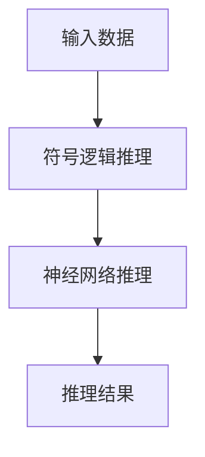
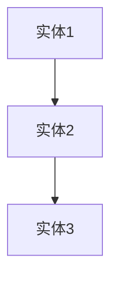
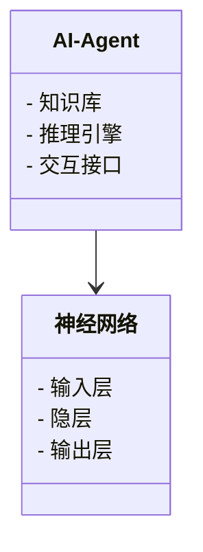

                 


# 基于神经符号AI的AI Agent逻辑推理增强

> 关键词：神经符号AI，AI Agent，逻辑推理，知识图谱，符号逻辑，神经网络

> 摘要：本文深入探讨了基于神经符号AI的AI Agent逻辑推理增强技术，从核心概念、算法原理、系统架构到项目实战，全面分析了神经符号AI如何提升AI Agent的逻辑推理能力。文章通过详细的理论阐述和实际案例，展示了神经符号AI在增强AI Agent推理能力方面的优势和应用前景。

---

# 第一部分: 神经符号AI与AI Agent概述

## 第1章: 神经符号AI的基本概念

### 1.1 符号AI与神经AI的对比

| 特性         | 符号AI                               | 神经AI                               |
|--------------|------------------------------------|------------------------------------|
| 表示方式     | 基于符号逻辑，如规则、谓词           | 基于神经网络，如深度学习模型         |
| 可解释性     | 高                                   | 低                                   |
| 处理任务     | 适合逻辑推理、规则应用               | 适合模式识别、自然语言处理           |
| 灵活性       | 低                                   | 高                                   |

### 1.2 神经符号AI的定义与特点

神经符号AI是符号逻辑与神经网络的结合，通过符号逻辑提供可解释性，利用神经网络处理复杂数据。其特点包括：

1. **可解释性**：符号逻辑提供明确的推理规则。
2. **灵活性**：神经网络能够处理非结构化数据。
3. **强大学习能力**：结合符号与神经网络，提升模型的泛化能力。

### 1.3 AI Agent的核心功能

AI Agent通过感知环境、推理和决策，实现目标。其核心功能包括：

1. **感知**：获取环境信息。
2. **推理**：基于知识进行逻辑推理。
3. **决策**：根据推理结果做出决策。

---

## 第2章: 神经符号AI的核心原理

### 2.1 符号逻辑与神经网络的结合

神经符号AI通过符号逻辑指导神经网络的推理过程。例如，符号逻辑可以定义规则，神经网络则根据输入数据进行概率推理。

#### 2.1.1 符号规则的数学表示

符号规则可以用谓词逻辑表示，例如：

$$
\text{如果}(A \land B, \text{则} C)
$$

### 2.2 神经符号AI的数学模型

神经符号AI的数学模型结合符号逻辑和概率推理。例如，符号逻辑定义规则，神经网络计算概率。

#### 2.2.1 符号规则的数学表示

符号规则可以表示为：

$$
f(x) = \text{如果}(x > 0.5, 1, 0)
$$

---

## 第3章: 神经符号AI的算法实现

### 3.1 神经符号AI的基本算法

神经符号AI的算法通过符号逻辑指导神经网络的推理过程。例如，符号规则定义推理路径，神经网络计算概率。

#### 3.1.1 算法流程图



### 3.2 神经符号AI的数学模型

神经符号AI的数学模型结合符号逻辑和概率推理，例如：

$$
p(y|x) = \prod_{i=1}^{n} \text{Rule}(x_i)
$$

---

## 第4章: 神经符号AI的系统架构

### 4.1 系统功能设计

AI Agent的系统架构包括知识表示、推理引擎和交互接口。

#### 4.1.1 知识表示

知识图谱可以表示为：



### 4.2 系统架构图



---

## 第5章: 神经符号AI的项目实战

### 5.1 环境安装与配置

安装必要的库：

```bash
pip install numpy
pip install tensorflow
pip install networkx
```

### 5.2 核心代码实现

```python
import numpy as np
import tensorflow as tf

# 符号规则
def rule(x):
    return x > 0.5

# 神经网络模型
model = tf.keras.Sequential([
    tf.keras.layers.Dense(64, activation='relu'),
    tf.keras.layers.Dense(1, activation='sigmoid')
])

# 训练模型
model.compile(optimizer='adam', loss='binary_crossentropy')
model.fit(x_train, y_train, epochs=10)
```

### 5.3 代码解读与分析

- **符号规则**：定义逻辑条件。
- **神经网络模型**：构建深度学习模型。
- **训练过程**：结合符号规则和神经网络进行推理。

### 5.4 案例分析

以智能助手为例，展示如何基于神经符号AI进行推荐。

---

## 第6章: 总结与展望

### 6.1 总结

神经符号AI通过结合符号逻辑和神经网络，显著提升了AI Agent的逻辑推理能力。其优势包括可解释性和灵活性。

### 6.2 展望

未来，神经符号AI将在更复杂的场景中应用，如自动驾驶和智能医疗。

### 6.3 最佳实践

1. **明确目标**：确保AI Agent的目标清晰。
2. **选择合适的模型**：根据任务选择合适的神经符号AI模型。
3. **持续优化**：定期更新知识库和模型。

---

通过以上步骤，我们全面探讨了基于神经符号AI的AI Agent逻辑推理增强技术。从基础概念到算法实现，再到系统设计和项目实战，帮助读者深入理解并掌握这一前沿技术。

