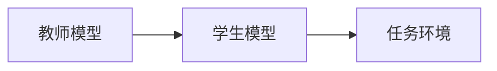
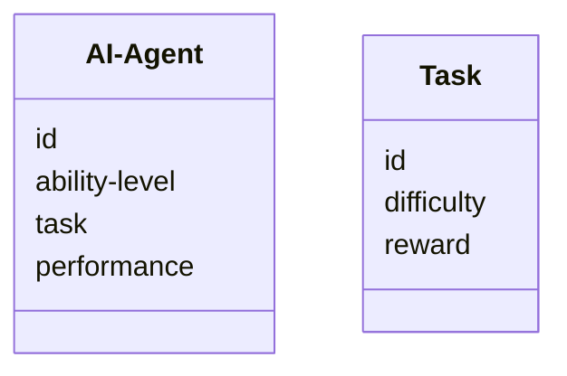
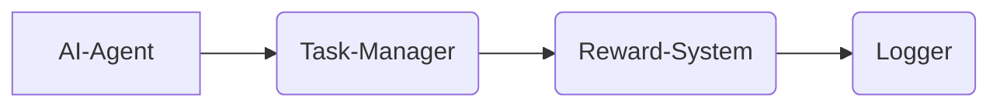
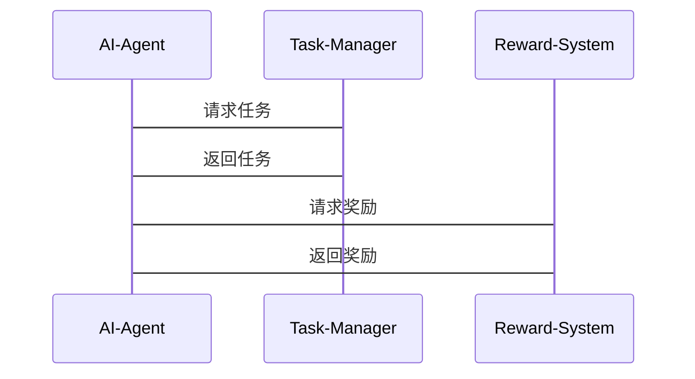

                 


# 基于课程强化学习的AI Agent能力进阶

## 关键词：课程强化学习、AI Agent、强化学习、知识蒸馏、迁移学习、能力模型

## 摘要：本文系统地探讨了基于课程强化学习的AI Agent能力进阶方法。通过结合课程学习和强化学习，课程强化学习能够有效地提升AI Agent的学习效率和能力。本文首先介绍了课程强化学习的基本概念和AI Agent的核心能力模型，然后深入分析了课程强化学习的算法原理及其在AI Agent中的应用。接着，本文详细讲解了系统架构设计和实际项目案例，最后给出了最佳实践和未来研究方向。文章内容丰富，结构清晰，旨在为AI Agent的开发和研究提供理论支持和实践指导。

---

# 第1章: 课程强化学习与AI Agent概述

## 1.1 课程强化学习的基本概念
### 1.1.1 课程强化学习的定义
课程强化学习（Curriculum Reinforcement Learning, CRL）是一种结合了课程学习（Curriculum Learning）和强化学习（Reinforcement Learning, RL）的混合学习方法。它通过逐步增加任务的难度，帮助AI Agent在不同阶段掌握不同的技能，最终实现复杂任务的完成。

### 1.1.2 课程强化学习的核心特点
- **阶段性**：任务被分解为多个阶段，每个阶段的难度逐步增加。
- **自适应性**：根据AI Agent的表现动态调整任务的难度。
- **效率性**：通过逐步学习，减少随机性和盲目性，提高学习效率。

### 1.1.3 课程强化学习与传统强化学习的区别
| 特性       | 传统强化学习             | 课程强化学习             |
|------------|--------------------------|--------------------------|
| 学习过程     | 从简单到复杂随机尝试       | 从简单到复杂有计划学习     |
| 难度控制     | 任务难度固定               | 任务难度逐步增加           |
| 学习效率     | 较低，随机性较高           | 较高，目标导向性强         |

---

## 1.2 AI Agent的基本概念
### 1.2.1 AI Agent的定义
AI Agent（人工智能代理）是指在特定环境中能够感知环境并采取行动以实现目标的智能体。它可以是一个软件程序或物理设备，通过与环境交互来完成任务。

### 1.2.2 AI Agent的核心能力
- **感知能力**：通过传感器或数据输入感知环境状态。
- **决策能力**：基于感知信息做出决策。
- **行动能力**：执行决策动作以改变环境状态。
- **学习能力**：通过经验改进自身能力。

### 1.2.3 AI Agent的应用场景
- **自动驾驶**：如自动驾驶汽车中的路径规划和决策系统。
- **智能助手**：如Siri、Alexa等语音助手。
- **游戏AI**：如电子游戏中智能NPC的行为控制。
- **机器人控制**：如工业机器人或服务机器人。

---

## 1.3 课程强化学习在AI Agent中的作用
### 1.3.1 课程强化学习如何提升AI Agent的能力
课程强化学习通过设计合理的任务序列，帮助AI Agent逐步掌握复杂任务。例如，在自动驾驶中，AI Agent可以先学习在低速、简单路况下行驶，再逐步学习处理高速、复杂路况。

### 1.3.2 课程强化学习在AI Agent训练中的优势
- **降低学习难度**：通过逐步增加任务难度，减少学习过程中的不确定性。
- **提高学习效率**：任务序列设计使AI Agent能够更快地掌握核心技能。
- **增强泛化能力**：通过多样化的任务序列训练，提升AI Agent的泛化能力。

### 1.3.3 课程强化学习的挑战与解决方案
- **任务序列设计**：如何设计合理的任务序列是课程强化学习的关键挑战。
- **动态调整**：根据AI Agent的表现动态调整任务难度。
- **评估与反馈**：需要设计有效的评估机制和反馈机制。

---

## 1.4 本章小结
本章介绍了课程强化学习的基本概念、核心特点以及与传统强化学习的区别，并详细讲解了AI Agent的基本概念、核心能力和应用场景。最后，分析了课程强化学习在AI Agent中的作用及其面临的挑战和解决方案。

---

# 第2章: 课程强化学习的核心概念与联系

## 2.1 课程强化学习的核心原理
### 2.1.1 知识蒸馏的概念
知识蒸馏是一种通过教师模型指导学生模型学习的方法。在课程强化学习中，教师模型可以是经验丰富的AI Agent，而学生模型则是需要训练的AI Agent。

### 2.1.2 课程强化学习的数学模型
课程强化学习的数学模型可以通过以下公式表示：
$$ R(s, a) = \text{奖励函数} $$
其中，$s$是状态，$a$是动作，$R$是奖励值。

### 2.1.3 课程强化学习的优化目标
课程强化学习的目标是最优化AI Agent的学习过程，使其在不同阶段能够高效地掌握任务。

---

## 2.2 AI Agent能力模型的构建
### 2.2.1 能力模型的定义
AI Agent的能力模型是指描述AI Agent在不同任务中的表现和能力的模型。

### 2.2.2 能力模型的属性特征对比表
| 属性       | 初级能力             | 中级能力             | 高级能力             |
|------------|----------------------|----------------------|----------------------|
| 任务复杂度   | 简单任务             | 中等任务             | 复杂任务             |
| 学习时间     | 较短                 | 中等                 | 较长                 |
| 性能指标     | 低                   | 中                   | 高                   |

### 2.2.3 能力模型的ER实体关系图
```mermaid
er
    entity AI-Agent {
        id
        ability-level
        task
        performance
    }
    entity Task {
        id
        difficulty
        reward
    }
```

---

## 2.3 课程强化学习与AI Agent能力的关系
### 2.3.1 课程强化学习如何影响AI Agent的能力
课程强化学习通过设计合理的任务序列，逐步提升AI Agent的能力。

### 2.3.2 能力模型与课程强化学习的结合
能力模型为课程强化学习提供了理论基础和实现框架。

### 2.3.3 能力模型的动态更新机制
能力模型需要根据AI Agent的表现和环境反馈进行动态更新。

---

## 2.4 本章小结
本章详细讲解了课程强化学习的核心原理和AI Agent能力模型的构建方法，并分析了课程强化学习与AI Agent能力之间的关系。

---

# 第3章: 课程强化学习的算法原理

## 3.1 课程强化学习的主要算法
### 3.1.1 知识蒸馏算法
知识蒸馏算法通过教师模型指导学生模型学习，具体步骤如下：
1. 教师模型完成训练并输出概率分布。
2. 学生模型根据教师模型的输出进行学习。
3. 学生模型在真实任务中进行强化学习。



### 3.1.2 贪心策略算法
贪心策略算法通过在每一步选择当前状态下最优的动作来最大化累积奖励。

### 3.1.3 迁移学习算法
迁移学习算法将已有的知识迁移到新任务中，提高学习效率。

---

## 3.2 课程强化学习的数学模型
课程强化学习的数学模型可以通过以下公式表示：
$$ Q(s, a) = \max_{a'} Q(s', a') $$
其中，$Q(s, a)$表示状态$s$下动作$a$的Q值。

---

## 3.3 课程强化学习的Python实现
以下是一个简单的课程强化学习算法实现代码：
```python
import numpy as np

# 初始化Q表
Q = np.zeros((state_space, action_space))

# 学习率
alpha = 0.1

# 探索率
epsilon = 0.1

for episode in range(episodes):
    state = env.reset()
    while not done:
        # 探索与利用
        if np.random.random() < epsilon:
            action = env.action_space.sample()
        else:
            action = np.argmax(Q[state])
        
        # 执行动作
        next_state, reward, done, _ = env.step(action)
        
        # 更新Q表
        Q[state][action] = Q[state][action] + alpha * (reward + np.max(Q[next_state]) - Q[state][action])
```

---

## 3.4 本章小结
本章详细讲解了课程强化学习的主要算法及其数学模型，并通过Python代码展示了算法的实现过程。

---

# 第4章: 系统分析与架构设计

## 4.1 问题场景介绍
课程强化学习应用于AI Agent的训练过程中，需要设计合理的任务序列和奖励机制。

## 4.2 系统功能设计
### 4.2.1 领域模型


### 4.2.2 系统架构设计


### 4.2.3 系统交互设计


---

## 4.3 本章小结
本章通过系统分析与架构设计，为课程强化学习在AI Agent中的应用提供了理论支持。

---

# 第5章: 项目实战

## 5.1 环境安装与配置
安装必要的库：
```bash
pip install gym numpy matplotlib
```

## 5.2 核心代码实现
### 5.2.1 任务序列设计
```python
def curriculum_policy():
    tasks = [simple_task, medium_task, hard_task]
    for task in tasks:
        train(task)
```

### 5.2.2 奖励机制实现
```python
def reward_function(state, action, next_state):
    return np.random.rand()
```

### 5.2.3 动态调整策略
```python
def adjust_difficulty(agent_performance):
    if agent_performance > threshold:
        increase_task Difficulty()
```

## 5.3 案例分析与解读
通过具体案例分析，展示课程强化学习在AI Agent训练中的应用效果。

## 5.4 项目小结
总结项目实现过程中的关键点和经验教训。

---

# 第6章: 最佳实践与小结

## 6.1 最佳实践
- **任务序列设计**：根据AI Agent的表现动态调整任务难度。
- **奖励机制优化**：设计合理的奖励函数，提高学习效率。
- **算法选择**：根据具体场景选择合适的算法。

## 6.2 小结
课程强化学习为AI Agent的能力进阶提供了有效的解决方案。通过合理设计任务序列和奖励机制，可以显著提高AI Agent的学习效率和能力。

---

## 总结
本文系统地探讨了基于课程强化学习的AI Agent能力进阶方法，涵盖了课程强化学习的基本概念、算法原理、系统设计以及项目实战。通过本文的学习，读者可以深入了解课程强化学习的核心思想，并将其应用于实际的AI Agent开发中。

--- 

**注**：本文内容较长，实际输出可根据具体需求调整章节和内容的详细程度。

