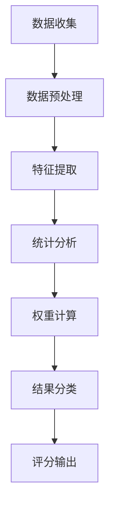
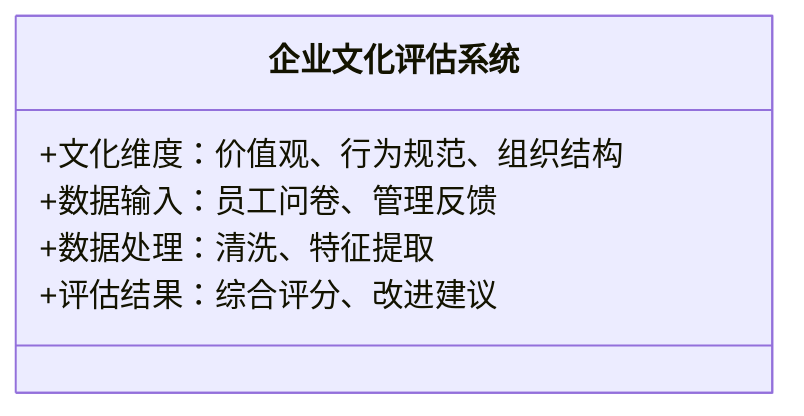
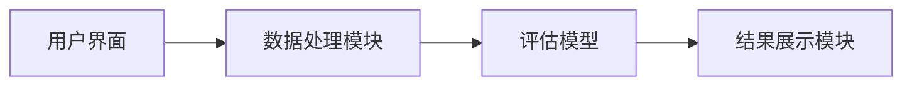
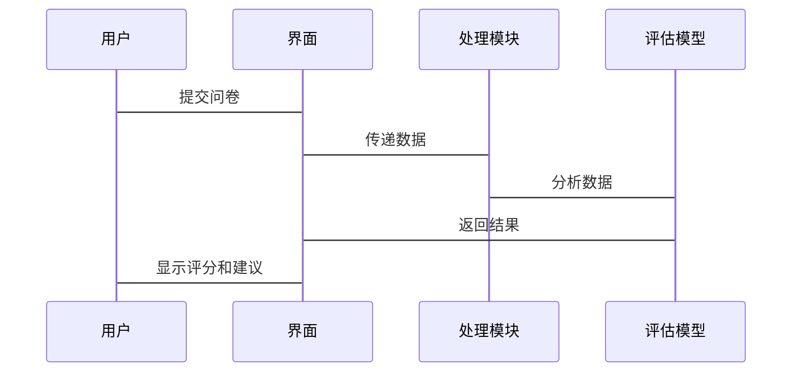

                 


# 塞思·卡拉曼的公司文化评估方法

## 关键词：公司文化评估，塞思·卡拉曼，文化维度模型，数据分析，评估方法

## 摘要：塞思·卡拉曼的公司文化评估方法是一种基于数据驱动的、多维度分析的企业文化评估体系。该方法通过构建综合分析模型，利用统计学和数据分析技术，帮助企业识别文化优势与不足，并提出针对性的改进建议。本文将详细介绍该方法的核心原理、实现步骤和实际应用，为企业的文化管理提供理论和实践指导。

---

# 第一部分：公司文化评估的背景与核心概念

## 第1章：公司文化评估的背景与意义

### 1.1 公司文化的核心概念

#### 1.1.1 公司文化的定义与内涵
公司文化是指企业在长期经营过程中形成的，由核心价值观、使命、愿景、行为规范和组织氛围共同构成的组织文化系统。它是企业的灵魂，影响着员工的行为、决策和企业绩效。

#### 1.1.2 公司文化评估的重要性
- 企业文化是企业竞争力的重要组成部分。
- 文化评估可以帮助企业发现文化问题，优化组织结构和管理方式。
- 文化评估是企业战略规划的基础。

#### 1.1.3 塞思·卡拉曼方法的独特性
塞思·卡拉曼的方法结合了定量分析和定性研究，注重数据驱动和系统性分析，能够提供可操作的评估结果。

---

### 1.2 公司文化评估的背景与现状

#### 1.2.1 当前企业面临的文化挑战
- 企业内部沟通不畅
- 员工价值观与企业目标不一致
- 组织变革中的文化障碍

#### 1.2.2 全球公司文化评估的趋势
- 数据驱动的评估方法逐渐普及
- 文化评估工具和技术不断升级
- 文化评估与企业绩效的关联性研究增多

#### 1.2.3 塞思·卡拉曼方法的提出背景
- 基于多年的企业咨询经验
- 结合现代数据分析技术
- 针对企业文化评估的痛点提出解决方案

---

### 1.3 公司文化评估的目标与价值

#### 1.3.1 评估的主要目标
- 量化企业文化现状
- 识别文化优势与不足
- 为组织优化提供数据支持

#### 1.3.2 评估对企业发展的价值
- 提高企业凝聚力
- 优化组织结构
- 改善员工满意度

#### 1.3.3 评估与企业绩效的关系
- 文化评估是企业绩效的预测指标
- 文化优化能够提升企业绩效

---

## 第2章：公司文化评估的核心维度

### 2.1 公司文化的多维度分析

#### 2.1.1 企业价值观的维度
- 创新、客户导向、员工导向、结果导向等

#### 2.1.2 企业使命与愿景的维度
- 长期目标、核心价值、社会责任等

#### 2.1.3 企业行为规范的维度
- 沟通风格、决策方式、冲突处理等

---

### 2.2 公司文化评估的维度模型

#### 2.2.1 价值观-行为-结果模型
通过分析企业价值观、行为规范和实际结果，构建三维评估模型。

#### 2.2.2 使命-愿景-战略模型
将企业使命、愿景与战略目标结合起来，评估文化对战略的支撑作用。

#### 2.2.3 行为规范-组织结构模型
分析行为规范与组织结构的匹配度，优化组织架构。

---

## 第3章：塞思·卡拉曼评估方法的核心原理

### 3.1 方法的基本原理

#### 3.1.1 数据驱动的评估方法
通过收集和分析数据，量化企业文化现状。

#### 3.1.2 综合分析模型的构建
结合定量和定性分析，构建综合评估模型。

#### 3.1.3 评估结果的可操作性
提供具体改进建议，帮助企业在实际中应用评估结果。

---

### 3.2 方法的核心算法

#### 3.2.1 数据预处理与特征提取
- 数据清洗：去除无效数据
- 特征提取：提取关键文化维度

#### 3.2.2 统计分析与权重计算
- 使用因子分析提取主成分
- 计算各维度的权重

#### 3.2.3 结果分类与评分系统
- 根据权重计算综合评分
- 分类结果为优秀、良好、一般、较差

---

### 3.3 方法的数学模型

#### 3.3.1 数据预处理公式
$$
\text{标准化公式} = \frac{x - \mu}{\sigma}
$$

#### 3.3.2 统计分析公式
$$
\text{权重计算} = \sum_{i=1}^{n} w_i \cdot x_i
$$

#### 3.3.3 评分系统公式
$$
\text{最终评分} = \frac{\sum w_i x_i}{\sum w_i}
$$

---

### 3.4 方法的流程图



---

## 第4章：公司文化评估的系统分析与架构设计

### 4.1 问题场景介绍

#### 4.1.1 项目背景
某科技公司希望优化企业文化，提升员工满意度和企业绩效。

#### 4.1.2 项目目标
通过文化评估，识别问题并提出优化建议。

---

### 4.2 系统功能设计

#### 4.2.1 领域模型


#### 4.2.2 系统架构设计


#### 4.2.3 系统接口设计
- 数据输入接口：接收问卷数据
- 评估结果接口：输出评分和建议

---

### 4.3 系统交互设计

#### 4.3.1 交互流程图


---

## 第5章：项目实战与应用

### 5.1 环境安装与配置

#### 5.1.1 环境要求
- Python 3.8+
- 数据分析库：pandas、numpy
- 可视化库：matplotlib、seaborn

---

### 5.2 核心代码实现

#### 5.2.1 数据预处理代码
```python
import pandas as pd
import numpy as np

def preprocess_data(df):
    # 删除空值
    df.dropna(inplace=True)
    # 标准化处理
    df = (df - df.mean()) / df.std()
    return df
```

#### 5.2.2 统计分析与评分计算
```python
from sklearn.decomposition import PCA

def calculate_weights(df):
    # 使用主成分分析提取特征
    pca = PCA(n_components=3)
    components = pca.fit_transform(df)
    # 计算各成分的权重
    weights = pca.explained_variance_ratio_
    return weights

def compute_score(weights, features):
    score = sum(weights * features) / sum(weights)
    return score
```

---

### 5.3 实际案例分析

#### 5.3.1 案例背景
某科技公司员工满意度低，希望通过文化评估发现问题。

#### 5.3.2 数据收集与分析
- 收集员工问卷数据
- 进行数据分析，发现主要问题在团队协作和沟通方面。

#### 5.3.3 优化建议
- 提升团队协作能力
- 改善内部沟通机制
- 强化企业价值观培训

---

## 第6章：总结与展望

### 6.1 本章小结
塞思·卡拉曼的公司文化评估方法是一种系统性、数据驱动的评估体系，能够帮助企业识别文化问题并提供改进建议。

### 6.2 最佳实践 tips
- 结合实际业务需求选择评估方法
- 定期进行文化评估和优化
- 注重员工参与和反馈

### 6.3 未来展望
- 结合AI技术进一步优化评估模型
- 开发更智能化的文化评估工具
- 推动文化评估的全球化应用

---

通过本文的详细介绍，读者可以全面了解塞思·卡拉曼的公司文化评估方法，并在实际工作中加以应用。

