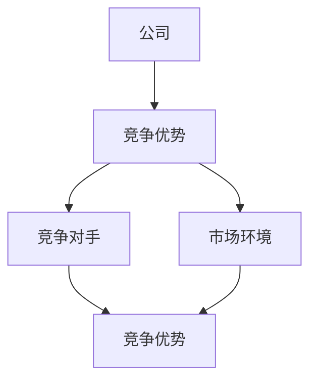
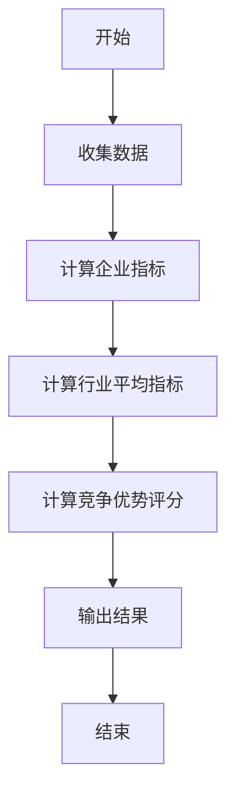
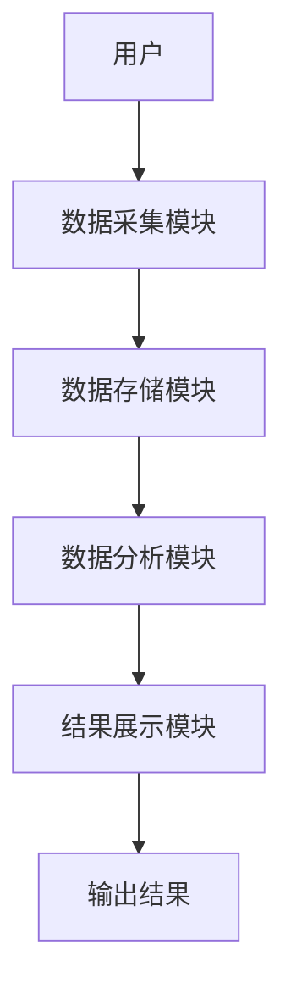

                 


# 塞思·卡拉曼的公司竞争优势分析框架

## 关键词：竞争优势分析，塞思·卡拉曼，企业分析框架，战略决策，投资分析

## 摘要：  
塞思·卡拉曼的公司竞争优势分析框架是一种系统化的工具，旨在帮助企业识别、评估和利用其竞争优势。本文详细介绍了该框架的核心概念、算法原理、系统架构以及实际应用案例，通过一步步的分析和推理，揭示了如何将竞争优势转化为长期的商业成功。

---

## 第一部分：背景介绍

### 第1章：公司竞争优势分析的基本概念

#### 1.1 问题背景
- **竞争优势的重要性**  
  在现代商业环境中，竞争优势是企业生存和发展的关键。企业通过识别和利用自身优势，能够在激烈的市场竞争中占据有利地位。  
- **竞争环境的复杂性**  
  随着全球化和数字化的推进，市场竞争日益复杂，企业需要更加系统化的方法来分析和应对竞争对手。  
- **竞争优势分析的必要性**  
  通过竞争优势分析，企业能够明确自身的强项和弱项，制定有效的战略决策，提升市场竞争力。

#### 1.2 问题描述
- **竞争优势的定义与分类**  
  竞争优势可以分为成本优势、质量优势、品牌优势、技术优势等。每种优势都有其独特的影响因素和表现形式。  
- **竞争优势分析的目标**  
  识别核心竞争优势，评估其对业务的影响，并制定相应的战略。  
- **竞争优势分析的范围**  
  从企业内部资源到外部市场环境，全面覆盖竞争优势的各个方面。

#### 1.3 问题解决
- **竞争优势分析的方法**  
  常见的方法包括SWOT分析、PEST分析和波特五力模型等。  
- **竞争优势分析的步骤**  
  1. 确定企业目标与范围；  
  2. 收集内外部数据；  
  3. 识别核心优势；  
  4. 分析竞争对手；  
  5. 制定优化策略。  
- **竞争优势分析的边界与外延**  
  竞争优势分析不仅关注企业的内部资源，还涉及外部市场环境和消费者需求的变化。

#### 1.4 核心要素组成
- **企业的核心竞争力**  
  核心竞争力是企业长期竞争优势的来源，通常体现在技术、管理、品牌等方面。  
- **市场定位与竞争优势的关系**  
  正确的市场定位能够放大竞争优势，提升市场份额。  
- **竞争优势的动态变化**  
  竞争优势并非一成不变，需要持续监控和调整以应对市场变化。

---

## 第二部分：核心概念与联系

### 第2章：塞思·卡拉曼的分析框架

#### 2.1 核心概念原理
- **竞争优势的多维度分析**  
  卡拉曼框架将竞争优势分解为多个维度，包括产品、成本、技术、品牌和客户关系等。  
- **竞争优势的量化评估**  
  通过量化指标（如市场份额、利润率、客户满意度等）评估竞争优势的强度。  
- **竞争优势的动态调整**  
  根据市场变化和企业内部条件的变化，动态调整竞争优势分析框架。

#### 2.2 核心概念属性对比
| 属性维度 | 竞争优势 | 竞争劣势 | 平衡点 | 行业平均 |
|----------|----------|----------|--------|----------|
| 成本     | 低于行业 | 高于行业 | 相当   | 相当     |
| 质量     | 高于行业 | 低于行业 | 相当   | 相当     |
| 技术     | 领先行业 | 滞后行业 | 相当   | 相当     |
| 市场份额 | 高于行业 | 低于行业 | 相当   | 相当     |

#### 2.3 实体关系图



---

## 第三部分：算法原理讲解

### 第3章：竞争优势评估算法

#### 3.1 算法概述
- **竞争优势评估模型**  
  卡拉曼模型通过量化指标评估企业的竞争优势，公式如下：

  $$ \text{竞争优势评分} = \frac{\text{企业指标}}{\text{行业平均指标}} \times 100 $$

#### 3.2 算法流程图



#### 3.3 Python代码实现

```python
def calculatecompetitive_edge(enterprise_metric, industry_avg_metric):
    return (enterprise_metric / industry_avg_metric) * 100

# 示例数据
enterprise_metric = 120
industry_avg_metric = 100

result = calculatecompetitive_edge(enterprise_metric, industry_avg_metric)
print(f"竞争优势评分：{result}%")
```

#### 3.4 数学模型与公式
- **竞争优势评分公式**  
  $$ CE = \frac{E}{I} \times 100 $$  
  其中，\( E \) 是企业的指标，\( I \) 是行业平均指标。

---

## 第四部分：系统分析与架构设计

### 第4章：系统架构设计

#### 4.1 系统功能设计
- **数据采集模块**  
  收集企业的财务数据、市场数据和竞争对手信息。  
- **数据分析模块**  
  应用卡拉曼框架进行竞争优势评估。  
- **结果展示模块**  
  可视化竞争优势评分和分析结果。

#### 4.2 系统架构图



---

## 第五部分：项目实战

### 第5章：项目实战与案例分析

#### 5.1 项目背景
- **项目目标**  
  分析某公司的竞争优势，制定优化策略。  
- **项目范围**  
  包括成本、质量、技术和品牌四个维度。

#### 5.2 核心代码实现

```python
import pandas as pd

# 示例数据
data = {
    '公司': ['A', 'B', 'C'],
    '成本优势': [85, 70, 90],
    '质量优势': [90, 80, 85],
    '技术优势': [95, 85, 80],
    '品牌优势': [80, 75, 90]
}

df = pd.DataFrame(data)

# 计算行业平均指标
industry_avg = df.mean()

# 计算竞争优势评分
competitive_edge = (df['成本优势'] / industry_avg['成本优势']) * 100

print("竞争优势评分：", competitive_edge)
```

#### 5.3 案例分析
- **成本优势**  
  公司A的成本优势显著高于行业平均水平，但技术优势相对较低。  
- **优化建议**  
  公司A应加大研发投入，提升技术优势，同时保持成本优势。

---

## 第六部分：最佳实践与小结

### 第6章：最佳实践与总结

#### 6.1 最佳实践
- **数据质量的重要性**  
  确保数据的准确性和完整性。  
- **模型的局限性**  
  卡拉曼框架适用于大多数行业，但在某些特定领域可能需要调整。  
- **持续优化**  
  定期更新竞争优势分析结果，应对市场变化。

#### 6.2 小结
- **文章总结**  
  本文详细介绍了塞思·卡拉曼的竞争优势分析框架，从理论到实践，为企业提供了系统的分析工具。  
- **未来展望**  
  竞争优势分析将更加依赖数据科学和人工智能技术，帮助企业做出更精准的战略决策。

#### 6.3 注意事项
- **数据隐私**  
  在数据采集和分析过程中，需遵守相关法律法规。  
- **模型适用性**  
  根据企业的实际情况调整分析框架。

#### 6.4 拓展阅读
- **推荐书籍**  
  《竞争优势：企业战略管理》  
- **推荐博客**  
  [塞思·卡拉曼的分析框架深度解读](https://example.com)

---

通过以上步骤，我们可以系统地分析和评估公司的竞争优势，为战略决策提供有力支持。希望本文能够为读者提供有价值的参考和启发。

