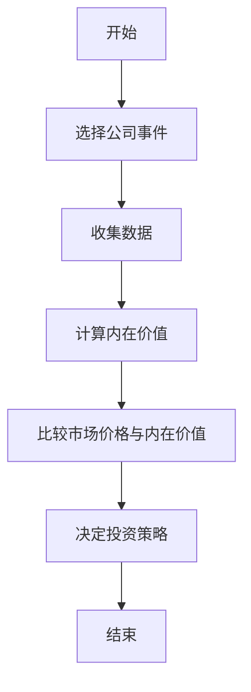
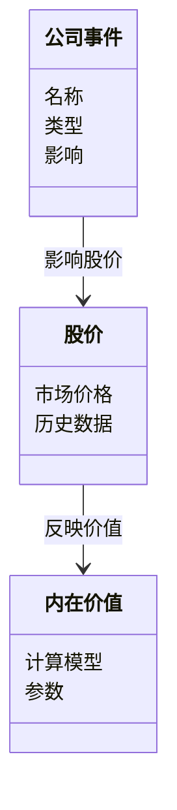
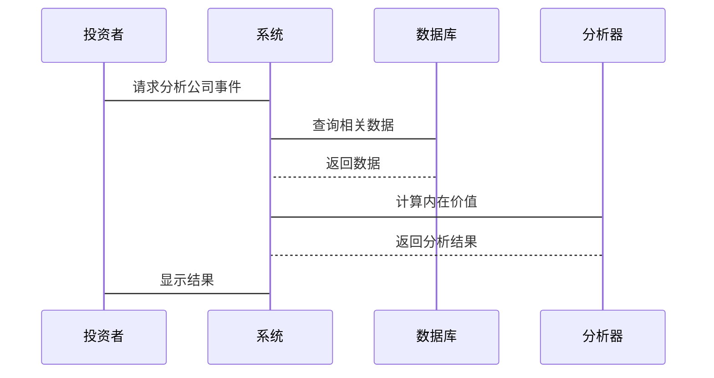

                 


# 塞思·卡拉曼的特殊情况价值投资：从公司事件中获利

## 关键词：价值投资，特殊情况，公司事件，卡拉曼，投资策略，内在价值

## 摘要：塞思·卡拉曼作为价值投资领域的权威，提出了在特殊情况下的投资策略，通过分析公司并购、债务重组等事件，识别市场低估的投资机会，计算内在价值，制定投资决策，最终从公司事件中获利。

---

# 第一部分: 价值投资与特殊情况概述

## 第1章: 特殊情况价值投资的背景与概念

### 1.1 价值投资的基本原理

#### 1.1.1 价值投资的定义与核心理念

价值投资是一种投资策略，强调购买低于其内在价值的资产。核心理念是寻找市场低估的公司，长期持有，等待其价值回归。

- **定义**: 价值投资是通过分析公司的基本面，寻找市场价格低于其内在价值的证券进行投资。
- **核心理念**: 购买便宜的东西，而不是追逐市场的趋势或情绪。

#### 1.1.2 价值投资与成长投资的区别

- **价值投资**: 侧重于寻找市场价格低于内在价值的公司，关注低市盈率、低市净率等指标。
- **成长投资**: 侧重于投资具有高增长潜力的公司，关注高市盈率、高市净率等指标。

#### 1.1.3 价值投资的适用场景

- **市场低迷**: 市场恐慌时，许多优质资产价格被低估。
- **经济衰退**: 许多公司因暂时困难而价格被低估。
- **特殊事件**: 公司并购、重组等事件可能导致市场价格偏离内在价值。

### 1.2 特殊情况的定义与特征

#### 1.2.1 什么是特殊情况

特殊情况是指那些影响公司价值的非日常事件，如并购、债务重组、股权稀释等。这些事件可能导致市场价格短期波动，但内在价值可能保持不变或被低估。

- **并购**: 公司之间的合并或收购，可能导致公司价值重估。
- **债务重组**: 公司通过调整债务结构来降低财务风险，可能影响公司价值。
- **股权稀释**: 新股发行可能导致现有股东权益被稀释，影响股价。

#### 1.2.2 特殊情况的分类

- **并购相关**: 公司并购、收购、出售资产等。
- **债务相关**: 债务重组、破产重整等。
- **股权相关**: 股权激励、新股发行等。
- **诉讼相关**: 重大诉讼、仲裁等。

#### 1.2.3 特殊情况的市场影响

- **短期影响**: 市场价格可能大幅波动，投资者需识别短期波动与长期价值。
- **长期影响**: 公司价值可能因事件而改变，投资者需评估长期影响。

### 1.3 塞思·卡拉曼的特殊情况投资策略

#### 1.3.1 卡拉曼的投资理念

塞思·卡拉曼强调在特殊情况中寻找市场低估的机会，通过深入分析公司基本面，识别市场价格与内在价值的差异。

- **核心理念**: 价格是投资的敌人，价值是投资的朋友。
- **策略**: 在市场恐慌或特殊事件中，寻找被低估的公司，进行长期投资。

#### 1.3.2 卡拉曼的特殊案例分析

卡拉曼通过分析公司并购、债务重组等事件，找到被低估的投资机会。

- **案例1**: 某公司并购后，市场价格未反映其整合后的价值。
- **案例2**: 某公司债务重组后，市场价格低于其重组后的价值。

#### 1.3.3 卡拉曼策略的优缺点

- **优点**: 在市场低估时买入，长期持有，获得超额收益。
- **缺点**: 需要深入分析公司基本面，对投资者的专业知识和分析能力要求较高。

---

## 第2章: 公司事件对价值的影响

### 2.1 公司并购与重组

#### 2.1.1 公司并购的定义与类型

- **定义**: 公司并购是指一家公司收购另一家公司，通常以获得资源、技术或市场。
- **类型**: 
  - **横向并购**: 同行业并购，提高市场份额。
  - **纵向并购**: 上下游并购，整合供应链。
  - **混合并购**: 跨行业并购，多元化经营。

#### 2.1.2 并购对股价的影响

- **短期影响**: 并购消息公布后，股价可能大幅波动，取决于市场反应。
- **长期影响**: 并购后，公司价值可能提升，股价逐步反映其整合后的价值。

#### 2.1.3 并购中的价值发现

- **分析要点**: 
  - 收购价格与目标公司价值的差异。
  - 并购后的协同效应。
  - 财务状况改善的可能性。

### 2.2 债务重组与财务困境

#### 2.2.1 债务重组的定义与影响

- **定义**: 债务重组是指公司通过调整债务条件或结构，降低财务负担。
- **影响**: 
  - 短期: 股价可能下跌，市场对公司前景担忧。
  - 长期: 债务减轻，公司可能恢复 profitability。

#### 2.2.2 财务困境中的投资机会

- **分析要点**: 
  - 公司是否具备扭亏为盈的潜力。
  - 债务重组后，公司是否能恢复元气。

#### 2.2.3 如何评估债务重组的价值

- **方法**: 
  - 分析重组后的债务结构。
  - 评估公司未来现金流。
  - 考虑行业前景和公司竞争力。

### 2.3 股权稀释与回购

#### 2.3.1 股权稀释的定义与影响

- **定义**: 股权稀释是指公司发行更多股份，导致现有股东持股比例下降。
- **影响**: 
  - 短期: 股价可能下跌。
  - 长期: 若公司未来增长，股价可能上涨，稀释影响可能被稀释。

#### 2.3.2 股票回购的定义与影响

- **定义**: 股票回购是指公司回购自己的股票，减少流通股数量。
- **影响**: 
  - 短期: 股价可能上涨。
  - 长期: 提高每股收益，增强股东价值。

#### 2.3.3 如何利用股权变化进行投资

- **分析要点**: 
  - 公司回购股票的动机。
  - 回购对每股收益和股价的影响。
  - 公司未来增长潜力。

---

## 第3章: 价值投资的核心概念与联系

### 3.1 核心概念原理

#### 3.1.1 内在价值的计算公式

$$
\text{内在价值} = \frac{\text{未来现金流}}{\text{折现率}}
$$

- **未来现金流**: 公司未来产生的现金流，考虑其增长率和永续增长率。
- **折现率**: 反映投资的风险和机会成本。

#### 3.1.2 市场价值与内在价值的关系

- **市场价值**: 市场价格，反映市场对公司的估值。
- **内在价值**: 公司的真实价值，与市场价值可能有差异。

### 3.2 概念属性特征对比表格

| 概念 | 定义 | 特征 | 示例 |
|------|------|------|------|
| 内在价值 | 公司未来现金流的现值 | 与市场价值可能有差异，可能被低估或高估 | 某公司内在价值为 $50，市场价格为 $30 |
| 市场价值 | 市场对公司的估值 | 受市场情绪和流动性影响 | 某公司市场价格为 $30，内在价值为 $50 |

### 3.3 ER实体关系图架构

```mermaid
er
actor 投资者
actor 市场
actor 公司
-----
entity 公司事件
entity 股价
entity 内在价值
-----
关系 投资者 -> 公司事件: 分析公司事件
关系 公司 -> 股价: 影响股价
关系 股价 <-w-> 内在价值: 市场价格反映内在价值
```

---

## 第4章: 算法原理讲解

### 4.1 算法流程图



### 4.2 Python代码实现

```python
import pandas as pd
import numpy as np

def calculate_intrinsic_value(fcf, growth_rate, discount_rate):
    """
    计算公司的内在价值，使用永续增长模型。
    """
    terminal_value = fcf * (1 + growth_rate) / (discount_rate - growth_rate)
    intrinsic_value = (terminal_value) / (1 + discount_rate)
    return intrinsic_value

# 示例数据
free_cash_flow = 100  # 未来自由现金流
growth_rate = 0.05     # 永续增长率
discount_rate = 0.10    # 折现率

intrinsic_value = calculate_intrinsic_value(free_cash_flow, growth_rate, discount_rate)
print(f"内在价值: ${intrinsic_value:.2f}")
```

### 4.3 数学模型与公式

#### 永续增长模型

$$
\text{内在价值} = \frac{\text{FCF} \times (1 + g)}{r - g}
$$

其中：
- FCF: 自由现金流
- g: 永续增长率
- r: 折现率

---

## 第5章: 系统分析与架构设计方案

### 5.1 系统功能设计

#### 5.1.1 领域模型



### 5.2 系统架构设计

```mermaid
graph TD
    UI --> API: 发送公司事件请求
    API --> Database: 查询数据
    Database --> Analyzer: 分析公司事件
    Analyzer --> API: 返回分析结果
    API --> UI: 显示结果
```

### 5.3 系统接口设计

- **API接口**: 提供公司事件数据查询和分析功能。
- **数据库**: 存储公司事件、股价数据和内在价值计算结果。

### 5.4 系统交互设计



---

## 第6章: 项目实战

### 6.1 环境安装

- **Python**: 安装Anaconda或Miniconda。
- **依赖库**: 安装pandas、numpy、scipy。

### 6.2 核心代码实现

```python
import pandas as pd
import numpy as np

def calculate_intrinsic_value(fcf, growth_rate, discount_rate):
    terminal_value = fcf * (1 + growth_rate) / (discount_rate - growth_rate)
    intrinsic_value = terminal_value / (1 + discount_rate)
    return intrinsic_value

# 示例数据
data = {
    '公司': ['A', 'B', 'C'],
    'FCF': [100, 150, 200],
    '增长率': [0.05, 0.06, 0.07],
    '折现率': [0.10, 0.11, 0.12]
}

df = pd.DataFrame(data)

# 计算内在价值
df['内在价值'] = df.apply(lambda row: calculate_intrinsic_value(row['FCF'], row['增长率'], row['折现率']), axis=1)

print(df)
```

### 6.3 案例分析

#### 案例1: 公司并购

- **公司A**：并购公司B，预计协同效应为 $20M。
- **分析**: 并购后，公司A的内在价值可能提升，市场价格可能低于内在价值，提供投资机会。

#### 案例2: 债务重组

- **公司C**：债务重组后，债务减少 $50M，预计未来现金流增加。
- **分析**: 重组后，公司C的内在价值可能提高，市场价格可能低于其价值，提供投资机会。

### 6.4 项目小结

通过项目实战，投资者可以利用Python代码分析公司事件，计算内在价值，识别投资机会。

---

## 第7章: 总结与展望

### 7.1 最佳实践 tips

- **深入分析公司基本面**：了解公司事件对公司价值的影响。
- **长期持有**：避免短期波动，关注长期价值。
- **分散投资**：降低风险，不要将所有资金投入单一事件。

### 7.2 小结

塞思·卡拉曼的特殊情况价值投资策略通过分析公司事件，识别市场低估的机会，帮助投资者从公司事件中获利。

### 7.3 注意事项

- **风险提示**：投资有风险，需谨慎评估公司事件的影响。
- **持续学习**：市场变化快，需不断学习和更新知识。

### 7.4 拓展阅读

- 《价值投资实战》：深入探讨价值投资策略。
- 《投资的革命》：分析特殊市场环境下的投资机会。

---

通过以上分析和实践，投资者可以更好地理解塞思·卡拉曼的特殊情况价值投资策略，从公司事件中获利。

