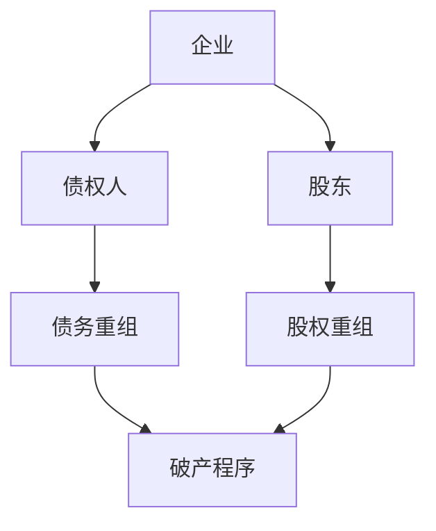
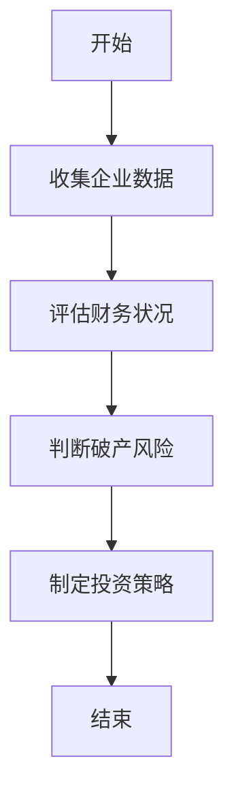
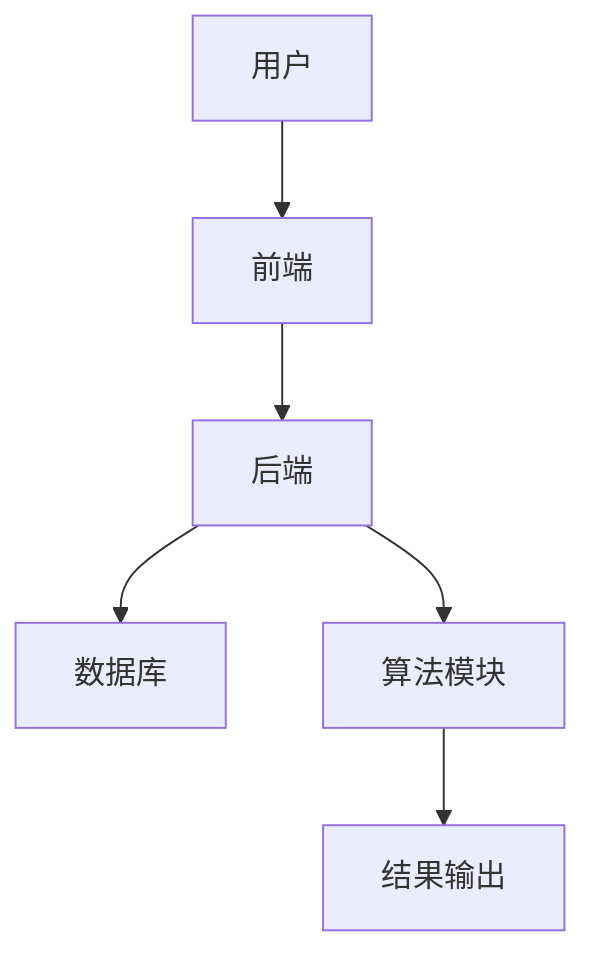

                 


# 塞斯·卡拉曼的破产重组投资策略

## 关键词
- 破产重组
- 投资策略
- 风险管理
- 卡拉曼模型
- 企业重组

## 摘要
本文详细探讨塞斯·卡拉曼的破产重组投资策略，分析其核心原理、算法模型、系统架构及实际应用。通过背景介绍、概念对比、算法实现、系统设计和案例分析，揭示如何利用破产重组优化投资决策，降低风险，实现收益最大化。

---

# 正文

## 第一部分：背景介绍

### 1. 破产重组的背景与概念

#### 1.1 破产重组的定义与背景
- **定义**：破产重组是指企业在无法偿还债务时，通过法律程序调整资产和负债结构，恢复财务健康的过程。
- **背景**：经济波动、过度扩张或管理不善可能导致企业破产，破产重组为投资者提供潜在收益机会。

#### 1.2 破产重组的重要性
- 通过重组，企业可优化资产结构，降低负债，提升运营效率。
- 投资者可通过重组后的企业获得更高回报。

#### 1.3 破产重组与投资策略
- 研判模型：分析企业破产风险，制定投资策略。
- 投资者在重组过程中寻找低价资产或股权，实现收益。

### 1.4 破产重组的核心概念
- 企业价值评估：资产与负债的合理匹配。
- 破产概率计算：预测企业破产的可能性。

## 第二部分：核心概念与联系

### 2.1 破产重组的核心原理

#### 2.1.1 破产重组的主要机制
- 资产出售：处置非核心资产，偿还债务。
- 债务重组：调整债务结构，延长还款期限。

#### 2.1.2 破产重组的法律框架
- 美国《破产法》第11章：允许企业在破产中继续运营并重组债务。
- 公司治理：董事会与管理层在重组中的角色。

#### 2.1.3 破产重组与企业价值
- 破产重组可提升企业价值，优化股权结构。

### 2.2 破产重组与企业并购的对比

| 对比维度       | 破产重组                | 企业并购                |
|-----------------|------------------------|-------------------------|
| 定义           | 调整债务与资产结构      | 收购或出售企业           |
| 目标           | 恢复财务健康            | 获取资源或扩大规模       |
| 风险           | 较高                   | 较低                    |

### 2.3 实体关系图


## 第三部分：算法原理

### 3.1 研判模型

#### 3.1.1 研判模型的数学基础
- 破产概率计算公式：
$$ \text{破产概率} = \frac{\text{负债总额}}{\text{资产总额}} \times 系数 $$

#### 3.1.2 破产概率计算
- 示例：负债总额为1000万元，资产总额为5000万元，系数为0.8，则破产概率为：
$$ \frac{1000}{5000} \times 0.8 = 0.16 \text{或} 16\% $$

#### 3.1.3 投资决策流程


### 3.2 投资策略实现

#### 3.2.1 数据收集与预处理
- 收集企业的财务数据，包括资产负债表和损益表。
- 清洗数据，处理缺失值和异常值。

#### 3.2.2 破产概率计算
- 使用历史数据训练模型，预测企业破产概率。
- 示例代码：
```python
import pandas as pd

# 数据加载
data = pd.read_csv('企业数据.csv')

# 计算破产概率
def calculate_bankruptcy_probability(data):
    bankruptcy_prob = data['负债总额'] / data['资产总额'] * 0.8
    return bankruptcy_prob

# 应用计算
data['破产概率'] = calculate_bankruptcy_probability(data)
```

## 第四部分：系统分析与架构设计

### 4.1 项目场景介绍
- 研判模型用于评估企业破产风险，辅助投资决策。
- 系统功能需求：数据处理、破产概率计算、投资决策优化。

### 4.2 系统功能设计
- 数据处理模块：收集、清洗和存储数据。
- 破产概率计算模块：应用算法模型计算破产概率。
- 投资决策模块：基于概率制定投资策略。

### 4.3 系统架构设计


## 第五部分：项目实战

### 5.1 环境安装
- 安装Python和相关库：pandas、numpy、scikit-learn。

### 5.2 核心代码实现
```python
import pandas as pd
import numpy as np

# 数据加载
data = pd.read_csv('企业数据.csv')

# 数据预处理
data['破产概率'] = data['负债总额'] / data['资产总额'] * 0.8

# 投资决策
threshold = 0.2
data['投资建议'] = np.where(data['破产概率'] < threshold, '买入', '卖出')
```

### 5.3 案例分析
- 某企业负债1000万元，资产5000万元，破产概率16%，低于阈值，建议买入。

## 第六部分：最佳实践与总结

### 6.1 最佳实践
- 定期更新模型，适应市场变化。
- 结合其他指标，全面评估企业风险。

### 6.2 小结
塞斯·卡拉曼的破产重组投资策略通过数学模型和系统架构，帮助投资者识别机会，降低风险，实现收益最大化。

### 6.3 注意事项
- 数据质量影响结果，需谨慎处理。
- 模型需定期更新，避免过时。

### 6.4 拓展阅读
- 《企业重组与投资策略》
- 《破产法与企业治理》

---

# 结语
通过本文的详细分析，读者可以掌握塞斯·卡拉曼的破产重组投资策略，从背景、概念、算法到系统设计和实战应用，全面理解如何利用重组优化投资决策。

