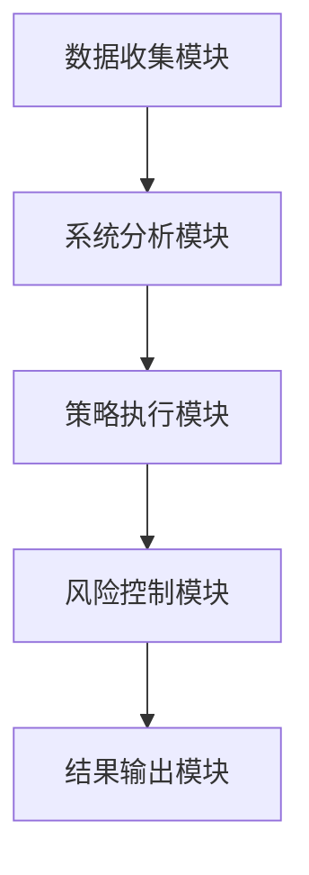
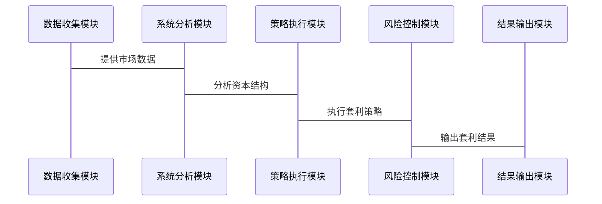

                 


# 塞斯·卡拉曼的资本结构套利策略

> **关键词**：资本结构套利，塞斯·卡拉曼，金融策略，投资组合优化，杠杆收购

> **摘要**：本文深入探讨了塞斯·卡拉曼的资本结构套利策略，从理论基础到实际应用，分析其在现代金融投资中的重要性。通过详细讲解资本结构套利的定义、核心概念、算法原理、系统架构设计以及项目实战，本文旨在帮助读者全面理解并掌握这一策略，为投资组合优化提供新的视角和方法。

---

## 第一章：资本结构套利的背景与基础

### 1.1 资本结构套利的定义与背景

#### 1.1.1 资本结构的定义
资本结构是指企业通过债务和股权融资形成的资本比例。合理的资本结构能够优化企业价值，降低资本成本，同时降低企业的财务风险。

#### 1.1.2 资本结构套利的起源与发展
资本结构套利是一种通过优化企业资本结构以实现投资收益的策略。它起源于现代金融理论，尤其是资本资产定价模型（CAPM）和套利定价理论（APT）。资本结构套利的核心在于通过分析企业的资本结构，寻找市场定价偏差，进行套利以实现收益。

#### 1.1.3 资本结构套利的市场环境
资本结构套利适用于成熟且高效的金融市场，尤其是在企业杠杆率较高、市场流动性充裕的情况下，投资者可以通过套利机会优化资本结构，实现投资收益。

### 1.2 资本结构套利的核心概念

#### 1.2.1 债务与股权融资的比较
- **债务融资**：通过借款或发行债券等方式筹集资金，具有固定利息支出，税后成本较低。
- **股权融资**：通过发行股票筹集资金，权益持有人分享企业利润，具有较高的资本成本。

#### 1.2.2 资本结构的优化理论
资本结构优化理论认为，企业在一定条件下通过调整债务和股权的比例，可以实现加权平均资本成本（WACC）的最小化，从而最大化企业价值。

#### 1.2.3 资本结构套利的策略分类
资本结构套利主要包括以下几种策略：
1. **杠杆收购套利**：通过杠杆收购企业，优化其资本结构，释放企业价值。
2. **可转债套利**：利用可转换债券的特性，通过套利策略实现收益。
3. **息税前利润（EBIT）套利**：通过调整资本结构，优化企业息税前利润，提升企业价值。

---

## 第二章：资本结构套利的理论基础

### 2.1 资本资产定价模型（CAPM）

#### 2.1.1 CAPM的基本原理
CAPM（Capital Asset Pricing Model）是一种用于计算资产期望收益的模型，公式如下：
$$
E(r_i) = r_f + \beta_i (E(r_m) - r_f)
$$
其中：
- $E(r_i)$：资产$i$的期望收益率
- $r_f$：无风险利率
- $\beta_i$：资产$i$的贝塔系数
- $E(r_m)$：市场期望收益率

CAPM在资本结构套利中的应用：通过分析企业的贝塔系数，评估其资本成本，进而优化资本结构。

#### 2.1.2 CAPM在资本结构套利中的应用
通过CAPM模型，投资者可以评估企业的加权平均资本成本（WACC），并将其与市场利率进行比较，寻找资本结构优化的机会。

### 2.2 套利定价理论（APT）

#### 2.2.1 APT的基本框架
APT（Arbitrage Pricing Theory）是一种基于套利机会的资产定价理论，其核心是通过消除套利机会来确定资产的合理价格。APT的基本假设是存在多个因素影响资产收益。

#### 2.2.2 APT与资本结构套利的关系
APT提供了套利机会的分析框架，帮助投资者识别市场中的定价偏差，进而进行资本结构套利。

### 2.3 资本成本与企业价值

#### 2.3.1 加权平均资本成本（WACC）的计算
WACC的计算公式为：
$$
WACC = \left( \frac{D}{V} \times r_d \times (1 - t) \right) + \left( \frac{E}{V} \times r_e \right)
$$
其中：
- $D$：债务资本
- $E$：股权资本
- $V$：企业价值
- $r_d$：债务成本
- $r_e$：股权成本
- $t$：企业所得税率

#### 2.3.2 WACC在资本结构优化中的作用
通过优化WACC，企业可以实现资本成本的最小化，从而最大化企业价值。

---

## 第三章：资本结构套利的策略与方法

### 3.1 债务套利策略

#### 3.1.1 利息税盾效应
利息税盾效应是指债务融资的利息支出可以抵扣所得税，从而降低企业的税后资本成本。

#### 3.1.2 债务融资的成本与风险
债务融资的成本包括利息支出和债券违约风险。通过合理控制债务比例，可以平衡成本与风险。

### 3.2 股权套利策略

#### 3.2.1 股权融资的优势
股权融资可以避免债务融资的利息支出和违约风险，同时为企业提供更多的财务灵活性。

#### 3.2.2 股权套利的风险
股权套利的风险主要体现在市场波动和企业业绩不确定性上。

### 3.3 综合套利策略

#### 3.3.1 债务与股权的组合套利
通过合理组合债务和股权融资，优化企业的资本结构，实现资本成本最小化。

#### 3.3.2 股权激励套利
通过股权激励机制，激励管理层优化企业资本结构，提升企业价值。

---

## 第四章：资本结构套利的系统架构设计

### 4.1 系统功能设计

#### 4.1.1 数据收集模块
- 数据来源：市场数据、企业财务报表、宏观经济指标
- 数据类型：债务规模、股权价值、市场利率、企业税率

#### 4.1.2 系统分析模块
- 分析工具：CAPM、APT模型
- 分析步骤：
  1. 计算WACC
  2. 分析资本结构
  3. 识别套利机会

#### 4.1.3 策略执行模块
- 执行策略：杠杆收购套利、可转债套利
- 风险控制：设置止损点、监控市场波动

### 4.2 系统架构设计

#### 4.2.1 系统架构图（Mermaid）


#### 4.2.2 系统交互序列图（Mermaid）


---

## 第五章：资本结构套利的项目实战

### 5.1 项目背景介绍

#### 5.1.1 项目目标
优化某上市公司的资本结构，实现资本成本最小化，提升企业价值。

#### 5.1.2 数据准备
- 企业财务报表：包括债务规模、股权价值、息税前利润（EBIT）等。
- 市场数据：包括市场利率、企业税率、行业基准收益率等。

### 5.2 系统实现

#### 5.2.1 数据收集模块实现
```python
import pandas as pd
import requests

def get_market_data():
    # 获取市场数据
    url = "https://api.marketdata.com/stock_prices"
    response = requests.get(url)
    data = response.json()
    return pd.DataFrame(data)
```

#### 5.2.2 系统分析模块实现
```python
def calculate_wacc(debt, equity, rd, re, t):
    # 计算WACC
    wacc = (debt / (debt + equity) * rd * (1 - t)) + (equity / (debt + equity) * re)
    return wacc
```

#### 5.2.3 策略执行模块实现
```python
def execute_arbitrage_strategy(wacc, market_wacc):
    # 执行套利策略
    if wacc < market_wacc:
        return "买入信号"
    else:
        return "卖出信号"
```

### 5.3 实际案例分析

#### 5.3.1 案例分析
某上市公司债务规模为$100 million，股权价值为$200 million，债务成本为5%，股权成本为8%，企业税率为20%。计算其WACC：
$$
WACC = \left( \frac{100}{300} \times 5\% \times (1 - 0.2) \right) + \left( \frac{200}{300} \times 8\% \right) = 4.67\% + 5.33\% = 10\%
$$
市场平均WACC为12%，因此存在套利机会，建议买入。

#### 5.3.2 项目小结
通过实际案例分析，验证了资本结构套利策略的有效性。通过优化资本结构，企业可以降低资本成本，提升企业价值。

---

## 第六章：资本结构套利的最佳实践

### 6.1 小结
资本结构套利是一种有效的投资策略，通过优化企业的资本结构，可以实现资本成本的最小化，进而提升企业价值。

### 6.2 注意事项
- 风险控制：套利者需要严格控制市场风险和信用风险。
- 市场时机：资本结构套利的成功取决于市场时机的选择。
- 数据质量：高质量的数据是套利策略成功的基础。

### 6.3 拓展阅读
- 《资本论》——卡尔·马克思
- 《投资学精要》——查尔斯·埃里森
- 《金融工程与金融创新》——罗伯特·马佐olen

---

## 总结
通过本文的详细讲解，读者可以全面了解塞斯·卡拉曼的资本结构套利策略，从理论基础到实际应用，掌握这一策略在现代金融投资中的重要性。希望本文能够为投资者提供新的视角和方法，帮助他们在复杂多变的金融市场中捕捉套利机会，实现投资收益。

