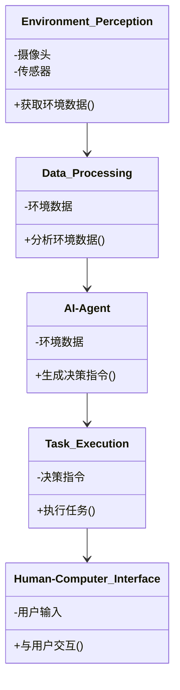
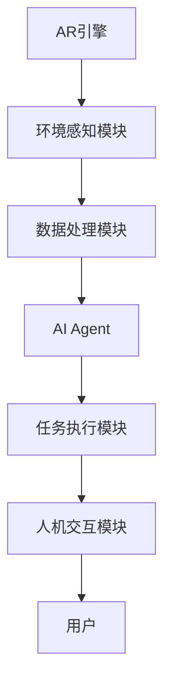
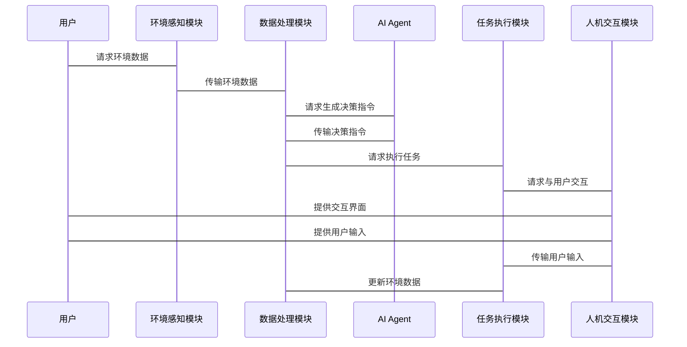

                 


# 增强现实技术与AI Agent的结合

> 关键词：增强现实技术，AI Agent，计算机视觉，自然语言处理，人工智能代理，人机交互

> 摘要：本文将详细探讨增强现实（AR）技术与人工智能代理（AI Agent）的结合，分析其核心概念、算法原理、系统架构以及实际应用场景。通过逐步分析，我们将揭示AR与AI Agent结合的技术优势和应用潜力，为相关领域的开发者和研究者提供深入的理论支持和实践指导。

---

## 第一部分：增强现实技术与AI Agent的背景介绍

### 第1章：增强现实技术与AI Agent的背景介绍

#### 1.1 增强现实技术的定义与特点
##### 1.1.1 增强现实技术的基本概念
增强现实（Augmented Reality，AR）是一种将数字信息叠加在现实世界中的技术。通过摄像头、传感器和算法，AR可以在用户视角中叠加虚拟元素，如图像、文字、3D模型等，从而增强用户的感知体验。

##### 1.1.2 增强现实技术的核心特点
1. **实时性**：AR需要实时捕捉和处理环境数据，快速生成叠加的虚拟内容。
2. **交互性**：用户可以通过手势、语音或触控等方式与AR内容互动。
3. **沉浸性**：AR通过叠加虚拟元素，让用户感觉置身于一个混合现实的环境中。

##### 1.1.3 增强现实技术的应用领域
1. **游戏娱乐**：如《Pokémon GO》、《Harry Potter: Wizards Unite》等。
2. **教育培训**：通过AR技术进行虚拟解剖、历史重现等教学。
3. **工业应用**：如设备维护、远程协作等。
4. **医疗领域**：辅助手术规划、患者诊断等。

#### 1.2 AI Agent的定义与特点
##### 1.2.1 AI Agent的基本概念
人工智能代理（AI Agent）是指能够感知环境、自主决策并执行任务的智能实体。AI Agent可以是软件程序、机器人或其他智能设备。

##### 1.2.2 AI Agent的核心特点
1. **感知能力**：通过传感器、摄像头、麦克风等设备感知环境信息。
2. **决策能力**：基于感知信息，利用机器学习、规则推理等方法做出决策。
3. **执行能力**：通过执行机构或接口与外界交互，完成任务。

##### 1.2.3 AI Agent的应用领域
1. **智能家居**：如智能音箱、智能家电的控制。
2. **自动驾驶**：如自动驾驶汽车中的决策控制系统。
3. **客户服务**：如智能客服、虚拟助手等。

#### 1.3 增强现实技术与AI Agent的结合背景
##### 1.3.1 问题背景
随着AR技术的快速发展，如何让AR系统具备智能感知和自主决策能力，成为当前研究的热点。AI Agent的引入可以为AR系统提供更强的智能支持。

##### 1.3.2 问题描述
传统的AR系统主要依赖于传感器和摄像头的数据处理，缺乏智能决策能力。而AI Agent可以通过分析环境数据，提供更智能的交互方式和决策支持。

##### 1.3.3 问题解决
通过将AI Agent与AR技术结合，可以实现更智能的AR应用。AI Agent可以实时分析AR环境中的数据，提供更精准的用户交互和决策支持。

##### 1.3.4 边界与外延
AR与AI Agent的结合主要集中在实时数据处理和智能决策领域。其外延包括但不限于计算机视觉、自然语言处理、机器人技术等。

##### 1.3.5 概念结构与核心要素组成
AR与AI Agent的结合系统包括以下核心要素：
1. **AR引擎**：负责生成和渲染虚拟内容。
2. **AI Agent**：负责感知环境、决策和执行。
3. **交互接口**：用户与系统交互的媒介，如手机、眼镜等。
4. **数据处理模块**：处理环境数据和用户输入。

---

## 第二部分：增强现实技术与AI Agent的核心概念与联系

### 第2章：增强现实技术与AI Agent的核心概念与联系

#### 2.1 增强现实技术的核心概念
##### 2.1.1 增强现实技术的原理
AR的核心原理是将数字信息叠加在现实环境中。其实现过程包括：
1. **环境感知**：通过摄像头、传感器等设备捕捉现实环境数据。
2. **数据处理**：将环境数据与虚拟内容进行匹配和融合。
3. **渲染输出**：将融合后的数据通过显示屏呈现给用户。

##### 2.1.2 增强现实技术的关键技术
1. **计算机视觉**：用于图像识别、目标检测等。
2. **SLAM（实时定位与地图构建）**：用于定位和构建环境模型。
3. **渲染技术**：用于将虚拟内容叠加到现实环境中。

##### 2.1.3 增强现实技术的实现流程
1. **环境数据采集**：通过摄像头、传感器等设备采集现实环境数据。
2. **数据处理与匹配**：将环境数据与虚拟内容进行匹配，确定虚拟内容的位置和姿态。
3. **渲染与输出**：将匹配后的数据渲染并输出到显示设备。

#### 2.2 AI Agent的核心概念
##### 2.2.1 AI Agent的原理
AI Agent通过感知环境数据，利用算法进行分析和决策，并通过执行机构完成任务。其实现过程包括：
1. **环境感知**：通过传感器、摄像头等设备采集环境数据。
2. **数据分析与决策**：利用机器学习、规则推理等方法进行分析和决策。
3. **任务执行**：通过执行机构或接口与外界交互，完成任务。

##### 2.2.2 AI Agent的关键技术
1. **机器学习**：用于模式识别、分类、预测等任务。
2. **自然语言处理**：用于文本理解、对话生成等任务。
3. **知识表示**：用于存储和处理知识，支持推理和决策。

##### 2.2.3 AI Agent的实现流程
1. **环境数据采集**：通过传感器、摄像头等设备采集环境数据。
2. **数据分析与处理**：利用算法对数据进行分析和处理，生成决策指令。
3. **任务执行**：根据决策指令，通过执行机构或接口完成任务。

#### 2.3 增强现实技术与AI Agent的联系
##### 2.3.1 增强现实技术与AI Agent的协同工作
AR与AI Agent的结合可以通过以下方式实现：
1. **环境感知与数据处理**：AI Agent可以分析AR环境中的数据，提供更智能的交互方式。
2. **智能决策与执行**：AI Agent可以根据AR环境中的数据，做出智能决策并执行任务。
3. **人机交互**：AI Agent可以通过语音、手势等方式与用户交互，提升AR系统的用户体验。

##### 2.3.2 增强现实技术与AI Agent的结合方式
1. **数据共享与协同处理**：AR系统与AI Agent共享环境数据，AI Agent对数据进行分析和处理，提供决策支持。
2. **任务协同**：AI Agent可以协助AR系统完成特定任务，如目标识别、路径规划等。
3. **智能交互**：AI Agent可以通过语音、手势等方式与用户交互，提供更智能的AR体验。

##### 2.3.3 增强现实技术与AI Agent的结合优势
1. **提升用户体验**：通过AI Agent的智能决策和交互能力，提升AR系统的用户体验。
2. **增强系统智能性**：AI Agent的引入可以提升AR系统的智能性，使其能够自主决策和执行任务。
3. **扩展应用场景**：AR与AI Agent的结合可以扩展AR的应用场景，使其在更多领域中得到应用。

---

## 第三部分：增强现实技术与AI Agent的算法原理讲解

### 第3章：增强现实技术与AI Agent的算法原理讲解

#### 3.1 增强现实技术的算法原理
##### 3.1.1 增强现实技术的算法流程
1. **环境数据采集**：通过摄像头、传感器等设备采集环境数据。
2. **数据处理与匹配**：将环境数据与虚拟内容进行匹配，确定虚拟内容的位置和姿态。
3. **渲染与输出**：将匹配后的数据渲染并输出到显示设备。

##### 3.1.2 增强现实技术的关键算法
1. **SLAM（实时定位与地图构建）**：用于实时定位和构建环境模型。
2. **计算机视觉算法**：用于图像识别、目标检测等任务。
3. **渲染算法**：用于将虚拟内容叠加到现实环境中。

##### 3.1.3 增强现实技术的实现代码示例
```python
# 示例代码：使用OpenCV进行图像处理
import cv2

# 捕获摄像头画面
cap = cv2.VideoCapture(0)

while cap.isOpened():
    ret, frame = cap.read()
    if not ret:
        break
    # 在画面中添加虚拟内容
    cv2.putText(frame, "Hello AR!", (10, 30), cv2.FONT_HERSHEY_SIMPLEX, 1, (0, 255, 0), 2)
    cv2.imshow('AR Demo', frame)
    if cv2.waitKey(1) & 0xFF == ord('q'):
        break

cap.release()
cv2.destroyAllWindows()
```

#### 3.2 AI Agent的算法原理
##### 3.2.1 AI Agent的算法流程
1. **环境数据采集**：通过传感器、摄像头等设备采集环境数据。
2. **数据分析与处理**：利用算法对数据进行分析和处理，生成决策指令。
3. **任务执行**：根据决策指令，通过执行机构或接口完成任务。

##### 3.2.2 AI Agent的关键算法
1. **机器学习算法**：用于模式识别、分类、预测等任务。
2. **自然语言处理算法**：用于文本理解、对话生成等任务。
3. **知识表示与推理算法**：用于知识存储、推理和决策。

##### 3.2.3 AI Agent的实现代码示例
```python
# 示例代码：使用TensorFlow进行图像分类
import tensorflow as tf
from tensorflow.keras import layers

# 定义模型
model = tf.keras.Sequential([
    layers.Conv2D(32, (3,3), activation='relu', input_shape=(224, 224, 3)),
    layers.MaxPooling2D((2,2)),
    layers.Conv2D(64, (3,3), activation='relu'),
    layers.MaxPooling2D((2,2)),
    layers.Flatten(),
    layers.Dense(128, activation='relu'),
    layers.Dense(10, activation='softmax')
])

# 编译模型
model.compile(optimizer='adam', loss='sparse_categorical_crossentropy', metrics=['accuracy'])

# 训练模型
model.fit(x_train, y_train, epochs=10, validation_data=(x_test, y_test))
```

#### 3.3 增强现实技术与AI Agent的结合算法
##### 3.3.1 结合算法的流程
1. **环境数据采集**：通过摄像头、传感器等设备采集环境数据。
2. **数据共享与协同处理**：AR系统与AI Agent共享环境数据，AI Agent对数据进行分析和处理，生成决策指令。
3. **智能交互与执行**：AI Agent根据决策指令，通过AR系统与用户交互，完成任务。

##### 3.3.2 结合算法的关键步骤
1. **环境数据采集**：通过摄像头、传感器等设备采集环境数据。
2. **数据共享与协同处理**：AR系统与AI Agent共享环境数据，AI Agent对数据进行分析和处理，生成决策指令。
3. **智能交互与执行**：AI Agent根据决策指令，通过AR系统与用户交互，完成任务。

##### 3.3.3 结合算法的实现代码示例
```python
# 示例代码：AR与AI Agent结合的简单实现
import cv2
import numpy as np

# 初始化AR引擎
ar_engine = AREngine()

# 初始化AI Agent
agent = AIAssistant()

# 捕获摄像头画面
cap = cv2.VideoCapture(0)

while cap.isOpened():
    ret, frame = cap.read()
    if not ret:
        break

    # 分析环境数据
    environment_data = ar_engine.analyze_frame(frame)

    # 请求AI Agent进行决策
    decision = agent.make_decision(environment_data)

    # 执行任务
    ar_engine.execute_task(decision)

    # 渲染并显示画面
    ar_engine.render_frame(frame)
    cv2.imshow('AR with AI Agent', frame)

    if cv2.waitKey(1) & 0xFF == ord('q'):
        break

cap.release()
cv2.destroyAllWindows()
```

---

## 第四部分：增强现实技术与AI Agent的系统分析与架构设计方案

### 第4章：增强现实技术与AI Agent的系统分析与架构设计方案

#### 4.1 问题场景介绍
##### 4.1.1 问题背景
随着AR技术的快速发展，如何让AR系统具备智能感知和自主决策能力，成为当前研究的热点。AI Agent的引入可以为AR系统提供更强的智能支持。

##### 4.1.2 问题描述
传统的AR系统主要依赖于传感器和摄像头的数据处理，缺乏智能决策能力。而AI Agent可以通过分析环境数据，提供更智能的交互方式和决策支持。

##### 4.1.3 问题解决
通过将AI Agent与AR技术结合，可以实现更智能的AR应用。AI Agent可以实时分析AR环境中的数据，提供更精准的用户交互和决策支持。

#### 4.2 项目介绍
##### 4.2.1 项目目标
实现一个基于AR与AI Agent结合的智能交互系统，具备环境感知、智能决策和人机交互功能。

##### 4.2.2 项目范围
涵盖环境感知、数据处理、智能决策、任务执行和人机交互等功能。

##### 4.2.3 项目需求
1. 实现实时环境感知与数据处理。
2. 实现智能决策与任务执行。
3. 实现人机交互功能。

#### 4.3 系统功能设计
##### 4.3.1 功能模块划分
1. **环境感知模块**：负责采集环境数据。
2. **数据处理模块**：负责分析和处理环境数据。
3. **智能决策模块**：负责生成决策指令。
4. **任务执行模块**：负责执行决策指令。
5. **人机交互模块**：负责用户与系统之间的交互。

##### 4.3.2 功能模块描述
1. **环境感知模块**：通过摄像头、传感器等设备采集环境数据。
2. **数据处理模块**：利用算法对数据进行分析和处理，生成决策指令。
3. **智能决策模块**：基于环境数据和用户输入，生成决策指令。
4. **任务执行模块**：根据决策指令，通过执行机构或接口完成任务。
5. **人机交互模块**：通过语音、手势等方式与用户交互，提供更智能的AR体验。

##### 4.3.3 领域模型（Mermaid类图）


#### 4.4 系统架构设计
##### 4.4.1 系统架构图（Mermaid架构图）


##### 4.4.2 系统接口设计
1. **环境感知模块接口**：提供环境数据获取接口。
2. **数据处理模块接口**：提供环境数据分析接口。
3. **AI Agent接口**：提供决策指令生成接口。
4. **任务执行模块接口**：提供任务执行接口。
5. **人机交互模块接口**：提供用户交互接口。

##### 4.4.3 系统交互流程（Mermaid序列图）


---

## 第五部分：增强现实技术与AI Agent的项目实战

### 第5章：增强现实技术与AI Agent的项目实战

#### 5.1 环境搭建
##### 5.1.1 开发环境安装
1. **安装AR开发框架**：如OpenCV、ARKit、ARCore等。
2. **安装AI Agent开发框架**：如TensorFlow、Keras、PyTorch等。
3. **安装其他依赖项**：根据具体项目需求，安装所需的第三方库。

##### 5.1.2 工具安装与配置
1. **安装Python**：确保安装了最新版本的Python。
2. **安装依赖管理工具**：如pip、conda等。
3. **安装开发工具**：如PyCharm、VS Code等。

#### 5.2 系统核心实现
##### 5.2.1 核心代码实现
1. **环境感知模块**：实现环境数据采集功能。
2. **数据处理模块**：实现环境数据分析功能。
3. **AI Agent模块**：实现决策指令生成功能。
4. **任务执行模块**：实现任务执行功能。
5. **人机交互模块**：实现用户与系统交互功能。

##### 5.2.2 代码实现细节
1. **环境感知模块代码**：
```python
import cv2

def capture_environment():
    cap = cv2.VideoCapture(0)
    while cap.isOpened():
        ret, frame = cap.read()
        if not ret:
            break
        # 处理环境数据
        cv2.imshow('Environment', frame)
        if cv2.waitKey(1) & 0xFF == ord('q'):
            break
    cap.release()
    cv2.destroyAllWindows()
```

2. **数据处理模块代码**：
```python
import numpy as np

def process_data(data):
    # 数据处理逻辑
    processed_data = np.array(data)
    return processed_data
```

3. **AI Agent模块代码**：
```python
def generate_decision(processed_data):
    # 决策生成逻辑
    decision = "执行任务"
    return decision
```

4. **任务执行模块代码**：
```python
def execute_task(decision):
    # 任务执行逻辑
    print(f"执行决策：{decision}")
```

5. **人机交互模块代码**：
```python
def human_interaction():
    while True:
        user_input = input("请输入命令：")
        if user_input == '退出':
            break
        print(f"收到命令：{user_input}")
```

#### 5.3 代码解读与分析
##### 5.3.1 代码实现细节
1. **环境感知模块**：通过摄像头采集环境数据，并将其显示出来。
2. **数据处理模块**：对环境数据进行处理，生成可供AI Agent分析的数据。
3. **AI Agent模块**：基于处理后的数据，生成决策指令。
4. **任务执行模块**：根据决策指令，执行相应的任务。
5. **人机交互模块**：通过命令行与用户交互，接收用户的输入并执行相应的操作。

##### 5.3.2 代码运行结果
1. **环境感知模块**：显示摄像头捕获的实时画面。
2. **数据处理模块**：输出处理后的数据。
3. **AI Agent模块**：输出生成的决策指令。
4. **任务执行模块**：输出执行的任务。
5. **人机交互模块**：与用户进行交互，接收用户的命令并执行。

#### 5.4 案例分析与详细讲解
##### 5.4.1 案例分析
1. **智能眼镜**：通过AR技术在眼镜中叠加虚拟内容，AI Agent可以根据用户的环境数据，提供智能的交互方式。
2. **虚拟助手**：通过AR技术在手机屏幕上叠加虚拟助手界面，AI Agent可以根据用户的输入，提供智能的决策支持。

##### 5.4.2 详细讲解
1. **智能眼镜案例**：
   - **环境感知**：通过摄像头采集用户的周围环境数据。
   - **数据处理**：将环境数据与虚拟内容进行匹配，确定虚拟内容的位置和姿态。
   - **AI Agent决策**：AI Agent可以根据环境数据，生成相应的决策指令，如“向右走”、“避开障碍物”等。
   - **任务执行**：根据决策指令，智能眼镜可以通过语音提示用户执行相应的操作。

2. **虚拟助手案例**：
   - **环境感知**：通过摄像头采集用户的屏幕数据。
   - **数据处理**：将屏幕数据与虚拟助手的界面进行匹配，确定虚拟助手的位置和姿态。
   - **AI Agent决策**：AI Agent可以根据用户的输入，生成相应的决策指令，如“搜索信息”、“打开应用”等。
   - **任务执行**：根据决策指令，虚拟助手可以通过执行相应的操作，如打开网页、启动应用等。

#### 5.5 项目小结
通过以上案例分析和详细讲解，我们可以看到AR与AI Agent的结合在实际应用中的巨大潜力。通过环境感知、数据处理、智能决策和任务执行，AR与AI Agent的结合可以为用户提供更智能、更便捷的交互方式。

---

## 第六部分：总结与展望

### 第6章：总结与展望

#### 6.1 最佳实践 tips
1. **环境感知模块**：确保摄像头和传感器的稳定性和准确性。
2. **数据处理模块**：优化算法，提高数据处理效率。
3. **AI Agent模块**：选择合适的算法，提升决策的准确性和响应速度。
4. **任务执行模块**：确保执行机构或接口的可靠性和稳定性。
5. **人机交互模块**：设计友好的交互界面，提升用户体验。

#### 6.2 小结
通过本文的详细讲解，我们可以看到AR与AI Agent的结合在实际应用中的巨大潜力。通过环境感知、数据处理、智能决策和任务执行，AR与AI Agent的结合可以为用户提供更智能、更便捷的交互方式。

#### 6.3 注意事项
1. **数据隐私**：在实际应用中，需要特别注意用户的隐私问题，确保数据的安全性。
2. **系统稳定性**：在实际应用中，需要确保系统的稳定性和可靠性，避免因系统故障导致用户体验下降。
3. **用户体验**：在实际应用中，需要注重用户体验的设计，确保用户能够方便地使用系统。

#### 6.4 拓展阅读
1. **AR技术**：推荐阅读《增强现实技术原理与应用》。
2. **AI Agent**：推荐阅读《人工智能代理与智能系统》。
3. **计算机视觉**：推荐阅读《计算机视觉算法与实现》。
4. **自然语言处理**：推荐阅读《自然语言处理算法与应用》。

---

通过以上详细的内容，我们希望读者能够全面理解增强现实技术与AI Agent的结合，掌握其实现原理和应用方法，并能够在实际项目中灵活运用这些知识。

