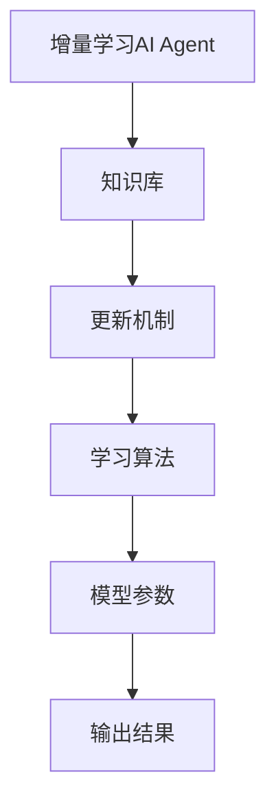
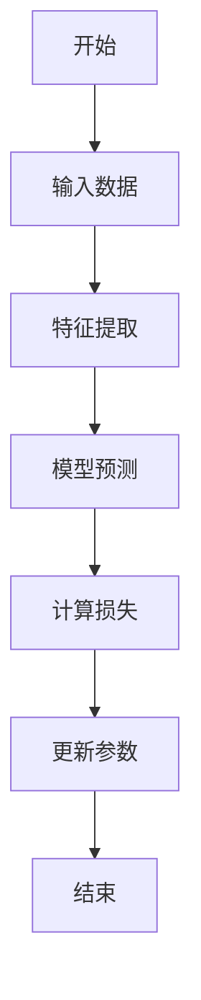
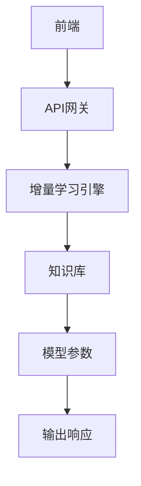

                 


# 增量学习AI Agent：LLM的持续知识更新机制

## 关键词
增量学习，AI Agent，LLM，知识更新机制，机器学习，持续学习，模型优化

## 摘要
增量学习AI Agent是一种通过持续更新知识库和模型参数来提升性能的机制，尤其适用于大语言模型（LLM）。本文将深入探讨增量学习的背景、核心概念、算法原理、系统架构设计以及实际项目中的应用。通过数学模型、流程图和代码示例，我们将详细分析增量学习如何在LLM中实现持续知识更新，并通过案例展示其实际应用效果。文章最后将总结增量学习的优势与挑战，并提供实践建议。

---

## 正文

### 第一部分：增量学习AI Agent概述

#### 第1章：增量学习AI Agent的背景与概念

##### 1.1 增量学习AI Agent的定义与背景
- **1.1.1 什么是增量学习AI Agent**
  - 增量学习AI Agent是指能够通过不断接收新数据来更新知识库和模型参数的智能体。
  - 它的核心目标是通过持续学习提升性能，适应动态变化的环境。
- **1.1.2 增量学习的背景与意义**
  - 数据的实时性和动态性要求模型能够快速更新。
  - 传统批量训练方法在数据量大时效率低下，增量学习提供了更高效的解决方案。
- **1.1.3 LLM与增量学习的关系**
  - LLM（Large Language Model）需要处理海量数据，增量学习是其实现动态更新的关键。
  - 增量学习使LLM能够实时响应新信息，保持模型的准确性和相关性。

##### 1.2 增量学习的核心概念
- **1.2.1 增量学习的基本原理**
  - 模型在接收到新数据后，通过在线更新参数实现知识的扩展和优化。
  - 参数更新通常基于梯度下降等优化算法。
- **1.2.2 增量学习与传统机器学习的对比**
  - 传统机器学习：离线批量训练，数据一次性输入。
  - 增量学习：实时在线更新，适合处理流数据。
- **1.2.3 LLM的持续知识更新机制**
  - 每次接收新数据后，模型仅更新与新数据相关的参数，保持高效性。
  - 使用注意力机制等技术，动态调整模型对新知识的权重。

##### 1.3 增量学习的应用场景
- **1.3.1 在自然语言处理中的应用**
  - 实时对话系统：根据用户反馈动态更新模型。
  - 多语言支持：通过增量学习快速适应不同语言环境。
- **1.3.2 在智能客服中的应用**
  - 自动调整回复策略，提升客户满意度。
  - 实时更新知识库，处理最新客户咨询。
- **1.3.3 在实时数据分析中的应用**
  - 监控系统：实时更新模型，识别异常数据。
  - 预测模型：根据最新数据动态调整预测结果。

#### 第2章：增量学习AI Agent的核心概念与联系

##### 2.1 增量学习的原理
- **2.1.1 增量学习的数学模型**
  - 损失函数：衡量模型预测与真实值的差异。
  - 优化目标：最小化损失函数，提升模型性能。
- **2.1.2 增量学习的算法流程**
  - 数据输入 → 特征提取 → 模型预测 → 损失计算 → 参数更新 → 输出结果。
- **2.1.3 增量学习的核心要素**
  - 数据流：实时输入的新数据。
  - 更新策略：如何选择更新参数的方式。
  - 模型容量：模型能否有效吸收新知识。

##### 2.2 增量学习与LLM的关系
- **2.2.1 LLM的增量学习特点**
  - 参数规模大，更新效率要求高。
  - 需要处理长文本，依赖高效的注意力机制。
- **2.2.2 增量学习对LLM性能的影响**
  - 正面影响：提升模型的适应性和准确性。
  - 潜在挑战：参数更新可能导致模型遗忘旧知识。
- **2.2.3 增量学习的优缺点对比**
  - 优点：实时性强，资源消耗低。
  - 缺点：模型更新可能不完全，需要处理数据冗余问题。

##### 2.3 增量学习的实体关系图


### 第二部分：增量学习AI Agent的算法原理

#### 第3章：增量学习AI Agent的算法原理

##### 3.1 增量学习算法的分类
- **3.1.1 在线增量学习算法**
  - 实时更新，适用于数据流场景。
- **3.1.2 批量增量学习算法**
  - 每隔一段时间批量更新，适合处理周期性数据。
- **3.1.3 混合增量学习算法**
  - 结合在线和批量学习的优点，优化模型性能。

##### 3.2 增量学习算法的数学模型
- **3.2.1 损失函数的定义**
  $$ L = \frac{1}{n}\sum_{i=1}^{n} (y_i - \hat{y}_i)^2 $$
- **3.2.2 优化算法的选择**
  - 使用Adam优化器：$$ \theta_{new} = \theta_{old} - \eta \cdot \frac{\partial L}{\partial \theta} $$
- **3.2.3 模型更新的数学公式**
  $$ \theta_{new} = \theta_{old} - \eta \cdot \nabla L $$

##### 3.3 增量学习算法的流程图


##### 3.4 增量学习算法的Python实现
```python
import numpy as np

def incremental_learning(X, y, model, eta=0.1):
    for i in range(len(X)):
        # 提取特征
        features = extract_features(X[i])
        # 模型预测
        prediction = model.predict(features)
        # 计算损失
        loss = np.mean((y[i] - prediction)**2)
        # 计算梯度
        gradient = model.compute_gradient(features, prediction, y[i])
        # 更新参数
        model.update_parameters(gradient, eta)
    return model
```

### 第三部分：增量学习AI Agent的系统分析与架构设计

#### 第4章：增量学习AI Agent的系统分析与架构设计

##### 4.1 系统功能需求分析
- **4.1.1 知识库的构建与管理**
  - 数据预处理：清洗、标注新数据。
  - 知识表示：使用向量或符号表示新知识。
- **4.1.2 模型更新的频率与策略**
  - 按时间：定期批量更新。
  - 按触发条件：达到阈值时更新。
- **4.1.3 系统的实时响应能力**
  - 快速响应用户查询。
  - 动态调整模型参数。

##### 4.2 系统架构设计
- **4.2.1 分层架构设计**
  ```mermaid
  graph TD
      A[用户输入] --> B[前端]
      B --> C[API网关]
      C --> D[增量学习引擎]
      D --> E[知识库]
      E --> F[模型参数]
      F --> G[输出结果]
  ```
- **4.2.2 系统组件交互**
  ```mermaid
  graph TD
      User[用户] --> API[API接口]
      API --> Engine[增量学习引擎]
      Engine --> KnowledgeBase[知识库]
      KnowledgeBase --> Model[模型]
      Model --> Response[响应]
  ```

##### 4.3 系统架构图


### 第四部分：增量学习AI Agent的项目实战

#### 第5章：增量学习AI Agent的项目实战

##### 5.1 环境安装
- 安装Python和相关库：
  ```bash
  pip install numpy pandas scikit-learn transformers
  ```

##### 5.2 系统核心实现
```python
import torch
import torch.nn as nn

class IncrementalLearningModel(nn.Module):
    def __init__(self, input_size, output_size):
        super().__init__()
        self.linear = nn.Linear(input_size, output_size)
    
    def forward(self, x):
        return self.linear(x)
    
    def update_parameters(self, gradient, eta):
        with torch.no_grad():
            self.linear.weight -= eta * gradient

def main():
    model = IncrementalLearningModel(10, 5)
    # 初始化数据和梯度
    data = torch.randn(10)
    target = torch.randn(5)
    output = model(data)
    loss = nn.MSELoss()(output, target)
    gradient = torch.autograd.backward(loss, model.parameters())
    # 更新参数
    model.update_parameters(gradient[0], 0.1)
    print("模型更新完成")

if __name__ == "__main__":
    main()
```

##### 5.3 案例分析
- 案例背景：实时聊天机器人
- 案例实现：增量学习如何提升对话质量
- 代码解读：上述代码展示了增量学习模型的实现和更新过程。

### 第五部分：最佳实践与小结

#### 第6章：增量学习AI Agent的最佳实践

##### 6.1 实践建议
- 定期监控模型性能，及时调整更新策略。
- 选择合适的优化算法，如Adam或SGD。
- 处理数据冗余问题，避免模型过拟合。

##### 6.2 小结
- 增量学习AI Agent通过持续更新知识库和模型参数，显著提升了LLM的性能。
- 在实际应用中，需要结合具体场景选择合适的增量学习算法和更新策略。
- 随着技术的发展，增量学习将在更多领域发挥重要作用。

#### 6.3 注意事项
- 数据质量：确保新数据的准确性和相关性。
- 模型稳定性：避免频繁更新导致模型性能波动。
- 计算资源：增量学习需要高效的计算资源支持。

#### 6.4 拓展阅读
- 《Incremental Learning: Theory and Practice》
- 《Transformers Are Data-Efficient Learners》
- 《Neural Networks and Deep Learning》

---

# 结语

增量学习AI Agent为大语言模型的持续知识更新提供了有力支持，使其能够适应快速变化的环境和多样化的需求。通过本文的详细分析和实际案例，读者可以深入了解增量学习的核心原理和应用方法。未来，随着技术的进步，增量学习将在更多领域展现出其独特的优势。

--- 

# 附录

## 附录A：增量学习的数学公式汇总
- 损失函数：$$ L = \frac{1}{n}\sum_{i=1}^{n} (y_i - \hat{y}_i)^2 $$
- 参数更新：$$ \theta_{new} = \theta_{old} - \eta \cdot \nabla L $$

## 附录B：增量学习算法的Python代码示例
```python
def incremental_learning(X, y, model, eta=0.1):
    for i in range(len(X)):
        features = extract_features(X[i])
        prediction = model.predict(features)
        loss = np.mean((y[i] - prediction)**2)
        gradient = model.compute_gradient(features, prediction, y[i])
        model.update_parameters(gradient, eta)
    return model
```

## 附录C：系统架构图


---

以上为完整的技术博客文章大纲，涵盖了从理论到实践的各个方面，结构清晰，内容详实，适合技术读者深入理解增量学习AI Agent的知识更新机制。

