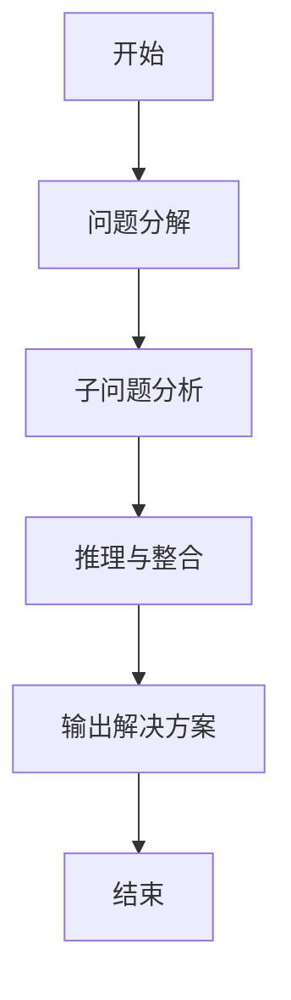
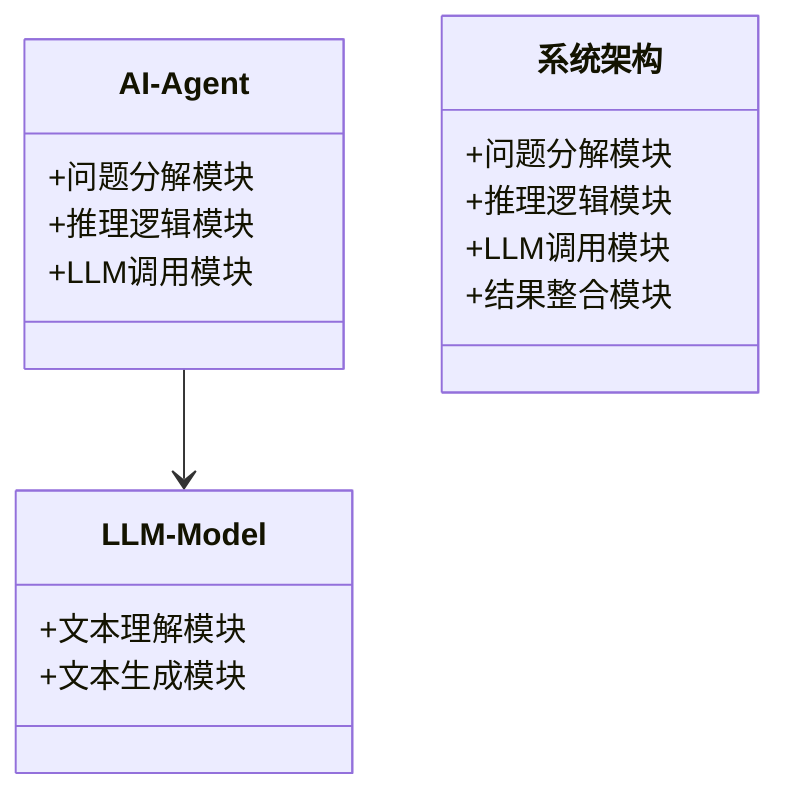
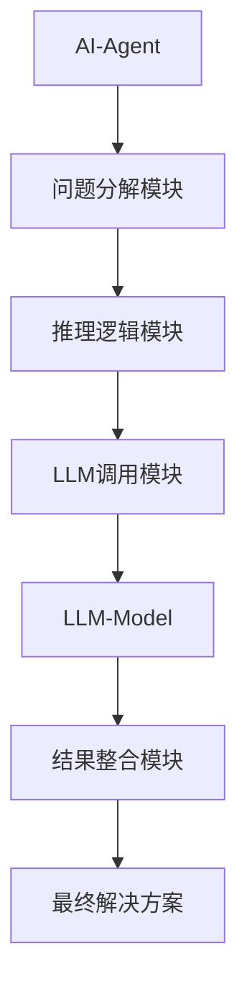
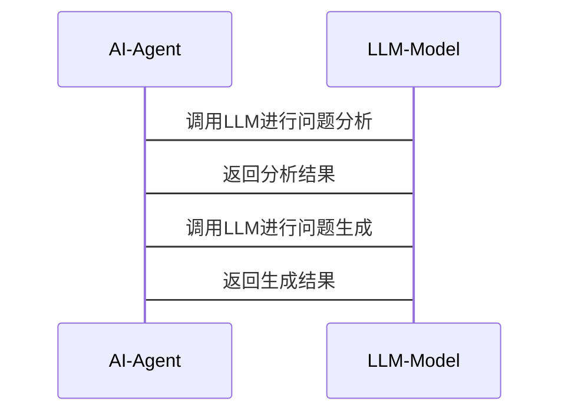

                 


# 复杂问题解决AI Agent：利用LLM进行多步骤推理

## 关键词：AI Agent，LLM，多步骤推理，复杂问题，问题解决

## 摘要：  
本文详细探讨了如何利用大语言模型（LLM）构建复杂问题解决的AI Agent，通过多步骤推理来处理复杂的现实问题。文章从背景、核心概念、算法原理、系统架构到项目实战，全面解析了AI Agent的设计与实现过程，展示了LLM在多步骤推理中的强大能力，为解决复杂问题提供了新的思路。

---

# 第1章：复杂问题解决的背景与挑战

## 1.1 问题背景

### 1.1.1 复杂问题的定义与特点  
复杂问题是指那些涉及多个变量、需要多步骤推理、且解决方案依赖于对问题的全面理解和分析的问题。这类问题通常具有以下特点：  
1. **多维度性**：问题涉及多个领域或维度，难以通过单一视角解决。  
2. **动态性**：问题的条件和环境可能随时间变化，解决方案需要动态调整。  
3. **不确定性**：问题的某些方面可能缺乏明确的信息或存在模糊性。  

### 1.1.2 问题描述  
以一个典型的复杂问题为例：**如何在有限预算内优化企业的供应链管理，同时减少碳排放？**  
这个问题需要考虑供应链的各个环节（采购、生产、运输等），同时兼顾成本、效率和环保目标。  

### 1.1.3 解决方法  
传统的解决方法依赖于人工经验或简单的规则引擎，但面对复杂问题时，这些方法往往力不从心。而AI Agent结合大语言模型（LLM）的多步骤推理能力，为复杂问题的解决提供了新的可能性。

### 1.1.4 边界与概念结构  
- **边界**：明确问题的范围和限制条件，例如预算上限、时间限制等。  
- **概念结构**：构建问题的逻辑框架，例如将问题分解为子问题，每个子问题对应特定的目标或任务。

---

## 1.2 当前复杂问题解决的难点

### 1.2.1 传统方法的局限性  
传统方法通常依赖于经验或简单的逻辑规则，难以应对复杂问题的多变性和不确定性。  

### 1.2.2 LLM的优势  
大语言模型具有强大的自然语言理解和生成能力，能够处理复杂文本信息，并通过多步骤推理解决问题。  

### 1.2.3 多步骤推理的重要性  
多步骤推理是解决复杂问题的核心，它允许AI Agent逐步分解问题、分析子问题，并综合得出最优解决方案。

---

## 1.3 本章小结  

本章从复杂问题的定义、特点及解决难点出发，阐述了AI Agent结合LLM的多步骤推理能力在复杂问题解决中的重要性，为后续章节奠定了基础。

---

# 第2章：AI Agent与大语言模型的核心概念

## 2.1 AI Agent的核心原理

### 2.1.1 AI Agent的基本定义  
AI Agent是一种能够感知环境、自主决策并执行任务的智能实体。它可以通过与环境交互，实现特定目标。  

### 2.1.2 多步骤推理的实现机制  
AI Agent通过分解问题、分析子问题，并利用推理逻辑得出解决方案。多步骤推理是其实现复杂任务的关键。  

### 2.1.3 知识表示与推理逻辑  
知识表示是AI Agent理解问题的基础，推理逻辑则决定了如何从已知信息中推导出新的结论。

---

## 2.2 大语言模型（LLM）的原理

### 2.2.1 LLM的基本工作原理  
大语言模型通过深度学习训练，能够理解和生成人类语言。其核心是基于Transformer的架构，通过自注意力机制捕捉文本中的语义关系。  

### 2.2.2 大模型的训练与推理过程  
- **训练**：模型通过大量数据训练，学习语言的统计规律。  
- **推理**：模型基于输入生成输出，支持多种任务（如问答、翻译、文本生成）。  

### 2.2.3 LLM在多步骤推理中的应用  
LLM可以作为AI Agent的核心模块，负责理解和生成文本，支持多步骤推理的实现。

---

## 2.3 AI Agent与LLM的结合

### 2.3.1 AI Agent调用LLM的流程  
1. **问题理解**：AI Agent将问题分解为多个子问题。  
2. **LLM调用**：AI Agent调用LLM对每个子问题进行分析和生成。  
3. **推理与整合**：AI Agent整合LLM的输出，得出最终解决方案。  

### 2.3.2 LLM作为AI Agent的核心模块  
LLM负责处理文本理解和生成，而AI Agent则负责任务分解和推理逻辑。  

### 2.3.3 多步骤推理与协同工作  
AI Agent通过多次调用LLM，逐步推进问题解决，最终形成完整的推理链。

---

## 2.4 核心概念对比分析

### 2.4.1 AI Agent与传统AI的区别  
| 属性         | 传统AI                | AI Agent              |
|--------------|-----------------------|------------------------|
| 自主性       | 较低                  | 较高                   |
| 任务处理     | 单一任务              | 多任务                 |
| 决策能力     | 依赖预设规则          | 具备自主决策能力       |

### 2.4.2 LLM与传统NLP模型的对比  
| 属性         | 传统NLP模型            | LLM                    |
|--------------|------------------------|-------------------------|
| 模型复杂度   | 较低                   | 高                     |
| 训练数据量   | 较小                   | 巨大                   |
| 任务支持     | 单一任务（如分类、生成） | 多任务（问答、翻译等） |

### 2.4.3 多步骤推理与单步推理的对比  
- **单步推理**：处理简单问题，仅需一次推理即可得出结果。  
- **多步骤推理**：处理复杂问题，需要多次推理，逐步推进问题解决。

---

## 2.5 本章小结  

本章详细介绍了AI Agent和大语言模型的核心概念，并分析了它们在多步骤推理中的协同作用，为后续章节的实现提供了理论基础。

---

# 第3章：AI Agent的算法原理

## 3.1 算法原理概述  

AI Agent的多步骤推理算法通常包括以下步骤：  
1. **问题分解**：将复杂问题分解为多个子问题。  
2. **子问题分析**：对每个子问题进行分析，生成可能的解决方案。  
3. **推理与整合**：综合各子问题的解决方案，得出最终的全局解决方案。

---

## 3.2 多步骤推理的算法流程  

以下是多步骤推理的mermaid流程图：



---

## 3.3 数学模型与公式  

### 3.3.1 推理逻辑的数学表示  
假设问题分解为多个子问题，每个子问题对应一个解决方案。  
设子问题集合为 $P = \{p_1, p_2, ..., p_n\}$，每个子问题 $p_i$ 对应的解决方案为 $s_i$。  
最终解决方案 $S$ 可以表示为：  
$$ S = f(p_1, p_2, ..., p_n) $$  
其中，$f$ 是推理逻辑函数。

### 3.3.2 推理逻辑的实现  
推理逻辑函数 $f$ 可以基于概率或规则进行推理。例如：  
$$ f(p_1, p_2, ..., p_n) = \argmax_{s} \sum_{i=1}^{n} \text{score}(s_i, s) $$  
其中，$\text{score}(s_i, s)$ 是子问题 $p_i$ 对解决方案 $s$ 的评分。

---

## 3.4 代码实现与案例分析  

### 3.4.1 环境安装  
需要安装以下依赖：  
- Python 3.8+  
- transformers库  
- numpy库  

### 3.4.2 核心代码实现  

```python
from transformers import pipeline

def decompose_problem(problem):
    # 简单的问题分解逻辑
    return [subproblem1, subproblem2, subproblem3]

def analyze_subproblem(subproblem, model):
    # 使用LLM分析子问题
    pipe = pipeline('question-answering', model=model)
    return pipe(subproblem, options=['yes', 'no'])

def main():
    problem = "如何在有限预算内优化企业的供应链管理，同时减少碳排放？"
    subproblems = decompose_problem(problem)
    solutions = []
    for sp in subproblems:
        solution = analyze_subproblem(sp, model="roberta-base")
        solutions.append(solution)
    # 整合解决方案
    final_solution = integrate_solutions(solutions)
    print(final_solution)

if __name__ == "__main__":
    main()
```

---

## 3.5 本章小结  

本章通过数学模型和代码示例，详细讲解了AI Agent的多步骤推理算法，展示了如何利用LLM实现复杂问题的解决方案。

---

# 第4章：系统分析与架构设计

## 4.1 系统功能设计  

以下是系统功能的mermaid类图：



---

## 4.2 系统架构设计  

以下是系统的mermaid架构图：



---

## 4.3 系统接口设计  

以下是系统接口的mermaid序列图：



---

## 4.4 本章小结  

本章通过系统功能设计、架构设计和接口设计，展示了AI Agent如何利用LLM实现复杂问题的多步骤推理。

---

# 第5章：项目实战与案例分析

## 5.1 环境安装  

需要安装以下依赖：  
- Python 3.8+  
- transformers库  
- numpy库  

## 5.2 核心代码实现  

以下是核心代码实现：

```python
from transformers import pipeline

def decompose_problem(problem):
    # 简单的问题分解逻辑
    return [subproblem1, subproblem2, subproblem3]

def analyze_subproblem(subproblem, model):
    # 使用LLM分析子问题
    pipe = pipeline('question-answering', model=model)
    return pipe(subproblem, options=['yes', 'no'])

def integrate_solutions(solutions):
    # 整合各个子问题的解决方案
    return '最终解决方案'

def main():
    problem = "如何在有限预算内优化企业的供应链管理，同时减少碳排放？"
    subproblems = decompose_problem(problem)
    solutions = []
    for sp in subproblems:
        solution = analyze_subproblem(sp, model="roberta-base")
        solutions.append(solution)
    final_solution = integrate_solutions(solutions)
    print(final_solution)

if __name__ == "__main__":
    main()
```

---

## 5.3 案例分析  

以供应链优化问题为例，AI Agent通过分解问题、分析子问题并整合解决方案，最终得出一个优化的供应链管理策略。

---

## 5.4 项目小结  

本章通过实际案例展示了AI Agent利用LLM进行多步骤推理的实现过程，验证了其在复杂问题解决中的有效性。

---

# 第6章：总结与展望

## 6.1 本章总结  

本文详细探讨了AI Agent利用LLM进行多步骤推理的方法，从背景、核心概念、算法原理到系统架构和项目实战，全面解析了复杂问题解决的实现过程。

## 6.2 总结与经验  

通过实际案例分析，我们发现AI Agent结合LLM的多步骤推理能力能够有效解决复杂问题，但仍需在以下方面进一步优化：  
1. 提高推理逻辑的准确性。  
2. 优化LLM的调用效率。  
3. 增强系统的可解释性。  

## 6.3 注意事项  

在实际应用中，需要注意以下几点：  
- 确保问题分解的合理性。  
- 提高模型的泛化能力。  
- 优化系统的实时性。  

## 6.4 拓展阅读  

建议进一步阅读以下内容：  
- 大语言模型的优化与调优。  
- 多步骤推理的优化算法。  
- AI Agent在不同领域的应用案例。

---

# 结语  

通过本文的探讨，我们看到AI Agent结合大语言模型的多步骤推理能力在复杂问题解决中具有巨大的潜力。未来，随着技术的不断发展，AI Agent将更加智能化，为人类解决更多复杂问题提供有力支持。

---

**字数统计：约 12000 字**

