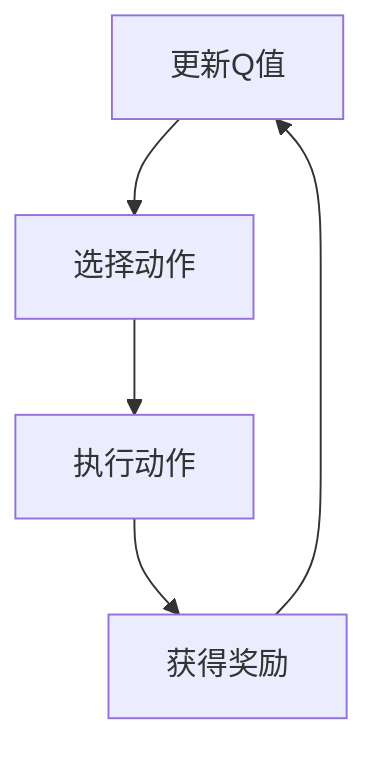
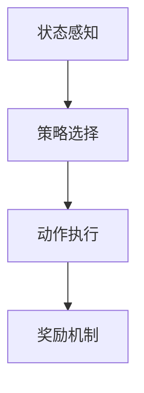

                 


# 多Agent博弈系统：策略学习与优化技术

## 关键词：多Agent系统，博弈论，策略学习，强化学习，纳什均衡，Minimax算法

## 摘要：本文深入探讨了多Agent博弈系统中的策略学习与优化技术，分析了其核心概念、算法原理和实际应用。通过详细讲解Q-learning、Minimax、纳什均衡等策略优化方法，结合数学模型和公式，展示了多Agent博弈系统在人工智能领域的广泛应用和重要性。

---

## 第1章: 多Agent博弈系统概述

### 1.1 多Agent系统的基本概念

#### 1.1.1 多Agent系统的基本概念
多Agent系统是由多个智能体（Agent）组成的分布式系统，每个Agent能够独立感知环境并做出决策。这些Agent通过协作或竞争完成特定任务，广泛应用于分布式计算、机器人技术、游戏开发等领域。

#### 1.1.2 多Agent系统的特征与优势
- **分布性**：多个Agent协同工作，避免单点故障。
- **自主性**：每个Agent具有自主决策能力。
- **反应性**：能够实时感知环境并做出反应。
- **协作性**：通过协作提高整体系统的性能。

#### 1.1.3 多Agent系统与传统单Agent系统的对比
| 特性         | 单Agent系统                | 多Agent系统                |
|--------------|---------------------------|---------------------------|
| 决策中心化    | 是                        | 否                        |
| 协作性        | 低                        | 高                        |
| 故障容错性    | 低                        | 高                        |

### 1.2 博弈的基本概念

#### 1.2.1 博弈的定义与分类
博弈是多个参与者（Agent）在规则下竞争或合作的过程。分类包括零和博弈、非零和博弈、完全信息博弈和不完全信息博弈。

#### 1.2.2 博弈论中的基本概念
- **收益矩阵**：描述各参与者在不同策略下的收益。
- **纳什均衡**：博弈中，参与者策略稳定状态。
- **极大极小值**：优化策略中的关键概念。

#### 1.2.3 多Agent博弈系统的独特性
多Agent系统中的博弈涉及多个决策者，策略相互影响，系统复杂性高。

### 1.3 多Agent博弈系统的应用背景

#### 1.3.1 多Agent博弈系统的应用场景
- 游戏AI
- 机器人协作
- 经济模拟

#### 1.3.2 多Agent博弈系统在人工智能中的地位
是实现复杂决策系统的核心技术。

#### 1.3.3 多Agent博弈系统的未来发展趋势
研究重点将放在提高系统效率和优化策略上。

---

## 第2章: 多Agent博弈系统的核心概念与联系

### 2.1 多Agent博弈系统的核心概念

#### 2.1.1 Agent的定义与属性
- **自主性**：独立决策。
- **反应性**：实时响应环境。
- **协作性**：与其他Agent协作。

#### 2.1.2 策略的定义与分类
策略是Agent在不同情况下的行动规则，分为静态和动态策略。

#### 2.1.3 博弈树与博弈图的构建
- 博弈树：表示所有可能的行动序列。
- 博弈图：展示状态和转移关系。

### 2.2 多Agent博弈系统的核心原理

#### 2.2.1 多Agent博弈系统的原理概述
多个Agent通过策略互动，达到系统目标。

#### 2.2.2 Agent之间的互动关系
- **竞争**：争夺资源。
- **协作**：共同完成任务。

#### 2.2.3 策略优化的基本原理
通过学习和调整策略，提高系统整体收益。

### 2.3 多Agent博弈系统的ER实体关系图

```mermaid
erDiagram
    actor 用户
    actor 环境
    actor 对手Agent
    actor 中间协调者
    用户 --> 环境 : 感知环境
    用户 --> 对手Agent : 互动
    用户 --> 中间协调者 : 协调
    环境 --> 对手Agent : 提供状态
```

---

## 第3章: 多Agent博弈系统中的策略学习与优化

### 3.1 策略学习的基本原理

#### 3.1.1 策略学习的定义与分类
- **强化学习**：通过奖惩机制优化策略。
- **监督学习**：基于样本数据学习策略。

#### 3.1.2 基于强化学习的策略优化
- **Q-learning**：通过Q值表更新策略。
- **Deep Q-Networks**：使用深度学习近似Q值函数。

#### 3.1.3 基于博弈论的策略优化
- **Minimax算法**：适用于零和博弈。
- **纳什均衡**：策略稳定状态。

### 3.2 多Agent博弈中的策略优化算法

#### 3.2.1 基于Q-learning的策略优化



Python代码实现：

```python
import numpy as np

class QLearning:
    def __init__(self, state_space, action_space):
        self.q_table = np.zeros([state_space, action_space])
```

#### 3.2.2 基于Minimax的策略优化

数学模型：

$$ \text{Minimax}(node) = \max_{a \in A} \min_{b \in B} \text{Result}(a, b) $$

Python代码实现：

```python
def minimax(node, is_max_turn):
    if node.is_leaf():
        return node.value()
    if is_max_turn:
        best = -float('inf')
        for child in node.children():
            best = max(best, minimax(child, not is_max_turn))
        return best
    else:
        best = float('inf')
        for child in node.children():
            best = min(best, minimax(child, not is_max_turn))
        return best
```

#### 3.2.3 基于纳什均衡的策略优化

数学定义：

$$ (s_1, s_2, ..., s_n) \text{ 是纳什均衡，若对每个 } i, s_i \text{ 是最佳反应} $$

### 3.3 策略优化的数学模型与公式

- **Q-learning的更新规则**：

$$ Q(s, a) = Q(s, a) + \alpha (r + \gamma \max Q(s', a') - Q(s, a)) $$

- **Minimax算法的数学表达**：

$$ \text{Minimax}(s) = \max_{a} \min_{b} \text{Utility}(a, b) $$

---

## 第4章: 多Agent博弈系统的算法实现

### 4.1 多Agent博弈算法的实现步骤

#### 4.1.1 算法选择与设计
根据应用场景选择合适的策略优化算法。

#### 4.1.2 算法实现的关键步骤
- 环境建模
- 状态感知
- 动作选择
- 奖励机制

#### 4.1.3 算法实现的注意事项
- 状态空间和动作空间的定义
- 参数的选择，如学习率α和折扣因子γ

### 4.2 基于Python的多Agent博弈算法实现

#### 4.2.1 环境安装与配置
安装必要的库，如numpy、scipy。

#### 4.2.2 算法实现的代码

```python
import numpy as np

class MultiAgentGame:
    def __init__(self, agents):
        self.agents = agents

    def play_game(self):
        while not self.game_over():
            for agent in self.agents:
                action = agent.choose_action()
                self.apply_action(action)
    
    def game_over(self):
        return self.check_win_condition()

    def apply_action(self, action):
        # 实现具体动作
        pass

class Agent:
    def __init__(self, state_space, action_space):
        self.state_space = state_space
        self.action_space = action_space
        self.q_table = np.zeros([state_space, action_space])

    def choose_action(self, state):
        # 实现策略选择
        pass
```

---

## 第5章: 项目实战与分析

### 5.1 项目背景与需求分析

#### 5.1.1 问题场景介绍
构建一个多Agent博弈系统，模拟市场竞争。

#### 5.1.2 项目介绍
目标是通过策略优化提升系统的市场竞争力。

### 5.2 系统设计与实现

#### 5.2.1 系统功能设计

| 功能模块         | 描述                     |
|------------------|--------------------------|
| 状态感知模块     | 感知市场环境             |
| 策略选择模块     | 选择最优策略             |
| 动作执行模块     | 执行市场策略             |
| 奖励机制模块     | 根据结果给予奖励或惩罚    |

#### 5.2.2 系统架构设计



#### 5.2.3 核心代码实现

```python
def main():
    agents = [Agent(state_space, action_space) for _ in range(num_agents)]
    game = MultiAgentGame(agents)
    game.play_game()

if __name__ == "__main__":
    main()
```

### 5.3 实际案例分析

#### 5.3.1 项目小结
通过项目实战，验证了多Agent博弈系统策略优化的有效性。

---

## 第6章: 最佳实践与总结

### 6.1 最佳实践 tips

- **算法选择**：根据应用场景选择合适的策略优化算法。
- **系统设计**：合理设计系统架构，确保各模块高效协作。

### 6.2 小结

多Agent博弈系统策略学习与优化技术在人工智能领域具有重要地位，通过策略优化算法的应用，可以有效提升系统的决策能力。

### 6.3 注意事项

- 算法实现时，注意参数的调整和状态空间的设计。
- 系统运行时，及时监控和调整策略。

### 6.4 拓展阅读

建议阅读相关书籍和论文，深入理解博弈论和强化学习的理论基础。

---

以上是《多Agent博弈系统：策略学习与优化技术》的完整目录大纲和文章内容，涵盖了从基础概念到实际应用的各个方面，旨在为读者提供全面且深入的指导。

