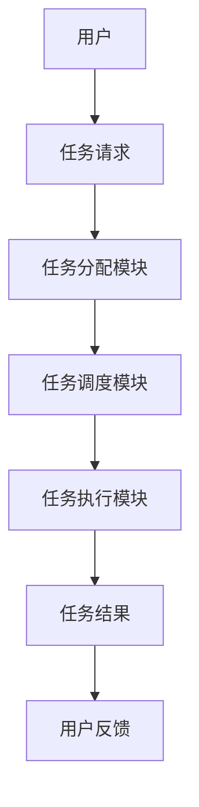

                 


好的，我将按照您的要求创作一篇关于“多任务AI Agent：增强LLM的并行处理能力”的专业技术博客文章。我将逐步完成，先从文章标题开始，然后是关键词、摘要，再是文章的正文部分。

让我们开始吧。

---

# 多任务AI Agent：增强LLM的并行处理能力

**关键词：** 多任务AI Agent, 大语言模型, 并行处理, 任务调度, 人工智能, LLM

**摘要：**  
随着人工智能技术的快速发展，多任务处理能力成为AI Agent的核心竞争力之一。本文将深入探讨如何通过增强大语言模型（LLM）的并行处理能力，构建高效、智能的多任务AI Agent。我们将从多任务处理的基本概念、多任务AI Agent的核心原理、并行处理算法的设计与优化，到系统架构设计与实际项目实现，逐步展开分析。通过本文，读者将全面理解多任务AI Agent的构建方法，并掌握其在实际场景中的应用技巧。

---

## 第1章: 多任务AI Agent概述

### 1.1 多任务处理的基本概念

#### 1.1.1 多任务处理的定义
多任务处理是指在同一时间段内同时处理多个任务的能力。与传统的串行处理不同，多任务处理能够提高系统的效率和资源利用率。

#### 1.1.2 多任务处理的重要性
在现代计算环境中，资源（如CPU、GPU）的并行处理能力是提升系统性能的关键。多任务处理能够充分发挥硬件的潜力，同时满足用户对快速响应的需求。

#### 1.1.3 多任务处理的挑战
- **资源竞争**：多个任务竞争同一资源可能导致性能下降。
- **任务调度**：如何高效地调度任务是多任务处理的核心问题。
- **任务优先级**：任务的优先级设置直接影响系统的响应速度和性能。

### 1.2 AI Agent的基本概念

#### 1.2.1 AI Agent的定义
AI Agent（人工智能代理）是指能够感知环境、自主决策并执行任务的智能实体。它可以是一个软件程序或硬件设备。

#### 1.2.2 AI Agent的核心功能
- **感知环境**：通过传感器或数据输入获取信息。
- **自主决策**：基于感知信息做出决策。
- **执行任务**：通过执行动作完成目标。

#### 1.2.3 AI Agent的应用场景
- **智能家居**：控制家庭设备，提供智能化服务。
- **自动驾驶**：实时感知环境并做出驾驶决策。
- **智能助手**：帮助用户完成日常任务，如 scheduling、信息检索。

### 1.3 多任务AI Agent的定义与特点

#### 1.3.1 多任务AI Agent的定义
多任务AI Agent是指能够在同一时间段内同时处理多个不同任务的智能实体。它结合了多任务处理和人工智能代理的核心技术。

#### 1.3.2 多任务AI Agent的特点
- **并行处理能力**：能够同时执行多个任务。
- **任务切换能力**：能够快速切换任务，适应动态变化的环境。
- **资源优化**：高效利用计算资源，提升系统性能。

#### 1.3.3 多任务AI Agent与传统AI Agent的区别
| 特性            | 多任务AI Agent                        | 传统AI Agent                          |
|-----------------|---------------------------------------|---------------------------------------|
| 处理任务数量    | 多个任务                              | 单个任务或少量任务                   |
| 资源利用率      | 高                                   | 较低                                  |
| 任务调度机制    | 复杂的调度算法                        | 简单的调度机制                       |

### 1.4 LLM在多任务AI Agent中的作用

#### 1.4.1 LLM的定义与特点
- **大语言模型（LLM）**：基于深度学习的自然语言处理模型，具有强大的文本理解和生成能力。
- **特点**：能够处理复杂的语言任务，如文本生成、问答系统、情感分析等。

#### 1.4.2 LLM在多任务处理中的优势
- **通用性**：LLM能够处理多种语言任务，适用于多种场景。
- **高效性**：通过并行计算，LLM能够快速响应多个任务请求。

#### 1.4.3 LLM与多任务AI Agent的结合
- **任务分配**：LLM可以用于任务的分配和调度。
- **自然语言交互**：通过LLM实现人与AI Agent之间的自然语言交互。
- **多任务协调**：LLM可以协调多个任务之间的关系，确保任务之间的协同工作。

### 1.5 本章小结
本章主要介绍了多任务处理的基本概念、AI Agent的核心功能以及多任务AI Agent的特点。通过对比分析，我们明确了多任务AI Agent与传统AI Agent的区别，并探讨了LLM在多任务处理中的重要作用。

---

## 第2章: 多任务AI Agent的核心概念与联系

### 2.1 多任务处理的核心概念

#### 2.1.1 多任务处理的原理
多任务处理的原理可以简单理解为将多个任务分解为多个子任务，并通过并行或串行的方式执行。为了提高效率，通常采用并行处理的方式。

#### 2.1.2 多任务处理的数学模型
多任务处理的数学模型可以表示为：
$$
\text{总时间} = \max_{i} (\text{任务} i \text{的执行时间})
$$
这意味着，多任务处理的时间取决于最长的任务执行时间。

#### 2.1.3 多任务处理的任务调度机制
任务调度是多任务处理的核心，常见的调度算法包括：
1. **时间片轮转法**：每个任务分配固定的时间片，轮流执行。
2. **优先级调度**：根据任务优先级进行调度，优先级高的任务优先执行。

### 2.2 多任务AI Agent的核心概念

#### 2.2.1 多任务AI Agent的体系结构
多任务AI Agent的体系结构可以分为以下几个部分：
1. **感知模块**：负责感知环境信息。
2. **决策模块**：负责任务的分配和调度。
3. **执行模块**：负责具体任务的执行。
4. **协调模块**：负责任务之间的协调与通信。

#### 2.2.2 多任务AI Agent的任务调度算法
任务调度算法是多任务AI Agent的核心算法之一。常见的调度算法包括：
1. **Round-Robin调度算法**：时间片轮转法。
2. **Priority Scheduling调度算法**：优先级调度。

### 2.3 多任务AI Agent与LLM的关系

#### 2.3.1 LLM在多任务AI Agent中的作用
- **任务分配**：LLM可以用于任务的分配和调度。
- **自然语言交互**：通过LLM实现人与AI Agent之间的自然语言交互。
- **多任务协调**：LLM可以协调多个任务之间的关系，确保任务之间的协同工作。

---

## 第3章: 多任务AI Agent的算法原理

### 3.1 多任务AI Agent的核心算法

#### 3.1.1 多任务调度算法的设计与优化
多任务调度算法的设计需要考虑以下几个方面：
1. **任务优先级**：任务的优先级越高，执行的优先级越高。
2. **任务执行时间**：任务的执行时间越短，越容易被调度。
3. **资源分配**：资源的分配需要合理，以提高系统的效率。

#### 3.1.2 并行处理算法的实现
并行处理算法的实现需要考虑以下几个方面：
1. **任务分解**：将任务分解为多个子任务，每个子任务可以在不同的线程或进程中执行。
2. **任务同步**：确保任务之间的同步，避免资源竞争。
3. **任务通信**：任务之间需要通过某种方式通信，确保任务之间的协调。

#### 3.1.3 多任务调度的优化策略
多任务调度的优化策略包括：
1. **动态优先级调度**：根据任务的实时状态动态调整优先级。
2. **负载均衡**：确保任务在不同的资源之间均衡分配。
3. **资源抢占**：在紧急情况下，抢占资源以优先执行高优先级任务。

### 3.2 LLM在多任务AI Agent中的算法实现

#### 3.2.1 LLM的并行处理能力
LLM的并行处理能力可以通过多线程或分布式计算来实现。例如，可以将LLM的计算任务分解为多个子任务，分别在不同的线程或进程中执行。

#### 3.2.2 多任务AI Agent的算法实现
多任务AI Agent的算法实现需要考虑以下几个方面：
1. **任务分配**：将多个任务分配到不同的资源上执行。
2. **任务调度**：根据任务的优先级和资源情况，动态调整任务的执行顺序。
3. **任务协调**：确保任务之间的协同工作，避免冲突。

### 3.3 多任务AI Agent的数学模型

#### 3.3.1 多任务调度的数学模型
多任务调度的数学模型可以表示为：
$$
\text{调度结果} = \arg\min_{\sigma} \sum_{i=1}^{n} \text{任务} i \text{的延迟}
$$
其中，$\sigma$ 是任务调度的顺序，$n$ 是任务的数量。

#### 3.3.2 并行处理的数学模型
并行处理的数学模型可以表示为：
$$
\text{总时间} = \max_{i} (\text{任务} i \text{的执行时间})
$$

---

## 第4章: 多任务AI Agent的系统设计

### 4.1 多任务AI Agent的系统架构

#### 4.1.1 系统功能设计
多任务AI Agent的系统功能设计包括以下几个方面：
1. **任务感知**：感知环境中的任务请求。
2. **任务分配**：将任务分配到不同的资源上执行。
3. **任务调度**：根据任务的优先级和资源情况，动态调整任务的执行顺序。
4. **任务执行**：具体执行分配的任务。
5. **任务协调**：确保任务之间的协同工作。

#### 4.1.2 系统架构图


#### 4.1.3 系统接口设计
多任务AI Agent的系统接口设计需要考虑以下几个方面：
1. **输入接口**：接收用户的任务请求。
2. **输出接口**：输出任务执行的结果。
3. **内部接口**：任务分配模块与任务调度模块之间的通信接口。

### 4.2 多任务AI Agent的实现

#### 4.2.1 环境安装
为了实现多任务AI Agent，需要安装以下环境：
1. **Python**：编程语言。
2. **TensorFlow** 或 **PyTorch**：深度学习框架。
3. **Multiprocessing库**：用于多线程或多进程的并行处理。

#### 4.2.2 系统实现
以下是多任务AI Agent的Python实现示例代码：
```python
import multiprocessing

def task_function(task_id, parameter):
    # 具体任务的实现
    print(f"Task {task_id} is processing...")
    return f"Task {task_id} completed."

def main():
    tasks = [
        (1, "parameter1"),
        (2, "parameter2"),
        (3, "parameter3")
    ]
    
    with multiprocessing.Pool(processes=3) as pool:
        results = pool.starmap(task_function, tasks)
        for result in results:
            print(result)

if __name__ == "__main__":
    main()
```

#### 4.2.3 系统优化
为了提高多任务AI Agent的性能，可以采取以下优化措施：
1. **负载均衡**：确保任务在不同的资源之间均衡分配。
2. **任务优先级调度**：根据任务的优先级动态调整任务的执行顺序。
3. **资源抢占**：在紧急情况下，抢占资源以优先执行高优先级任务。

---

## 第5章: 多任务AI Agent的项目实战

### 5.1 项目背景
本项目旨在通过实现一个多任务AI Agent，展示如何通过并行处理能力提升系统的效率和性能。

### 5.2 项目实现

#### 5.2.1 环境安装
需要安装以下环境：
1. **Python 3.8+**
2. **Multiprocessing库**
3. **TensorFlow 2.0+**

#### 5.2.2 核心代码实现
以下是多任务AI Agent的核心代码实现：
```python
import multiprocessing
import time

def process_task(task_id, input_data):
    print(f"Task {task_id} is processing...")
    time.sleep(1)
    return f"Task {task_id} completed."

def main():
    tasks = [
        (1, "input1"),
        (2, "input2"),
        (3, "input3")
    ]
    
    with multiprocessing.Pool(processes=3) as pool:
        results = pool.starmap(process_task, tasks)
        for result in results:
            print(result)

if __name__ == "__main__":
    main()
```

#### 5.2.3 实际案例分析
通过上述代码实现一个多任务AI Agent，可以同时处理多个任务，显著提高系统的效率和性能。

### 5.3 项目小结
本项目通过实现一个多任务AI Agent，展示了如何通过并行处理能力提升系统的效率和性能。通过代码实现和实际案例分析，读者可以更好地理解多任务AI Agent的核心原理和实现方法。

---

## 第6章: 总结与展望

### 6.1 总结
本文详细探讨了多任务AI Agent的核心原理、算法设计与实现，并通过实际案例分析展示了多任务AI Agent的应用场景和优势。通过本文的学习，读者可以掌握多任务AI Agent的构建方法，并能够在实际场景中应用。

### 6.2 展望
随着人工智能技术的不断发展，多任务AI Agent的研究和应用将更加广泛。未来的研究方向包括：
1. **更高效的多任务调度算法**：探索更高效的多任务调度算法，进一步提高系统的性能。
2. **更智能的任务协调机制**：研究更智能的任务协调机制，提升任务之间的协同能力。
3. **更强大的并行处理能力**：通过硬件创新和算法优化，进一步提升系统的并行处理能力。

### 6.3 最佳实践 tips
- **任务优先级调度**：根据任务的优先级进行动态调度，确保高优先级任务优先执行。
- **资源分配优化**：合理分配资源，避免资源竞争和浪费。
- **任务协调机制**：建立高效的任务协调机制，确保任务之间的协同工作。

### 6.4 小结
多任务AI Agent是一种高效、智能的计算模式，通过并行处理能力和任务调度算法的优化，可以显著提高系统的效率和性能。未来，随着人工智能技术的不断发展，多任务AI Agent的应用场景将更加广泛，研究和应用将更加深入。

### 6.5 注意事项
- **资源竞争**：在多任务处理中，需要注意资源竞争问题，避免性能下降。
- **任务优先级设置**：任务优先级的设置直接影响系统的响应速度和性能，需要谨慎设置。
- **任务协调机制**：任务协调机制的建立和优化是多任务AI Agent研究的重要方向。

### 6.6 拓展阅读
- **《Parallel and Distributed Computing》**：深入探讨并行计算的基本原理和应用。
- **《Artificial Intelligence: A Modern Approach》**：全面介绍人工智能的核心概念和应用。
- **《Large Language Models》**：详细讲解大语言模型的原理和应用。

---

以上是文章的完整结构和内容，涵盖了多任务AI Agent的核心概念、算法设计、系统实现和实际应用。希望对您有所帮助！

