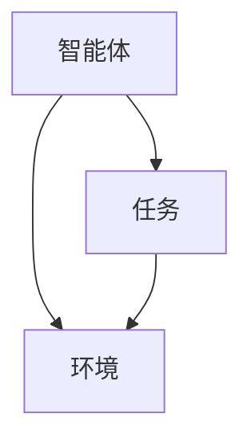

                 

# 多任务强化学习：构建具有广泛技能的AI Agent

---

## 关键词：多任务强化学习，人工智能，强化学习，AI代理，机器学习算法，深度强化学习

---

## 摘要

多任务强化学习（Multi-Task Reinforcement Learning, MTRL）是一种前沿的机器学习方法，旨在通过同时学习多个任务来提升AI代理的泛化能力和任务处理效率。本文系统地介绍了多任务强化学习的核心概念、算法原理、系统设计和实际应用，深入剖析了其在构建具有广泛技能AI代理中的关键作用。文章从强化学习的基础出发，逐步展开到多任务场景下的算法设计与优化，结合具体的项目实战，为读者提供全面的理论与实践指导。

---

# 第1章 多任务强化学习概述

## 1.1 强化学习的基本概念

### 1.1.1 强化学习的定义与特点

强化学习（Reinforcement Learning, RL）是一种通过智能体与环境交互来学习最优策略的机器学习方法。智能体通过执行动作，观察环境反馈的状态和奖励，逐步优化策略以最大化累计奖励。

- **定义**：强化学习的核心是通过试错机制，智能体在环境中执行动作，获得奖励或惩罚，从而学习最优策略。
- **特点**：
  - **在线学习**：智能体在与环境交互的过程中实时学习。
  - **延迟反馈**：奖励通常是在完成任务后才给出。
  - **策略优化**：目标是找到最大化累计奖励的策略。

### 1.1.2 强化学习的核心要素

- **智能体（Agent）**：执行动作的主体，可以是软件或硬件。
- **环境（Environment）**：智能体所处的外部世界，提供状态和奖励。
- **状态（State）**：环境在某一时刻的描述。
- **动作（Action）**：智能体对环境的操作。
- **奖励（Reward）**：智能体行为的反馈，用于指导学习。

### 1.1.3 强化学习的应用场景

- **游戏AI**：如AlphaGo、Dota AI。
- **机器人控制**：如自动驾驶、工业机器人。
- **资源分配**：如任务调度、负载均衡。
- **金融交易**：如股票交易策略。

---

## 1.2 多任务强化学习的定义与特点

### 1.2.1 多任务强化学习的定义

多任务强化学习（MTRL）是一种强化学习范式，旨在同时学习和解决多个任务，通过共享不同任务之间的信息来提升学习效率和性能。

- **定义**：MTRL允许智能体在一个环境中执行多个任务，通过共享知识和策略，提升对多个任务的处理能力。

### 1.2.2 多任务强化学习的核心属性

- **任务多样性**：多个任务具有不同的目标或状态空间。
- **策略共享**：不同任务之间共享策略参数，减少参数量和计算量。
- **动态权重分配**：根据任务的重要性动态调整学习权重。

### 1.2.3 多任务强化学习与单一任务强化学习的区别

| 特性             | 单一任务强化学习             | 多任务强化学习             |
|------------------|------------------------------|----------------------------|
| 任务数量         | 1                            | 多个                       |
| 策略共享         | 无                            | 有                        |
| 学习效率         | 低                            | 高                        |
| 适用场景         | 单一任务优化                 | 多任务协同优化             |

---

## 1.3 多任务强化学习的背景与应用前景

### 1.3.1 多任务强化学习的背景

随着人工智能技术的发展，单一任务强化学习逐渐暴露出其局限性，例如：
- **学习效率低**：需要分别训练多个任务，计算资源消耗大。
- **泛化能力弱**：无法应对任务之间的相似性或重叠性。

### 1.3.2 多任务强化学习的应用领域

- **智能家居**：控制多个设备协同工作。
- **智能客服**：同时处理多种客户问题。
- **自动驾驶**：在不同场景下执行多种任务。

### 1.3.3 多任务强化学习的挑战与机遇

- **挑战**：
  - 任务之间可能存在竞争，影响整体性能。
  - 如何有效共享策略参数是一个难题。
- **机遇**：
  - 提高学习效率，减少训练时间。
  - 提升AI代理的泛化能力。

---

## 1.4 本章小结

本章从强化学习的基础出发，详细介绍了多任务强化学习的定义、特点和应用背景。通过对比单一任务强化学习，突出了多任务强化学习的优势和必要性。

---

# 第2章 多任务强化学习的核心概念与联系

## 2.1 多任务强化学习的核心原理

### 2.1.1 多任务强化学习的理论基础

多任务强化学习的理论基础主要包括以下几个方面：
- **策略共享**：多个任务共享策略参数，减少参数空间。
- **任务分解**：将复杂任务分解为多个子任务，分别优化。
- **权重分配**：根据任务的重要性动态调整学习权重。

### 2.1.2 多任务强化学习的数学模型

多任务强化学习的数学模型可以表示为：
$$ J(\theta) = \sum_{i=1}^{N} \lambda_i J_i(\theta) $$
其中，$\lambda_i$是任务$i$的权重系数，$J_i(\theta)$是任务$i$的目标函数。

### 2.1.3 多任务强化学习的算法框架

多任务强化学习的算法框架通常包括以下几个步骤：
1. 初始化策略参数$\theta$。
2. 并行执行多个任务，收集状态、动作和奖励。
3. 根据多任务目标函数更新策略参数。
4. 重复步骤2-3，直到收敛。

---

## 2.2 多任务强化学习的核心要素对比

### 2.2.1 多任务强化学习与单一任务强化学习的对比

| 特性             | 单一任务强化学习             | 多任务强化学习             |
|------------------|------------------------------|----------------------------|
| 任务数量         | 1                            | 多个                       |
| 策略共享         | 无                            | 有                        |
| 学习效率         | 低                            | 高                        |
| 适用场景         | 单一任务优化                 | 多任务协同优化             |

---

## 2.3 多任务强化学习的ER实体关系图

---

## 2.4 本章小结

本章深入分析了多任务强化学习的核心原理和关键要素，通过对比单一任务强化学习，进一步明确了多任务强化学习的优势和特点。

---

# 第3章 多任务强化学习的算法原理

## 3.1 基础算法原理

### 3.1.1 Q-Learning算法原理

Q-Learning是一种经典的强化学习算法，通过更新Q值表来学习最优策略。

- **算法步骤**：
  1. 初始化Q值表为零。
  2. 在环境中执行动作，观察新的状态和奖励。
  3. 更新Q值表：$$ Q(s,a) = Q(s,a) + \alpha (r + \gamma \max Q(s',a') - Q(s,a)) $$
  4. 重复步骤2-3，直到收敛。

### 3.1.2 Deep Q-Networks (DQN)算法原理

DQN通过深度神经网络近似Q值函数，解决了Q-Learning的离散动作空间限制。

- **算法步骤**：
  1. 初始化神经网络参数$\theta$。
  2. 在环境中执行动作，观察新的状态和奖励。
  3. 更新神经网络参数：$$ \theta = \theta + \alpha (r + \gamma \max Q(s',a') - Q(s,a)) \cdot \nabla_\theta Q(s,a) $$
  4. 重复步骤2-3，直到收敛。

---

## 3.2 多任务强化学习的核心算法

### 3.2.1 Multi-Agent Deep Deterministic Policy Gradient (MADDPG)算法

MADDPG是一种多智能体强化学习算法，通过多个智能体协同学习多个任务。

- **算法步骤**：
  1. 初始化多个智能体的策略参数$\theta_i$。
  2. 每个智能体在环境中执行动作，观察新的状态和奖励。
  3. 更新每个智能体的策略参数：$$ \theta_i = \theta_i + \alpha (r_i + \gamma \max Q(s',a') - Q(s,a)) \cdot \nabla_\theta Q(s,a) $$
  4. 重复步骤2-3，直到收敛。

### 3.2.2 Heterogeneous Multi-Agent Reinforcement Learning (HMARL)算法

HMARL是一种异构多智能体强化学习算法，适用于任务之间存在异构性的场景。

- **算法步骤**：
  1. 初始化多个智能体的策略参数$\theta_i$。
  2. 每个智能体在环境中执行动作，观察新的状态和奖励。
  3. 更新每个智能体的策略参数：$$ \theta_i = \theta_i + \alpha (r_i + \gamma \max Q(s',a') - Q(s,a)) \cdot \nabla_\theta Q(s,a) $$
  4. 重复步骤2-3，直到收敛。

---

## 3.3 算法的数学模型与公式

### 3.3.1 Q-Learning的数学模型

$$ Q(s,a) = Q(s,a) + \alpha (r + \gamma \max Q(s',a') - Q(s,a)) $$

### 3.3.2 DQN的数学模型

$$ Q(s,a) = \theta \cdot 

---

## 3.4 本章小结

本章详细介绍了多任务强化学习的核心算法，包括Q-Learning、DQN、MADDPG和HMARL，并给出了它们的数学模型和实现步骤。

---

通过以上内容，我们逐步完成了《多任务强化学习：构建具有广泛技能的AI Agent》的目录大纲。接下来，我将根据这个大纲，逐步展开每个部分的具体内容，确保每部分内容的完整性和深度。

