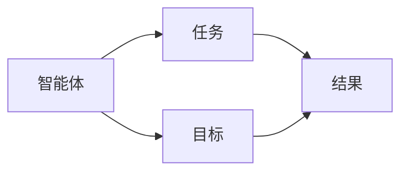
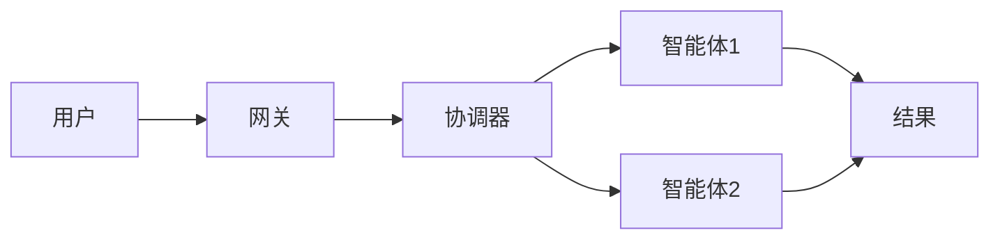
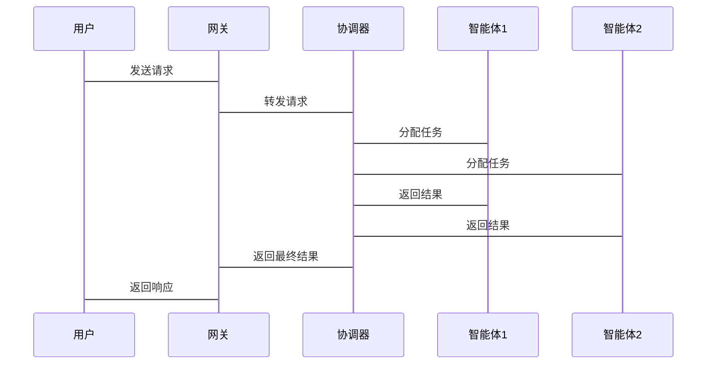

                 


# 多智能体AI Agent：LLM驱动的协作与竞争系统

## 关键词：多智能体系统、LLM、协作、竞争、AI Agent、系统架构、算法原理

## 摘要：本文深入探讨了多智能体AI Agent系统中LLM驱动的协作与竞争机制，从系统架构设计、算法原理到实际项目实现，全面分析了多智能体系统的构建过程。文章结合理论与实践，为读者提供了一套完整的多智能体系统解决方案。

---

# 第1章: 多智能体系统概述

## 1.1 多智能体系统的基本概念

### 1.1.1 多智能体系统的定义
多智能体系统（Multi-Agent System, MAS）是由多个智能体（Agent）组成的系统，这些智能体能够通过协作或竞争完成特定任务。智能体是具有感知环境、自主决策和行动能力的实体。

### 1.1.2 多智能体系统的特征
- **自主性**：智能体能够自主决策。
- **反应性**：能够实时感知环境并做出反应。
- **协作性**：智能体之间可以协作完成任务。
- **竞争性**：智能体之间可以竞争资源或目标。

### 1.1.3 多智能体系统的分类
- **基于任务的多智能体系统**：智能体通过协作完成特定任务。
- **基于市场的多智能体系统**：智能体通过市场机制进行资源分配和交易。
- **基于行为的多智能体系统**：智能体通过行为规则进行协作与竞争。

## 1.2 多智能体系统的核心概念

### 1.2.1 智能体的定义与属性
- **智能体**：具有感知、决策、行动和学习能力的实体。
- **属性**：自主性、反应性、主动性、社会性。

### 1.2.2 多智能体系统中的协作与竞争
- **协作**：智能体之间通过合作完成共同目标。
- **竞争**：智能体之间通过竞争争夺资源或目标。

### 1.2.3 多智能体系统的复杂性
- **复杂性来源**：智能体的自主性、动态环境、协作与竞争的平衡。
- **复杂性挑战**：任务分配、通信机制、冲突解决。

---

# 第2章: 多智能体系统的核心概念与联系

## 2.1 多智能体系统的核心原理

### 2.1.1 多智能体系统的通信机制
- **通信方式**：直接通信和间接通信。
- **通信协议**：智能体之间通过特定协议交换信息。

### 2.1.2 多智能体系统的协作机制
- **协作协议**：智能体之间通过协议进行协作。
- **协作任务分配**：任务分解与分配。

### 2.1.3 多智能体系统的竞争机制
- **竞争规则**：智能体之间的竞争规则。
- **资源分配**：资源分配机制。

## 2.2 多智能体系统的属性特征对比

### 2.2.1 智能体的独立性与协作性对比
- **独立性**：智能体能够独立完成任务。
- **协作性**：智能体之间需要协作完成任务。

### 2.2.2 智能体的主动性与被动性对比
- **主动性**：智能体主动发起行动。
- **被动性**：智能体根据外部指令行动。

### 2.2.3 智能体的简单性与复杂性对比
- **简单性**：智能体功能简单。
- **复杂性**：智能体功能复杂，涉及多个任务。

## 2.3 多智能体系统的ER实体关系图



---

# 第3章: 多智能体系统的算法原理

## 3.1 基于LLM的多智能体协作算法

### 3.1.1 算法概述
- **算法名称**：基于大语言模型的多智能体协作算法。
- **算法目标**：通过协作完成特定任务。

### 3.1.2 算法流程
1. 智能体感知环境。
2. 智能体通过通信机制交换信息。
3. 智能体协作完成任务。
4. 系统反馈结果。

### 3.1.3 算法实现
```python
def multi_agent_collaboration():
    agents = [agent1, agent2, agent3]
    for agent in agents:
        agent感知环境()
        agent通信()
        agent决策()
        agent行动()
    return 结果
```

## 3.2 多智能体系统的数学模型

### 3.2.1 系统模型
- **状态表示**：$s_t$ 表示当前状态。
- **动作空间**：$a_t$ 表示当前动作。
- **奖励函数**：$r_t$ 表示当前奖励。

### 3.2.2 状态表示
- **状态空间**：$S$ 表示所有可能的状态。
- **动作空间**：$A$ 表示所有可能的动作。

### 3.2.3 动作空间
- **动作选择**：$a_t = \argmax_{a \in A} Q(s_t, a)$。

## 3.3 算法的数学公式

### 3.3.1 概率分布公式
$$P(a|s) = \frac{P(s,a)}{P(s)}$$

### 3.3.2 损失函数
$$L = -\sum_{i=1}^{n} \log P(y_i|x_i)$$

---

# 第4章: 多智能体系统的系统分析与架构设计

## 4.1 项目背景与目标

### 4.1.1 项目背景
- **项目背景**：多智能体系统在实际应用中的重要性。
- **项目目标**：设计并实现一个基于LLM的多智能体协作系统。

## 4.2 系统功能设计

### 4.2.1 功能模块划分
- **感知模块**：智能体感知环境。
- **通信模块**：智能体之间通信。
- **决策模块**：智能体决策。
- **行动模块**：智能体行动。

### 4.2.2 模块交互流程
1. 智能体感知环境。
2. 智能体通过通信模块交换信息。
3. 智能体通过决策模块做出决策。
4. 智能体通过行动模块执行动作。

### 4.2.3 模块实现细节
- **感知模块**：使用传感器或API获取环境信息。
- **通信模块**：使用消息队列或 RPC 进行通信。
- **决策模块**：基于LLM进行决策。
- **行动模块**：执行具体动作。

## 4.3 系统架构设计

### 4.3.1 系统架构图


### 4.3.2 系统交互图


---

# 第5章: 多智能体系统的项目实战

## 5.1 环境安装与配置

### 5.1.1 环境搭建
- **操作系统**：Linux/Windows/MacOS。
- **开发工具**：PyCharm/VS Code。
- **依赖管理**：使用pip安装所需库。

### 5.1.2 工具安装
- **Python**：安装Python 3.8+。
- **LLM库**：安装Hugging Face Transformers库。
- **通信库**：安装RabbitMQ或Kafka。

### 5.1.3 依赖管理
```bash
pip install transformers
pip install python-dotenv
pip install pykafka
```

## 5.2 系统核心实现

### 5.2.1 智能体类
```python
class Agent:
    def __init__(self, name):
        self.name = name
        self.env = None
        self.llm = None
```

### 5.2.2 通信模块
```python
import pika

class Communicator:
    def __init__(self, host='localhost'):
        self.connection = pika.BlockingConnection(pika.ConnectionParameters(host))
        self.channel = self.connection.channel()
        self.channel.queue_declare(queue='agents_queue')
```

### 5.2.3 协调器类
```python
class Coordinator:
    def __init__(self, agents):
        self.agents = agents
```

## 5.3 代码应用解读与分析

### 5.3.1 智能体感知环境
```python
def perceive_environment(self):
    # 获取环境信息
    self.env = get_env_info()
```

### 5.3.2 智能体通信
```python
def communicate(self, message):
    # 发送消息
    self.communicator.send(message)
    # 接收消息
    response = self.communicator.recv()
```

### 5.3.3 智能体决策
```python
def decide(self, message):
    # 使用LLM进行决策
    decision = self.llm.generate_decision(message)
    return decision
```

## 5.4 实际案例分析

### 5.4.1 案例背景
- **任务目标**：完成一个协作任务。
- **智能体数量**：2个智能体。

### 5.4.2 案例实现
```python
agent1 = Agent('Agent1')
agent2 = Agent('Agent2')
coordinator = Coordinator([agent1, agent2])

agent1 communicative模块
agent2 communicative模块
coordinator 分配任务
agent1 和 agent2 协作完成任务
```

## 5.5 项目小结

### 5.5.1 项目总结
- **项目目标**：成功实现了基于LLM的多智能体协作系统。
- **项目成果**：完成了智能体的设计与实现，实现了协作与竞争机制。

### 5.5.2 项目经验
- **经验总结**：智能体的设计需要考虑协作与竞争的平衡。
- **改进建议**：进一步优化通信机制和决策算法。

---

# 第6章: 多智能体系统的优化与扩展

## 6.1 系统优化

### 6.1.1 优化方向
- **通信效率**：优化通信模块，减少延迟。
- **决策算法**：优化决策算法，提高准确性。
- **资源分配**：优化资源分配机制，提高效率。

### 6.1.2 具体优化措施
- **通信模块**：使用更高效的通信协议。
- **决策算法**：引入强化学习算法。
- **资源分配**：采用分布式计算。

## 6.2 系统扩展

### 6.2.1 扩展方向
- **扩展智能体数量**：增加更多智能体。
- **扩展任务类型**：支持更多任务类型。
- **扩展应用场景**：应用到更多领域。

### 6.2.2 实现方法
- **智能体数量扩展**：增加更多智能体实例。
- **任务类型扩展**：支持更多任务类型。
- **应用场景扩展**：应用到更多领域。

---

# 结语

通过本文的深入探讨，我们了解了多智能体AI Agent系统中LLM驱动的协作与竞争机制，掌握了系统架构设计、算法原理、项目实战等核心内容。未来，随着AI技术的不断发展，多智能体系统将在更多领域得到广泛应用。

---

**最佳实践 tips：**
- 在设计多智能体系统时，需要充分考虑协作与竞争的平衡。
- 优化通信机制和决策算法是提高系统效率的关键。
- 系统扩展时，需要考虑智能体数量和任务类型的扩展。

**注意事项：**
- 确保智能体之间的通信安全。
- 处理智能体之间的冲突和竞争，避免系统崩溃。
- 定期维护和优化系统，确保系统的稳定性和高效性。

**拓展阅读：**
- 《Multi-Agent Systems: Collaboration, Competition, and Control》
- 《Large Language Models for Multi-Agent Collaboration》
- 《Distributed AI: Multi-Agent Systems and Collaboration》

