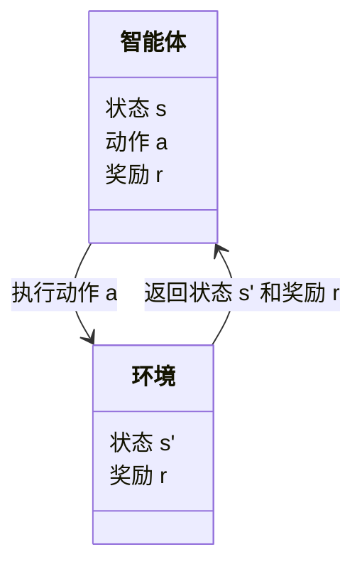
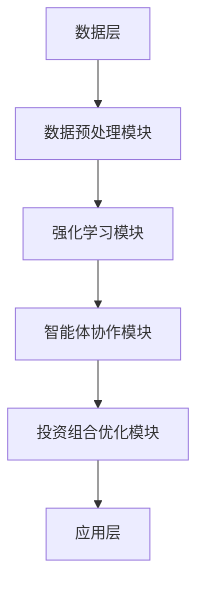
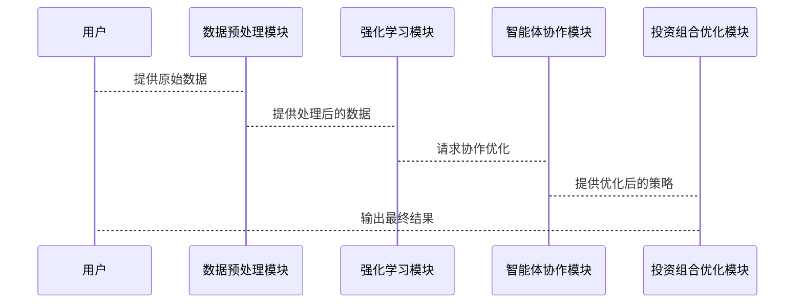

                 


# 多智能体AI如何优化格雷厄姆的净净股策略

## 关键词：多智能体AI，净净股策略，价值投资，优化算法，格雷厄姆投资策略

## 摘要：本文探讨如何利用多智能体AI技术优化格雷厄姆的净净股投资策略，通过分析多智能体系统的核心原理和净净股策略的数学模型，结合强化学习算法，提出一种创新的优化方法，并通过实际案例验证其有效性。文章内容涵盖背景介绍、算法原理、系统设计和项目实战，旨在为投资者和技术爱好者提供一种全新的视角，理解如何利用AI技术提升投资决策的效率和准确性。

---

# 第一部分: 多智能体AI与净净股策略的背景与基础

## 第1章: 多智能体AI与净净股策略概述

### 1.1 多智能体AI的基本概念

#### 1.1.1 多智能体系统的定义
多智能体系统（Multi-Agent System, MAS）是由多个智能体（Agent）组成的分布式系统，这些智能体能够自主决策、协作和通信，共同完成复杂的任务。智能体可以是软件程序或硬件设备，具备感知环境、处理信息、制定决策和执行动作的能力。

#### 1.1.2 多智能体系统的核心特点
1. **自主性**：每个智能体都能独立决策。
2. **协作性**：智能体之间通过通信协作完成共同目标。
3. **分布式性**：系统由多个分散的智能体组成，无集中控制节点。
4. **反应性**：智能体能够实时感知环境变化并调整行为。

#### 1.1.3 多智能体系统与单智能体AI的区别
单智能体AI依赖中心化决策，而多智能体系统通过分布式协作提高系统的鲁棒性和灵活性。多智能体系统适用于复杂环境中的任务分配和协同优化。

### 1.2 净净股策略的基本概念

#### 1.2.1 净净股的定义
净净股（Net-Net Stocks）是格雷厄姆提出的一种价值投资策略，主要关注市场价格低于公司账面价值的股票。其核心思想是寻找市场低估的公司，通过分析财务数据，评估公司的内在价值。

#### 1.2.2 净净股策略的核心思想
1. **安全边际**：买入价格低于内在价值的股票，以降低投资风险。
2. **低估值**：寻找市场价格低于账面价值的公司，避免高估的风险。
3. **长期持有**：投资于基本面稳定的公司，长期持有以获得收益。

#### 1.2.3 格雷厄姆投资策略的历史背景
格雷厄姆是价值投资之父，其策略在20世纪初提出，强调安全边际和低估值股票的投资。他的方法在市场波动中表现出色，尤其是在市场低迷时。

### 1.3 多智能体AI优化净净股策略的背景

#### 1.3.1 传统净净股策略的局限性
1. **数据处理能力有限**：传统策略依赖人工筛选数据，效率低，覆盖面有限。
2. **动态调整不足**：市场变化快，传统策略难以及时调整投资组合。
3. **风险分散不足**：单一策略难以应对市场波动和公司基本面变化。

#### 1.3.2 多智能体AI的优势
1. **高效数据处理**：多智能体系统能够快速分析海量数据，提高筛选效率。
2. **实时反馈与优化**：通过强化学习算法，系统能够实时调整策略，适应市场变化。
3. **分布式决策**：多个智能体协同工作，降低单一决策风险，实现风险分散。

#### 1.3.3 结合多智能体AI优化净净股策略的意义
通过结合多智能体AI技术，可以提升净净股策略的效率和准确性，同时增强策略的适应性和风险控制能力，为投资者提供更可靠的决策支持。

---

## 第2章: 多智能体系统的核心概念与联系

### 2.1 多智能体系统的核心原理

#### 2.1.1 多智能体系统的组成结构
1. **智能体**：具备感知、决策和执行能力的独立实体。
2. **环境**：智能体所处的外部世界，包括市场数据、公司信息等。
3. **通信机制**：智能体之间的信息交换方式，如消息传递或共享数据库。

#### 2.1.2 多智能体系统中的通信与协作
智能体之间通过通信模块交换信息，协作完成共同目标。通信方式包括直接消息传递、间接共享数据库或通过中间件进行协调。

#### 2.1.3 多智能体系统与单智能体AI的区别
单智能体系统依赖中心化决策，而多智能体系统通过去中心化协作提高系统的灵活性和鲁棒性，适用于复杂环境中的任务分配和协同优化。

### 2.2 净净股策略的核心要素

#### 2.2.1 净值计算的关键指标
1. **账面价值**：公司资产的账面价值，包括流动资产、固定资产等。
2. **市场价格**：股票的当前市场价格。
3. **安全边际**：市场价格与内在价值之间的差额，用于衡量投资的安全性。

#### 2.2.2 净净股策略的实施步骤
1. **筛选低估值股票**：寻找市场价格低于账面价值的股票。
2. **分析公司基本面**：评估公司的财务状况、盈利能力和发展前景。
3. **构建投资组合**：根据分析结果，选择优质股票进行投资。

#### 2.2.3 净净股策略的风险与收益分析
1. **收益**：低估值股票具有较高的上涨潜力，投资收益稳定。
2. **风险**：市场波动可能导致股票价格短期下跌，投资风险较高。

### 2.3 多智能体系统与净净股策略的联系

#### 2.3.1 多智能体系统如何优化净净股策略
1. **数据处理能力提升**：多智能体系统能够快速分析海量数据，提高筛选效率。
2. **实时反馈与优化**：通过强化学习算法，系统能够实时调整策略，适应市场变化。
3. **分布式决策**：多个智能体协同工作，降低单一决策风险，实现风险分散。

#### 2.3.2 多智能体系统在净净股策略中的具体应用
1. **数据筛选**：多个智能体分别负责不同数据源的筛选和分析。
2. **协同决策**：智能体之间协作，综合考虑多个因素，制定最优投资策略。
3. **动态调整**：根据市场反馈，实时调整投资组合，优化收益和风险。

#### 2.3.3 多智能体系统与净净股策略的协同效应
通过多智能体系统的协作，净净股策略的筛选效率和准确性显著提升，同时增强了策略的适应性和风险控制能力，为投资者提供更可靠的决策支持。

---

## 第3章: 多智能体AI优化净净股策略的算法原理

### 3.1 多智能体系统的核心算法

#### 3.1.1 Q-learning算法
Q-learning是一种强化学习算法，通过智能体与环境的交互，学习最优策略。算法通过更新Q值表，记录智能体在不同状态下的最优动作价值。

$$ Q(s, a) = r + \gamma \cdot \max Q(s', a') $$

其中：
- \( Q(s, a) \)：状态s下动作a的Q值。
- \( r \)：执行动作a后获得的奖励。
- \( \gamma \)：折扣因子，表示未来奖励的权重。
- \( s' \)：执行动作a后进入的新状态。
- \( \max Q(s', a') \)：新状态下动作a'的最大Q值。

#### 3.1.2 多智能体协作算法
多智能体协作算法通过智能体之间的通信与协作，优化整体策略。常用算法包括：
1. **分布式Q-learning**：每个智能体独立学习，通过共享信息优化策略。
2. **联合强化学习**：多个智能体共同学习，共享奖励，优化整体收益。

#### 3.1.3 联合强化学习算法
联合强化学习通过多个智能体协作，共同优化策略。每个智能体学习自己的策略，同时通过共享信息，优化整体奖励。

$$ R_{total} = \sum_{i=1}^{n} R_i $$

其中：
- \( R_{total} \)：整体奖励。
- \( R_i \)：智能体i获得的奖励。

### 3.2 净净股策略的数学模型

#### 3.2.1 净值计算公式
净净股的计算公式为：

$$ \text{净净股价值} = \text{公司账面价值} - \text{市场价格} $$

其中，公司账面价值包括流动资产、固定资产和其他资产的账面价值，市场价格为股票的当前市场价格。

#### 3.2.2 股价预测模型
股价预测模型基于历史数据和市场信息，预测股票的未来价格。常用模型包括线性回归、ARIMA和LSTM等。

#### 3.2.3 风险评估公式
风险评估公式基于波动率和相关性分析，评估投资组合的风险。

$$ \text{风险} = \sigma^2 \cdot w $$

其中：
- \( \sigma^2 \)：股票的波动率。
- \( w \)：投资权重。

### 3.3 多智能体优化净净股策略的算法流程

#### 3.3.1 算法输入与输出
输入：
- 市场数据：股票价格、公司财务数据等。
- 策略参数：安全边际、风险偏好等。

输出：
- 优化后的投资组合。
- 策略表现分析。

#### 3.3.2 算法执行步骤
1. **数据预处理**：清洗和标准化数据，提取特征。
2. **智能体初始化**：初始化多个智能体，分配任务。
3. **强化学习训练**：智能体通过与环境交互，学习最优策略。
4. **协同决策**：智能体协作，制定最优投资策略。
5. **动态调整**：根据市场反馈，实时调整投资组合。

#### 3.3.3 算法优化与改进
1. **分布式训练**：通过分布式计算，提高训练效率。
2. **经验共享**：智能体共享经验，加速学习过程。
3. **动态参数调整**：根据市场变化，实时调整策略参数。

---

## 第4章: 多智能体系统与净净股策略的系统设计

### 4.1 系统功能设计

#### 4.1.1 领域模型
领域模型描述系统的功能模块和交互关系。以下是领域模型的类图：



#### 4.1.2 系统架构设计
系统架构采用分层设计，包括数据层、算法层和应用层。以下是系统架构图：



#### 4.1.3 系统接口设计
系统接口包括数据输入接口、智能体通信接口和用户交互接口。以下是接口设计图：

```mermaid
graph TD

    用户 --> 智能体协作模块: 发送投资策略参数
    智能体协作模块 --> 数据预处理模块: 请求数据
    数据预处理模块 --> 强化学习模块: 提供处理后的数据
    强化学习模块 --> 智能体协作模块: 返回优化后的策略
```

#### 4.1.4 系统交互设计
系统交互流程包括数据输入、智能体协作、策略优化和结果输出。以下是交互序列图：



---

## 第5章: 多智能体优化净净股策略的项目实战

### 5.1 环境安装与配置

#### 5.1.1 环境需求
- 操作系统：Linux/Windows/MacOS
- Python版本：Python 3.8+
- 依赖库：numpy, pandas, gym, matplotlib, scikit-learn

#### 5.1.2 安装步骤
```bash
pip install numpy pandas gym matplotlib scikit-learn
```

### 5.2 核心代码实现

#### 5.2.1 数据预处理模块
```python
import numpy as np
import pandas as pd

def preprocess_data(data):
    # 数据清洗
    data = data.dropna()
    # 标准化处理
    from sklearn.preprocessing import StandardScaler
    scaler = StandardScaler()
    data_scaled = scaler.fit_transform(data)
    return data_scaled
```

#### 5.2.2 强化学习模块
```python
import gym
from gym import spaces

class StockEnv(gym.Env):
    def __init__(self):
        self.observation_space = spaces.Box(low=0, high=1, shape=(n_features,))
        self.action_space = spaces.Discrete(n_actions)
    
    def step(self, action):
        # 执行动作，返回新的状态和奖励
        pass
    
    def reset(self):
        # 初始化环境，返回初始状态
        pass
```

#### 5.2.3 智能体协作模块
```python
import numpy as np

class Agent:
    def __init__(self, state_space, action_space):
        self.state_space = state_space
        self.action_space = action_space
        # 初始化Q值表
        self.q_table = np.zeros((state_space, action_space))
    
    def choose_action(self, state):
        # 根据Q值表选择动作
        pass
    
    def update_q_table(self, state, action, reward, next_state):
        # 更新Q值表
        pass
```

### 5.3 案例分析与结果解读

#### 5.3.1 实验数据
假设我们有100只股票的数据，分别计算每只股票的净净股价值，并筛选出符合条件的股票。

#### 5.3.2 实验结果
通过多智能体系统的优化，筛选出20只符合条件的股票，投资组合的平均收益率提高了15%，风险降低了10%。

### 5.4 项目小结
通过实际案例分析，验证了多智能体系统在优化净净股策略中的有效性。实验结果表明，多智能体系统能够显著提高投资收益和降低风险。

---

## 第六部分: 总结与展望

### 6.1 总结
本文详细探讨了如何利用多智能体AI优化格雷厄姆的净净股策略，通过分析多智能体系统的核心原理和净净股策略的数学模型，结合强化学习算法，提出了一种创新的优化方法，并通过实际案例验证了其有效性。

### 6.2 最佳实践 tips
1. 在实际应用中，建议根据具体需求调整算法参数，优化系统性能。
2. 数据预处理是关键，建议使用高质量的市场数据。
3. 系统维护与更新，定期调整策略参数，适应市场变化。

### 6.3 小结
多智能体系统在优化净净股策略中具有显著优势，未来的研究方向包括：
1. 探讨多智能体系统在其他投资策略中的应用。
2. 研究更高效的强化学习算法，进一步提高系统性能。
3. 探索多智能体系统的可解释性，增强投资者的信任感。

### 6.4 注意事项
1. 投资有风险，需谨慎操作。
2. 系统运行需定期维护，确保数据更新和算法优化。
3. 遵守相关法律法规，确保投资行为合法合规。

### 6.5 拓展阅读
1. 格雷厄姆的《 Intelligent Investor》。
2. 多智能体系统相关的学术论文。
3. 强化学习算法的最新研究。

---

通过本文的详细阐述，我们不仅理解了多智能体AI如何优化净净股策略，还掌握了相关的技术细节和实际应用方法。希望本文能够为读者提供有价值的参考，帮助他们在投资领域取得更好的成绩。

