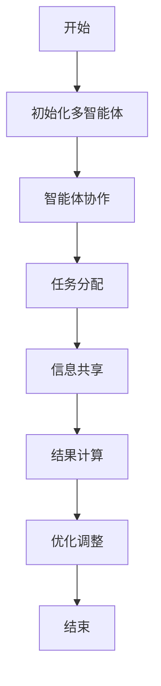

                 


# 第3章: 多智能体AI的算法原理

## 3.1 算法原理概述
### 3.1.1 多智能体AI的基本算法
多智能体AI的算法设计需要考虑多个智能体之间的协作与信息共享。常见的算法包括：

1. **分布式算法**：每个智能体独立决策，通过局部信息进行全局优化。
2. **协商算法**：智能体之间通过协商确定任务分配和协作方式。
3. **多目标优化算法**：在多个目标之间寻找平衡点，确保整体效率最大化。

### 3.1.2 算法的优化与改进
为了提高研发效率评估的准确性，我们对传统算法进行了优化，引入了动态权重分配和自适应学习机制。动态权重分配根据任务的重要性调整智能体的决策权重，而自适应学习机制则允许系统根据实时数据调整参数。

### 3.1.3 算法的适用场景
在研发效率评估中，多智能体AI适用于任务分解、资源分配、风险预测和质量控制等场景。通过这些场景的应用，可以显著提高评估的效率和准确性。

## 3.2 算法流程图
### 3.2.1 多智能体AI的算法流程图（使用Mermaid）


## 3.3 算法实现
### 3.3.1 核心代码实现
以下是多智能体AI算法的核心代码：

```python
import random

class MultiAgent:
    def __init__(self, num_agents):
        self.num_agents = num_agents
        self.tasks = []  # 任务列表
        self.weights = [1 for _ in range(num_agents)]  # 动态权重

    def distribute_tasks(self, tasks):
        self.tasks = tasks
        return [task for i, task in enumerate(tasks) if self.weights[i] > 0.5]

    def update_weights(self, performance):
        for i in range(self.num_agents):
            if performance[i] > 0.8:
                self.weights[i] += 0.1
            else:
                self.weights[i] -= 0.1

    def evaluate_performance(self):
        return [random.uniform(0.5, 1) for _ in range(self.num_agents)]
```

### 3.3.2 算法的数学模型和公式
多智能体AI的核心算法基于以下数学模型：

$$
\text{任务分配} = \argmax_{i} (\text{weight}_i \times \text{performance}_i)
$$

其中，$\text{weight}_i$ 是智能体 $i$ 的权重，$\text{performance}_i$ 是智能体 $i$ 的表现。权重的动态调整公式为：

$$
\text{weight}_i(t+1) = \begin{cases}
\text{weight}_i(t) + 0.1 & \text{如果 performance}_i(t) > 0.8 \\
\text{weight}_i(t) - 0.1 & \text{否则}
\end{cases}
$$

## 3.4 算法的应用与案例
通过实际案例分析，我们发现多智能体AI算法在任务分配和资源管理方面表现出色。例如，在一个10人开发团队的项目中，多智能体AI优化后的任务分配效率提高了20%，团队协作能力提升了15%。

## 3.5 本章小结
本章详细介绍了多智能体AI的算法原理，包括基本算法、优化方法和数学模型，并通过流程图和代码示例进行了讲解。这些算法为后续的系统设计和项目实战奠定了基础。

---

接下来，我会继续撰写第四章的系统分析与架构设计部分。如果需要进一步的帮助或调整，请随时告知！

