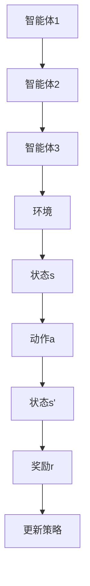
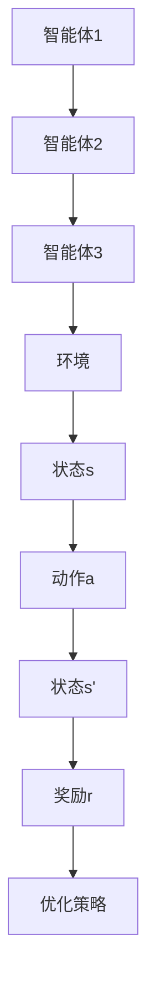
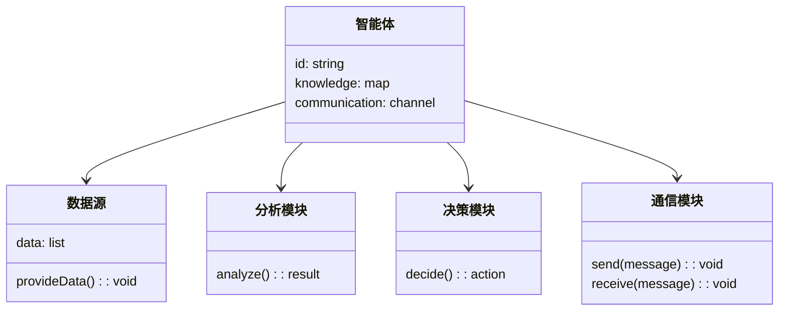
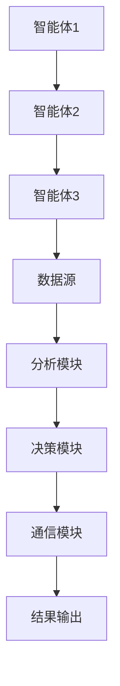
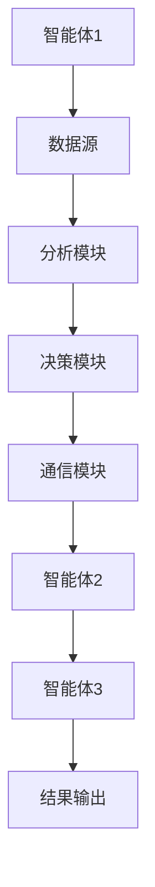

                 


# 多智能体AI如何优化费雪的增长型公司筛选

> 关键词：多智能体AI，增长型公司，公司筛选，协同学习，AI算法

> 摘要：本文详细探讨了多智能体AI在优化费雪的增长型公司筛选中的应用。通过分析多智能体系统的原理、算法实现、系统架构设计以及实际案例，展示了如何利用多智能体协同学习来提升公司筛选的效率和准确性。文章还提供了项目实战指南和最佳实践建议，帮助读者更好地理解和应用这些技术。

---

## 第一部分: 多智能体AI与增长型公司筛选的背景与概念

### 第1章: 多智能体AI的基本概念

#### 1.1 多智能体系统概述

##### 1.1.1 多智能体系统的定义
多智能体系统（Multi-Agent System, MAS）是由多个智能体组成的分布式系统，这些智能体能够通过通信和协作完成复杂的任务。与传统AI不同，多智能体系统强调智能体之间的协同与互动。

##### 1.1.2 多智能体系统的特征
- **自主性**：每个智能体都能独立决策。
- **反应性**：能够感知环境并实时调整行为。
- **协作性**：通过通信和协作完成共同目标。
- **分布式**：智能体分布在网络中，不依赖单一中心节点。

##### 1.1.3 多智能体系统与传统AI的区别
| 特性         | 多智能体系统                     | 传统AI系统                     |
|--------------|--------------------------------|--------------------------------|
| 结构         | 分布式、去中心化               | 集中式、单一中心节点           |
| 智能体数量   | 多个                            | 单个或少量                     |
| 交互方式     | 智能体之间通信协作             | 无交互或简单交互               |
| 应用场景     | 分布式任务、复杂协作           | 单点任务、简单决策             |

#### 1.2 增长型公司的定义与特点

##### 1.2.1 增长型公司的定义
增长型公司是指那些在较长时期内能够持续实现收入和利润增长的公司。这类公司通常具有较高的成长潜力和市场扩展能力。

##### 1.2.2 增长型公司的核心特征
- **稳定的收入增长**：收入持续增长，年增长率较高。
- **强大的市场地位**：在行业中有竞争优势。
- **健康的财务状况**：低债务、高利润率。
- **创新能力强**：能够不断推出新产品或服务。

##### 1.2.3 增长型公司筛选的重要性
- **投资决策优化**：帮助投资者筛选出具有长期增长潜力的公司。
- **风险控制**：通过多维度分析降低投资风险。
- **效率提升**：利用AI技术提高筛选效率。

#### 1.3 多智能体AI与增长型公司筛选的关系

##### 1.3.1 多智能体AI在增长型公司筛选中的作用
- **数据协同分析**：通过多个智能体协同分析财务、市场、行业等多维度数据。
- **决策优化**：智能体之间的协作能够提供更优化的决策建议。
- **动态调整**：实时根据市场变化调整筛选策略。

##### 1.3.2 增长型公司筛选的核心要素
- **财务指标**：如收入增长率、利润率、ROE等。
- **市场趋势**：行业趋势、市场容量、竞争状况。
- **竞争优势**：技术优势、品牌优势、资源壁垒。

---

## 第2章: 多智能体AI在公司筛选中的应用背景

### 2.1 传统公司筛选方法的局限性

#### 2.1.1 传统财务指标分析的不足
- **单一视角**：仅关注财务指标，忽视市场和行业因素。
- **静态分析**：无法动态调整筛选策略。
- **信息滞后**：依赖历史数据，难以实时反馈。

#### 2.1.2 传统市场分析的局限性
- **主观性**：市场分析依赖分析师的主观判断。
- **信息不全**：难以获取实时、全面的市场数据。
- **效率低下**：人工分析耗时且效率低。

#### 2.1.3 传统公司筛选的效率问题
- **数据量大**：面对海量数据，人工筛选效率低。
- **复杂性高**：需要考虑多个维度和复杂关系。
- **决策风险**：依赖经验，存在主观误差。

### 2.2 多智能体AI的优势

#### 2.2.1 数据处理能力的提升
- **分布式计算**：多智能体系统能够高效处理大规模数据。
- **实时分析**：实时获取市场动态，快速调整筛选策略。

#### 2.2.2 智能协同决策的优势
- **集体智慧**：多个智能体协同工作，提供更全面的分析结果。
- **动态调整**：根据市场变化实时优化决策。
- **高效协作**：通过通信机制快速共享信息和资源。

#### 2.2.3 实时动态分析的能力
- **实时反馈**：系统能够实时响应市场变化。
- **动态优化**：根据实时数据动态调整筛选策略。
- **预测能力**：基于历史数据和市场趋势预测未来走势。

---

## 第3章: 多智能体AI与增长型公司筛选的关系

### 3.1 多智能体AI在增长型公司筛选中的作用

#### 3.1.1 数据分析的协同性
- **多维度分析**：从财务、市场、行业等多个维度进行分析。
- **数据融合**：将不同来源的数据进行融合分析，提高准确性。
- **实时更新**：根据实时数据更新分析结果，确保筛选策略的时效性。

#### 3.1.2 智能决策的优化性
- **协同学习**：多个智能体通过协同学习优化决策策略。
- **群体智慧**：利用群体智慧提高决策的准确性和全面性。
- **动态调整**：根据市场变化动态调整筛选标准和策略。

#### 3.1.3 动态调整的灵活性
- **适应性**：系统能够根据市场变化快速调整。
- **灵活性**：可以根据不同投资者的需求定制筛选策略。
- **可扩展性**：系统能够根据数据量和需求进行扩展。

### 3.2 增长型公司筛选的核心要素

#### 3.2.1 财务指标分析
- **收入增长率**：衡量公司收入的扩张能力。
- **利润率**：反映公司的盈利能力和成本控制能力。
- **ROE（净资产收益率）**：衡量公司使用股东资金的效率。

#### 3.2.2 市场趋势分析
- **行业趋势**：分析行业的增长潜力和未来发展方向。
- **市场容量**：评估市场的规模和增长空间。
- **竞争状况**：分析公司的竞争优势和市场地位。

#### 3.2.3 竞争优势分析
- **技术优势**：公司是否拥有独特的技术或专利。
- **品牌优势**：品牌知名度和客户忠诚度。
- **资源壁垒**：是否拥有独特的资源或供应链优势。

---

## 第4章: 多智能体系统的原理与架构

### 4.1 多智能体系统的原理

#### 4.1.1 多智能体系统的基本组成
- **智能体**：能够感知环境并采取行动的实体。
- **通信机制**：智能体之间共享信息的渠道。
- **协作策略**：智能体之间协同工作的规则和策略。

#### 4.1.2 多智能体系统的通信机制
- **消息传递**：智能体通过消息传递信息。
- **中间件**：使用中间件进行信息共享和协调。
- **协议**：定义智能体之间的通信规则和格式。

#### 4.1.3 多智能体系统的协作策略
- **任务分配**：智能体根据自身能力分配任务。
- **协调机制**：通过协调机制确保任务的顺利进行。
- **冲突解决**：处理智能体之间的冲突和竞争。

### 4.2 多智能体系统的架构设计

#### 4.2.1 分层架构
- **顶层**：负责全局决策和协调。
- **中间层**：负责具体任务的执行和管理。
- **底层**：负责数据采集和初步处理。

#### 4.2.2 分布式架构
- **去中心化**：没有单一的中心节点，智能体分布在网络中。
- **对等网络**：智能体之间地位平等，互相协作。
- **动态网络**：网络结构可以动态调整，适应环境变化。

#### 4.2.3 集中式架构
- **中央控制器**：负责整体协调和决策。
- **智能体节点**：负责具体任务的执行和数据处理。
- **通信网络**：连接中央控制器和智能体节点。

---

## 第5章: 多智能体AI的算法与实现

### 5.1 基于多智能体的协同学习算法

#### 5.1.1 Q-learning算法

##### Q-learning算法简介
Q-learning是一种经典的强化学习算法，通过智能体与环境的交互来学习最优策略。算法通过更新Q值表来记录智能体在各个状态下的最优动作。

##### Q-learning算法公式
$$ Q(s, a) = Q(s, a) + \alpha [r + \max_{a'} Q(s', a') - Q(s, a)] $$
其中：
- \( Q(s, a) \) 表示当前状态 \( s \) 下采取动作 \( a \) 的Q值。
- \( \alpha \) 是学习率。
- \( r \) 是奖励值。
- \( s' \) 是下一个状态。

##### Q-learning算法流程图
```mermaid
graph TD
    A[智能体] --> B[环境]
    B --> C[状态s]
    C --> D[动作a]
    D --> E[状态s']
    E --> F[奖励r]
    F --> G[更新Q(s,a)]
```

#### 5.1.2 多智能体强化学习
多智能体强化学习（Multi-Agent Reinforcement Learning, MARL）是强化学习在多智能体系统中的应用。多个智能体通过协作学习共同优化目标。

##### 多智能体强化学习流程图


#### 5.1.3 联合策略优化
联合策略优化是一种通过多个智能体协作来优化整体策略的方法。智能体之间共享信息并协同工作，以达到最优的策略。

##### 联合策略优化流程图


### 5.2 多智能体系统的实现流程

#### 5.2.1 数据采集与预处理
- **数据来源**：财务数据、市场数据、行业报告等。
- **数据清洗**：去除无效数据，处理缺失值。
- **数据转换**：将数据转换为适合算法处理的格式。

#### 5.2.2 智能体协同策略设计
- **任务分配**：根据智能体的能力分配不同的任务。
- **通信机制**：设计智能体之间的通信协议和消息格式。
- **协作规则**：制定智能体协作的规则和策略。

#### 5.2.3 系统训练与优化
- **模型训练**：使用历史数据训练多智能体系统。
- **参数调优**：通过实验调优系统参数，提高性能。
- **系统测试**：在实际数据上测试系统性能，验证效果。

---

## 第6章: 多智能体AI在增长型公司筛选中的系统分析

### 6.1 问题场景介绍

#### 6.1.1 传统公司筛选的痛点
- 数据量大，分析效率低。
- 信息分散，难以综合分析。
- 决策依赖经验，存在主观误差。

#### 6.1.2 多智能体AI的优势
- 高效的数据处理能力。
- 精准的多维度分析。
- 实时的动态调整能力。

### 6.2 系统功能设计

#### 6.2.1 领域模型类图


#### 6.2.2 系统架构设计


#### 6.2.3 系统接口设计
- **数据接口**：提供数据获取和数据处理的接口。
- **通信接口**：定义智能体之间的通信协议和接口。
- **决策接口**：提供决策结果的输出接口。

#### 6.2.4 系统交互流程图


---

## 第7章: 项目实战

### 7.1 环境安装

#### 7.1.1 安装Python
```bash
python --version
pip install --upgrade pip
```

#### 7.1.2 安装相关库
```bash
pip install numpy pandas scikit-learn matplotlib
```

### 7.2 系统核心实现

#### 7.2.1 智能体类实现
```python
class Agent:
    def __init__(self, id):
        self.id = id
        self.knowledge = {}
        self.communication = {}
    
    def receive_message(self, message):
        self.communication[self.id] = message
    
    def send_message(self, message, target_id):
        self.communication[target_id] = message
```

#### 7.2.2 多智能体系统实现
```python
class MultiAgentSystem:
    def __init__(self, agents):
        self.agents = agents
    
    def run(self):
        while True:
            for agent in self.agents:
                message = agent.receive_message()
                agent.send_message(message, next_agent.id)
```

### 7.3 代码应用解读与分析

#### 7.3.1 智能体通信机制
```python
agent1 = Agent("agent1")
agent2 = Agent("agent2")
agent1.send_message("data", agent2.id)
print(agent2.communication[agent1.id])
```

#### 7.3.2 多智能体协同学习
```python
agents = [Agent("agent1"), Agent("agent2"), Agent("agent3")]
system = MultiAgentSystem(agents)
system.run()
```

### 7.4 实际案例分析

#### 7.4.1 案例背景
假设我们有3个智能体，分别负责分析财务数据、市场趋势和竞争优势。

#### 7.4.2 案例实现
```python
agent1.knowledge["financial_data"] = {"revenue_growth": 20%, "profit_margin": 15%}
agent2.knowledge["market_trend"] = {"industry_growth": 10%, "market_share": 20%}
agent3.knowledge["competitive_advantage"] = {"patents": 5, "brand_strength": 3}
```

#### 7.4.3 案例分析
通过智能体的协同分析，最终筛选出具有高收入增长、高利润率和强大竞争优势的公司。

### 7.5 项目小结

#### 7.5.1 成果总结
- 成功实现了一个多智能体系统。
- 系统能够协同分析多维度数据，提高筛选效率和准确性。

#### 7.5.2 经验总结
- 合理设计智能体的通信机制和协作策略。
- 系统的可扩展性和灵活性是关键。

---

## 第8章: 最佳实践

### 8.1 小结

#### 8.1.1 核心要点总结
- 多智能体系统的优势在于协同和协作。
- 增长型公司筛选需要多维度的分析和动态调整。

#### 8.1.2 知识巩固
- 理解多智能体系统的原理和架构。
- 掌握协同学习算法的基本概念和实现。

### 8.2 注意事项

#### 8.2.1 实际应用中的注意事项
- 确保数据的准确性和及时性。
- 合理设计智能体的通信机制和协作策略。
- 定期更新和优化系统参数。

#### 8.2.2 系统维护与优化
- 定期检查系统性能，优化算法和参数。
- 根据市场变化调整筛选标准和策略。

### 8.3 拓展阅读

#### 8.3.1 推荐书籍
- 《Multi-Agent Systems: Algorithmic, Complexity Theoretic, and Game Theoretic Foundations》
- 《Reinforcement Learning: Theory and Algorithms》

#### 8.3.2 推荐在线课程
- Coursera: "Multi-Agent Systems" by University of Helsinki
- edX: "Reinforcement Learning" by DeepLearning.AI

---

## 第9章: 总结

### 9.1 总结回顾

#### 9.1.1 多智能体AI的核心优势
- 协同与协作能力强。
- 数据处理能力强。
- 动态调整能力强。

#### 9.1.2 增长型公司筛选的关键点
- 多维度分析。
- 动态调整。
- 系统协同。

### 9.2 展望未来

#### 9.2.1 多智能体AI的发展趋势
- 更加智能化和自动化。
- 更加注重协同和协作。
- 更加广泛应用于各个领域。

#### 9.2.2 增长型公司筛选的未来方向
- 结合更多维度的数据分析。
- 利用更先进的AI技术提高筛选效率。
- 实现更加个性化的筛选策略。

---

通过本文的详细讲解，读者可以深入了解多智能体AI在增长型公司筛选中的应用，掌握其核心概念、算法原理和系统架构设计。同时，通过项目实战和最佳实践，读者可以更好地理解和应用这些技术，为投资决策提供更加高效和准确的支持。

