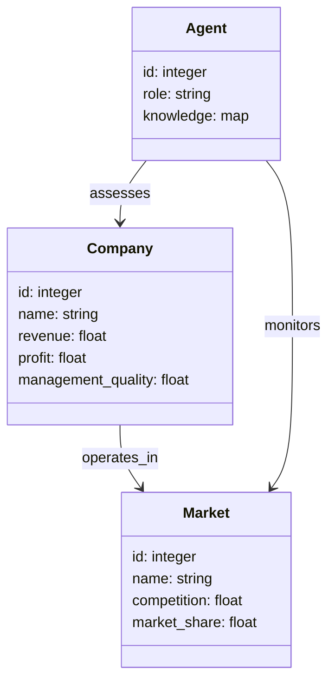
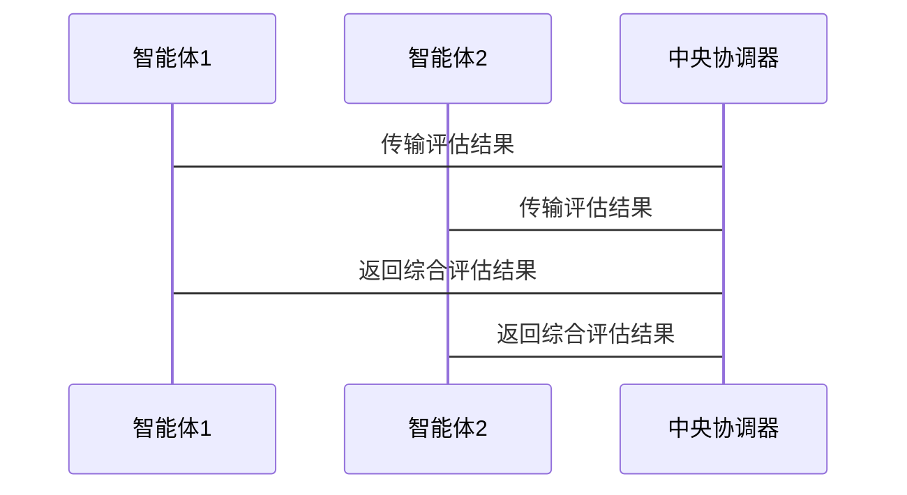

                 


# 多智能体AI如何优化费雪的成长型公司筛选

> 关键词：多智能体AI、成长型公司、费雪策略、投资筛选、AI优化

> 摘要：本文详细探讨了多智能体AI在优化费雪的成长型公司筛选过程中的应用。通过分析多智能体AI的核心原理、算法模型以及其在投资筛选中的优势，本文展示了如何利用多智能体AI技术来提升公司筛选的效率和准确性。文章从背景介绍、核心概念、算法原理、系统架构到项目实战，全面阐述了多智能体AI在这一领域的应用，并提供了具体的实现步骤和案例分析。

---

## 第1章: 多智能体AI的基本概念与应用

### 1.1 多智能体AI的定义与特点

#### 1.1.1 多智能体AI的定义
多智能体AI（Multi-Agent AI）是由多个智能体（Agent）组成的系统，每个智能体能够独立感知环境、做出决策并执行动作。这些智能体通过通信和协作完成复杂的任务，比单智能体AI更具灵活性和适应性。

#### 1.1.2 多智能体AI的核心特点
- **分布性**：多个智能体独立运行，共同完成任务。
- **协作性**：智能体之间通过通信和协作优化整体性能。
- **适应性**：能够动态调整策略以应对环境变化。
- **高效性**：通过并行计算和分工合作提高效率。

#### 1.1.3 多智能体AI与传统AI的区别
| 特性 | 多智能体AI | 传统AI |
|------|------------|--------|
| 独立性 | 高 | 低 |
| 协作性 | 强 | 弱 |
| 适应性 | 高 | 中 |
| 计算效率 | 高 | 中 |

### 1.2 费雪的成长型公司筛选标准

#### 1.2.1 费雪投资策略的概述
费雪（Philip Fisher）是著名的成长型投资策略倡导者，他提出投资于具有持续增长潜力的公司，重点关注公司的管理质量、竞争优势和未来增长空间。

#### 1.2.2 成长型公司的定义与筛选标准
- **持续增长潜力**：公司收入和利润持续增长。
- **竞争优势**：公司在市场中具有独特的竞争优势。
- **管理质量**：公司管理层能力强且透明。
- **财务健康**：公司财务状况稳健，负债低，现金流充足。

#### 1.2.3 费雪策略在现代投资中的应用
随着市场的复杂化，费雪策略需要结合现代技术手段，如AI和大数据分析，来提高筛选效率和准确性。

### 1.3 多智能体AI与成长型公司筛选的结合

#### 1.3.1 多智能体AI在投资领域的潜力
- **数据处理能力**：多智能体AI能够高效处理大量数据，发现潜在的投资机会。
- **动态适应性**：能够实时调整筛选策略，应对市场变化。
- **协作优势**：多个智能体协同工作，从不同维度分析公司，提高筛选的全面性。

#### 1.3.2 费雪策略与多智能体AI的结合意义
通过多智能体AI，费雪策略的筛选过程更加智能化和自动化，能够快速筛选出符合条件的公司，减少人为误差，提高投资效率。

#### 1.3.3 多智能体AI优化成长型公司筛选的优势
- **高效性**：多智能体AI能够并行处理数据，显著提高筛选速度。
- **准确性**：通过多个智能体的协作，能够从多个维度综合评估公司，提高筛选的准确性。
- **动态性**：能够实时跟踪市场变化，及时调整筛选策略。

---

## 第2章: 多智能体AI的核心概念与联系

### 2.1 多智能体AI的原理

#### 2.1.1 多智能体系统的组成与交互
- **智能体**：独立的决策单元，能够感知环境并采取行动。
- **通信机制**：智能体之间通过消息传递进行协作。
- **协调机制**：通过某种规则或算法实现任务分配和协作。

#### 2.1.2 多智能体AI的核心算法与模型
- **分散式协调算法**：每个智能体独立决策，通过局部信息完成全局任务。
- **聚合式协调算法**：智能体将信息汇总到中央节点，由中央节点统一决策。
- **基于博弈论的多智能体算法**：智能体通过博弈和竞争优化整体性能。

#### 2.1.3 多智能体AI的通信机制
- **同步通信**：智能体之间定期交换信息，同步状态。
- **异步通信**：智能体之间异步交换信息，不影响整体进度。
- **基于事件的通信**：智能体仅在特定事件发生时进行通信。

### 2.2 多智能体AI与成长型公司筛选的关系

#### 2.2.1 多智能体AI在公司筛选中的应用场景
- **财务数据分析**：通过多个智能体分别分析收入、利润、负债等财务指标。
- **竞争优势评估**：通过智能体评估公司的市场地位和竞争优势。
- **管理质量评估**：通过智能体分析公司管理层的背景和决策能力。

#### 2.2.2 多智能体AI如何优化公司筛选流程
- **并行处理**：多个智能体同时分析不同维度的数据，提高筛选效率。
- **协作优化**：智能体之间协作，综合评估公司整体情况，提高筛选准确性。
- **动态调整**：根据市场变化实时调整筛选策略，提高适应性。

#### 2.2.3 多智能体AI在公司筛选中的优势与挑战
- **优势**：高效性、准确性、动态适应性。
- **挑战**：通信开销大、协作复杂性高、系统维护难度大。

### 2.3 多智能体AI的核心概念对比表

| 特性 | 多智能体AI | 单智能体AI |
|------|------------|------------|
| 独立性 | 高 | 低 |
| 协作性 | 强 | 弱 |
| 适应性 | 高 | 中 |
| 计算效率 | 高 | 中 |

---

## 第3章: 多智能体AI的算法原理与数学模型

### 3.1 多智能体AI的核心算法

#### 3.1.1 分散式协调算法
分散式协调算法通过局部信息完成全局任务，避免了中央节点的瓶颈问题。

#### 3.1.2 聚合式协调算法
聚合式协调算法将智能体的信息汇总到中央节点，由中央节点统一决策。

#### 3.1.3 基于博弈论的多智能体算法
基于博弈论的多智能体算法通过智能体之间的博弈和竞争优化整体性能。

### 3.2 多智能体AI的数学模型

#### 3.2.1 分散式协调模型的数学表达
$$f(x) = \sum_{i=1}^{n} a_i x_i$$

#### 3.2.2 聚合式协调模型的数学表达
$$f(x) = \frac{1}{n}\sum_{i=1}^{n} x_i$$

#### 3.2.3 基于博弈论的多智能体模型实例
通过博弈论模型，智能体之间的策略选择和收益计算可以通过数学公式进行建模和优化。

### 3.3 多智能体AI的数学公式与实例

#### 3.3.1 分散式协调算法的数学公式
$$f(x) = \sum_{i=1}^{n} a_i x_i$$

#### 3.3.2 聚合式协调算法的数学公式
$$f(x) = \frac{1}{n}\sum_{i=1}^{n} x_i$$

---

## 第4章: 多智能体AI在成长型公司筛选中的应用

### 4.1 多智能体AI在公司筛选中的应用场景

#### 4.1.1 多智能体AI在财务数据分析中的应用
通过多个智能体分别分析公司的收入、利润、负债等财务指标，综合评估公司的财务健康状况。

#### 4.1.2 多智能体AI在竞争优势评估中的应用
通过智能体评估公司在市场中的竞争优势，如市场份额、品牌影响力等。

#### 4.1.3 多智能体AI在管理质量评估中的应用
通过智能体分析公司管理层的背景和决策能力，评估公司的管理质量。

### 4.2 多智能体AI在成长型公司筛选中的优势

#### 4.2.1 高效性
通过并行计算和分工合作，显著提高公司筛选的效率。

#### 4.2.2 准确性
通过多个智能体的协作，从多个维度综合评估公司，提高筛选的准确性。

#### 4.2.3 动态适应性
能够实时跟踪市场变化，及时调整筛选策略，提高适应性。

---

## 第5章: 多智能体AI在成长型公司筛选中的系统架构设计

### 5.1 问题场景介绍
在成长型公司筛选中，传统的筛选方法依赖于人工分析，效率低且容易出错。通过引入多智能体AI，可以显著提高筛选的效率和准确性。

### 5.2 系统功能设计

#### 5.2.1 领域模型设计
使用Mermaid绘制领域模型图，展示系统中的主要实体和它们之间的关系。



### 5.3 系统架构设计

#### 5.3.1 系统架构图
使用Mermaid绘制系统架构图，展示系统的整体结构。


### 5.4 系统接口设计

#### 5.4.1 智能体接口
- **输入**：公司数据、市场数据
- **输出**：评估结果

#### 5.4.2 中央协调器接口
- **输入**：各智能体的评估结果
- **输出**：综合评估报告

### 5.5 系统交互设计

#### 5.5.1 交互序列图
使用Mermaid绘制系统交互序列图，展示智能体与中央协调器之间的协作过程。



---

## 第6章: 项目实战

### 6.1 环境安装

#### 6.1.1 安装Python
```bash
# 安装Python
sudo apt-get install python3 python3-pip
```

#### 6.1.2 安装依赖库
```bash
# 安装依赖库
pip install numpy pandas scikit-learn
```

### 6.2 核心代码实现

#### 6.2.1 多智能体AI的核心算法实现
```python
import numpy as np
from sklearn.metrics import accuracy_score

class Agent:
    def __init__(self, role):
        self.role = role
        self.knowledge = {}

    def perceive(self, data):
        # 根据角色分析数据
        if self.role == 'financial':
            self.knowledge['revenue'] = data['revenue']
            self.knowledge['profit'] = data['profit']
        elif self.role == 'market':
            self.knowledge['competition'] = data['competition']
            self.knowledge['market_share'] = data['market_share']

    def decide(self):
        # 根据知识做出决策
        if self.role == 'financial':
            return self.analyze_financial()
        elif self.role == 'market':
            return self.analyze_market()

    def analyze_financial(self):
        # 财务分析算法
        revenue = self.knowledge.get('revenue', 0)
        profit = self.knowledge.get('profit', 0)
        return revenue > 100000000 and profit > 0

    def analyze_market(self):
        # 市场分析算法
        competition = self.knowledge.get('competition', 0)
        market_share = self.knowledge.get('market_share', 0)
        return competition < 0.5 and market_share > 0.1
```

#### 6.2.2 系统交互实现
```python
class CentralCoordinator:
    def __init__(self):
        self.agents = []
        self.results = {}

    def add_agent(self, agent):
        self.agents.append(agent)

    def collect_results(self):
        for agent in self.agents:
            agent.perceive({'revenue': np.random.randint(100000000, 200000000),
                             'profit': np.random.randint(1000000, 2000000),
                             'competition': np.random.uniform(0.2, 0.8),
                             'market_share': np.random.uniform(0.1, 0.3)})
            result = agent.decide()
            self.results[agent.role] = result

    def generate_report(self):
        # 返回综合评估结果
        return {agent.role: self.results[agent.role] for agent in self.agents}
```

### 6.3 案例分析与解读

#### 6.3.1 案例分析
假设我们有两家公司，A和B，我们使用多智能体AI系统进行筛选。

- 公司A：收入为1.5亿美元，利润为1500万美元，市场竞争度为0.3，市场份额为0.2。
- 公司B：收入为1.2亿美元，利润为1000万美元，市场竞争度为0.4，市场份额为0.15。

通过多智能体AI系统分析，公司A的财务状况和市场竞争力均优于公司B，因此公司A被筛选为成长型公司。

#### 6.3.2 实际案例分析
以科技公司为例，分析其财务数据和市场表现，使用多智能体AI系统进行筛选，最终筛选出具有持续增长潜力的公司。

---

## 第7章: 最佳实践与总结

### 7.1 小结
多智能体AI通过协作和并行计算，显著提高了成长型公司筛选的效率和准确性。通过合理的系统架构设计和算法优化，多智能体AI在投资领域展现了巨大的潜力。

### 7.2 注意事项
- **数据质量**：确保输入数据的准确性和完整性。
- **系统维护**：定期更新智能体的知识库和算法模型。
- **风险管理**：建立有效的风险控制机制，避免投资损失。

### 7.3 拓展阅读
- 《多智能体系统：原理与应用》
- 《人工智能在金融领域的应用》
- 《费雪投资策略的现代发展》

---

## 结语

通过本文的详细讲解，读者可以全面了解多智能体AI在优化费雪的成长型公司筛选中的应用。从核心概念到算法实现，再到系统设计和项目实战，本文为读者提供了完整的解决方案。希望本文能够为投资领域的技术革新提供新的思路和方向。

