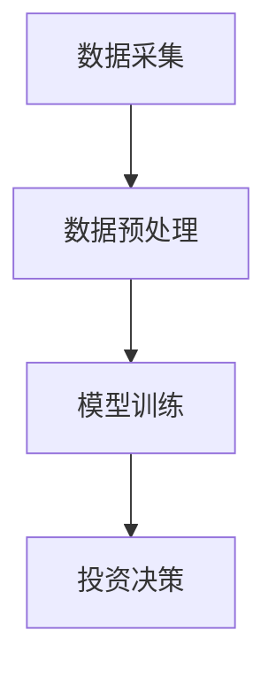

                 


# 多智能体AI如何增强价值投资的全球化视野

> 关键词：多智能体AI、价值投资、全球化、投资决策、智能系统

> 摘要：随着全球化的深入，价值投资需要更广阔的视野和更高效的决策工具。多智能体AI通过其分布式计算和协作机制，为价值投资提供了全新的可能性。本文将详细探讨多智能体AI的核心概念、算法原理、系统架构以及在全球化投资中的实际应用，帮助投资者更好地理解和应用这一技术。

---

## 第一部分: 多智能体AI与价值投资的背景介绍

### 第1章: 多智能体AI的基本概念

#### 1.1 多智能体AI的定义
多智能体AI是一种由多个智能体组成的分布式系统，这些智能体通过协作和竞争完成复杂的任务。与传统AI不同，多智能体AI强调个体间的交互和信息共享，能够处理更复杂的问题。

#### 1.2 多智能体AI的核心特征
- **分布式计算**：多个智能体协同工作，每个智能体负责不同的任务。
- **协作与竞争**：智能体之间可以协作完成目标，也可以通过竞争优化决策。
- **自适应性**：系统能够根据环境变化自动调整策略。

#### 1.3 多智能体AI与传统AI的区别
| 特性       | 多智能体AI                            | 传统AI                              |
|------------|--------------------------------------|--------------------------------------|
| 结构       | 分布式，多个智能体协作                | 单一智能体，集中处理                |
| 交互       | 智能体之间有复杂的交互               | 智能体之间无交互                   |
| 灵活性       | 高，适应复杂环境                   | 较低，依赖预设规则和数据结构         |

### 第2章: 价值投资的基本概念

#### 2.1 价值投资的定义
价值投资是一种投资策略，强调以低于市场价买入具有内在价值的资产，长期持有，等待其价值回归。

#### 2.2 价值投资的核心原则
- **安全边际**：买入价格低于内在价值。
- **长期视角**：关注企业的长期盈利能力。
- **分散投资**：降低风险。

#### 2.3 多智能体AI在价值投资中的应用
多智能体AI可以通过分析全球市场数据，识别潜在投资机会，优化投资组合，帮助投资者做出更明智的决策。

---

## 第二部分: 多智能体AI的核心概念与价值投资的联系

### 第3章: 多智能体AI的核心概念

#### 3.1 多智能体系统的组成
- **智能体**：独立决策的个体。
- **通信机制**：智能体之间的信息交换。
- **协作机制**：智能体协同完成任务的方式。

#### 3.2 多智能体系统中的协作与竞争
协作可以提高系统的整体效率，而竞争则有助于优化个体决策。例如，在投资决策中，不同智能体可以分别负责风险评估和收益预测，通过协作得出最优投资策略。

### 第4章: 多智能体AI与价值投资的结合

#### 4.1 全球化投资的复杂性
- **多市场分析**：需要同时关注多个市场的动态。
- **风险分散**：需要在全球范围内配置资产。
- **实时决策**：需要快速响应市场变化。

#### 4.2 多智能体AI在价值投资中的应用
- **市场分析**：智能体可以实时分析全球市场的数据，识别投资机会。
- **风险控制**：通过协作，智能体可以评估不同资产的风险，优化投资组合。
- **决策优化**：通过竞争和协作，智能体可以得出最优的投资策略。

---

## 第三部分: 多智能体AI的算法原理与数学模型

### 第5章: 多智能体AI的算法原理

#### 5.1 分布式计算与协作机制
多智能体AI通过分布式计算实现协作，每个智能体负责不同的任务，并通过通信机制共享信息。

#### 5.2 通信协议
智能体之间的通信需要遵循特定的协议，例如使用消息队列或事件驱动机制。

#### 5.3 决策算法
智能体根据接收到的信息，使用强化学习或博弈论算法做出决策。

### 第6章: 价值投资的数学模型

#### 6.1 投资组合优化
目标是最大化收益，同时最小化风险。

$$ \text{目标函数：} \max \sum_{i=1}^{n} w_i r_i - \lambda \sum_{i=1}^{n} w_i^2 $$

其中，$w_i$是资产$i$的权重，$r_i$是预期收益，$\lambda$是风险厌恶系数。

#### 6.2 风险评估
使用马科维茨的有效组合理论，计算投资组合的风险。

$$ \text{风险：} \sigma^2 = \sum_{i=1}^{n} \sum_{j=1}^{n} w_i w_j \sigma_{ij} $$

其中，$\sigma_{ij}$是资产$i$和$j$之间的协方差。

---

## 第四部分: 多智能体AI的系统架构与全球化投资的实现

### 第7章: 多智能体AI的系统架构

#### 7.1 系统模块划分
- 数据采集模块：收集全球市场数据。
- 分析模块：使用多智能体算法分析数据。
- 决策模块：生成投资策略。

#### 7.2 系统功能设计
- 数据预处理：清洗和标准化数据。
- 模型训练：训练多智能体AI模型。
- 投资决策：生成投资建议。

#### 7.3 系统架构图


### 第8章: 全球化投资的实现

#### 8.1 投资环境分析
分析全球经济趋势、政策变化和市场波动。

#### 8.2 投资组合优化
根据多智能体AI的分析结果，优化投资组合。

#### 8.3 风险管理
实时监控投资组合的风险，调整策略。

---

## 第五部分: 项目实战

### 第9章: 项目实战

#### 9.1 环境配置
安装Python、NumPy、Pandas和Scikit-learn库。

#### 9.2 核心代码实现
```python
import numpy as np
import pandas as pd
from sklearn.metrics import mean_squared_error

def multi_agent_algorithm(data):
    # 分配任务给多个智能体
    agents = 5
    agent_data = np.array_split(data, agents)
    # 每个智能体进行预测
    predictions = [process_data(agent) for agent in agent_data]
    # 合并预测结果
    combined_predictions = combine_predictions(predictions)
    return combined_predictions

def process_data(agent):
    # 具体的处理逻辑
    return agent.mean()

def combine_predictions(predictions):
    # 合并预测结果
    return np.mean(predictions)
```

#### 9.3 案例分析
分析某个市场的历史数据，展示多智能体AI如何优化投资组合。

#### 9.4 项目总结
总结项目成果，分析多智能体AI在实际投资中的优势。

---

## 第六部分: 总结与展望

### 第10章: 总结

多智能体AI为价值投资提供了全新的工具和方法，通过协作和竞争，能够更高效地分析全球市场，优化投资决策。

### 第11章: 未来展望

未来，随着AI技术的不断发展，多智能体AI在价值投资中的应用将更加广泛，可能实现更复杂的协作和决策机制。

---

通过以上步骤，我们详细介绍了多智能体AI在价值投资中的应用，从理论到实践，帮助投资者更好地理解这一技术，并在全球化视野下做出更明智的投资决策。

