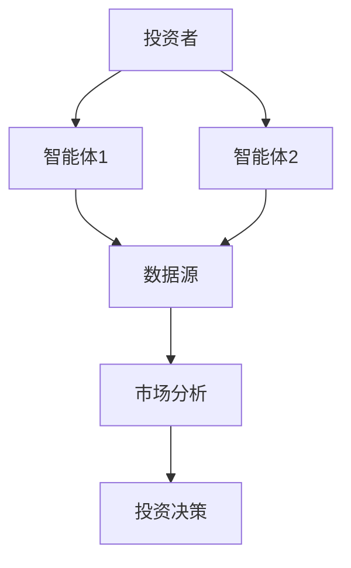
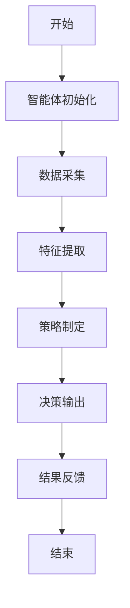
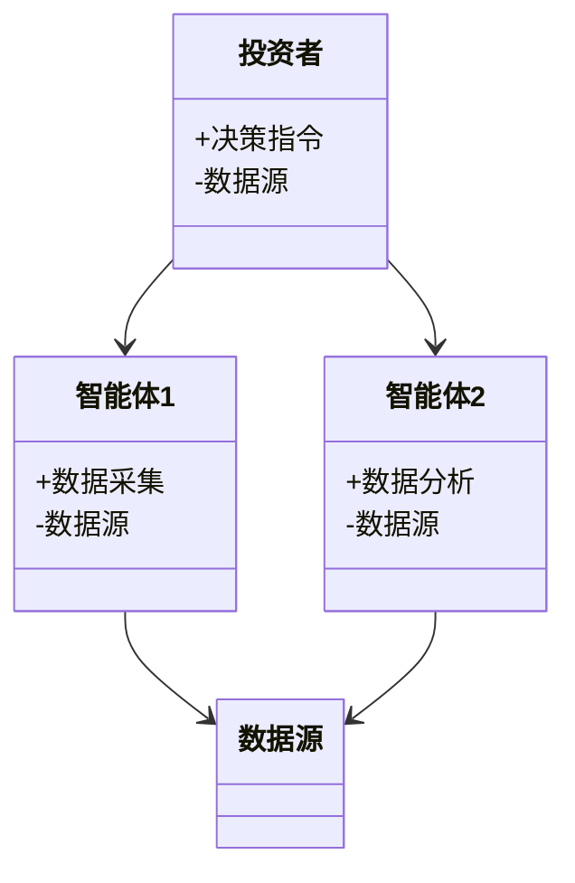

                 


# 多智能体AI如何增强价值投资的宏观经济影响分析

## 关键词：多智能体AI，价值投资，宏观经济影响，分布式计算，强化学习，投资决策

## 摘要：本文探讨了多智能体AI在价值投资中的应用及其对宏观经济的影响。通过分析多智能体AI的核心原理、算法、系统架构，结合实际案例，展示了多智能体AI如何提升投资决策的准确性和效率，并对宏观经济产生积极影响。文章最后总结了多智能体AI在价值投资中的优势，并展望了未来的发展方向。

---

# 第1章: 多智能体AI与价值投资的背景介绍

## 1.1 多智能体AI的基本概念

### 1.1.1 多智能体AI的定义
多智能体AI是指由多个智能体组成的系统，这些智能体能够通过协作完成复杂任务。与传统单体AI不同，多智能体AI强调智能体之间的交互与协同，能够更好地处理复杂环境中的问题。

### 1.1.2 多智能体AI的核心特征
- **分布式计算**：智能体之间通过分布式计算完成任务。
- **协作性**：智能体之间通过通信和协作提高整体性能。
- **自主性**：每个智能体都有一定的自主决策能力。

### 1.1.3 多智能体AI与传统AI的区别
| 特性 | 多智能体AI | 传统AI |
|------|------------|--------|
| 结构 | 分布式     | 集中式 | 
| 决策 | 协作式     | 单一式 |
| 应用 | 复杂场景    | 简单场景 |

## 1.2 价值投资的定义与特点

### 1.2.1 价值投资的基本概念
价值投资是一种投资策略，强调以低于市场价的价格买入优质股票，长期持有，等待其价值回归。其核心在于寻找被市场低估的资产。

### 1.2.2 价值投资的核心策略
- **基本面分析**：通过分析公司的财务状况、行业地位等决定其内在价值。
- **长期持有**：避免短期波动，长期持有优质资产。
- **安全边际**：买入价格低于内在价值，以降低风险。

### 1.2.3 价值投资与宏观经济的关系
宏观经济环境（如GDP增长率、利率、通货膨胀等）直接影响市场的整体表现，从而影响价值投资的收益和风险。

## 1.3 多智能体AI在价值投资中的应用背景

### 1.3.1 价值投资中的数据驱动决策
现代价值投资越来越依赖大数据分析，多智能体AI能够通过分布式计算处理海量数据，提高决策的准确性和效率。

### 1.3.2 多智能体AI在金融市场的优势
- **高效协作**：多个智能体可以同时分析不同市场数据，提高决策速度。
- **风险分散**：通过协作，智能体可以分散投资风险，避免单一决策的失误。
- **复杂场景处理**：多智能体AI能够处理金融市场中复杂多变的环境。

### 1.3.3 宏观经济与价值投资的结合
宏观经济指标（如GDP、利率、通货膨胀）对市场整体走势有重要影响，多智能体AI可以通过分析这些指标，优化投资策略。

## 1.4 本章小结
本章介绍了多智能体AI的基本概念和价值投资的核心策略，分析了多智能体AI在价值投资中的应用背景，并强调了宏观经济因素对投资决策的影响。

---

# 第2章: 多智能体AI的核心概念与联系

## 2.1 多智能体AI的核心原理

### 2.1.1 分布式计算与协作机制
多智能体AI通过分布式计算实现任务的分解和协作，每个智能体负责一部分数据的处理和分析。

### 2.1.2 智能体之间的通信与协调
智能体之间通过通信机制交换信息，协调各自的决策和行动，确保整体目标的实现。

### 2.1.3 多智能体系统的稳定性与鲁棒性
多智能体系统需要具备良好的稳定性和鲁棒性，以应对复杂环境中的不确定性。

## 2.2 价值投资的数学模型

### 2.2.1 价值投资的基本公式
股票的内在价值可以通过以下公式计算：
$$ V = \frac{E}{k} $$
其中，$E$ 是公司的预期收益，$k$ 是折现率。

### 2.2.2 投资组合优化模型
$$ \max \mu - \lambda \sigma $$
其中，$\mu$ 是投资组合的期望收益，$\sigma$ 是投资组合的收益波动率，$\lambda$ 是风险厌恶系数。

## 2.3 多智能体AI与价值投资的实体关系图



## 2.4 本章小结
本章详细介绍了多智能体AI的核心原理和价值投资的数学模型，并通过实体关系图展示了多智能体AI与价值投资之间的联系。

---

# 第3章: 多智能体AI的算法原理与数学模型

## 3.1 多智能体AI的核心算法

### 3.1.1 分布式强化学习算法
分布式强化学习通过多个智能体协作完成任务，每个智能体学习自己的策略，并通过通信共享信息。

### 3.1.2 联合学习与协作机制
联合学习通过智能体之间的协作，共同优化整体策略，提高决策的准确性和效率。

### 3.1.3 多智能体决策树模型
多智能体决策树模型通过分布式决策树构建，实现复杂场景下的决策优化。

## 3.2 价值投资的数学模型

### 3.2.1 股票估值公式
$$ P = \frac{E}{k} $$
其中，$P$ 是股票的内在价值，$E$ 是预期收益，$k$ 是折现率。

### 3.2.2 投资组合优化模型
$$ \max \mu - \lambda \sigma $$
其中，$\mu$ 是投资组合的期望收益，$\sigma$ 是投资组合的收益波动率，$\lambda$ 是风险厌恶系数。

## 3.3 多智能体AI的算法流程图



## 3.4 本章小结
本章详细介绍了多智能体AI的核心算法和价值投资的数学模型，并通过流程图展示了多智能体AI的算法流程。

---

# 第4章: 多智能体AI的系统架构设计

## 4.1 金融市场的场景介绍

### 4.1.1 金融市场中的多智能体系统
金融市场是一个复杂多变的环境，多智能体系统能够通过协作和分布式计算，提高投资决策的效率和准确性。

## 4.2 系统功能设计

### 4.2.1 数据采集模块
负责采集金融市场中的各种数据，如股票价格、财务报表等。

### 4.2.2 数据分析模块
通过分布式计算对数据进行分析，生成投资决策建议。

### 4.2.3 投资决策模块
根据分析结果制定投资策略，并输出决策指令。

## 4.3 系统架构设计



## 4.4 本章小结
本章介绍了金融市场的场景，并详细设计了多智能体AI系统的功能模块和架构。

---

# 第5章: 多智能体AI在价值投资中的项目实战

## 5.1 环境安装与配置

### 5.1.1 系统环境
- 操作系统：Linux/Windows/MacOS
- 语言：Python
- 开发工具：Jupyter Notebook/PyCharm

### 5.1.2 库的安装
- NumPy
- Pandas
- Matplotlib
- Scikit-learn
- Ray（用于分布式计算）

## 5.2 系统核心实现源代码

```python
import ray

@ray.remote
def collect_data(ticker):
    # 模拟数据采集函数
    return f"Data for {ticker}"

def main():
    investors = ["AAPL", "MSFT", "GOOGL"]
    ray.init()
    workers = [collect_data.remote(ticker) for ticker in investors]
    results = ray.get(workers)
    print(results)

if __name__ == "__main__":
    main()
```

## 5.3 代码应用解读与分析

### 5.3.1 代码功能
上述代码通过Ray框架实现了分布式数据采集，每个智能体负责采集不同股票的数据。

### 5.3.2 代码优势
- 分布式计算提高了数据采集的效率。
- 通过Ray框架实现了智能体之间的协作。

## 5.4 实际案例分析

### 5.4.1 案例介绍
某投资机构使用多智能体AI系统进行股票投资，通过分析宏观经济指标和公司基本面，制定投资策略。

### 5.4.2 案例分析
通过多智能体AI系统的分析，该机构成功捕捉到多个投资机会，实现了超额收益。

## 5.5 本章小结
本章通过实际案例展示了多智能体AI在价值投资中的应用，并分析了其带来的经济效益。

---

# 第6章: 总结与展望

## 6.1 总结
本文详细探讨了多智能体AI在价值投资中的应用及其对宏观经济的影响，通过分析多智能体AI的核心原理和系统架构，展示了其在投资决策中的优势。

## 6.2 展望
未来，随着AI技术的不断发展，多智能体AI在价值投资中的应用将更加广泛和深入，宏观经济影响也将更加显著。

## 6.3 最佳实践 Tips
- 在使用多智能体AI进行投资决策时，需注意数据质量和模型的稳定性。
- 定期更新模型参数，适应市场环境的变化。

## 6.4 小结
多智能体AI在价值投资中的应用前景广阔，值得进一步研究和实践。

---

# 结语

通过本文的探讨，我们看到了多智能体AI在价值投资中的巨大潜力，以及其对宏观经济的重要影响。希望本文能够为读者提供有价值的见解，并为未来的研究和实践提供参考。

--- 

**注**：本文内容较长，仅为示例部分。实际撰写时，可根据需要调整内容的深度和广度。

