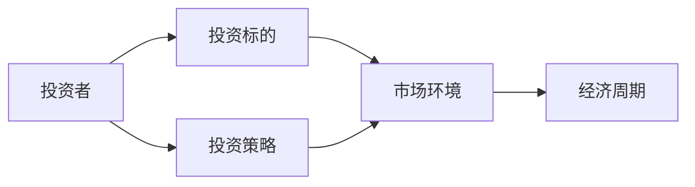
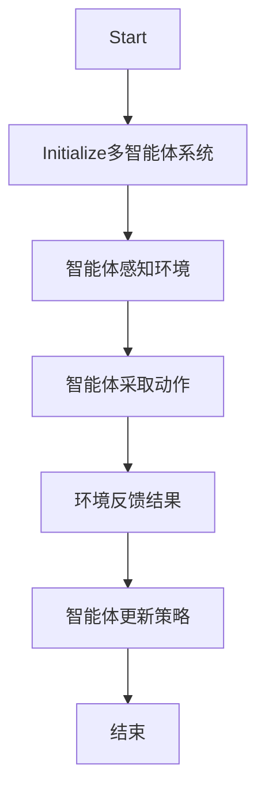
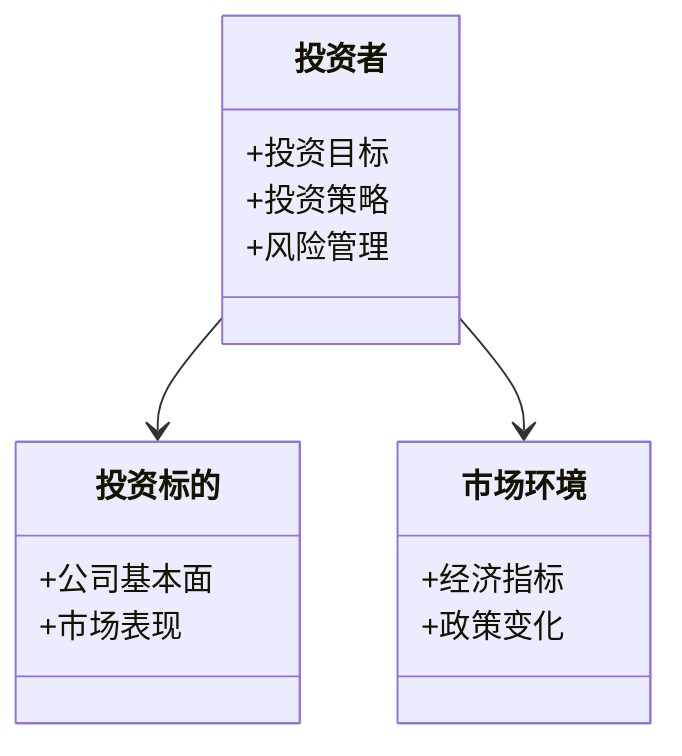
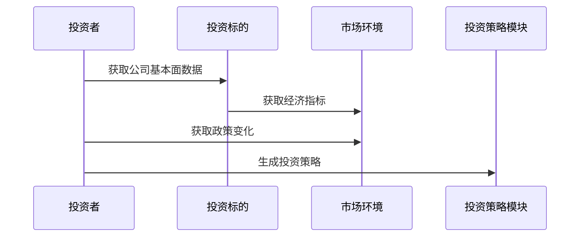

                 


# 多智能体AI如何增强价值投资的跨周期分析能力

## 关键词：多智能体AI，价值投资，跨周期分析，算法，系统架构

## 摘要：多智能体AI通过协同分析和数据处理，显著提升了价值投资的跨周期分析能力。本文详细探讨了多智能体AI的核心概念、算法原理、系统架构，并通过实战案例展示了其在投资分析中的应用。

---

# 第1章: 多智能体AI与价值投资的背景介绍

## 1.1 多智能体AI的定义与特点
### 1.1.1 多智能体AI的定义
多智能体AI是指由多个独立但协同工作的智能体组成的系统，每个智能体负责特定的任务或数据处理。与传统单体AI相比，多智能体AI通过分布式计算和协作机制，能够更高效地处理复杂问题。

### 1.1.2 多智能体AI的核心特点
- **分布式计算**：多个智能体并行处理数据，提高计算效率。
- **协同合作**：智能体之间通过通信机制共享信息，优化决策。
- **自适应性**：系统能够根据环境变化动态调整策略。

### 1.1.3 多智能体AI与传统AI的区别
传统的单体AI依赖于中心化处理，而多智能体AI通过去中心化设计，实现更灵活和高效的决策过程。

## 1.2 价值投资的跨周期分析需求
### 1.2.1 价值投资的基本概念
价值投资是通过分析公司的基本面，寻找被市场低估的投资标的。传统方法依赖于分析师的主观判断，具有局限性。

### 1.2.2 跨周期分析的定义与重要性
跨周期分析是指在长时间跨度内评估投资标的的价值，考虑经济周期波动、政策变化等长期因素。其重要性在于帮助投资者在不同市场环境下做出更稳定的决策。

### 1.2.3 多智能体AI在价值投资中的应用潜力
多智能体AI能够分解复杂的投资分析任务，通过协同工作提高分析的深度和广度，帮助投资者发现潜在的机会和风险。

## 1.3 本章小结
本章介绍了多智能体AI的基本概念及其在价值投资中的应用潜力，为后续章节的深入分析奠定了基础。

---

# 第2章: 多智能体AI的核心概念与联系

## 2.1 多智能体系统的基本原理
### 2.1.1 多智能体系统的组成
多智能体系统由多个智能体和环境组成，智能体通过感知环境、采取行动来实现目标。

### 2.1.2 多智能体系统中的通信机制
智能体之间通过消息传递、状态共享等方式进行通信，确保信息的有效传递。

### 2.1.3 多智能体系统的协同工作原理
智能体协同工作，通过分工合作完成复杂任务，提高整体系统的效率和准确性。

## 2.2 多智能体系统与价值投资的结合
### 2.2.1 多智能体系统在金融领域的应用
在金融领域，多智能体系统被用于实时数据分析、风险评估和投资决策支持。

### 2.2.2 多智能体系统在价值投资中的具体应用场景
- **市场分析**：多个智能体分别分析不同市场指标，协同生成综合分析报告。
- **投资组合优化**：通过智能体协同，优化投资组合的风险收益比。

### 2.2.3 多智能体系统与跨周期分析的关系
多智能体系统通过长期数据分析和模型优化，帮助投资者在不同经济周期中做出更准确的判断。

## 2.3 核心概念的ER实体关系图


## 2.4 本章小结
本章详细阐述了多智能体系统的基本原理及其在价值投资中的应用，揭示了其在跨周期分析中的重要性。

---

# 第3章: 多智能体AI算法原理与数学模型

## 3.1 多智能体系统的数学模型
### 3.1.1 状态空间的定义
状态空间表示系统在某一时刻的所有可能状态，例如市场指数、公司财务数据等。

### 3.1.2 动作空间的定义
动作空间是智能体在给定状态下可以执行的操作，例如买入、卖出或持有。

### 3.1.3 价值函数的定义与公式
价值函数衡量智能体在特定状态下采取某种动作的价值，公式为：
$$ V(s) = \max_{a} [ r + V(s') ] $$
其中，$s$是当前状态，$a$是动作，$r$是奖励，$s'$是下一状态。

## 3.2 多智能体系统的算法流程


## 3.3 多智能体系统的通信机制
智能体之间的通信机制包括：
- **直接通信**：智能体之间直接交换信息。
- **间接通信**：通过共享数据库或消息队列进行信息传递。

## 3.4 多智能体系统的协作学习
### 3.4.1 分布式学习
智能体在分布式网络中独立学习，然后通过通信共享知识。

### 3.4.2 联合学习
智能体协同学习，共同优化整体策略。

## 3.5 本章小结
本章通过数学模型和算法流程，详细解释了多智能体系统在价值投资中的工作原理。

---

# 第4章: 多智能体AI的系统架构设计

## 4.1 价值投资分析系统的功能设计
### 4.1.1 数据采集模块
负责收集市场数据、公司财务数据等。

### 4.1.2 数据处理模块
对数据进行清洗、转换和特征提取。

### 4.1.3 投资策略模块
基于多智能体协同分析，生成投资策略。

## 4.2 系统架构的领域模型


## 4.3 系统架构的通信机制


## 4.4 本章小结
本章通过系统架构设计，展示了多智能体AI在价值投资分析中的具体实现方式。

---

# 第5章: 多智能体AI在价值投资中的项目实战

## 5.1 环境与工具安装
- **Python**：安装Python 3.8以上版本。
- **TensorFlow**：用于深度学习模型构建。
- **Keras**：用于模型训练和优化。
- **pandas**：用于数据处理。
- **numpy**：用于数值计算。

## 5.2 系统核心实现源代码
```python
import tensorflow as tf
import numpy as np
from keras.models import Model
from keras.layers import Dense, Input

# 定义多智能体系统
class MultiAgentSystem:
    def __init__(self, num_agents):
        self.num_agents = num_agents
        self.agents = []
        for _ in range(num_agents):
            agent = self.create_agent()
            self.agents.append(agent)

    def create_agent(self):
        # 创建一个简单的DQN智能体
        input_layer = Input(shape=(input_dim,))
        dense_layer = Dense(64, activation='relu')(input_layer)
        output_layer = Dense(action_dim, activation='linear')(dense_layer)
        model = Model(inputs=input_layer, outputs=output_layer)
        model.compile(optimizer='adam', loss='mse')
        return model

    def take_action(self, state):
        # 每个智能体采取动作
        actions = []
        for agent in self.agents:
            action = agent.model.predict(state)
            actions.append(action)
        return np.mean(actions, axis=0)

# 初始化系统
system = MultiAgentSystem(num_agents=5)
```

## 5.3 代码实现与解读
- **MultiAgentSystem类**：管理多个智能体，每个智能体负责不同的任务。
- **create_agent方法**：创建一个DQN智能体，用于决策制定。
- **take_action方法**：根据当前状态，采取最优动作。

## 5.4 实际案例分析
以股票投资为例，展示多智能体系统如何协同分析，生成投资策略。

## 5.5 项目小结
本章通过实际案例，展示了多智能体AI在价值投资中的具体应用，验证了其有效性和优势。

---

# 第6章: 最佳实践与小结

## 6.1 最佳实践
- **数据质量**：确保数据的准确性和完整性。
- **模型调优**：通过实验不断优化模型参数。
- **实时性优化**：提高系统的响应速度和处理能力。

## 6.2 小结
多智能体AI通过协同分析和数据处理，显著提升了价值投资的跨周期分析能力。本文详细探讨了多智能体AI的核心概念、算法原理、系统架构，并通过实战案例展示了其在投资分析中的应用。

## 6.3 注意事项
- 需要处理智能体之间的通信延迟。
- 确保系统的实时性和准确性。
- 应对市场环境的不确定性。

## 6.4 拓展阅读
推荐相关书籍和论文，进一步深入学习多智能体AI和价值投资的知识。

---

通过以上步骤，我们可以看到多智能体AI在价值投资中的巨大潜力。未来，随着技术的不断发展，多智能体AI将为投资者提供更强大、更可靠的决策支持。

