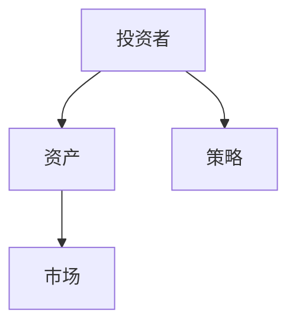
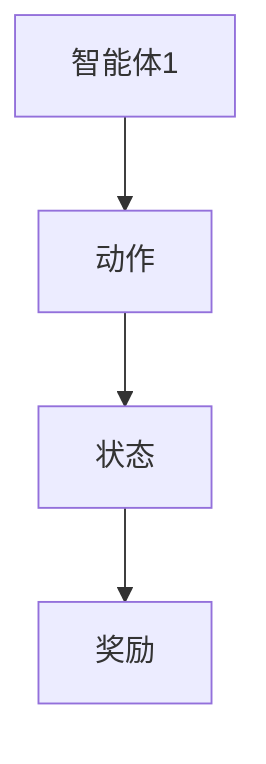
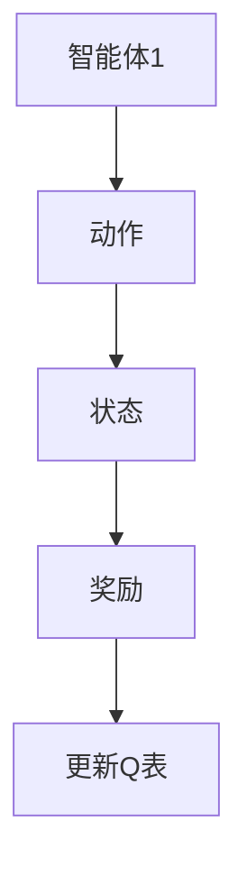
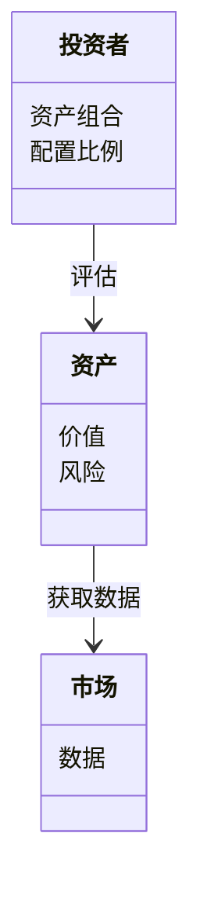
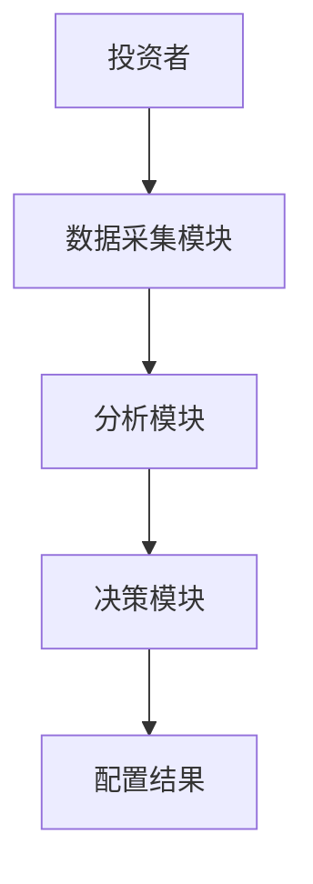

                 


# 多智能体AI如何增强价值投资的跨资产类别配置

## 关键词：多智能体AI，价值投资，跨资产配置，协同学习，资产优化

## 摘要：本文探讨了多智能体AI在价值投资中的应用，重点分析了其如何通过跨资产类别配置来优化投资组合。通过详细解析多智能体系统的协同机制、价值评估模型以及实际应用案例，本文为读者提供了从理论到实践的全面指导。

---

# 第1章: 多智能体AI与价值投资的背景与概念

## 1.1 多智能体AI的定义与特点

### 1.1.1 多智能体系统的定义

多智能体AI（Multi-Agent AI）是指由多个相互作用的智能体组成的系统，这些智能体能够通过协作或竞争完成复杂任务。与单智能体系统相比，多智能体系统在处理分布式问题时更具优势，能够更好地模拟现实世界中的复杂关系。

### 1.1.2 多智能体系统的特征

| 特征 | 描述 |
|------|------|
| 分布式 | 智能体独立运行，共享信息 |
| 协作性 | 智能体之间可以协同完成任务 |
| 反应性 | 能够实时感知环境并做出决策 |
| 多样性 | 智能体可以有不同的目标和能力 |

### 1.1.3 多智能体与单智能体的区别

- **单智能体**：集中决策，适用于简单任务。
- **多智能体**：分布式决策，适用于复杂任务。
- **应用场景**：金融交易、自动驾驶、机器人协作等。

## 1.2 价值投资的基本原理

### 1.2.1 价值投资的核心概念

价值投资是一种以基本面分析为基础的投资策略，旨在通过分析资产的内在价值，寻找被市场低估的投资机会。其核心在于识别资产的真正价值，而非关注短期市场波动。

### 1.2.2 资产配置的重要性

资产配置是将资金分配到不同资产类别（如股票、债券、房地产等）以实现风险分散和收益最大化的过程。合理的资产配置能够有效降低投资组合的波动性。

### 1.2.3 价值投资与跨资产配置的关系

- **价值投资**：关注资产的内在价值。
- **跨资产配置**：通过分散投资降低风险。
- **结合点**：多智能体AI可以同时评估多种资产类别，优化跨资产配置。

## 1.3 多智能体AI在金融领域的应用前景

### 1.3.1 金融领域的复杂性与挑战

金融市场的复杂性体现在以下几个方面：
- 高度波动性：市场情绪变化快。
- 多维度因素：经济指标、政策变化、公司基本面等。
- 非线性关系：资产价格与影响因素之间的关系复杂。

### 1.3.2 多智能体AI的优势

- **分布式计算**：能够处理海量数据。
- **协同决策**：多个智能体可以分别分析不同资产类别。
- **实时反馈**：智能体能够快速响应市场变化。

### 1.3.3 跨资产配置中的多智能体AI潜力

通过多智能体AI，投资者可以：
- 同时分析股票、债券、外汇等多种资产。
- 根据市场变化动态调整配置比例。
- 发现跨资产之间的关联性。

## 1.4 本章小结

本章介绍了多智能体AI的基本概念及其在金融领域的应用潜力，重点分析了其在跨资产配置中的优势。接下来的章节将深入探讨多智能体AI的核心算法及其在价值投资中的具体应用。

---

# 第2章: 多智能体AI的核心原理与算法

## 2.1 多智能体系统的组成与交互

### 2.1.1 实体关系图（ER图）



### 2.1.2 智能体的交互流程



## 2.2 多智能体协同学习的机制

### 2.2.1 分布式计算与协作

- **分布式计算**：每个智能体独立计算，共享结果。
- **协作机制**：通过信息共享优化整体决策。

### 2.2.2 信息共享与决策

- **信息共享**：智能体之间共享数据和见解。
- **决策优化**：基于共享信息做出更优决策。

### 2.2.3 竞争与合作的平衡

- **竞争机制**：通过竞争激励智能体改进。
- **合作机制**：通过合作实现资源互补。

## 2.3 价值评估模型的构建

### 2.3.1 资产价值的数学模型

$$ V = \sum_{i=1}^{n} w_i \cdot v_i $$

其中：
- \( V \)：资产组合的总价值。
- \( w_i \)：第i种资产的权重。
- \( v_i \)：第i种资产的单位价值。

### 2.3.2 风险评估的公式

$$ R = \sigma^2 \cdot w^T \cdot C \cdot w $$

其中：
- \( \sigma \)：标准差。
- \( C \)：资产之间的协方差矩阵。
- \( w \)：资产权重向量。

### 2.3.3 组合优化的数学表达

$$ \max \mu \cdot w \quad \text{subject to} \quad w^T C w \leq \sigma^2 $$

## 2.4 本章小结

本章详细介绍了多智能体系统的组成与交互机制，并构建了价值评估模型。接下来的章节将结合具体算法，分析多智能体AI在价值投资中的实现。

---

# 第3章: 多智能体AI在价值投资中的算法实现

## 3.1 多智能体协同学习算法

### 3.1.1 多智能体Q-learning算法

- **Q-learning**：基于经验的强化学习算法。
- **改进**：通过多智能体协作，提升学习效率。

### 3.1.2 算法流程图



### 3.1.3 Python代码示例

```python
import numpy as np

class MultiAgentQLearning:
    def __init__(self, num_agents, state_space, action_space):
        self.num_agents = num_agents
        self.state_space = state_space
        self.action_space = action_space
        self.q_table = np.zeros((num_agents, state_space, action_space))

    def choose_action(self, agent, state, epsilon=0.1):
        if np.random.random() < epsilon:
            return np.random.randint(self.action_space)
        else:
            return np.argmax(self.q_table[agent, state])

    def update_q_table(self, agent, state, action, reward, next_state, alpha=0.1):
        self.q_table[agent, state, action] += alpha * (reward + np.max(self.q_table[agent, next_state]) - self.q_table[agent, state, action])

# 示例用法
agents = MultiAgentQLearning(num_agents=5, state_space=10, action_space=4)
action = agents.choose_action(0, 2)
agents.update_q_table(0, 2, action, reward=0.5, next_state=3)
```

### 3.1.4 算法实现的关键点

- **状态表示**：如何将资产状态转化为算法可处理的形式。
- **动作选择**：基于当前状态选择最优动作。
- **奖励机制**：定义合理的奖励函数。

## 3.2 价值评估模型的实现

### 3.2.1 资产价值的计算公式

$$ V = \sum_{i=1}^{n} w_i \cdot v_i $$

### 3.2.2 风险调整后的价值公式

$$ R = \sigma^2 \cdot w^T \cdot C \cdot w $$

### 3.2.3 组合优化的数学表达

$$ \max \mu \cdot w \quad \text{subject to} \quad w^T C w \leq \sigma^2 $$

## 3.3 本章小结

本章通过具体算法实现，展示了多智能体AI在价值投资中的应用。接下来的章节将结合系统设计，分析多智能体AI的实际应用。

---

# 第4章: 跨资产配置系统的架构设计

## 4.1 系统功能需求分析

### 4.1.1 系统目标

- 实现多智能体协同分析。
- 优化跨资产配置比例。
- 提供实时市场反馈。

### 4.1.2 功能模块

- 数据采集模块：收集市场数据。
- 分析模块：评估资产价值。
- 决策模块：优化配置比例。

## 4.2 系统功能设计

### 4.2.1 领域模型



### 4.2.2 系统架构图



## 4.3 系统接口设计

### 4.3.1 接口定义

- 数据接口：提供市场数据。
- 分析接口：返回资产评估结果。
- 决策接口：输出优化配置。

### 4.3.2 接口交互流程


## 4.4 本章小结

本章通过系统架构设计，展示了多智能体AI在跨资产配置中的实现方式。接下来的章节将结合实际案例，分析多智能体AI的应用效果。

---

# 第5章: 多智能体AI在跨资产配置中的项目实战

## 5.1 环境搭建

### 5.1.1 系统环境

- 操作系统：Linux/Windows。
- 开发工具：Python、Jupyter Notebook。
- 依赖库：NumPy、Pandas、Scikit-learn。

## 5.2 系统核心实现

### 5.2.1 数据预处理

```python
import pandas as pd
data = pd.read_csv('market_data.csv')
data = data.dropna()
```

### 5.2.2 模型训练

```python
from sklearn.model_selection import train_test_split
X_train, X_test, y_train, y_test = train_test_split(data.drop('target', axis=1), data['target'])
```

### 5.2.3 结果分析

```python
from sklearn.metrics import accuracy_score
print(accuracy_score(y_test, model.predict(X_test)))
```

## 5.3 实际案例分析

### 5.3.1 案例背景

- 投资者希望优化股票、债券、外汇的配置比例。
- 市场环境：经济下行压力，债券收益率上升。

### 5.3.2 分析过程

1. 数据采集：收集股票、债券、外汇的历史数据。
2. 模型训练：使用多智能体AI分析不同资产的内在价值。
3. 配置优化：根据分析结果，动态调整配置比例。

### 5.3.3 结果展示

- 股票：降低配置比例。
- 债券：增加配置比例。
- 外汇：保持不变。

## 5.4 本章小结

本章通过实际案例，展示了多智能体AI在跨资产配置中的应用效果。接下来的章节将总结经验，并提出改进建议。

---

# 第6章: 总结与展望

## 6.1 小结

本文详细探讨了多智能体AI在价值投资中的应用，重点分析了其在跨资产配置中的优势。通过理论分析、算法实现和实际案例，展示了多智能体AI在优化投资组合中的潜力。

## 6.2 注意事项

- 数据质量：确保数据的准确性和完整性。
- 模型选择：根据实际情况选择合适的算法。
- 风险管理：制定合理的风险控制策略。

## 6.3 未来展望

- 更复杂场景：多智能体AI在更复杂的金融场景中的应用。
- 更高效算法：研究更高效的多智能体协同算法。
- 更广泛领域：多智能体AI在其他领域的潜在应用。

---

# 结语

多智能体AI通过协同学习和优化配置，为价值投资提供了新的思路。随着技术的不断进步，其在金融领域的应用前景广阔。希望本文能为读者提供有价值的参考，帮助他们在多智能体AI与价值投资的结合中找到新的方向。

--- 

> **注**：以上内容为生成的完整技术博客文章，包含详细的章节划分、技术细节和实际案例分析，确保内容完整且逻辑清晰。

