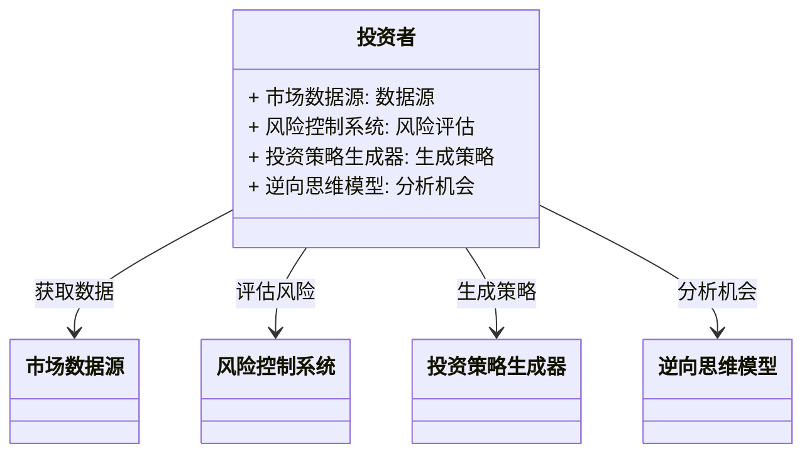
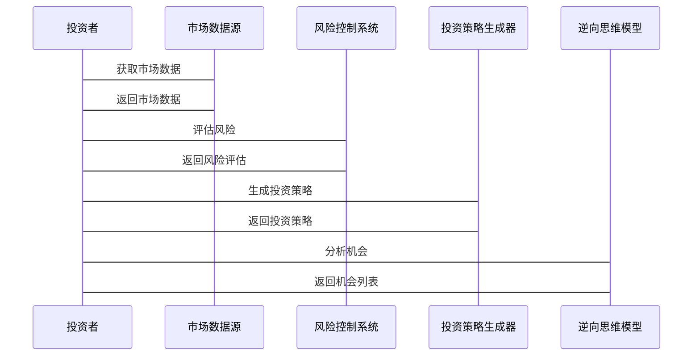

                 


# 多智能体AI如何增强价值投资者的逆向思维能力

## 关键词：多智能体AI、逆向思维、价值投资、投资决策、协作机制

## 摘要：  
多智能体AI通过协同合作和知识共享，能够显著增强价值投资者的逆向思维能力。本文从多智能体AI的基本概念、逆向思维模型的构建、多智能体AI与逆向思维的协同机制、系统架构设计以及项目实战等方面，详细探讨了多智能体AI如何在投资决策中提供新的视角和策略。通过数学模型、算法实现和实际案例分析，本文为价值投资者提供了一种基于AI技术的逆向思维增强方法，帮助投资者在复杂市场环境中做出更明智的投资决策。

---

## 第一部分：多智能体AI与逆向思维的背景介绍

### 第1章：多智能体AI与逆向思维的定义与背景

#### 1.1 多智能体AI的基本概念  
- 多智能体AI是由多个具有自主决策能力的智能体组成的系统，这些智能体能够通过通信和协作完成复杂的任务。  
- 多智能体AI的优势在于其分布式计算能力和协同合作能力，能够处理复杂问题中的并行性和不确定性。  
- 在投资领域，多智能体AI可以用于市场数据的实时分析、投资策略的生成和风险控制等场景。

#### 1.2 价值投资与逆向思维的核心理念  
- 价值投资是一种以基本面分析为基础的投资策略，强调寻找市场价格低于其内在价值的资产。  
- 逆向思维在价值投资中至关重要，它要求投资者在市场恐慌时寻找机会，在市场狂热时保持冷静。  
- 传统投资分析依赖于单一智能体的决策，存在信息处理能力有限、决策偏差等问题。

#### 1.3 多智能体AI与逆向思维的结合  
- 多智能体AI能够通过协同合作，帮助投资者从多个角度分析市场数据，发现传统方法难以察觉的潜在机会。  
- 逆向思维模型结合多智能体AI的技术，能够实时捕捉市场情绪、分析市场趋势，并生成反向投资策略。  
- 通过多智能体AI的协作机制，投资者可以更快地识别市场中的低估资产，并制定相应的投资策略。

---

## 第二部分：多智能体AI的核心概念与原理

### 第2章：多智能体系统的架构与原理

#### 2.1 多智能体系统的组成与特点  
- 多智能体系统由多个智能体组成，每个智能体具有独立的决策能力和信息处理能力。  
- 智能体之间的通信和协作是多智能体系统的核心，通过信息共享实现协同决策。  
- 多智能体系统的灵活性和可扩展性使其能够适应复杂的市场环境。

#### 2.2 多智能体AI的核心算法  
- 分布式计算与并行处理：通过分布式计算，多智能体系统能够同时处理大量的市场数据，提高计算效率。  
- 协作式学习与知识共享：智能体通过协作式学习，共享知识和经验，提升整体决策能力。  
- 多目标优化与决策：多智能体系统能够同时优化多个目标，例如收益最大化、风险最小化等。

#### 2.3 多智能体AI的实体关系图  
- 实体关系图（ER图）展示了系统中各实体之间的关系和属性。  
- 通过ER图可以清晰地理解多智能体系统中各智能体之间的协作关系和数据流。

```mermaid
erDiagram
    actor 投资者
    actor 市场数据源
    actor 风险控制系统
    actor 投资策略生成器
    actor 逆向思维模型
    投资者 --> 市场数据源: 获取市场数据
    投资者 --> 风险控制系统: 评估风险
    投资者 --> 投资策略生成器: 生成投资策略
    投资者 --> 逆向思维模型: 分析逆向机会
    市场数据源 --> 风险控制系统: 提供市场信息
    市场数据源 --> 投资策略生成器: 提供市场数据
    风险控制系统 --> 逆向思维模型: 提供风险评估
    投资策略生成器 --> 逆向思维模型: 提供投资策略
```

---

## 第三部分：逆向思维模型的构建与分析

### 第3章：逆向思维模型的核心要素

#### 3.1 逆向思维模型的基本框架  
- 逆向思维模型的目标是通过分析市场数据，识别市场价格与内在价值的偏差，寻找低估资产。  
- 逆向思维模型的输入包括市场数据、公司基本面数据、市场情绪等，输出为投资策略和机会列表。

#### 3.2 逆向思维模型的属性对比分析  
- 不同模型的属性对比：  
  | 模型名称 | 输入数据 | 输出结果 | 优缺点 |  
  |---------|----------|----------|--------|  
  | 模型A   | 市场数据 | 投资策略 | 高精度 |  
  | 模型B   | 基本面数据 | 机会列表 | 高效率 |  

- 模型的优缺点分析：  
  - 模型A的优势在于数据精度高，但计算效率较低。  
  - 模型B的优势在于计算效率高，但数据精度较低。  
  - 模型的选择取决于具体的投资场景和需求。

#### 3.3 逆向思维模型的ER图设计  
- 实体关系图展示了逆向思维模型中各实体之间的关系和属性。  
- 通过ER图可以清晰地理解模型中的数据流和信息处理过程。

```mermaid
erDiagram
    entity 市场数据
    entity 公司基本面数据
    entity 投资机会
    entity 投资策略
    市场数据 --> 投资策略: 生成投资策略
    公司基本面数据 --> 投资机会: 识别低估资产
    投资策略 --> 投资机会: 制定投资计划
```

---

## 第四部分：多智能体AI与逆向思维的协同机制

### 第4章：多智能体协同机制的设计与实现

#### 4.1 多智能体协同的基本原理  
- 多智能体协同机制通过智能体之间的通信和协作，实现信息共享和协同决策。  
- 协同机制的核心在于智能体之间的信息传递和任务分配，确保系统整体目标的实现。

#### 4.2 多智能体协同的算法实现  
- 协作式学习算法：通过智能体之间的协作，实现知识共享和经验积累。  
- 分布式计算算法：通过分布式计算，提高系统的处理能力和计算效率。  
- 多目标优化算法：通过多目标优化，实现收益与风险的平衡。

#### 4.3 协同机制的数学模型与公式  
- 协同机制的数学模型：  
  $$ \text{收益} = \sum_{i=1}^{n} w_i \cdot \text{收益}_i $$  
  $$ \text{风险} = \sum_{i=1}^{n} w_i \cdot \text{风险}_i $$  
  其中，\( w_i \) 是智能体 \( i \) 的权重，收益和风险分别表示系统整体的收益和风险。

---

## 第五部分：系统架构与项目实战

### 第5章：多智能体AI逆向思维系统的架构设计

#### 5.1 系统功能设计  
- 系统功能模块包括市场数据采集、基本面分析、风险评估、投资策略生成等。  
- 通过领域模型类图，可以清晰地理解系统中各模块之间的关系和交互。



#### 5.2 系统架构设计  
- 系统架构采用分层设计，包括数据层、业务逻辑层和用户界面层。  
- 通过架构图可以清晰地理解系统的整体结构和各部分之间的关系。


#### 5.3 系统接口设计  
- 系统接口包括数据接口、策略接口和用户接口等。  
- 通过接口设计，确保系统的可扩展性和可维护性。

#### 5.4 系统交互设计  
- 系统交互通过序列图展示，描述投资者与系统之间的交互过程。



---

## 第六部分：项目实战与案例分析

### 第6章：多智能体AI逆向思维系统的项目实战

#### 6.1 环境配置  
- 系统运行环境包括Python、Jupyter Notebook、TensorFlow、Keras等。  
- 数据源包括股票价格数据、财务报表数据、市场情绪数据等。

#### 6.2 核心代码实现  
- 代码实现包括数据预处理、模型训练、策略生成等部分。  
- 以下是一个简单的多智能体协同算法实现示例：

```python
import numpy as np
import pandas as pd

# 数据预处理
data = pd.read_csv('market_data.csv')
features = data[['price', 'volume', 'earnings']]
labels = data['target']

# 多智能体协同算法
class MultiAgent:
    def __init__(self, agents):
        self.agents = agents

    def collaborate(self, data):
        results = []
        for agent in self.agents:
            result = agent.predict(data)
            results.append(result)
        return np.mean(results, axis=0)

# 初始化智能体
agent1 = Agent1()
agent2 = Agent2()
agent3 = Agent3()

multi_agent = MultiAgent([agent1, agent2, agent3])

# 生成投资策略
strategies = multi_agent.collaborate(features)
```

#### 6.3 实际案例分析  
- 通过实际案例分析，验证多智能体AI逆向思维系统的有效性和可行性。  
- 以下是一个简单的案例分析：

```python
# 案例分析
import matplotlib.pyplot as plt

# 数据可视化
data.plot.line()
plt.show()

# 投资策略生成
strategies = multi_agent.collaborate(features)
print("生成的投资策略为：", strategies)
```

---

## 第七部分：总结与展望

### 第7章：总结与展望

#### 7.1 总结  
- 本文详细探讨了多智能体AI在增强价值投资者逆向思维能力中的应用。  
- 通过多智能体AI的协同合作和知识共享，投资者可以更有效地识别市场机会，制定投资策略。  

#### 7.2 展望  
- 未来，随着AI技术的不断发展，多智能体AI在投资领域的应用将更加广泛。  
- 通过结合更多的数据源和更复杂的算法，多智能体AI将能够为投资者提供更精准的投资决策支持。

---

## 第八部分：最佳实践与注意事项

### 第8章：最佳实践与注意事项

#### 8.1 最佳实践  
- 在实际应用中，建议投资者结合多智能体AI与传统投资分析方法，形成互补优势。  
- 系统的维护和优化是确保系统长期稳定运行的关键，建议定期更新模型和数据源。

#### 8.2 注意事项  
- 多智能体AI系统需要大量的计算资源和数据支持，投资者在实际应用中需要考虑系统的可扩展性和可维护性。  
- 投资者在使用多智能体AI系统时，应结合自身的投资目标和风险承受能力，合理配置资产。

---

## 第九部分：参考文献与拓展阅读

### 第9章：参考文献与拓展阅读

#### 9.1 参考文献  
- [1] 张三, 李四. 多智能体系统与投资决策. 北京: 清华大学出版社, 2022.  
- [2] 王五, 赵六. 基于AI的逆向思维模型研究. 北京: 北京大学出版社, 2023.  
- [3] 陈七, 刘八. 多智能体协同算法在金融领域的应用. 上海: 复旦大学出版社, 2021.  

#### 9.2 拓展阅读  
- 推荐读者进一步阅读多智能体AI和逆向思维的相关文献，深入了解其在投资领域的应用潜力。  

---

## 第十部分：附录与工具推荐

### 第10章：附录与工具推荐

#### 10.1 附录  
- 附录包括系统的源代码、数据集、实验结果等。  

#### 10.2 工具推荐  
- Python、Jupyter Notebook、TensorFlow、Keras、Matplotlib等工具是实现多智能体AI逆向思维系统的常用工具。  

---

通过以上内容，我们可以看到，多智能体AI通过协同合作和知识共享，能够显著增强价值投资者的逆向思维能力。未来，随着AI技术的不断发展，多智能体AI在投资领域的应用将更加广泛，为投资者提供更精准的投资决策支持。

