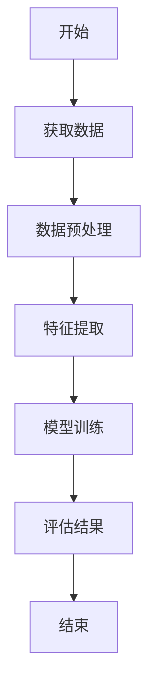
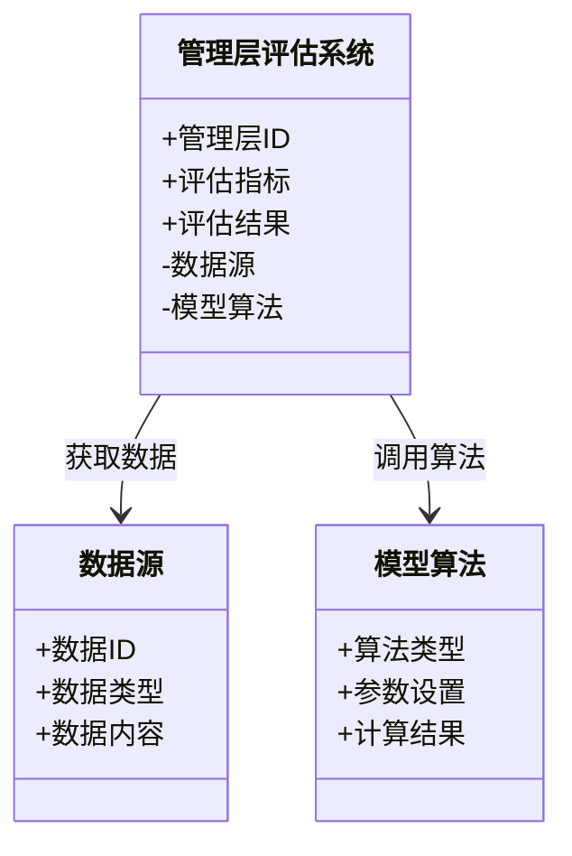

                 


# 多智能体AI如何增强管理层诚信评估的准确性

## 关键词：诚信评估、多智能体AI、AI算法、数据分析、系统架构

## 摘要：本文探讨了多智能体AI在管理层诚信评估中的应用，分析了其如何通过分布式计算、博弈论模型和大数据分析提高评估的准确性。文章从背景介绍、核心概念、算法原理、系统架构到项目实战，全面阐述了多智能体AI在诚信评估中的优势和实现过程，并展望了其未来的发展。

---

## 第1章：背景介绍

### 1.1 诚信评估的重要性

诚信评估是衡量管理层信用状况的关键指标，直接影响企业的决策和运作。传统的诚信评估方法依赖于人工分析和单一数据源，存在效率低、准确性差的问题。随着企业规模的扩大和数据的多样化，传统方法难以满足现代评估的需求。

### 1.2 多智能体AI的定义与特点

多智能体AI是指多个智能体协同工作的系统，每个智能体都有独立的目标和决策能力。其特点包括分布式计算、自主性、协作性和动态适应性。与传统AI相比，多智能体AI更注重多个智能体之间的互动和协作。

### 1.3 多智能体AI在诚信评估中的优势

多智能体AI通过分布式计算和协作学习，能够高效处理大规模数据，提高评估的准确性和效率。同时，多智能体AI能够模拟不同情境下的决策过程，提供更全面的评估结果。

---

## 第2章：管理层诚信评估的核心概念

### 2.1 问题背景与问题描述

诚信评估的核心问题是如何准确、全面地评估管理层的信用状况。传统方法依赖单一数据源和人工判断，存在主观性强、效率低的问题。多智能体AI通过整合多源数据和智能协作，解决了这些问题。

### 2.2 核心概念与联系

#### 核心概念对比表格

| 概念        | 特征             |
|-------------|------------------|
| 诚信评估    | 数据驱动、全面性  |
| 多智能体AI   | 分布式、协作性   |

#### ER实体关系图架构

```mermaid
erDiagram
    actor 管理层评估系统 {
        attribute 管理层ID
        attribute 评估指标
        attribute 评估结果
    }
    actor 数据源 {
        attribute 数据ID
        attribute 数据类型
        attribute 数据内容
    }
    管理层评估系统 --> 数据源 : 获取数据
```

---

## 第3章：算法原理

### 3.1 多智能体AI算法的数学模型

多智能体AI的核心算法包括分布式计算和博弈论模型。分布式计算通过并行处理提高效率，博弈论模型模拟决策过程。

#### 分布式计算公式

$$ \text{分布式计算} = \sum_{i=1}^{n} f(i) $$

#### 博弈论模型公式

$$ \text{最优策略} = \argmax_{i} \text{收益}(i) $$

### 3.2 算法实现步骤

#### Mermaid流程图



#### Python代码示例

```python
import numpy as np

def distributed_compute(data):
    return np.mean(data)

def game_theory_model(players, payoff_matrix):
    max_payoff = max(np.max(payoff_matrix))
    return max_payoff

data = np.array([1, 2, 3, 4])
result = distributed_compute(data)
print(result)
```

---

## 第4章：系统分析与架构设计

### 4.1 项目背景介绍

本项目旨在通过多智能体AI技术，构建一个高效、准确的管理层诚信评估系统，解决传统评估方法的局限性。

### 4.2 系统功能设计

#### Mermaid类图



### 4.3 系统架构设计

#### Mermaid架构图

```mermaid
docker
    server 管理层评估系统
    server --> 数据源
    server --> 模型算法
    server --> 评估结果
```

---

## 第5章：项目实战

### 5.1 环境安装

安装必要的工具和库，如Python、NumPy、Mermaid工具等。

### 5.2 核心代码实现

#### 核心代码示例

```python
import numpy as np

def multi_agent_compute(data):
    return np.mean(data)

data = np.array([1, 2, 3, 4])
result = multi_agent_compute(data)
print(result)
```

### 5.3 案例分析

通过实际案例分析，展示多智能体AI如何提高评估的准确性和效率。

### 5.4 项目小结

总结项目成果，强调多智能体AI在诚信评估中的优势和应用前景。

---

## 第6章：总结与展望

### 6.1 最佳实践tips

在实际应用中，建议结合多智能体AI和大数据分析技术，确保数据的多样性和模型的动态适应性。

### 6.2 小结

多智能体AI通过分布式计算和协作学习，显著提高了管理层诚信评估的准确性和效率。

### 6.3 注意事项

在使用多智能体AI时，需注意数据隐私和模型的可解释性问题。

### 6.4 拓展阅读

推荐进一步阅读关于多智能体AI和诚信评估的学术论文和技术报告。

---

通过以上结构，本文系统地探讨了多智能体AI在管理层诚信评估中的应用，从理论到实践，全面分析了其优势和实现过程，为读者提供了深入的见解和实用的技术指导。

