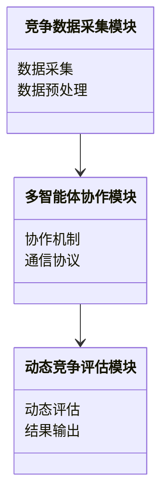
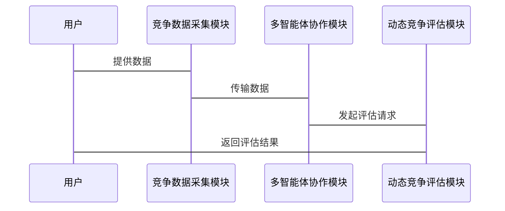

                 


# 多智能体AI如何实现动态竞争格局评估

## 关键词：多智能体AI，动态竞争，竞争格局，协作算法，博弈论

## 摘要：多智能体AI在动态竞争格局评估中，通过协作算法和博弈论模型，实现对复杂竞争环境的实时分析与预测。本文将从背景、核心概念、算法原理、系统架构、项目实战等方面，详细阐述多智能体AI如何动态评估竞争格局，并通过具体案例和代码示例，帮助读者深入理解技术实现。

---

# 第1章 多智能体AI与动态竞争格局评估的背景

## 1.1 多智能体AI的定义与特点

### 1.1.1 多智能体系统的定义
多智能体系统（Multi-Agent System, MAS）是由多个相互作用的智能体组成的分布式系统。智能体（Agent）是具有感知环境、自主决策、执行任务能力的实体。

### 1.1.2 多智能体的核心特点
- **自主性**：智能体能够自主决策，无需外部干预。
- **反应性**：智能体能够实时感知环境变化并做出响应。
- **协作性**：智能体之间可以协作完成复杂任务。
- **分布式性**：智能体之间通过分布式计算实现任务目标。

### 1.1.3 多智能体与单智能体的区别
| 属性 | 单智能体 | 多智能体 |
|------|---------|----------|
| 决策 | 中央化 | 分布化 |
| 通信 | 无 | 有 |
| 协作 | 无 | 有 |

## 1.2 动态竞争格局的定义与特点

### 1.2.1 竞争格局的定义
竞争格局是指多个参与者在竞争环境中相互作用所形成的状态和关系。

### 1.2.2 动态竞争的核心特征
- **实时性**：竞争环境不断变化。
- **复杂性**：参与者之间存在复杂的互动关系。
- **不确定性**：竞争结果具有不确定性。

### 1.2.3 动态竞争格局与静态竞争格局的区别
| 属性 | 静态竞争 | 动态竞争 |
|------|----------|-----------|
| 时间性 | 固定 | 实时变化 |
| 参与者 | 固定 | 动态加入或退出 |
| 竞争结果 | 可预测 | 不可预测 |

## 1.3 多智能体AI在动态竞争中的作用

### 1.3.1 多智能体AI的优势
- **协作能力**：多个智能体可以协作完成复杂任务。
- **实时性**：智能体能够实时感知环境并做出响应。
- **适应性**：智能体能够适应动态变化的竞争环境。

### 1.3.2 多智能体AI在竞争格局评估中的应用
- **实时监测**：监测多个参与者的实时行为。
- **预测分析**：预测竞争环境的变化趋势。
- **决策优化**：优化参与者的决策策略。

### 1.3.3 动态竞争格局评估的挑战
- **实时性要求高**：需要快速响应环境变化。
- **复杂性高**：参与者之间的互动关系复杂。
- **不确定性大**：竞争环境具有高度不确定性。

## 1.4 本章小结
本章介绍了多智能体AI的定义与特点，以及动态竞争格局的定义与特点。同时，分析了多智能体AI在动态竞争格局评估中的作用及其面临的挑战。

---

# 第2章 多智能体AI动态竞争格局评估的核心概念

## 2.1 多智能体系统的核心要素

### 2.1.1 智能体的定义与属性
- **智能体**：具有感知、决策、执行能力的实体。
- **属性**：自主性、反应性、协作性、分布式性。

### 2.1.2 智能体之间的关系
- **协作关系**：智能体之间通过协作完成任务。
- **竞争关系**：智能体之间存在竞争关系。

### 2.1.3 多智能体系统的架构
- **集中式架构**：由一个中央控制器协调多个智能体。
- **分布式架构**：智能体之间通过分布式计算实现协作。

## 2.2 竞争格局评估的数学模型

### 2.2.1 竞争格局的量化指标
- **市场份额**：参与者在市场中的份额。
- **竞争强度**：参与者之间的竞争程度。
- **影响力**：参与者对竞争格局的影响程度。

### 2.2.2 竞争格局评估的数学公式
竞争格局评估的数学模型可以用以下公式表示：
$$
C_i = \sum_{j=1}^{n} w_j \cdot x_j
$$
其中，$C_i$ 表示参与者 $i$ 的竞争能力，$w_j$ 表示权重，$x_j$ 表示指标值。

### 2.2.3 竞争格局评估的边界条件
- **时间范围**：评估的时间段。
- **参与者范围**：参与评估的参与者。
- **数据来源**：数据的来源和可靠性。

## 2.3 多智能体AI与动态竞争格局的关系

### 2.3.1 多智能体AI如何影响竞争格局
- **实时监测**：多智能体AI能够实时监测竞争环境的变化。
- **预测分析**：多智能体AI能够预测竞争环境的变化趋势。
- **决策优化**：多智能体AI能够优化参与者的决策策略。

### 2.3.2 动态竞争格局对多智能体AI的反馈机制
- **动态调整**：竞争环境的变化会反馈给多智能体AI，调整其决策策略。
- **自适应性**：多智能体AI能够根据竞争环境的变化自适应调整。

### 2.3.3 多智能体AI与动态竞争格局的协同进化
- **协同进化**：多智能体AI与动态竞争格局相互作用，共同进化。

## 2.4 本章小结
本章介绍了多智能体系统的核心要素，竞争格局评估的数学模型，以及多智能体AI与动态竞争格局的关系。

---

# 第3章 多智能体AI动态竞争格局评估的算法原理

## 3.1 多智能体协作算法

### 3.1.1 分布式计算与协作机制
- **分布式计算**：智能体之间通过分布式计算实现协作。
- **协作机制**：智能体之间通过通信协议实现协作。

### 3.1.2 联合推理与决策算法
- **联合推理**：多个智能体共同推理出最优决策。
- **决策算法**：基于博弈论的决策算法。

### 3.1.3 跨智能体通信协议
- **通信协议**：智能体之间通过通信协议实现信息交换。
- **信息格式**：信息的格式化表示。

## 3.2 动态竞争评估的数学模型

### 3.2.1 竞争态势的动态建模
- **动态建模**：基于时间序列的动态建模。
- **状态转移**：状态之间的转移关系。

### 3.2.2 基于博弈论的竞争评估
- **博弈论模型**：纳什均衡、极大极小算法。
- **竞争策略**：基于博弈论的竞争策略。

### 3.2.3 动态权重分配算法
- **权重分配**：根据竞争环境的变化动态分配权重。
- **权重调整**：基于反馈机制调整权重。

## 3.3 算法实现的Python代码示例

### 3.3.1 多智能体协作算法实现
```python
class Agent:
    def __init__(self, id):
        self.id = id
        self.state = None

    def perceive(self, environment):
        self.state = environment感知()

    def decide(self):
        return self.state决策()

# 多智能体协作实现
agents = [Agent(1), Agent(2), Agent(3)]
environment = 环境数据()
for agent in agents:
    agent.perceive(environment)
    agent.decide()
```

### 3.3.2 动态竞争评估的数学模型实现
```python
def competition_assessment(participants, weights):
    assessment = {}
    for participant in participants:
        score = 0
        for i in range(len(participants)):
            score += weights[i] * participants[i]
        assessment[participant] = score
    return assessment
```

### 3.3.3 算法性能测试与优化
- **性能测试**：测试算法的运行效率和准确性。
- **优化方法**：基于反馈机制优化算法性能。

## 3.4 本章小结
本章介绍了多智能体协作算法，动态竞争评估的数学模型，以及算法实现的Python代码示例。

---

# 第4章 多智能体AI动态竞争格局评估的系统架构设计

## 4.1 系统功能设计

### 4.1.1 竞争数据采集模块
- **数据采集**：采集竞争环境中的数据。
- **数据预处理**：对数据进行清洗和预处理。

### 4.1.2 多智能体协作模块
- **协作机制**：智能体之间的协作机制。
- **通信协议**：智能体之间的通信协议。

### 4.1.3 动态竞争评估模块
- **动态评估**：基于实时数据动态评估竞争格局。
- **评估结果输出**：输出评估结果。

## 4.2 系统架构设计

### 4.2.1 分层架构设计
- **感知层**：数据采集和预处理。
- **协作层**：智能体协作和通信。
- **评估层**：动态竞争评估和结果输出。

### 4.2.2 模块化设计
- **模块划分**：竞争数据采集模块、多智能体协作模块、动态竞争评估模块。
- **模块接口**：模块之间的接口设计。

### 4.2.3 可扩展性设计
- **扩展性设计**：系统具有可扩展性，能够适应新的参与者和新的竞争环境。

## 4.3 系统接口设计

### 4.3.1 外部数据接口
- **数据接口**：与外部数据源的接口。
- **数据格式**：数据的格式化表示。

### 4.3.2 智能体间通信接口
- **通信接口**：智能体之间的通信接口。
- **通信协议**：智能体之间的通信协议。

### 4.3.3 用户交互接口
- **用户接口**：与用户的交互接口。
- **用户界面**：用户界面的设计与实现。

## 4.4 本章小结
本章介绍了多智能体AI动态竞争格局评估系统的功能设计、架构设计、接口设计等。

---

# 第5章 多智能体AI动态竞争格局评估的项目实战

## 5.1 项目背景与目标

### 5.1.1 项目背景介绍
- **项目背景**：某企业需要实时评估市场中的竞争格局。
- **项目目标**：开发一个多智能体AI系统，实时评估市场中的竞争格局。

### 5.1.2 项目需求分析
- **需求分析**：分析项目的需求，确定系统的功能模块。
- **需求实现**：根据需求设计系统的功能模块。

## 5.2 系统功能设计

### 5.2.1 领域模型类图


### 5.2.2 系统架构设计


### 5.2.3 系统接口设计


## 5.3 系统核心实现

### 5.3.1 核心代码实现
```python
class Agent:
    def __init__(self, id):
        self.id = id
        self.data = None

    def receive_data(self, data):
        self.data = data

    def process_data(self):
        # 数据处理逻辑
        return self.data * 2

# 系统实现
agents = [Agent(1), Agent(2), Agent(3)]
data = 100
for agent in agents:
    agent.receive_data(data)
    result = agent.process_data()
    print(f"Agent {agent.id} 的处理结果为：{result}")
```

### 5.3.2 代码解读与分析
- **Agent类**：定义了智能体的基本属性和方法。
- **数据接收**：智能体接收外部数据。
- **数据处理**：智能体处理接收到的数据并返回结果。

## 5.4 项目实战总结

### 5.4.1 项目实施总结
- **实施过程**：项目实施的详细步骤。
- **问题解决**：项目实施过程中遇到的问题及解决方案。

### 5.4.2 项目成果展示
- **成果展示**：项目成果的展示与分析。
- **成果意义**：项目成果的意义与价值。

## 5.4.3 项目经验总结
- **经验总结**：项目实施中的经验总结。
- **改进建议**：对项目的改进建议。

## 5.5 本章小结
本章通过具体的项目实战，详细阐述了多智能体AI动态竞争格局评估系统的实现过程，包括系统设计、功能实现、代码解读等。

---

# 第6章 总结与展望

## 6.1 总结

### 6.1.1 核心技术总结
- **核心技术**：多智能体协作算法、动态竞争评估模型。
- **实现方法**：基于博弈论的算法实现、分布式计算。

### 6.1.2 实践总结
- **实践经验**：项目实施中的经验和教训。
- **技术总结**：多智能体AI在动态竞争格局评估中的技术优势。

## 6.2 未来展望

### 6.2.1 技术发展
- **技术趋势**：多智能体AI技术的发展趋势。
- **技术挑战**：多智能体AI技术面临的挑战。

### 6.2.2 应用前景
- **应用场景**：多智能体AI在其他领域的应用前景。
- **未来发展方向**：多智能体AI在动态竞争格局评估中的未来发展方向。

## 6.3 本章小结
本章对全文进行了总结，并展望了多智能体AI在动态竞争格局评估技术的未来发展方向。

---

# 参考文献
（此处列出参考文献）

---

# 附录
（此处列出附录内容）

---

通过以上结构和内容，您可以撰写一篇详细的、逻辑清晰的关于“多智能体AI如何实现动态竞争格局评估”的技术博客文章。

