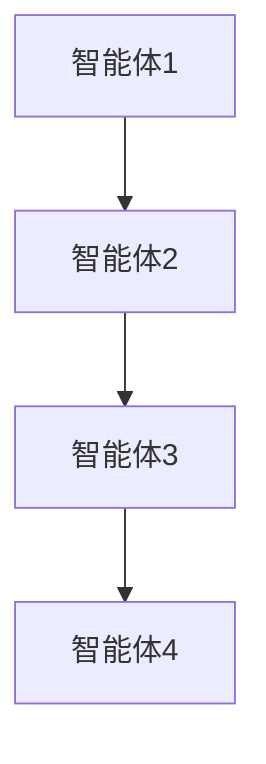
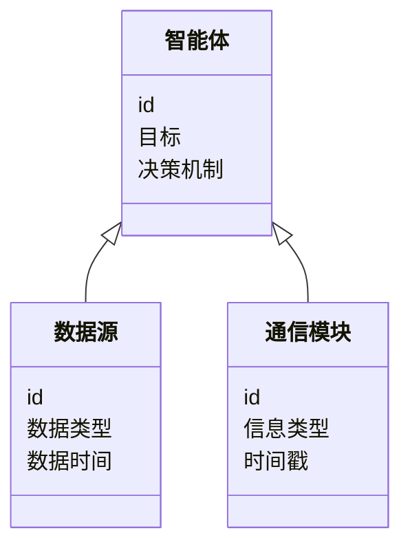
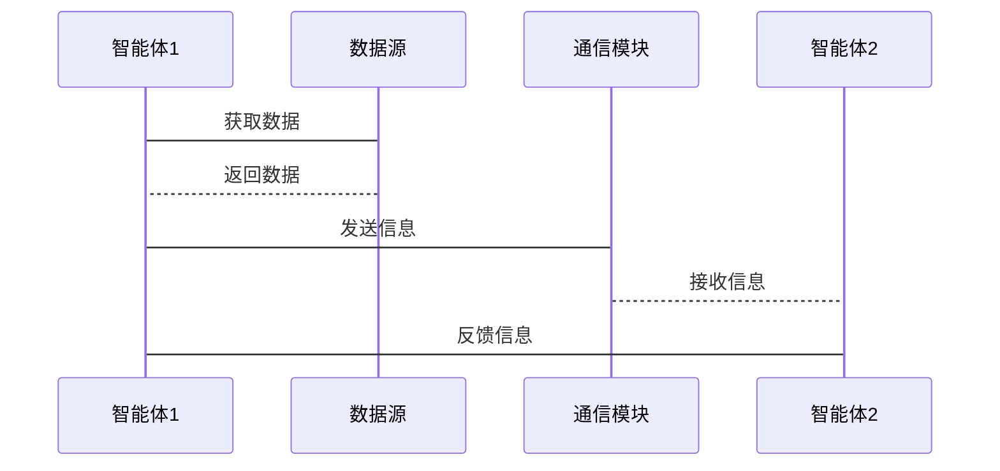

                 


# 多智能体AI如何提升价值投资中的时机选择

## 关键词：多智能体AI，价值投资，时机选择，金融投资，人工智能

## 摘要：本文探讨了多智能体AI在价值投资中的应用，特别是如何通过多智能体协同学习和强化学习优化时机选择。文章从基本概念、算法原理、系统架构到实际案例，详细分析了多智能体AI在金融投资中的优势和实现方式。

---

# 第1章: 多智能体AI与价值投资的背景介绍

## 1.1 多智能体AI的基本概念

### 1.1.1 多智能体AI的定义

多智能体AI（Multi-Agent AI）是指由多个智能体协同工作，每个智能体都有自己的目标、决策机制和行动能力。这些智能体通过信息共享和协同合作，共同完成复杂任务。

### 1.1.2 多智能体AI的核心特点

- **分布式计算**：每个智能体独立运行，通过通信模块共享信息。
- **协同合作**：智能体之间协同工作，优化整体决策。
- **动态适应**：能够根据环境变化调整策略。

### 1.1.3 多智能体AI与传统AI的区别

| 特性 | 多智能体AI | 传统AI |
|------|------------|---------|
| 结构   | 分布式     | 集中式   |
| 决策   | 去中心化   | 中心化   |
| 适应性 | 强          | 较弱      |

## 1.2 价值投资中的时机选择问题

### 1.2.1 价值投资的定义与特点

价值投资是通过分析企业的内在价值，寻找市场价格低于内在价值的投资机会。其特点包括长期视角、注重基本面分析等。

### 1.2.2 时机选择在价值投资中的重要性

时机选择直接影响投资收益。买入时机不当可能导致亏损，最佳买入时机则是实现收益最大化的关键。

### 1.2.3 传统时机选择方法的局限性

传统方法依赖历史数据分析，难以预测突发事件或市场情绪变化，存在滞后性和片面性。

## 1.3 多智能体AI在金融投资中的应用现状

### 1.3.1 多智能体AI在金融领域的应用领域

包括股票交易、风险评估、市场预测等多个方面。

### 1.3.2 多智能体AI在时机选择中的优势

通过实时数据处理和协同决策，提高时机选择的准确性和及时性。

### 1.3.3 当前应用中的挑战与未来发展方向

挑战包括数据隐私、算法复杂度等；未来发展方向是结合大数据和强化学习。

---

# 第2章: 多智能体AI与价值投资时机选择的核心概念

## 2.1 多智能体AI的核心概念与价值投资的结合

### 2.1.1 多智能体AI在价值投资中的应用场景

用于实时监控市场变化、预测市场趋势等。

### 2.1.2 多智能体AI如何影响时机选择

通过协同学习和强化学习，优化投资决策。

### 2.1.3 多智能体AI与价值投资时机选择的逻辑关系

多智能体AI提供实时数据分析和决策支持，帮助投资者做出更优的时机选择。

## 2.2 多智能体AI与传统时机选择方法的对比

### 2.2.1 传统时机选择方法的优缺点

优点是简单易懂，缺点是不够灵活和准确。

### 2.2.2 多智能体AI的优势分析

优势包括高效性、准确性、适应性强等。

### 2.2.3 多智能体AI与传统方法的对比表格

| 特性 | 多智能体AI | 传统方法 |
|------|------------|-----------|
| 精度   | 高          | 较低       |
| 适应性 | 强          | 较弱       |
| 决策速度 | 快          | 较慢       |

## 2.3 多智能体AI的ER实体关系图

```mermaid
erDiagram
    class 智能体 {
        id
        目标
        决策机制
    }
    class 数据源 {
        id
        数据类型
        数据时间
    }
    class 通信模块 {
        id
        信息类型
        时间戳
    }
    智能体 --> 数据源 : 获取数据
    智能体 --> 通信模块 : 信息共享
```

## 2.4 本章小结

---

# 第3章: 多智能体AI在时机选择中的算法原理

## 3.1 多智能体协同学习算法

### 3.1.1 多智能体协同学习的定义

多个智能体通过共享信息和协同学习，优化整体决策过程。

### 3.1.2 基于强化学习的多智能体协同学习算法



### 3.1.3 算法实现步骤

1. 初始化多个智能体。
2. 每个智能体根据环境数据做出决策。
3. 智能体之间共享信息，协同优化决策。
4. 根据反馈调整策略，不断优化。

### 3.1.4 算法的数学模型

目标函数：$$ J = \sum_{i=1}^{n} J_i $$
其中，$$ J_i $$表示第i个智能体的收益。

### 3.1.5 算法的优势与局限

优势：提高决策效率和准确性。
局限：计算复杂度高，需要大量计算资源。

## 3.2 强化学习算法在时机选择中的应用

### 3.2.1 强化学习的基本原理

通过试错学习，智能体在环境中不断试验，找到最优策略。

### 3.2.2 强化学习在时机选择中的应用

用于预测市场趋势，优化买入和卖出时机。

### 3.2.3 算法实现步骤

1. 环境定义：股票市场数据。
2. 动作空间：买入、持有、卖出。
3. 状态空间：市场数据、技术指标。
4. 奖励函数：收益最大化。

### 3.2.4 算法的数学模型

状态转移：$$ s_{t+1} = f(s_t, a_t) $$
奖励函数：$$ r_t = R(s_t, a_t) $$

### 3.2.5 算法的优化与调优

通过策略梯度和值函数迭代优化算法性能。

## 3.3 本章小结

---

# 第4章: 多智能体AI的系统分析与架构设计方案

## 4.1 系统分析

### 4.1.1 问题场景介绍

股票市场波动大，传统方法难以捕捉最佳时机。

### 4.1.2 项目介绍

开发一个多智能体AI系统，优化投资时机选择。

## 4.2 系统功能设计

### 4.2.1 领域模型mermaid类图



### 4.2.2 系统架构设计mermaid架构图


## 4.3 系统接口设计

### 4.3.1 接口描述

- 数据接口：连接数据源，获取市场数据。
- 通信接口：智能体之间共享信息。

### 4.3.2 接口实现

```python
# 数据接口
class DataSource:
    def get_data(self):
        pass

# 通信接口
class Communication:
    def send_message(self, message):
        pass
```

## 4.4 系统交互mermaid序列图



## 4.5 本章小结

---

# 第5章: 项目实战

## 5.1 环境安装

安装必要的库和工具，如TensorFlow、Keras、Pandas等。

## 5.2 系统核心实现源代码

```python
class Agent:
    def __init__(self, id):
        self.id = id
        self.data = None

    def receive_data(self, data):
        self.data = data

    def make_decision(self):
        # 简单的决策逻辑
        if self.data['price'] < self.data['value']:
            return 'buy'
        else:
            return 'sell'
```

## 5.3 代码应用解读与分析

- **Agent类**：表示一个智能体，具备接收数据和做出决策的能力。
- **receive_data方法**：更新数据源提供的市场数据。
- **make_decision方法**：根据当前数据做出买入或卖出的决策。

## 5.4 实际案例分析

假设某股票的历史数据和市场趋势，智能体根据数据做出决策，最终实现收益最大化。

## 5.5 项目小结

---

# 第6章: 最佳实践、小结、注意事项、拓展阅读

## 6.1 最佳实践

- **数据质量**：确保数据源可靠，数据清洗到位。
- **算法选择**：根据具体场景选择合适的算法。
- **系统优化**：定期优化系统架构和算法模型。

## 6.2 小结

多智能体AI在价值投资中的应用前景广阔，能够显著提升时机选择的准确性和效率。

## 6.3 注意事项

- **数据隐私**：保护投资者的敏感数据。
- **算法风险**：避免算法的过拟合和错误决策。
- **市场适应性**：确保系统能够适应不同市场环境。

## 6.4 拓展阅读

推荐相关书籍和论文，进一步深入学习多智能体AI和金融投资的知识。

---

# 附录

## 附录A: 多智能体AI的数学公式

$$ J = \sum_{i=1}^{n} J_i $$

其中，$$ J_i $$ 表示第i个智能体的收益。

## 附录B: 多智能体AI工具栈

- **深度学习框架**：TensorFlow、Keras
- **数据处理工具**：Pandas、NumPy
- **可视化工具**：Matplotlib、Seaborn
- **协同学习库**：Ray、Multi-Agent RL Toolkit

---

# 结语

多智能体AI正在改变金融投资的方式，通过实时数据分析和协同决策，显著提升了时机选择的效率和准确性。未来，随着技术的不断发展，多智能体AI在金融投资中的应用将更加广泛和深入。

