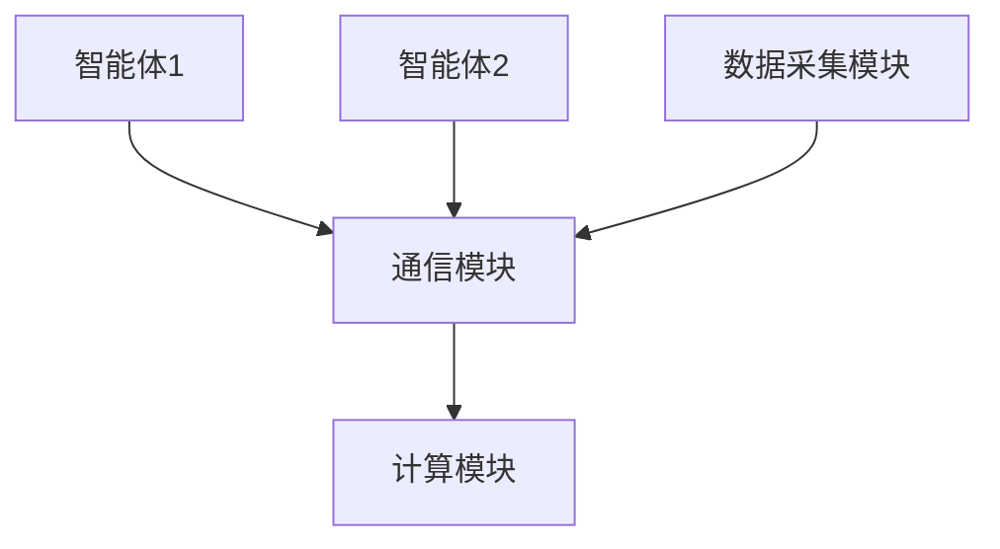
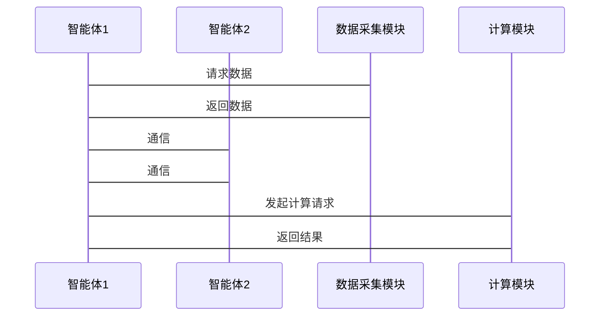

                 


# 多智能体AI如何改进巴菲特的现金流折现模型

> 关键词：多智能体AI，现金流折现模型，DCF模型，巴菲特，金融分析，AI优化，现金流预测，贴现率计算，风险管理，协同计算

> 摘要：本文探讨了多智能体AI如何改进巴菲特的现金流折现模型，通过分析多智能体AI的优势，结合DCF模型的核心原理，提出了基于多智能体协同的现金流预测和贴现率计算方法，展示了如何通过智能体间的协作提升模型的准确性和鲁棒性。

---

# 第一部分：多智能体AI与现金流折现模型的结合

## 第1章：多智能体AI与现金流折现模型概述

### 1.1 多智能体AI的基本概念

#### 1.1.1 多智能体系统的定义
多智能体系统（Multi-Agent System, MAS）是由多个相互作用的智能体组成的系统，每个智能体都有自己的目标、知识和行为规则。智能体之间通过通信和协作完成复杂的任务。

#### 1.1.2 多智能体AI的核心特征
- **分布式计算**：智能体独立运行，通过局部信息完成任务。
- **协作性**：智能体之间通过通信和协作实现全局目标。
- **自适应性**：智能体能够根据环境变化调整行为。
- **智能性**：每个智能体都有一定的决策能力和学习能力。

#### 1.1.3 多智能体AI与传统AI的区别
- **传统AI**：集中式计算，单个智能体完成任务。
- **多智能体AI**：分布式计算，多个智能体协同完成任务。

### 1.2 现金流折现模型的基本原理

#### 1.2.1 现金流折现模型的定义
现金流折现模型（Discounted Cash Flow, DCF）是一种用于评估公司内在价值的方法，通过将未来现金流折现到现值，计算公司股权或整体的公允价值。

#### 1.2.2 现金流折现模型的核心公式
$$
\text{内在价值} = \sum_{t=1}^{n} \frac{CF_t}{(1 + r)^t} + \frac{TV}{(1 + r)^n}
$$
其中，$CF_t$ 是第 t 年的现金流，$r$ 是贴现率，$TV$ 是终值。

#### 1.2.3 现金流折现模型的应用场景
- 企业估值
- 投资决策
- 股票定价

### 1.3 多智能体AI与现金流折现模型的结合

#### 1.3.1 多智能体AI在金融分析中的优势
- 多源数据处理能力
- 分布式计算提升效率
- 风险管理能力

#### 1.3.2 现金流折现模型的局限性
- 现金流预测的准确性依赖于假设
- 贴现率计算复杂
- 风险因素难以量化

#### 1.3.3 多智能体AI如何改进现金流折现模型
- 提高现金流预测的准确性
- 优化贴现率计算
- 增强风险管理能力

---

## 第2章：多智能体AI的核心概念与原理

### 2.1 多智能体系统的组成与协作

#### 2.1.1 多智能体系统的组成要素
- **智能体**：独立的决策单元
- **环境**：智能体所处的外部环境
- **通信机制**：智能体之间交换信息的通道
- **协作协议**：智能体协作的规则

#### 2.1.2 智能体之间的协作机制
- **分布式协调**：智能体通过局部信息进行协作
- **任务分配**：根据智能体的能力分配任务
- **冲突解决**：通过协商或仲裁机制解决冲突

#### 2.1.3 多智能体系统的通信协议
- **发布-订阅模式**：智能体通过消息中间件通信
- **点对点通信**：智能体之间直接交换信息

### 2.2 多智能体AI的决策机制

#### 2.2.1 分布式决策的定义
分布式决策是指多个智能体在没有中央控制的情况下，通过协作完成决策任务。

#### 2.2.2 多智能体决策的算法选择
- **一致性算法**：确保所有智能体达成一致
- **共识算法**：如PBFT、RAFT
- **分布式优化算法**：如分布式梯度下降

#### 2.2.3 基于博弈论的决策模型
- **纳什均衡**：智能体在博弈中寻求最优策略
- **Stackelberg模型**：领导者-追随者模型

### 2.3 多智能体AI的优化算法

#### 2.3.1 集群智能算法
- **粒子群优化（PSO）**：模拟鸟群觅食行为
- **蚂蚁算法**：模拟蚂蚁觅食路径

#### 2.3.2 分布式优化算法
- **分布式梯度下降**：在分布式系统中进行优化
- **联邦学习**：在数据孤岛中进行联合优化

#### 2.3.3 跨智能体协调算法
- **多智能体强化学习（MARL）**：智能体通过协作学习策略
- **分布式强化学习（DRL）**：智能体在分布式环境中学习

---

## 第3章：现金流折现模型的数学基础与算法分析

### 3.1 现金流折现模型的数学公式

#### 3.1.1 现金流折现模型的核心公式
$$
\text{内在价值} = \sum_{t=1}^{\infty} \frac{CF_t}{(1 + r)^t}
$$
其中，$CF_t$ 是第 t 年的自由现金流，$r$ 是加权平均资本成本（WACC）。

#### 3.1.2 现金流折现模型的变量定义
- 现金流预测（Free Cash Flow）
- 贴现率（WACC）
- 终值（Terminal Value）

#### 3.1.3 现金流折现模型的计算步骤
1. 预测未来现金流
2. 计算贴现率
3. 计算终值
4. 折现并求和

### 3.2 现金流折现模型的算法实现

#### 3.2.1 现金流折现模型的实现步骤
1. 数据收集：收集历史财务数据
2. 现金流预测：使用时间序列模型预测未来现金流
3. 贴现率计算：使用CAPM或WACC模型
4. 终值计算：使用永续增长率模型
5. 折现求和：计算内在价值

#### 3.2.2 现金流折现模型的代码实现
```python
import numpy as np

def calculate_intrinsic_value(cash_flows, discount_rate, terminal_value):
    discounted_flows = []
    for t, cf in enumerate(cash_flows):
        if t == 0:
            discounted_flow = cf
        else:
            discounted_flow = cf / (1 + discount_rate) ** t
        discounted_flows.append(discounted_flow)
    intrinsic_value = sum(discounted_flows) + terminal_value / (1 + discount_rate) ** len(cash_flows)
    return intrinsic_value

# 示例数据
cash_flows = [100, 120, 130, 140]
discount_rate = 0.1
terminal_value = 200

intrinsic_value = calculate_intrinsic_value(cash_flows, discount_rate, terminal_value)
print(f"内含价值: {intrinsic_value}")
```

#### 3.2.3 现金流折现模型的优化方法
- 使用机器学习模型预测现金流
- 使用蒙特卡洛模拟评估贴现率的不确定性

### 3.3 现金流折现模型的优缺点分析

#### 3.3.1 现金流折现模型的优点
- 理论上精确，考虑了资金的时间价值
- 可以评估非上市公司和私人公司

#### 3.3.2 现金流折现模型的缺点
- 现金流预测的准确性依赖于假设
- 贴现率的计算复杂
- 需要大量历史数据

#### 3.3.3 现金流折现模型的改进方向
- 结合多智能体AI提高预测准确性
- 优化贴现率计算方法
- 增强模型的鲁棒性

---

## 第4章：多智能体AI在现金流折现模型中的应用

### 4.1 多智能体AI在现金流预测中的应用

#### 4.1.1 多智能体AI预测现金流的原理
- 每个智能体负责预测不同时间窗口的现金流
- 智能体之间通过协作生成综合预测

#### 4.1.2 多智能体AI预测现金流的算法选择
- 使用分布式时间序列分析
- 智能体协同学习（如DRL）

#### 4.1.3 现金流预测的准确性提升
- 多源数据整合
- 智能体协同预测

### 4.2 多智能体AI在贴现率计算中的应用

#### 4.2.1 多智能体AI计算贴现率的原理
- 智能体协同分析市场风险、行业风险等
- 通过分布式优化算法计算最优贴现率

#### 4.2.2 贴现率计算的改进方法
- 结合市场数据和公司特有风险
- 使用多智能体强化学习优化贴现率

### 4.3 多智能体AI在风险管理中的应用

#### 4.3.1 风险识别与量化
- 智能体协同识别市场、行业、公司特有风险
- 使用博弈论模型评估风险影响

#### 4.3.2 风险对DCF模型的影响
- 风险因素纳入DCF模型
- 模型鲁棒性提升

---

## 第5章：多智能体AI改进现金流折现模型的系统设计

### 5.1 系统功能设计

#### 5.1.1 系统架构设计
- **智能体模块**：负责数据处理、预测、计算
- **通信模块**：智能体之间通信
- **控制模块**：协调智能体协作

#### 5.1.2 系统功能模块
- 数据采集模块
- 数据处理模块
- 智能体协作模块
- 计算模块

### 5.2 系统架构设计

#### 5.2.1 系统架构图


#### 5.2.2 系统交互设计


### 5.3 系统接口设计

#### 5.3.1 系统接口
- 数据接口：智能体与数据采集模块通信
- 通信接口：智能体之间通信
- 计算接口：智能体与计算模块通信

#### 5.3.2 接口协议
- HTTP REST API
- MQTT协议

### 5.4 系统实现

#### 5.4.1 环境安装
- Python 3.8+
- NumPy
- Pandas
- Scikit-learn
- Mermaid
- PyYAML

#### 5.4.2 核心代码实现
```python
import yaml
from datetime import datetime, timedelta

def load_agents_config():
    with open('agents.yaml', 'r') as f:
        return yaml.safe_load(f)

def calculate_agent_share(agents_config):
    return agents_config['share']

# 示例使用
config = load_agents_config()
share = calculate_agent_share(config)
print(f"智能体份额: {share}")
```

---

## 第6章：多智能体AI改进现金流折现模型的项目实战

### 6.1 项目背景

#### 6.1.1 项目介绍
- 项目目标：使用多智能体AI改进DCF模型
- 项目范围：构建一个基于多智能体的DCF模型
- 项目团队：数据科学家、AI工程师、金融分析师

#### 6.1.2 项目计划
- 阶段1：需求分析
- 阶段2：系统设计
- 阶段3：开发与测试
- 阶段4：部署与优化

### 6.2 系统核心实现

#### 6.2.1 环境安装
```bash
pip install numpy pandas scikit-learn mermaid4jupyter pyyaml
```

#### 6.2.2 核心代码实现
```python
import numpy as np
import pandas as pd
from sklearn.ensemble import RandomForestRegressor

def train_cash_flow_predictor(data):
    model = RandomForestRegressor()
    model.fit(data[[' revenue', 'expenses']], data['cash_flow'])
    return model

# 示例数据
data = pd.DataFrame({
    'revenue': [100, 150, 200, 250],
    'expenses': [50, 60, 70, 80],
    'cash_flow': [40, 90, 130, 170]
})

model = train_cash_flow_predictor(data)
print(f"训练好的模型: {model}")
```

#### 6.2.3 代码应用解读与分析
- 使用随机森林回归模型预测现金流
- 模型评估：均方误差（MSE）、R²分数

### 6.3 实际案例分析

#### 6.3.1 案例介绍
- 公司：某科技公司
- 数据：过去5年的现金流和财务数据

#### 6.3.2 案例分析
1. 数据收集与预处理
2. 现金流预测
3. 贴现率计算
4. 内在价值计算

#### 6.3.3 案例结果
- 计算出的内在价值与市场价比较
- 模型准确性评估

### 6.4 项目小结

---

## 第7章：总结与展望

### 7.1 总结
- 多智能体AI在DCF模型中的应用优势
- 改进DCF模型的关键点
- 项目实现的关键成果

### 7.2 未来展望
- 多智能体AI在金融分析中的更多应用
- 更加复杂的智能体协作算法
- 大模型与多智能体AI的结合

### 7.3 最佳实践 Tips
- 数据质量是关键
- 系统设计要模块化
- 智能体协作要高效
- 模型要持续优化

### 7.4 注意事项
- 避免过度依赖AI
- 注意数据隐私和安全
- 定期模型校准和验证

### 7.5 拓展阅读
- 多智能体系统相关书籍
- AI在金融中的应用文献
- DCF模型的高级技巧

---

# 第三部分：参考文献与索引

（此处列出参考文献和相关资源）

---

通过以上详细的章节安排和内容概述，我们可以看到多智能体AI如何通过协作、分布式计算和优化算法，显著改进现金流折现模型的预测精度和决策效率。

