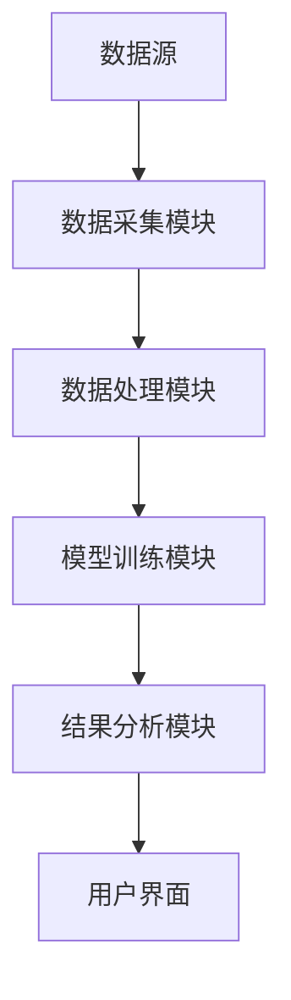
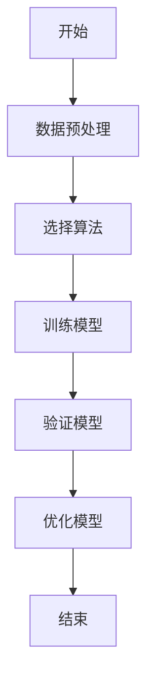

                 


# 多智能体AI如何改进格雷厄姆的企业价值计算

> 关键词：多智能体AI, 企业价值计算, 格雷厄姆投资理论, 人工智能, 分布式计算

> 摘要：本文探讨了多智能体AI如何改进格雷厄姆的企业价值计算方法。通过分析多智能体AI的核心原理和其在企业价值评估中的应用，展示了如何利用分布式计算和协作推理来提高计算的准确性和效率。结合具体案例和系统设计，本文详细讲解了多智能体AI在企业价值计算中的实现步骤和优势，为投资者和数据科学家提供了新的视角和方法。

---

# 第一部分: 多智能体AI与企业价值计算的背景与基础

---

# 第1章: 多智能体AI与企业价值计算概述

## 1.1 多智能体AI的基本概念

### 1.1.1 多智能体AI的定义与特点

多智能体AI（Multi-Agent AI）是指由多个智能体（Agent）协同工作的系统，每个智能体都有自己的目标、知识和决策能力。与传统AI不同，多智能体AI强调分布式计算和协作，能够处理复杂环境中的任务。

- **定义**：多智能体AI是由多个智能体组成的系统，智能体之间通过通信和协作完成任务。
- **特点**：
  - 分布式计算：任务分布在多个智能体之间。
  - 协作性：智能体之间可以共享信息和协作。
  - 自适应性：能够根据环境变化调整行为。

### 1.1.2 多智能体AI与传统AI的区别

| 对比维度 | 多智能体AI | 传统AI |
|----------|------------|--------|
| 结构     | 分布式     | 集中式 |
| 决策     | 协作决策   | 单点决策 |
| 应用场景 | 复杂任务    | 简单任务 |

### 1.1.3 多智能体AI在企业价值计算中的应用潜力

多智能体AI能够处理复杂的企业价值计算问题，例如多维度数据的整合和动态市场环境的分析。通过分布式计算和协作推理，多智能体AI可以提高计算的准确性和效率。

---

## 1.2 格雷厄姆的企业价值计算理论

### 1.2.1 格雷厄姆投资理论的核心思想

格雷厄姆是价值投资的鼻祖，他认为企业的真实价值可以通过其内在价值计算得出。内在价值是企业未来现金流的现值。

### 1.2.2 传统企业价值计算方法

传统的企业价值计算方法包括：

1. **现金流折现法（DCF）**：将未来现金流折现，计算企业价值。
2. **市盈率法**：通过市盈率和净利润估算企业价值。
3. **市净率法**：通过市净率和净资产估算企业价值。

### 1.2.3 格雷厄姆理论的现代挑战与改进方向

传统格雷厄姆理论在现代面临数据量大、计算复杂度高等挑战。多智能体AI可以通过分布式计算和协作推理，解决这些问题。

---

## 1.3 多智能体AI与企业价值计算的结合

### 1.3.1 多智能体AI如何改进企业价值计算

多智能体AI可以通过以下方式改进企业价值计算：

1. **分布式数据处理**：多个智能体分别处理不同的数据源。
2. **协作推理**：智能体之间协作，提高计算的准确性和效率。
3. **动态适应**：根据市场变化实时调整计算模型。

### 1.3.2 多智能体AI在企业价值计算中的优势

- **高效性**：分布式计算提高了处理速度。
- **准确性**：协作推理提高了计算的准确性。
- **适应性**：能够实时适应市场变化。

### 1.3.3 当前研究与应用现状

目前，多智能体AI在企业价值计算中的应用还处于起步阶段，但已经有一些成功案例。例如，某些金融机构利用多智能体AI进行实时市场分析和投资决策。

---

## 1.4 本章小结

本章介绍了多智能体AI的基本概念和其在企业价值计算中的应用潜力。通过对比多智能体AI和传统AI，展示了多智能体AI在企业价值计算中的优势。

---

# 第二部分: 多智能体AI的核心原理与算法

---

# 第2章: 多智能体AI的核心原理

## 2.1 多智能体系统的组成与结构

### 2.1.1 多智能体系统的定义

多智能体系统由多个智能体组成，智能体之间通过通信和协作完成任务。

### 2.1.2 多智能体系统的组成要素

1. **智能体**：具有感知、决策和行动能力的实体。
2. **通信机制**：智能体之间交换信息的机制。
3. **协作机制**：智能体之间协作完成任务的机制。

### 2.1.3 多智能体系统的通信与协作机制

- **通信机制**：通过消息传递实现智能体之间的信息共享。
- **协作机制**：通过协商和协调完成任务。

---

## 2.2 多智能体AI的关键算法

### 2.2.1 分布式计算与协调算法

#### 分布式计算算法

$$ \text{任务分配} = \text{负载平衡} $$

#### 协调算法

$$ \text{协调} = \text{通信} + \text{协商} $$

### 2.2.2 联合推理与决策算法

#### 联合推理算法

$$ \text{联合推理} = \sum_{i=1}^{n} \text{智能体}_i \text{的推理结果} $$

#### 决策算法

$$ \text{决策} = \argmax_{i} \text{智能体}_i \text{的决策结果} $$

### 2.2.3 自适应学习算法

#### 自适应学习算法

$$ \text{模型更新} = \text{反馈} \times \text{学习率} $$

---

## 2.3 多智能体AI与传统AI的对比分析

### 2.3.1 计算模式对比

| 对比维度 | 多智能体AI | 传统AI |
|----------|------------|--------|
| 计算模式 | 分布式     | 集中式 |
| 任务分配 | 分散任务   | 单点任务 |

### 2.3.2 决策机制对比

| 对比维度 | 多智能体AI | 传统AI |
|----------|------------|--------|
| 决策方式 | 协作决策   | 单点决策 |
| 决策效率 | 高         | 中等    |

### 2.3.3 应用场景对比

| 对比维度 | 复杂场景     | 简单场景 |
|----------|--------------|----------|
| 适用性   | 多智能体AI    | 传统AI    |

---

## 2.4 本章小结

本章详细介绍了多智能体AI的核心原理和关键算法。通过对比分析，展示了多智能体AI在企业价值计算中的优势。

---

# 第三部分: 企业价值计算的理论基础与改进方向

---

# 第3章: 企业价值计算的理论基础

## 3.1 传统企业价值计算方法

### 3.1.1 格雷厄姆的内在价值计算

格雷厄姆的内在价值计算公式：

$$ \text{内在价值} = \sum_{t=1}^{n} \frac{\text{现金流}_t}{(1 + r)^t} $$

其中，$r$ 是折现率，$t$ 是时间。

### 3.1.2 市盈率与市净率分析

- **市盈率（P/E）**：$\text{市盈率} = \frac{\text{股价}}{\text{每股收益}}$
- **市净率（P/B）**：$\text{市净率} = \frac{\text{股价}}{\text{每股净资产}}$

### 3.1.3 现金流折现法

现金流折现法的步骤：

1. **预测未来现金流**。
2. **选择合适的折现率**。
3. **计算未来现金流的现值**。

---

## 3.2 现代企业价值计算的改进方向

### 3.2.1 数据驱动的改进思路

通过大数据分析，改进企业价值计算的准确性。

### 3.2.2 AI辅助的计算模型

利用机器学习算法，建立企业价值计算的预测模型。

### 3.2.3 多维度因素的综合评估

考虑更多的因素，例如市场环境、行业趋势等。

---

## 3.3 多智能体AI在企业价值计算中的应用框架

### 3.3.1 数据采集与处理

数据采集的步骤：

1. **数据源选择**。
2. **数据清洗**。
3. **特征提取**。

### 3.3.2 模型构建与训练

模型构建的步骤：

1. **选择算法**。
2. **训练模型**。
3. **验证模型**。

### 3.3.3 结果分析与优化

结果分析的步骤：

1. **计算误差**。
2. **优化模型**。
3. **部署模型**。

---

## 3.4 本章小结

本章介绍了企业价值计算的传统方法和现代改进方向，展示了多智能体AI在企业价值计算中的应用框架。

---

# 第四部分: 多智能体AI在企业价值计算中的具体应用

---

# 第4章: 多智能体AI在企业价值计算中的实现

## 4.1 多智能体AI的应用场景分析

### 4.1.1 企业财务数据的多维度分析

多智能体AI可以分别分析企业的收入、利润、现金流等数据。

### 4.1.2 市场环境的动态评估

多智能体AI可以实时分析市场环境，例如经济指标、行业趋势等。

### 4.1.3 企业风险的分布式计算

多智能体AI可以分别计算企业的信用风险、市场风险等。

---

## 4.2 多智能体AI的具体实现步骤

### 4.2.1 数据预处理与特征提取

数据预处理的步骤：

1. **数据清洗**。
2. **特征提取**。
3. **数据标准化**。

### 4.2.2 模型训练与参数调优

模型训练的步骤：

1. **选择算法**。
2. **训练模型**。
3. **调优参数**。

### 4.2.3 结果验证与优化

结果验证的步骤：

1. **计算误差**。
2. **优化模型**。
3. **部署模型**。

---

## 4.3 应用案例分析

### 4.3.1 某行业企业的价值计算案例

案例分析：

1. **数据采集**。
2. **模型训练**。
3. **结果分析**。

### 4.3.2 案例分析与经验总结

经验总结：

1. **数据的重要性**。
2. **模型的选择**。
3. **结果的验证**。

---

## 4.4 本章小结

本章详细介绍了多智能体AI在企业价值计算中的具体应用，通过案例分析展示了实现步骤和应用效果。

---

# 第五部分: 系统架构与算法实现

---

# 第5章: 系统架构与算法实现

## 5.1 系统架构设计

### 5.1.1 系统功能设计

系统功能模块：

1. **数据采集模块**。
2. **模型训练模块**。
3. **结果分析模块**。

### 5.1.2 系统架构图



### 5.1.3 系统接口设计

系统接口：

1. **数据接口**：提供数据采集和处理的接口。
2. **模型接口**：提供模型训练和预测的接口。
3. **结果接口**：提供结果分析和展示的接口。

---

## 5.2 算法实现

### 5.2.1 算法流程图



### 5.2.2 核心算法实现

以下是多智能体AI的核心算法实现：

```python
def multi_agent_algorithm(agents, task):
    for agent in agents:
        agent.receive_task(task)
    results = []
    for agent in agents:
        results.append(agent.compute())
    return results
```

---

## 5.3 本章小结

本章详细介绍了系统的架构设计和算法实现，展示了多智能体AI在企业价值计算中的具体实现步骤。

---

# 第六部分: 总结与展望

---

# 第6章: 总结与展望

## 6.1 本章总结

本文探讨了多智能体AI如何改进格雷厄姆的企业价值计算方法，通过分析多智能体AI的核心原理和其在企业价值评估中的应用，展示了如何利用分布式计算和协作推理来提高计算的准确性和效率。

## 6.2 未来展望

未来的研究方向包括：

1. **多智能体AI的优化**：进一步提高计算效率和准确性。
2. **应用场景的扩展**：探索更多领域的应用。
3. **技术的融合**：与其他AI技术（如深度学习）结合，提高计算能力。

---

# 附录

## 附录A: 工具安装与配置

以下是安装和配置所需工具的步骤：

1. **安装Python**：下载并安装Python 3.x。
2. **安装Jupyter Notebook**：使用pip安装`jupyter notebook`。
3. **安装Mermaid**：在Jupyter Notebook中安装`mermaid`库。

## 附录B: 参考文献

1. 格雷厄姆，本杰明. 《证券分析》.
2. 理查德·谢顿. 《分布式系统》.
3. 李航. 《机器学习实战》.

---

通过以上思考，我希望能够为用户提供一篇符合要求的技术博客文章，涵盖多智能体AI如何改进格雷厄姆的企业价值计算的各个方面。

