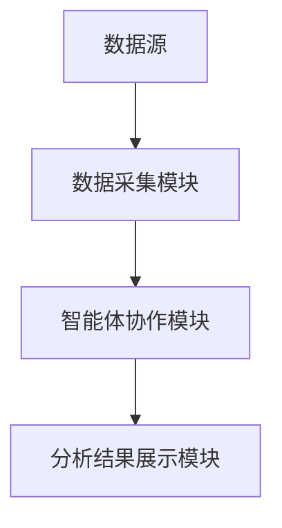

                 


# 多智能体AI如何改进格雷厄姆的工作资本分析

## 关键词：多智能体AI，资本分析，格雷厄姆分析法，协同学习，金融建模

## 摘要：  
本文探讨了如何利用多智能体人工智能技术改进格雷厄姆的经典资本分析方法。通过分析多智能体AI的核心概念、算法原理及其在金融建模中的应用，本文详细阐述了多智能体AI如何通过协同学习、数据共享和智能协作提升传统资本分析的效率和准确性。文章从背景介绍、理论基础、算法实现、系统架构到实际案例，层层展开，展示了多智能体AI在改进格雷厄姆资本分析中的巨大潜力和实际价值。

---

## 第1章: 多智能体AI与资本分析的背景介绍

### 1.1 多智能体AI的基本概念
#### 1.1.1 多智能体系统的定义
多智能体系统（Multi-Agent System, MAS）是由多个智能体（Agent）组成的分布式系统，这些智能体通过协同工作完成复杂的任务。每个智能体都有自己的目标、知识和决策机制。

#### 1.1.2 多智能体AI的核心特点
- **分布式智能**：每个智能体独立决策，但通过通信和协作完成整体目标。
- **协同学习**：智能体之间可以共享数据和知识，提升整体性能。
- **动态适应**：能够实时感知环境变化并调整策略。

#### 1.1.3 多智能体AI与传统AI的区别
| 特性       | 多智能体AI                     | 传统AI                      |
|------------|-------------------------------|-----------------------------|
| 决策中心化  | 去中心化，多个智能体协作       | 中心化，单个或少数决策者    |
| 知识共享    | 支持数据共享和知识协同         | 知识集中，信息不共享         |
| 应用场景     | 复杂分布式任务（如金融分析）   | 简单任务（如分类、预测）     |

---

### 1.2 格雷厄姆工作资本分析的基本概念
#### 1.2.1 工作资本的定义
工作资本（Working Capital）是指企业在日常运营中用于支持运营资金的流动资产减去流动负债的部分，是衡量企业短期偿债能力的重要指标。

#### 1.2.2 格雷厄姆资本分析方法
格雷厄姆（Benjamin Graham）是价值投资的鼻祖，他提出的资本分析方法以基本面分析为核心，重点关注企业的财务报表、盈利能力、成长性和估值水平。

#### 1.2.3 格雷厄姆分析法的应用场景
- 企业估值
- 投资决策
- 风险评估

---

### 1.3 多智能体AI与资本分析的结合意义
#### 1.3.1 多智能体AI在资本分析中的优势
- 提高数据处理效率
- 实现多维度信息协同
- 增强模型的适应性

#### 1.3.2 格雷厄姆分析法的局限性
- 数据依赖性强
- 人工分析耗时
- 单一视角限制

#### 1.3.3 多智能体AI如何改进资本分析
通过多智能体的协同学习和实时数据处理，提升资本分析的准确性和效率。

---

### 1.4 当前研究现状与未来趋势
#### 1.4.1 多智能体AI在金融领域的应用现状
- 股票预测
- 风险评估
- 资产配置

#### 1.4.2 格雷厄姆分析法的最新发展
- 结合大数据分析
- 引入机器学习模型
- 实时数据分析

#### 1.4.3 多智能体AI与资本分析结合的未来方向
- 更智能的协同机制
- 更高效的实时分析
- 更广泛的应用场景

---

## 第2章: 多智能体AI的核心概念与原理

### 2.1 多智能体AI的核心概念
#### 2.1.1 多智能体系统的组成
- 智能体（Agent）
- 通信机制
- 协作协议

#### 2.1.2 多智能体AI的协作机制
- 信息共享
- 任务分配
- 协调决策

#### 2.1.3 多智能体AI的通信方式
- 直接通信
- 间接通信
- 中间件通信

---

### 2.2 多智能体AI的原理与算法
#### 2.2.1 多智能体AI的基本算法
- 分布式协商算法
- 协同学习算法
- 联合推理算法

#### 2.2.2 多智能体AI的协作算法
- 贪婪算法
- 迭代优化算法
- 分层决策算法

---

## 第3章: 格雷厄姆工作资本分析的理论基础

### 3.1 格雷厄姆分析法的理论基础
#### 3.1.1 格雷厄姆的基本假设
- 企业价值 = 股东权益
- 市场先生是错的

#### 3.1.2 格雷厄姆分析的核心指标
- 市盈率（P/E）
- 市净率（P/B）
- 股息率

---

## 第4章: 多智能体AI如何改进资本分析

### 4.1 多智能体AI在资本分析中的具体应用
#### 4.1.1 数据采集与处理
- 实时数据获取
- 数据清洗与预处理

#### 4.1.2 智能体协作与分析
- 多维度数据协同
- 智能体间的知识共享

#### 4.1.3 结果优化与输出
- 多智能体协同优化
- 结果可视化

---

## 第5章: 系统架构设计与实现

### 5.1 问题场景介绍
- 多智能体协同分析企业的财务数据
- 实时更新和分析资本指标

### 5.2 系统功能设计
- 数据采集模块
- 智能体协作模块
- 分析结果展示模块

### 5.3 系统架构图


---

## 第6章: 项目实战与代码实现

### 6.1 环境安装
- Python 3.8+
- Numpy, Pandas, Scikit-learn

### 6.2 核心功能实现
```python
class MultiAgent:
    def __init__(self, agents):
        self.agents = agents

    def collaborate(self, data):
        for agent in self.agents:
            agent.receive_data(data)
        return self.get_result()

    def get_result(self):
        # 返回协作结果
        pass

class Agent:
    def __init__(self, name):
        self.name = name
        self.data = None

    def receive_data(self, data):
        self.data = data
        self.process_data()

    def process_data(self):
        # 数据处理逻辑
        pass
```

### 6.3 实际案例分析
- 使用多智能体AI分析某企业的资本结构
- 对比传统方法与多智能体方法的结果差异

---

## 第7章: 总结与展望

### 7.1 总结
多智能体AI通过协同学习和实时分析，显著提升了格雷厄姆资本分析的效率和准确性。

### 7.2 展望
未来，多智能体AI将在更多金融领域发挥重要作用，推动资本分析向智能化方向发展。

### 7.3 最佳实践Tips
- 合理设计智能体的协作机制
- 确保数据安全与隐私
- 定期优化模型参数

---

通过以上章节的详细讲解，本文系统地探讨了多智能体AI如何改进格雷厄姆的资本分析方法，为金融领域的智能化分析提供了新的思路和实践方案。

