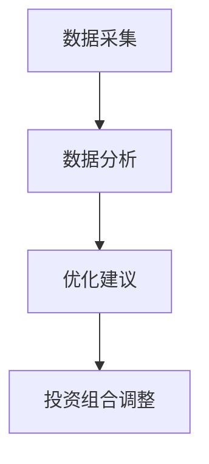
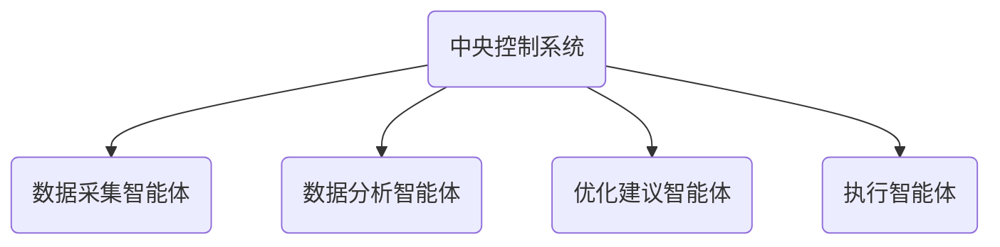

                 


# 多智能体AI如何改进约翰·伯格的指数化策略

## 关键词：多智能体AI，指数化策略，约翰·伯格，投资组合优化，机器学习，协作算法

## 摘要：本文探讨了多智能体AI在改进约翰·伯格指数化策略中的应用，分析了多智能体系统的核心概念及其与指数化策略的联系，详细讲解了基于多智能体的指数化策略优化算法，并通过系统架构设计和项目实战展示了如何在实际中实现这一策略。

---

# 第一部分：多智能体AI与指数化策略的背景介绍

## 第1章：多智能体AI与指数化策略概述

### 1.1 多智能体AI的基本概念

#### 1.1.1 多智能体系统的定义
多智能体系统（Multi-Agent System, MAS）是由多个智能体（Agent）组成的协作系统，每个智能体都是一个能够感知环境、做出决策并采取行动的实体。

#### 1.1.2 多智能体系统的特征
- **分布式**：智能体独立运行，通过通信协作解决问题。
- **协作性**：智能体之间通过协作完成共同目标。
- **自主性**：智能体具有自主决策能力。

#### 1.1.3 多智能体系统与传统AI的区别
传统AI依赖中央控制，而多智能体系统通过去中心化实现任务分配和协作。

### 1.2 约翰·伯格的指数化策略

#### 1.2.1 指数化策略的定义
指数化策略通过跟踪市场指数（如标普500）构建投资组合，以实现市场平均收益。

#### 1.2.2 指数化策略的核心思想
通过分散投资降低风险，同时最大化收益。

#### 1.2.3 指数化策略的应用场景
广泛应用于金融投资、资产配置等领域。

### 1.3 多智能体AI与指数化策略的结合

#### 1.3.1 多智能体AI如何优化指数化策略
通过分布式计算和协作优化投资组合。

#### 1.3.2 多智能体AI在指数化策略中的作用
- 数据收集与分析
- 投资组合优化
- 风险控制

#### 1.3.3 多智能体AI对指数化策略的改进
通过实时数据分析和预测模型，提高优化效率和准确性。

---

## 第2章：多智能体AI的核心概念与联系

### 2.1 多智能体系统的原理

#### 2.1.1 多智能体系统的组成
- 智能体：负责特定任务。
- 通信机制：实现智能体间信息共享。
- 协作机制：确保任务协同完成。

### 2.2 指数化策略的数学模型

#### 2.2.1 指数化策略的数学表达
$$\text{收益} = \sum_{i=1}^{n} w_i r_i$$
其中，\(w_i\)是权重，\(r_i\)是资产i的收益。

### 2.3 多智能体系统与指数化策略的ER实体关系图

```mermaid
er
actor(多智能体系统) --> index_strategy(指数化策略)
actor(指数化策略) --> multi_agent_system(多智能体系统)
```

### 2.4 多智能体系统与指数化策略的概念属性对比

| 属性 | 多智能体系统 | 指数化策略 |
|------|------------|------------|
| 定义 | 分布式协作系统 | 投资组合优化策略 |
| 特征 | 分布式、协作性、自主性 | 增长性、指数性、动态性 |
| 应用 | 任务分配、资源优化、决策支持 | 投资组合优化、风险控制 |

---

## 第3章：多智能体AI改进指数化策略的算法原理

### 3.1 多智能体协作算法

#### 3.1.1 基于博弈论的协作机制
通过博弈论模型优化协作策略。

#### 3.1.2 分布式决策算法
每个智能体独立决策，通过通信协商达成共识。

#### 3.1.3 联合优化算法
多个智能体协同优化，实现全局最优。

### 3.2 指数化策略优化算法

#### 3.2.1 基于多智能体的指数化策略
通过多智能体协作，优化投资组合权重。

---

## 第4章：系统架构设计

### 4.1 系统功能设计

#### 4.1.1 系统功能模块
- 数据采集模块：收集市场数据。
- 分析模块：分析数据并生成优化建议。
- 执行模块：根据建议调整投资组合。

#### 4.1.2 系统功能流程


### 4.2 系统架构设计

#### 4.2.1 系统架构图


---

## 第5章：项目实战

### 5.1 环境安装

#### 5.1.1 安装工具和库
- Python 3.8+
- TensorFlow 2.0+
- Keras
- Pandas
- NumPy

### 5.2 系统核心实现

#### 5.2.1 多智能体协作代码
```python
class Agent:
    def __init__(self, id):
        self.id = id
        self.data = None
```

#### 5.2.2 指数化策略优化代码
```python
import numpy as np

def optimize_portfolio(weights, returns):
    return np.dot(weights, returns)
```

### 5.3 实际案例分析

#### 5.3.1 数据分析与优化
分析历史数据，优化投资组合权重。

#### 5.3.2 系统性能评估
评估优化后的投资组合表现。

---

## 第6章：总结与展望

### 6.1 最佳实践
- 合理设计多智能体协作机制。
- 定期更新数据和模型。

### 6.2 小结
多智能体AI能够显著提升指数化策略的优化效率和准确性。

### 6.3 注意事项
- 确保数据安全和隐私保护。
- 定期维护和更新系统。

### 6.4 拓展阅读
建议阅读相关领域的最新论文和技术报告。

---

通过以上分析，我们看到多智能体AI在改进约翰·伯格指数化策略中具有巨大潜力。通过合理设计和实现，多智能体AI能够帮助投资者实现更优的投资组合，提升收益并降低风险。

