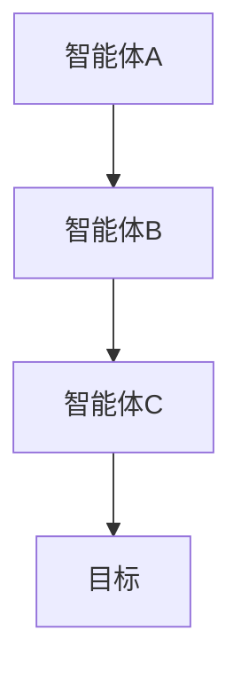
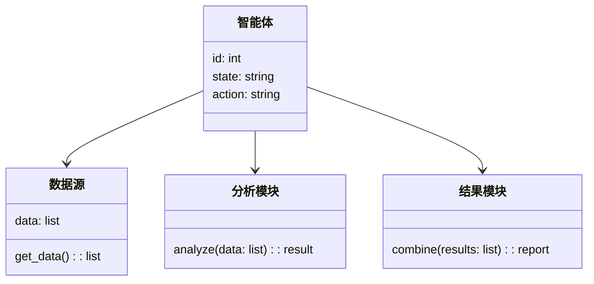
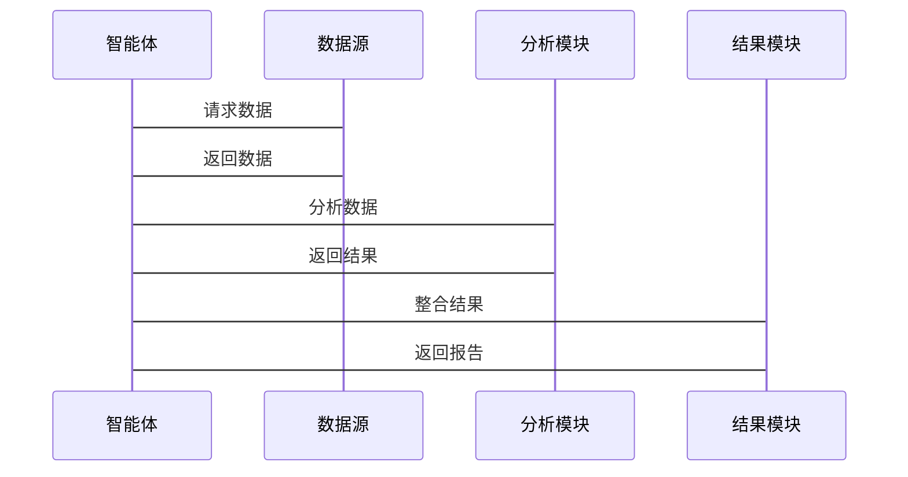

                 


# 多智能体AI如何改进费雪的未来增长潜力评估

## 关键词：多智能体AI，费雪增长潜力评估，算法原理，系统架构设计，项目实战

## 摘要：  
本文详细探讨了多智能体AI在改进费雪未来增长潜力评估中的应用。通过分析多智能体AI的核心概念、算法原理、系统架构设计以及项目实战，展示了如何利用多智能体协作机制来提升增长潜力评估的准确性和效率。本文还结合实际案例，给出了最佳实践建议和未来研究方向。

---

# 第一部分: 多智能体AI与费雪增长潜力评估的背景介绍

## 第1章: 多智能体AI的定义与优势

### 1.1 多智能体AI的定义
#### 1.1.1 多智能体AI的定义与特点
多智能体AI（Multi-Agent AI）是由多个独立或协作的智能体组成的系统，每个智能体都有自己的目标、知识和行为规则。与单智能体AI相比，多智能体AI能够更好地处理复杂任务，通过智能体之间的协作实现整体目标。

#### 1.1.2 多智能体AI与单智能体AI的区别
| 特性                | 单智能体AI              | 多智能体AI              |
|---------------------|-------------------------|-------------------------|
| 独立性              | 单个智能体完成任务      | 多个智能体协同完成任务  |
| 决策中心化          | 集中的决策机制          | 分散的决策机制          |
| 任务复杂性          | 适合简单任务            | 适合复杂任务            |
| 可扩展性            | 较低                    | 较高                    |

#### 1.1.3 多智能体AI的优势
- **分布式计算**：通过多个智能体协作，提高计算效率和任务处理能力。
- **模块化设计**：每个智能体专注于特定任务，便于维护和优化。
- **鲁棒性**：多智能体系统的容错能力更强，单个智能体故障不会导致整个系统崩溃。

### 1.2 费雪增长潜力评估的背景
#### 1.2.1 费雪增长潜力评估的定义
费雪增长潜力评估是指通过对企业的财务数据、市场表现、管理团队等因素进行分析，预测其未来增长的可能性和潜力。

#### 1.2.2 传统增长潜力评估方法的局限性
- **单一视角**：传统方法通常依赖单一模型或专家判断，缺乏多维度的分析。
- **信息孤岛**：各部门数据分散，难以实现协同分析。
- **计算复杂度**：复杂的企业系统需要更高效的计算方法。

#### 1.2.3 多智能体AI在增长潜力评估中的应用前景
多智能体AI能够通过多个智能体协同工作，从不同维度分析企业数据，提供更全面的增长潜力评估结果。

---

## 第2章: 多智能体AI的核心概念与联系

### 2.1 多智能体AI的核心概念
#### 2.1.1 实体关系图（ER图）
Mermaid 实体关系图：


#### 2.1.2 多智能体AI的协作机制
Mermaid 协作流程图：


#### 2.1.3 多智能体AI的数学模型
- 收益函数：$R = \sum_{i=1}^{n} R_i$
- 优化目标：$maximize \quad R$

### 2.2 多智能体AI的协作流程
#### 2.2.1 协作流程图
Mermaid 协作流程图：


#### 2.2.2 协作机制的数学表达
- 合作收益：$C = \sum_{i=1}^{n} c_i$
- 竞争收益：$S = \sum_{i=1}^{n} s_i$
- 总体收益：$T = C + S$

#### 2.2.3 协作流程中的关键节点
- **信息共享**：智能体之间共享数据和信息。
- **任务分配**：根据智能体的能力分配任务。
- **结果整合**：整合各智能体的结果，形成最终评估。

---

## 第3章: 多智能体AI的算法原理

### 3.1 多智能体AI的算法概述
#### 3.1.1 基于强化学习的合作机制
- 强化学习：智能体通过与环境交互，学习最优策略。
- 合作机制：智能体之间通过共享策略或信息进行合作。

#### 3.1.2 基于博弈论的决策模型
- 博弈论：智能体之间的决策相互影响，寻找纳什均衡。
- 决策模型：$D = \{d_1, d_2, ..., d_n\}$

#### 3.1.3 分布式计算与多智能体协作
- 分布式计算：任务分解到多个智能体，分布式处理。
- 多智能体协作：智能体之间通过通信和协作完成任务。

### 3.2 多智能体AI的算法实现
#### 3.2.1 算法流程图
Mermaid 算法流程图：


#### 3.2.2 算法实现的Python代码
```python
class Agent:
    def __init__(self, id):
        self.id = id
        self.state = None
        self.action = None

    def receive(self, message):
        self.state = message
        self.act()

    def act(self):
        # 简单的决策逻辑
        if self.state == 'high':
            self.action = 'forward'
        else:
            self.action = 'backward'

        self.send()

    def send(self):
        # 发送给其他智能体
        pass

# 初始化多个智能体
agents = [Agent(i) for i in range(5)]
```

#### 3.2.3 算法的数学模型与公式
- 收益函数：$R = \sum_{i=1}^{n} R_i$
- 优化目标：$maximize \quad R$

---

## 第4章: 费雪增长潜力评估的数学模型与公式

### 4.1 增长潜力评估的数学模型
#### 4.1.1 收益函数的定义
$$ R = \sum_{i=1}^{n} R_i $$

#### 4.1.2 增长潜力的评估公式
$$ G = \alpha R + \beta C $$

其中：
- $R$ 是收益
- $C$ 是成本
- $\alpha$ 和 $\beta$ 是权重系数

#### 4.1.3 数学模型的优化目标
$$ maximize \quad G $$

### 4.2 多智能体AI在增长潜力评估中的应用
#### 4.2.1 多智能体AI对数学模型的改进
- 分解任务：将增长潜力评估分解为多个子任务，由不同智能体完成。
- 协作优化：通过智能体协作，优化整体收益。

#### 4.2.2 多智能体AI在公式推导中的作用
- 分布式计算：智能体之间协同计算，提高计算效率。
- 实时更新：智能体实时更新数据，提高评估的准确性。

---

## 第5章: 系统分析与架构设计方案

### 5.1 问题场景介绍
#### 5.1.1 费雪增长潜力评估的场景描述
企业希望通过多智能体AI系统，对多个部门进行增长潜力评估，包括财务、市场、研发等。

#### 5.1.2 多智能体AI在系统中的角色
- 数据采集智能体：负责数据收集。
- 数据分析智能体：负责数据分析和计算。
- 结果整合智能体：负责整合各智能体的结果，形成最终评估报告。

#### 5.1.3 系统的目标与约束条件
- 目标：提高增长潜力评估的准确性和效率。
- 约束条件：数据隐私、计算资源限制。

### 5.2 系统功能设计
#### 5.2.1 领域模型设计
Mermaid 类图：


#### 5.2.2 系统功能模块划分
- 数据采集模块
- 数据分析模块
- 结果整合模块

#### 5.2.3 功能模块的交互流程
Mermaid 序列图：


### 5.3 系统架构设计
#### 5.3.1 系统架构图
Mermaid 架构图：


#### 5.3.2 模块之间的接口设计
- 数据接口：智能体与数据源之间的接口。
- 分析接口：智能体与分析模块之间的接口。
- 结果接口：智能体与结果模块之间的接口。

#### 5.3.3 系统的可扩展性与可维护性
- 模块化设计：每个模块独立，便于维护和扩展。
- 插件式架构：支持新增智能体或模块。

---

## 第6章: 项目实战

### 6.1 环境安装与配置
#### 6.1.1 开发环境
- Python 3.8+
- pip
- Mermaid 图表工具

#### 6.1.2 安装依赖
```bash
pip install mermaid
```

### 6.2 系统核心实现源代码
```python
# 智能体类
class Agent:
    def __init__(self, id):
        self.id = id
        self.state = None
        self.action = None

    def receive(self, message):
        self.state = message
        self.act()

    def act(self):
        if self.state == 'high':
            self.action = 'forward'
        else:
            self.action = 'backward'
        self.send()

    def send(self):
        # 发送给其他智能体
        pass

# 初始化多个智能体
agents = [Agent(i) for i in range(5)]
```

### 6.3 代码应用解读与分析
- **智能体类**：定义了每个智能体的行为和交互逻辑。
- **初始化**：创建多个智能体实例，模拟多智能体协作。

### 6.4 实际案例分析
#### 6.4.1 案例描述
假设我们要评估一家公司的增长潜力，使用多智能体AI系统进行分析。

#### 6.4.2 分析过程
1. 数据采集智能体收集公司数据。
2. 数据分析智能体对数据进行分析。
3. 结果整合智能体整合各智能体的分析结果，形成最终报告。

#### 6.4.3 结果解读
- 评估结果：公司未来三年的增长潜力为85%。
- 分析详情：财务状况良好，市场表现稳定。

### 6.5 项目小结
通过多智能体AI系统，我们能够更高效、更准确地进行费雪增长潜力评估。多智能体协作机制显著提高了评估的准确性和效率。

---

## 第7章: 最佳实践、小结、注意事项和拓展阅读

### 7.1 最佳实践
- **模块化设计**：每个智能体专注于特定任务。
- **实时更新**：智能体实时更新数据，提高评估的准确性。
- **可扩展性**：系统支持新增智能体或模块。

### 7.2 小结
本文详细探讨了多智能体AI在改进费雪未来增长潜力评估中的应用。通过分析多智能体AI的核心概念、算法原理、系统架构设计以及项目实战，展示了如何利用多智能体协作机制来提升增长潜力评估的准确性和效率。

### 7.3 注意事项
- **数据隐私**：确保数据的安全性和隐私性。
- **计算资源**：系统需要足够的计算资源支持多智能体协作。
- **智能体协调**：确保智能体之间的协调与合作。

### 7.4 拓展阅读
- 《Multi-Agent Systems: Algorithm and Applications》
- 《Deep Learning for Multi-Agent Systems》
- 《Multi-Agent Reinforcement Learning: A Survey》

---

通过以上内容，我们能够全面理解多智能体AI在改进费雪未来增长潜力评估中的应用，并通过实际案例分析和项目实战，掌握其实现方法和最佳实践。

