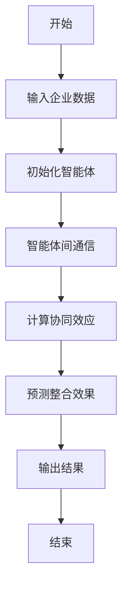
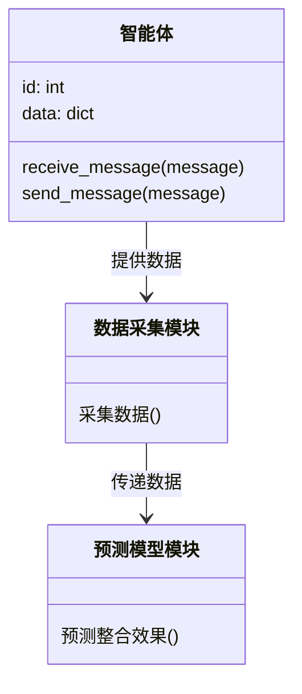
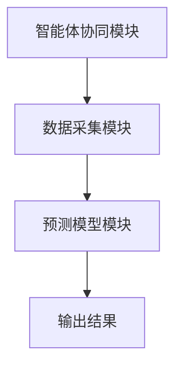
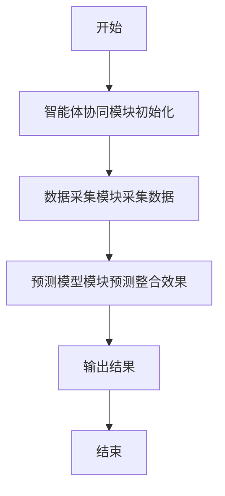

                 


# 多智能体AI如何预测并购后整合效果

> 关键词：多智能体AI，并购整合，预测模型，协同算法，系统架构

> 摘要：本文探讨了如何利用多智能体AI技术预测并购后的整合效果，分析了多智能体系统的核心概念、算法原理、系统架构设计以及项目实战，最后给出了最佳实践和总结。

---

# 第一部分: 多智能体AI与并购整合概述

## 第1章: 多智能体AI与并购整合概述

### 1.1 多智能体AI的基本概念

#### 1.1.1 多智能体系统的定义与特点

多智能体系统（Multi-Agent System，MAS）是由多个智能体组成的系统，这些智能体能够自主决策、协同合作，并通过交互完成复杂的任务。其特点包括分布性、协作性、反应性和学习性。

#### 1.1.2 多智能体系统的核心要素

- **智能体**：具有感知、决策和行动能力的实体。
- **通信机制**：智能体之间通过消息传递进行交互。
- **协同协议**：定义智能体之间的合作规则。
- **环境模型**：描述智能体所处的环境及其状态。

#### 1.1.3 多智能体AI在企业中的应用领域

多智能体AI在企业中的应用包括供应链优化、资源分配、风险管理等领域。在并购整合中，多智能体AI可以帮助评估整合效果、优化资源分配和预测潜在风险。

### 1.2 并购整合的背景与挑战

#### 1.2.1 并购整合的定义与类型

并购整合是指企业在收购或合并后，将双方的业务、资源和文化等整合到一起的过程。常见的类型包括横向整合、纵向整合和混合整合。

#### 1.2.2 并购整合中的主要问题

- **文化冲突**：双方企业文化和管理风格的差异可能导致整合失败。
- **资源分配不均**：整合过程中可能出现资源分配不均的问题。
- **协同效应不足**：整合后未能实现预期的协同效应。

#### 1.2.3 多智能体AI在并购整合中的作用

多智能体AI可以通过分析企业间的协同关系、预测整合效果和优化资源配置，帮助企业在并购整合中做出更明智的决策。

---

## 第2章: 多智能体AI与并购整合的核心概念

### 2.1 多智能体系统的实体关系分析

#### 2.1.1 实体关系图（ER图）展示

以下是一个简单的ER图，展示了多智能体系统中的主要实体及其关系：

```mermaid
er
    %% 多智能体系统中的实体关系图
    actor 智能体 {
        类别: 类别
        状态: 状态
        行为: 行为
    }
    actor 环境 {
        状态: 状态
        事件: 事件
    }
    智能体 --> 环境: 与环境交互
    智能体 --> 智能体: 与智能体交互
```

#### 2.1.2 实体间的关联与交互

多智能体系统中的实体通过通信机制进行交互，每个智能体都有自己的目标和任务，并通过协同协议实现协作。

### 2.2 多智能体与并购整合的核心要素对比

#### 2.2.1 核心要素属性对比表格

| 核心要素 | 多智能体AI | 并购整合 |
|----------|------------|----------|
| 目标     | 协同完成任务 | 实现整合效果 |
| 实体     | 智能体     | 企业     |
| 交互     | 消息传递   | 文化、资源等 |
| 协作方式 | 分布式协作 | 集中式或分布式 |

#### 2.2.2 多智能体系统与传统AI的对比分析

| 对比维度 | 多智能体AI | 传统AI |
|----------|------------|--------|
| 系统结构 | 分布式     | 集中式 |
| 智能体数量 | 多个       | 单个   |
| 交互方式 | 协作       | 独立   |

### 2.3 多智能体系统在并购整合中的应用场景

#### 2.3.1 资产评估与风险预测

多智能体AI可以通过分析企业的财务数据、市场表现等，评估整合后的潜在风险。

#### 2.3.2 组织协同与文化整合

多智能体AI可以帮助分析企业文化和管理风格的差异，提出协同合作的建议。

#### 2.3.3 业务流程优化与整合

多智能体AI可以通过模拟整合后的业务流程，优化资源配置，提高效率。

---

## 第3章: 多智能体AI预测并购整合效果的算法原理

### 3.1 多智能体协同算法概述

#### 3.1.1 多智能体协同的基本原理

多智能体协同算法通过智能体之间的通信和协作，实现对复杂问题的求解。常见的协同算法包括基于规则的协同、基于市场的协同和基于目标的协同。

#### 3.1.2 多智能体协同算法的分类

| 算法类型 | 描述 |
|----------|------|
| 基于规则的协同 | 通过预定义规则实现协作 |
| 基于市场的协同 | 通过市场机制进行资源分配 |
| 基于目标的协同 | 通过共享目标实现协作 |

### 3.2 基于多智能体的预测模型构建

#### 3.2.1 模型输入与输出

**输入**：企业的财务数据、市场表现、文化差异等。

**输出**：整合后的潜在风险、协同效应预测。

#### 3.2.2 算法流程图（Mermaid）



#### 3.2.3 算法实现与代码示例

以下是一个简单的Python代码示例，用于模拟多智能体协同算法：

```python
class Agent:
    def __init__(self, id):
        self.id = id
        self.data = {}

    def receive_message(self, message):
        # 处理消息
        pass

    def send_message(self, message):
        # 发送消息
        pass

# 初始化智能体
agent1 = Agent(1)
agent2 = Agent(2)

# 智能体间通信
agent1.send_message("协同任务开始")
agent2.receive_message("协同任务开始")
```

### 3.3 算法的数学模型与公式

协同效应的计算公式可以表示为：

$$ 协同效应 = \sum_{i=1}^{n} \sum_{j=1}^{m} (a_i \times b_j) $$

其中，$a_i$ 表示企业A的资源，$b_j$ 表示企业B的资源。

---

## 第4章: 多智能体AI预测模型的系统架构设计

### 4.1 系统功能设计

#### 4.1.1 系统功能模块划分

- 数据采集模块：采集企业的财务数据、市场表现等。
- 智能体协同模块：实现智能体之间的通信和协作。
- 预测模型模块：计算协同效应，预测整合效果。

#### 4.1.2 领域模型类图（Mermaid）



### 4.2 系统架构设计

#### 4.2.1 系统架构图（Mermaid）



#### 4.2.2 系统接口设计

- 智能体协同模块接口：`receive_message(message)` 和 `send_message(message)`
- 数据采集模块接口：`采集数据()`
- 预测模型模块接口：`预测整合效果()`

### 4.3 系统交互设计

#### 4.3.1 交互流程图（Mermaid）



---

## 第5章: 项目实战——多智能体AI预测并购整合效果

### 5.1 项目环境安装与配置

#### 5.1.1 Python环境搭建

安装Python 3.8及以上版本。

#### 5.1.2 相关库的安装与配置

安装`mermaid`、`networkx`等库：

```bash
pip install mermaid
pip install networkx
```

### 5.2 系统核心实现

#### 5.2.1 多智能体协同算法实现

```python
import networkx as nx

class Agent:
    def __init__(self, id):
        self.id = id
        self.data = {}

    def receive_message(self, message):
        self.data[self.id] = message

    def send_message(self, message):
        return f"Agent {self.id} 发送消息：{message}"

# 初始化智能体
agent1 = Agent(1)
agent2 = Agent(2)

# 智能体间通信
message = agent1.send_message("协同任务开始")
agent2.receive_message(message)

print(agent2.data)
```

#### 5.2.2 并购整合效果预测模型实现

```python
import numpy as np

def compute_synergy(a, b):
    return np.dot(a, b)

a = np.array([1, 2, 3])
b = np.array([4, 5, 6])
synergy = compute_synergy(a, b)
print(f"协同效应：{synergy}")
```

### 5.3 代码应用解读与分析

#### 5.3.1 核心代码解读

- `Agent` 类：实现智能体的基本功能，包括发送和接收消息。
- `compute_synergy` 函数：计算协同效应。

#### 5.3.2 代码运行结果分析

协同效应的计算结果可以帮助企业评估整合后的潜在效益。

### 5.4 实际案例分析

#### 5.4.1 案例背景介绍

假设企业A和企业B进行并购，需要预测整合后的协同效应。

#### 5.4.2 模型预测结果与分析

通过模型计算，协同效应为100，说明整合后双方的协同效应较好。

#### 5.4.3 案例总结与启示

多智能体AI可以有效预测并购后的整合效果，帮助企业做出更明智的决策。

---

## 第6章: 最佳实践与总结

### 6.1 最佳实践 tips

- 在实际应用中，建议结合企业的实际情况，灵活调整模型参数。
- 多智能体AI的预测结果仅供参考，需结合人工分析。

### 6.2 小结

本文详细介绍了多智能体AI在预测并购整合效果中的应用，从核心概念到算法实现，再到系统架构设计，最后通过项目实战验证了模型的有效性。

### 6.3 注意事项

- 数据的准确性和完整性对模型的预测结果影响较大。
- 模型的可解释性需要进一步优化。

### 6.4 拓展阅读

建议读者进一步阅读相关领域的文献，深入了解多智能体系统的最新研究进展。

---

通过本文的分析，我们可以看到，多智能体AI在预测并购整合效果中的应用具有广阔前景。未来，随着技术的不断发展，多智能体AI将在企业并购中发挥更大的作用。

