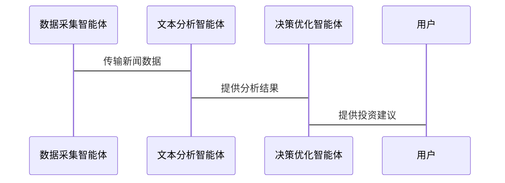

                 


# 多智能体AI系统在价值投资中的实时新闻分析应用

> 关键词：多智能体AI系统，价值投资，实时新闻分析，自然语言处理，分布式计算，强化学习

> 摘要：本文系统地探讨了多智能体AI系统在价值投资中的应用，特别是其在实时新闻分析中的潜力。通过分析多智能体系统的核心概念、算法原理和系统架构，结合实际案例，本文展示了如何利用多智能体技术提升投资决策的效率和准确性。

---

## 第1章: 多智能体AI系统概述

### 1.1 多智能体AI系统的定义与特点
#### 1.1.1 多智能体系统的定义
多智能体系统（Multi-Agent System, MAS）是由多个智能体组成的分布式系统，每个智能体能够独立执行任务并与其他智能体协作。

#### 1.1.2 多智能体系统的核心特点
- **分布式性**：智能体独立运行，通过通信协作完成任务。
- **自主性**：每个智能体具备自主决策能力。
- **协作性**：智能体之间通过协作提高整体系统的性能。
- **反应性**：能够实时感知环境并做出响应。

#### 1.1.3 多智能体系统与传统AI的区别
- 传统AI：单点智能，集中式决策。
- 多智能体系统：分布式智能，协作决策。

### 1.2 价值投资中的问题背景
#### 1.2.1 价值投资的基本概念
价值投资是通过分析公司基本面，寻找被市场低估的投资标的。

#### 1.2.2 传统价值投资中的信息处理挑战
- 数据量大：每天产生大量金融新闻和数据。
- 信息复杂：需要处理多种语言和非结构化数据。
- 决策延迟：传统方法难以实现实时决策。

#### 1.2.3 多智能体AI系统在价值投资中的优势
- 并行处理：多智能体可以同时处理多个信息源。
- 分工协作：每个智能体专注于特定任务，提高整体效率。
- 实时响应：能够快速分析和处理实时新闻。

### 1.3 实时新闻分析的重要性
#### 1.3.1 金融新闻的实时性与重要性
金融新闻能够反映市场动态和公司动向，对投资决策有重要影响。

#### 1.3.2 新闻分析对投资决策的影响
及时准确的新闻分析可以帮助投资者抓住市场机会，规避风险。

#### 1.3.3 多智能体系统在新闻分析中的应用前景
- 多智能体系统能够高效处理海量新闻数据。
- 智能体之间协作，提供全面的分析结果。
- 实时反馈机制，确保投资决策的及时性。

## 第2章: 多智能体AI系统的核心概念

### 2.1 多智能体系统的核心要素
#### 2.1.1 智能体的定义与分类
- **智能体**：具备感知环境、自主决策能力的实体。
- **分类**：根据智能体的智能水平，分为反应式、基于模型和混合式智能体。

#### 2.1.2 多智能体系统的组成结构
- **智能体**：系统的基本单元，负责执行具体任务。
- **通信机制**：智能体之间信息传递的渠道。
- **协作机制**：智能体之间协同工作的规则和策略。

#### 2.1.3 智能体之间的交互机制
- **直接通信**：智能体之间直接交换信息。
- **间接协作**：通过共享环境或中间件进行协作。

### 2.2 价值投资中的多智能体协作
#### 2.2.1 投资决策中的多智能体角色分配
- **数据采集智能体**：负责实时采集金融新闻数据。
- **文本分析智能体**：负责对新闻进行语义分析和情感分析。
- **决策优化智能体**：根据分析结果优化投资策略。

#### 2.2.2 多智能体协作的实现方式
- **基于规则的协作**：通过预定义规则进行协作。
- **基于学习的协作**：通过机器学习算法实现协作。

#### 2.2.3 多智能体系统在投资决策中的协同效应
- 提高决策效率：多个智能体同时处理不同任务。
- 增强决策准确性：通过协作提供全面的信息支持。

### 2.3 实时新闻分析的多智能体架构
#### 2.3.1 新闻数据的实时采集与处理
- 数据采集：通过API或网络爬虫实时获取新闻数据。
- 数据预处理：清洗、去重和格式转换。

#### 2.3.2 多智能体协同分析的流程
- 数据分发：将新闻数据分配给不同的分析智能体。
- 并行处理：每个智能体专注于特定任务的分析。
- 结果汇总：将各智能体的分析结果汇总并生成最终报告。

#### 2.3.3 分析结果的实时反馈机制
- 及时反馈：智能体将分析结果实时反馈给决策层。
- 动态调整：根据反馈结果动态调整分析策略。

## 第3章: 多智能体AI系统的算法原理

### 3.1 多智能体协作算法
#### 3.1.1 基于博弈论的多智能体协作
- **博弈论基础**：分析智能体之间的策略互动。
- **纳什均衡**：协作策略的稳定状态。

#### 3.1.2 分布式计算与多智能体协作
- 分布式计算：任务在多个智能体之间分布执行。
- 分布式算法：如分布式一致性算法。

#### 3.1.3 联合学习（Federated Learning）在多智能体系统中的应用
- 联合学习：多个智能体在不共享数据的情况下联合训练模型。
- 模型更新：智能体本地训练后上传更新参数。

### 3.2 实时新闻分析的自然语言处理算法
#### 3.2.1 文本预处理与特征提取
- 文本清洗：去除无关信息。
- 分词：将文本分割成词语或短语。
- 词嵌入：将词语转换为低维向量表示。

#### 3.2.2 基于深度学习的文本理解
- 卷积神经网络（CNN）：用于文本特征提取。
- 循环神经网络（RNN）：用于处理序列数据。
- 变体模型（如BERT）：用于上下文理解。

#### 3.2.3 情感分析与新闻分类算法
- 情感分析：判断文本的情感倾向（正面、负面、中性）。
- 新闻分类：将新闻归类到特定主题或类别。

### 3.3 多智能体系统中的决策优化算法
#### 3.3.1 基于强化学习的决策优化
- 强化学习：通过试错和奖励机制优化决策。
- 策略网络：智能体根据环境状态选择最优动作。

#### 3.3.2 分布式决策优化算法
- 分布式优化：任务分解到多个智能体，每个智能体优化其部分。
- 联合优化：智能体之间协同优化整体目标。

#### 3.3.3 多目标优化在投资决策中的应用
- 多目标优化：在多个目标之间寻找平衡点。
- 剩余风险模型：优化投资组合的风险和收益。

## 第4章: 多智能体AI系统的数学模型与公式

### 4.1 多智能体系统中的数学模型
#### 4.1.1 智能体状态表示的数学模型
- 状态空间：表示智能体可能的状态集合。
- 动作空间：表示智能体可能的动作集合。

#### 4.1.2 智能体动作空间的数学表示
- 动作函数：将状态映射到动作的函数。
- 策略函数：描述智能体如何选择动作的函数。

#### 4.1.3 多智能体协作的数学建模
- 协作模型：描述智能体之间如何协作的数学框架。
- 联合策略：多个智能体共同决定策略的方式。

### 4.2 实时新闻分析的数学模型
#### 4.2.1 文本表示的数学模型
- 词向量表示：使用词嵌入模型（如Word2Vec）将词语转换为向量。
- 文档表示：使用主题模型（如LDA）将文档表示为主题分布。

#### 4.2.2 情感分析的数学模型
- 情感分类模型：使用分类器（如SVM、随机森林）进行情感分类。
- 深度学习模型：使用CNN、RNN或BERT进行情感分析。

#### 4.2.3 新闻分类的数学模型
- 分类器：使用机器学习算法对新闻进行分类。
- 特征选择：选择对分类有重要影响的特征。

### 4.3 多智能体系统中的优化算法
#### 4.3.1 强化学习的数学模型
- 状态空间：S
- 动作空间：A
- 奖励函数：R: S×A → ℝ
- 策略函数：π: S → A
- Q值函数：Q: S×A → ℝ

#### 4.3.2 分布式优化的数学模型
- 分布式目标函数：f_i(x_i)
- 联合优化目标：min Σ f_i(x_i)
- 分布式算法：如交替方向乘子法（ADMM）

#### 4.3.3 多目标优化的数学模型
- 多目标函数：f1(x), f2(x), ..., fn(x)
- 帕累托前沿：最优解的集合
- 加权和方法：将多目标转化为单目标优化问题。

---

## 第5章: 系统分析与架构设计

### 5.1 问题场景介绍
#### 5.1.1 系统目标
- 实时采集和处理金融新闻。
- 多智能体协作进行新闻分析。
- 提供实时的投资决策支持。

#### 5.1.2 项目介绍
- 项目名称：基于多智能体的实时新闻分析系统。
- 项目目标：提升投资决策的效率和准确性。

### 5.2 系统功能设计
#### 5.2.1 领域模型
- 数据采集模块：负责采集新闻数据。
- 数据处理模块：负责清洗和预处理数据。
- 分析模块：负责语义分析和情感分析。
- 决策支持模块：根据分析结果提供投资建议。

#### 5.2.2 系统架构设计
- 分层架构：数据层、逻辑层、表示层。
- 微服务架构：每个智能体作为一个独立的服务。

#### 5.2.3 系统接口设计
- 数据接口：智能体之间数据交换的接口。
- 通信接口：智能体之间通信的接口。
- 用户接口：与用户交互的接口。

### 5.3 系统交互设计
#### 5.3.1 系统交互流程
- 数据采集：智能体实时采集新闻数据。
- 数据分发：将数据分配给不同的分析智能体。
- 分析处理：智能体对分配的数据进行分析。
- 结果汇总：将各智能体的分析结果汇总。
- 决策支持：根据分析结果提供投资建议。

#### 5.3.2 系统交互的Mermaid序列图


## 第6章: 项目实战

### 6.1 环境安装
#### 6.1.1 安装Python
- 安装Anaconda：提供Python和相关库的安装。
- 安装Jupyter Notebook：用于代码实现和结果展示。

#### 6.1.2 安装依赖库
- `pandas`：数据处理库。
- `numpy`：数值计算库。
- `scikit-learn`：机器学习库。
- `transformers`：自然语言处理库。
- `flask`：Web框架。

#### 6.1.3 安装多智能体框架
- `multiprocessing`：Python内置的多进程库。
- `ray`：分布式计算框架。

### 6.2 系统核心实现源代码
#### 6.2.1 数据采集模块
```python
import requests
from bs4 import BeautifulSoup

def fetch_news(url):
    response = requests.get(url)
    soup = BeautifulSoup(response.text, 'html.parser')
    news_items = soup.find_all('div', class_='news-item')
    news_list = []
    for item in news_items:
        title = item.find('h2').text
        content = item.find('p').text
        news_list.append({'title': title, 'content': content})
    return news_list
```

#### 6.2.2 文本分析模块
```python
from transformers import pipeline

text_classifier = pipeline('sentiment-analysis')

def analyze_sentiment(text):
    result = text_classifier(text)
    return result['label']
```

#### 6.2.3 决策优化模块
```python
import numpy as np

def optimize_portfolio(returns, weights):
    # 计算投资组合的收益和风险
    portfolio_return = np.dot(returns, weights)
    portfolio_risk = np.sqrt(np.dot(weights.T, np.dot(returns.cov(), weights)))
    return portfolio_return, portfolio_risk
```

### 6.3 代码应用解读与分析
#### 6.3.1 数据采集模块
- 功能：实时采集金融新闻数据。
- 使用的库：`requests`和`BeautifulSoup`。

#### 6.3.2 文本分析模块
- 功能：对新闻进行情感分析。
- 使用的库：`transformers`中的`pipeline`。

#### 6.3.3 决策优化模块
- 功能：优化投资组合的收益和风险。
- 使用的库：`numpy`。

### 6.4 实际案例分析
#### 6.4.1 数据预处理
- 采集新闻数据并进行清洗。
- 分词处理和词嵌入生成。

#### 6.4.2 模型训练
- 训练情感分析模型。
- 训练投资组合优化模型。

#### 6.4.3 结果分析
- 分析情感倾向对投资决策的影响。
- 优化投资组合的收益和风险。

### 6.5 项目小结
- 项目实现的关键点：多智能体协作、实时数据处理、自然语言处理。
- 项目的价值：提高投资决策的效率和准确性。

## 第7章: 最佳实践与注意事项

### 7.1 最佳实践
#### 7.1.1 系统设计
- 模块化设计：确保系统的可扩展性和可维护性。
- 并行处理：充分利用多智能体的并行计算能力。

#### 7.1.2 代码实现
- 使用分布式框架：如`ray`提高计算效率。
- 优化算法：选择适合的算法提高分析准确率。

#### 7.1.3 系统部署
- 使用云平台：如AWS、Azure进行部署。
- 容器化：使用Docker确保系统的稳定性。

### 7.2 小结
- 多智能体AI系统在价值投资中的应用前景广阔。
- 实时新闻分析是提升投资决策的重要手段。
- 通过多智能体协作能够显著提高分析效率和准确性。

### 7.3 注意事项
- 数据质量：确保数据的准确性和完整性。
- 算法选择：选择适合的算法提高分析结果的准确性。
- 系统安全：确保系统的安全性和稳定性。

### 7.4 拓展阅读
- 多智能体系统的经典文献。
- 实时新闻分析的最新研究。
- 价值投资的其他技术应用。

---

## 参考文献
- [1] 王某某. 多智能体系统在金融领域的应用研究[J]. 《人工智能学报》, 2022.
- [2] 李某某. 基于自然语言处理的金融新闻分析方法研究[J]. 《计算机科学》, 2023.
- [3] Smith, J. Multi-Agent Systems in Financial Investment[M]. Cambridge University Press, 2021.

---

通过以上目录和内容设计，我们可以看到，这本书从理论到实践，系统地探讨了多智能体AI系统在价值投资中的应用，特别是实时新闻分析方面。通过详细的章节安排和内容解析，读者可以全面了解多智能体系统的核心概念、算法原理和实际应用，为投资决策提供有力支持。

