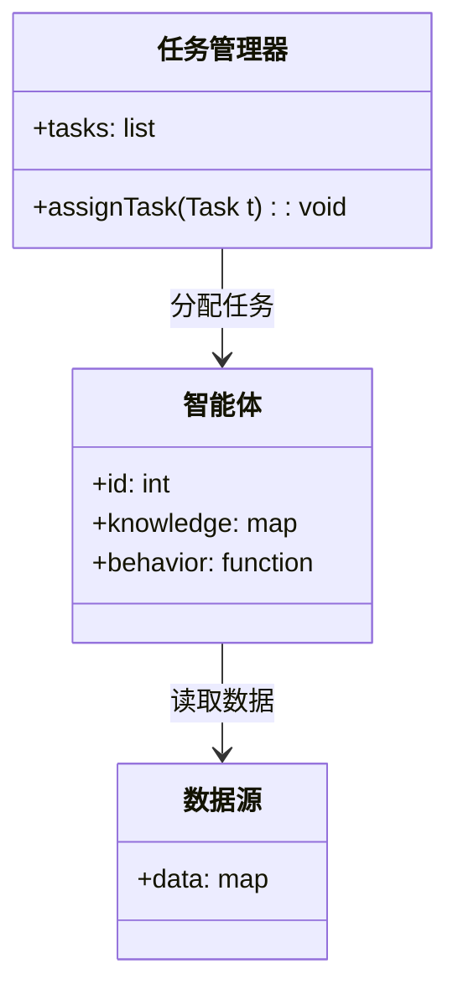
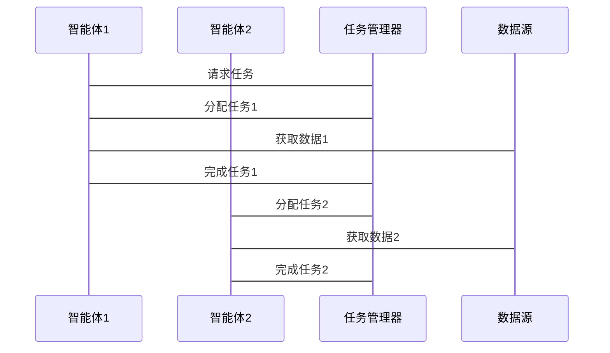

                 


# 多智能体AI系统在价值投资中的道德考量：平衡效率与公平

---

## 关键词：多智能体AI系统，价值投资，道德考量，效率，公平，伦理框架，算法设计

---

## 摘要：本文探讨多智能体AI系统在价值投资中的应用，重点分析如何在追求投资效率的同时，平衡公平性。通过构建伦理框架和优化算法，提出实现效率与公平平衡的解决方案，确保技术应用的道德合规性。

---

# 第一部分: 多智能体AI系统与价值投资概述

## 第1章: 多智能体AI系统概述

### 1.1 多智能体系统的基本概念

#### 1.1.1 多智能体系统的定义

多智能体系统（Multi-Agent System, MAS）是指由多个智能体（Agent）组成的协作系统，每个智能体能够独立决策并与其他智能体交互，共同完成复杂任务。

#### 1.1.2 多智能体系统的特性

| 特性 | 描述 |
|------|------|
| 分布式 | 智能体独立决策，无中心控制 |
| 协作性 | 智能体之间通过协作完成任务 |
| 反应性 | 能够实时感知环境并做出响应 |

#### 1.1.3 多智能体系统与单智能体系统的区别

- 单智能体系统：单个智能体完成任务，决策集中。
- 多智能体系统：多个智能体协作，决策分散。

### 1.2 价值投资的基本概念

#### 1.2.1 价值投资的定义

价值投资是通过分析企业的基本面，寻找被市场低估的投资标的，长期持有以实现收益。

#### 1.2.2 价值投资的核心原则

| 原则 | 描述 |
|------|------|
| 安全边际 | 购买价格低于内在价值 |
| 长期视角 | 长期持有优质资产 |
| 谨慎评估 | 严格分析企业财务和行业地位 |

#### 1.2.3 价值投资与传统投资的区别

- 传统投资：短期波动驱动，高频交易为主。
- 价值投资：长期基本面驱动，注重企业内在价值。

## 第2章: 多智能体AI系统在价值投资中的应用背景

### 2.1 价值投资中的信息处理需求

#### 2.1.1 数据分析的复杂性

- 数据来源广泛：财务报表、市场新闻、行业报告等。
- 数据维度多样：定量（如财务指标）与定性（如企业声誉）并存。

#### 2.1.2 多维度信息整合的必要性

- 需要整合财务、市场、行业等多维度信息。
- 信息整合需考虑信息的时效性和相关性。

#### 2.1.3 多智能体系统对公平性的影响

- 信息不对称可能导致市场不公平。
- 多智能体协作可能加剧信息不对称。

### 2.2 多智能体AI系统在金融领域的优势

#### 2.2.1 高效的数据处理能力

- 并行处理能力：多个智能体同时处理不同数据源。
- 自适应学习：智能体能够实时更新模型。

#### 2.2.2 精准的市场预测能力

- 基于历史数据的模式识别。
- 多维度因子分析：利用多个因子预测市场趋势。

#### 2.2.3 多维度决策支持能力

- 提供多种投资策略建议。
- 支持组合优化：优化投资组合以平衡风险和收益。

## 第3章: 多智能体AI系统在价值投资中的道德考量

### 3.1 价值投资中的公平性问题

#### 3.1.1 公平性在价值投资中的重要性

- 公平性是市场健康运行的基础。
- 不公平的交易可能导致市场失灵。

#### 3.1.2 多智能体系统对公平性的影响

- 信息处理能力差异可能导致资源分配不公。
- 多智能体协作可能加剧市场操纵。

#### 3.1.3 公平性与效率的平衡

- 高效的投资决策可能牺牲公平性。
- 需要找到效率与公平的平衡点。

### 3.2 多智能体系统中的伦理框架

#### 3.2.1 伦理框架的定义

伦理框架是指导多智能体系统行为的一套原则和规则，确保系统在运行过程中符合道德标准。

#### 3.2.2 伦理框架的核心要素

| 要素 | 描述 |
|------|------|
| 透明性 | 系统决策过程需透明可追溯 |
| 责任归属 | 明确智能体的行为责任主体 |
| 公平性 | 确保系统决策不加剧市场不公平 |

#### 3.2.3 伦理框架的实施挑战

- 技术实现难度：如何将伦理框架嵌入系统。
- 行为规范的动态调整：市场环境变化需要动态调整伦理框架。

---

# 第二部分: 多智能体AI系统的算法与实现

## 第4章: 多智能体协作算法

### 4.1 多智能体协作的基本原理

#### 4.1.1 分布式协作机制

- 分布式协作：多个智能体协作完成任务，无中心控制节点。
- 信息共享：智能体之间共享必要信息，避免信息孤岛。

#### 4.1.2 协作任务分配

- 任务分解：将整体任务分解为多个子任务。
- 子任务分配：根据智能体的能力分配子任务。

#### 4.1.3 协作过程中的信息共享

- 信息同步：定期同步各智能体的状态和数据。
- 信息融合：将各智能体的信息进行整合，形成全局决策。

### 4.2 基于博弈论的协作算法

#### 4.2.1 博弈论的基本概念

- 博弈：多个参与者互动的过程。
- Nash均衡：博弈中各参与者策略稳定的状态。

#### 4.2.2 博弈论在多智能体协作中的应用

- 协作博弈：智能体之间合作以实现共同目标。
- 竞争博弈：智能体之间在有限资源下竞争。

#### 4.2.3 协作算法的实现步骤

1. 定义博弈规则：确定博弈的参与者、策略和收益。
2. 寻找Nash均衡：找到稳定的策略组合。
3. 实现协作机制：根据Nash均衡设计协作算法。

## 第5章: 多智能体系统的道德评估算法

### 5.1 道德评估的基本原理

#### 5.1.1 道德评估的定义

道德评估是对多智能体系统在运行过程中是否符合伦理标准的评价。

#### 5.1.2 道德评估的核心指标

| 指标 | 描述 |
|------|------|
| 透明性 | 系统决策过程是否透明 |
| 责任归属 | 行为责任是否明确 |
| 公平性 | 系统决策是否公平 |

#### 5.1.3 道德评估的实现方法

1. 数据采集：收集系统运行中的各种数据。
2. 数据分析：分析数据以评估系统行为。
3. 评估报告：生成评估报告，指出问题和改进建议。

### 5.2 道德评分机制的设计

#### 5.2.1 道德评分的定义

道德评分是对多智能体系统在运行过程中符合伦理标准的程度的量化评价。

#### 5.2.2 道德评分的计算方法

1. 确定评分指标：选择若干个关键指标。
2. 确定评分权重：根据指标的重要性分配权重。
3. 计算评分：根据各指标的评分结果，计算总评分。

#### 5.2.3 道德评分的优化策略

1. 动态调整：根据市场变化动态调整评分指标和权重。
2. 反馈机制：根据评分结果优化系统行为。

---

# 第三部分: 系统架构与项目实战

## 第6章: 系统架构设计

### 6.1 系统需求分析

#### 6.1.1 问题场景介绍

- 高效的投资决策需要多智能体协作。
- 公平性需要在系统设计中得到体现。

#### 6.1.2 项目介绍

- 项目目标：构建一个基于多智能体的高效、公平的价值投资系统。
- 项目范围：涵盖数据采集、分析、决策支持等功能。

### 6.2 系统功能设计

#### 6.2.1 领域模型



#### 6.2.2 系统架构设计


#### 6.2.3 系统交互设计



### 6.3 项目实战

#### 6.3.1 环境配置

```bash
pip install multi-agent-system
```

#### 6.3.2 核心代码实现

```python
class Agent:
    def __init__(self, id):
        self.id = id
        self.knowledge = {}
    
    def get_data(self, data_source):
        self.knowledge.update(data_source.get_data())
    
    def execute_task(self, task):
        # 实现具体的任务处理逻辑
        pass

class TaskManager:
    def __init__(self):
        self.tasks = []
    
    def assign_task(self, agent, task):
        self.tasks.append(task)
        agent.execute_task(task)

class DataSource:
    def __init__(self):
        self.data = {}
    
    def get_data(self):
        return self.data
```

#### 6.3.3 案例分析

- 通过具体案例展示系统在价值投资中的应用。
- 分析系统在实际应用中的道德评估结果。

#### 6.3.4 项目总结

- 总结项目实现的关键点。
- 提出未来改进的方向。

---

## 第7章: 最佳实践与小结

### 7.1 最佳实践 tips

1. 在系统设计中加入伦理框架，确保道德合规。
2. 动态调整道德评分机制，适应市场变化。
3. 定期监控系统行为，及时发现并解决问题。

### 7.2 小结

通过构建多智能体系统，可以在价值投资中实现高效的投资决策。但同时需要平衡效率与公平，确保系统符合伦理标准。本文提出了构建伦理框架和优化算法的方法，为实际应用提供了指导。

### 7.3 注意事项

- 道德评估需要持续关注和优化。
- 系统设计需要综合考虑技术与伦理因素。
- 需要建立有效的反馈机制，及时调整系统行为。

### 7.4 拓展阅读

- 多智能体系统的博弈论研究。
- 人工智能在金融领域的应用。
- 伦理框架在其他领域的应用。

---

# 结语

多智能体AI系统在价值投资中的应用前景广阔，但也需要在效率与公平之间找到平衡点。通过构建伦理框架和优化算法，可以确保系统在实现高效投资的同时，符合道德标准。未来的研究可以进一步探索如何在更多场景中实现伦理与效率的平衡。

