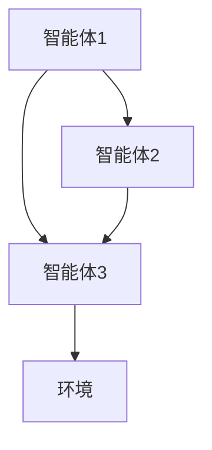
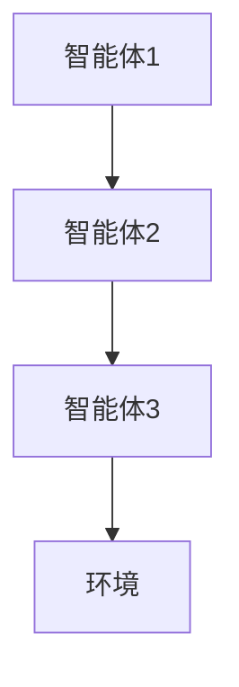
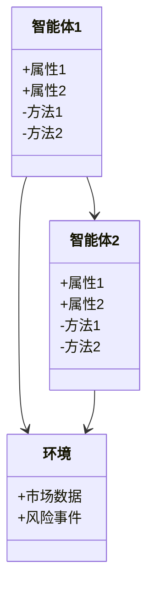
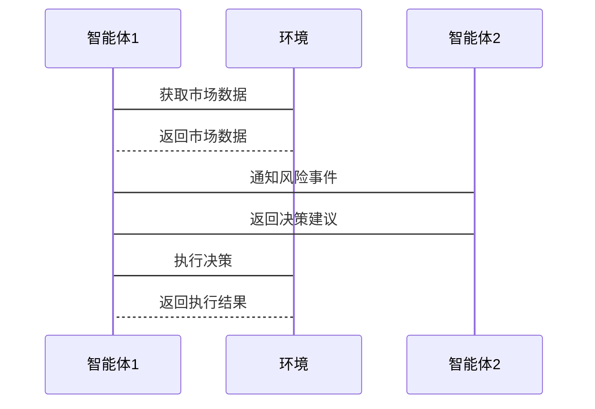

                 


# 多智能体AI系统在价值投资中的风险管理应用

## 关键词：多智能体AI系统、风险管理、价值投资、金融、人工智能

## 摘要：  
本文探讨了多智能体AI系统在价值投资中的风险管理应用，通过分析多智能体系统的核心概念、算法原理、数学模型以及实际应用场景，展示了如何利用多智能体技术提升金融市场的风险管理能力。文章详细介绍了多智能体系统在风险评估、风险控制和风险预警中的应用，并通过实例分析和代码实现，深入剖析了多智能体AI系统在价值投资中的优势和潜力。

---

## 第一部分: 多智能体AI系统与价值投资概述

### 第1章: 多智能体AI系统与价值投资概述

#### 1.1 多智能体AI系统的定义与特点

- **1.1.1 多智能体系统的定义**
  多智能体系统（Multi-Agent System, MAS）是由多个智能体组成的系统，每个智能体能够感知环境、自主决策并与其他智能体协作或竞争，以实现特定目标。

- **1.1.2 多智能体系统的核心特点**
  - **分布性**：智能体独立运行，但通过通信协作完成任务。
  - **自主性**：每个智能体具备自主决策能力。
  - **反应性**：能够实时感知环境变化并做出反应。
  - **协作性**：智能体之间通过通信协作，共同完成复杂任务。

- **1.1.3 多智能体系统与传统AI的区别**
  - 传统AI：基于规则或经验进行决策，通常不涉及多个智能体的协作。
  - 多智能体系统：多个智能体协作，具备更强的适应性和灵活性。



#### 1.2 价值投资的基本原理

- **1.2.1 价值投资的定义**
  价值投资是一种投资策略，旨在通过分析企业的基本面，找到市场价格低于其内在价值的股票进行投资。

- **1.2.2 价值投资的核心原则**
  - **安全边际**：买入价格低于内在价值。
  - **长期视角**：关注企业的长期盈利能力。
  - **精选个股**：选择具有竞争优势的企业。

- **1.2.3 价值投资在金融市场的应用**
  - **股票筛选**：通过基本面分析筛选出具有投资价值的股票。
  - **组合管理**：构建投资组合以分散风险。

#### 1.3 风险管理在价值投资中的重要性

- **1.3.1 风险管理的定义**
  风险管理是通过识别、评估和应对潜在风险，以降低投资损失的过程。

- **1.3.2 风险管理在价值投资中的作用**
  - **降低投资损失**：通过风险评估避免高风险投资。
  - **优化投资组合**：通过分散投资降低整体风险。
  - **动态调整**：根据市场变化及时调整投资策略。

- **1.3.3 风险管理的常见方法**
  - **风险评估**：分析潜在风险并评估其影响。
  - **风险控制**：采取措施降低风险发生概率。
  - **风险监控**：实时监控风险变化并及时应对。

#### 1.4 多智能体AI系统在风险管理中的应用前景

- **1.4.1 多智能体系统在金融领域的潜力**
  - 提供实时市场监控。
  - 分析复杂市场行为。
  - 优化投资决策。

- **1.4.2 多智能体系统在风险管理中的优势**
  - **分布式计算**：多个智能体协同工作，提升计算效率。
  - **实时协作**：快速响应市场变化。
  - **智能决策**：通过协作提高决策的准确性。

- **1.4.3 多智能体系统应用的挑战与机遇**
  - **技术挑战**：复杂系统的协调与优化。
  - **数据挑战**：需要大量高质量的金融数据支持。
  - **应用机遇**：在金融市场的风险管理中实现突破。

#### 1.5 本章小结

本章介绍了多智能体系统的基本概念、特点以及其在金融领域的应用潜力，重点分析了多智能体系统在风险管理中的优势和挑战。通过多智能体系统的协作能力，可以显著提升金融市场的风险管理效率。

---

## 第二部分: 多智能体AI系统的风险管理模型

### 第2章: 多智能体AI系统的风险管理模型

#### 2.1 多智能体系统在风险管理中的核心概念

- **2.1.1 多智能体系统的协作机制**
  - **任务分配**：智能体根据自身能力分配任务。
  - **信息共享**：智能体之间共享信息以提高决策的准确性。
  - **协作决策**：多个智能体共同制定最优决策。

- **2.1.2 多智能体系统的决策模型**
  - **基于Q-learning的决策模型**：通过强化学习优化决策策略。
  - **基于博弈论的决策模型**：分析智能体之间的博弈关系，制定最优策略。

- **2.1.3 多智能体系统的通信协议**
  - **异步通信**：智能体之间异步交换信息。
  - **同步通信**：所有智能体同时进行信息交换。



#### 2.2 价值投资中的风险管理模型

- **2.2.1 风险评估模型的定义**
  风险评估模型是一种用于量化投资风险的数学模型，通常基于历史数据和市场信息。

- **2.2.2 风险评估模型的构建**
  - **数据收集**：收集历史股价、财务数据、市场指数等。
  - **模型选择**：选择合适的统计或机器学习模型。
  - **参数优化**：通过训练数据优化模型参数。

- **2.2.3 风险评估模型的优化**
  - **模型验证**：通过回测验证模型的有效性。
  - **模型调整**：根据实际表现调整模型参数。
  - **模型更新**：定期更新模型以适应市场变化。

#### 2.3 多智能体系统与风险管理模型的结合

- **2.3.1 多智能体系统在风险评估中的应用**
  - **分布式计算**：多个智能体协同计算，提高计算效率。
  - **信息共享**：智能体之间共享数据，提升风险评估的准确性。
  - **协作决策**：智能体共同制定风险评估策略。

- **2.3.2 多智能体系统在风险控制中的应用**
  - **实时监控**：智能体实时监控市场变化，及时发现潜在风险。
  - **动态调整**：根据市场变化动态调整风险控制策略。

- **2.3.3 多智能体系统在风险预警中的应用**
  - **异常检测**：智能体通过协作发现市场中的异常行为。
  - **预警机制**：智能体之间协同制定预警规则，及时发出预警信号。

#### 2.4 本章小结

本章重点介绍了多智能体系统在风险管理中的核心概念，并详细分析了多智能体系统在风险评估、风险控制和风险预警中的具体应用。通过多智能体系统的协作能力，可以显著提升风险管理的效率和准确性。

---

## 第三部分: 多智能体AI系统的算法原理

### 第3章: 多智能体AI系统的算法原理

#### 3.1 多智能体系统的算法基础

- **3.1.1 多智能体系统的协作算法**
  - **分布式协作算法**：基于分布式计算的协作算法。
  - **基于博弈论的协作算法**：通过博弈论分析智能体之间的协作关系。

- **3.1.2 多智能体系统的决策算法**
  - **基于Q-learning的决策算法**：通过强化学习优化决策策略。
  - **基于逻辑推理的决策算法**：通过逻辑推理制定决策。

- **3.1.3 多智能体系统的通信算法**
  - **异步通信算法**：智能体之间异步交换信息。
  - **同步通信算法**：智能体之间同步交换信息。

#### 3.2 价值投资中的风险管理算法

- **3.2.1 风险评估算法的原理**
  - **基于统计的算法**：如均值-方差模型。
  - **基于机器学习的算法**：如随机森林、神经网络。

- **3.2.2 风险评估算法的实现**
  - **数据预处理**：清洗、归一化。
  - **模型训练**：选择合适的算法进行训练。
  - **模型评估**：通过交叉验证评估模型性能。

- **3.2.3 风险评估算法的优化**
  - **参数调优**：通过网格搜索优化模型参数。
  - **特征选择**：通过特征重要性分析选择关键特征。

#### 3.3 多智能体系统与风险管理算法的结合

- **3.3.1 多智能体系统在风险评估算法中的应用**
  - **分布式计算**：多个智能体协同计算，提高计算效率。
  - **信息共享**：智能体之间共享数据，提升风险评估的准确性。

- **3.3.2 多智能体系统在风险控制算法中的应用**
  - **实时监控**：智能体实时监控市场变化，及时发现潜在风险。
  - **动态调整**：根据市场变化动态调整风险控制策略。

- **3.3.3 多智能体系统在风险预警算法中的应用**
  - **异常检测**：智能体通过协作发现市场中的异常行为。
  - **预警机制**：智能体之间协同制定预警规则，及时发出预警信号。

#### 3.4 本章小结

本章详细介绍了多智能体系统的核心算法及其在风险管理中的应用，重点分析了多智能体系统在风险评估、风险控制和风险预警中的具体实现方法。

---

## 第四部分: 多智能体AI系统的数学模型与公式

### 第4章: 多智能体AI系统的数学模型与公式

#### 4.1 多智能体系统的数学模型

- **4.1.1 多智能体系统的状态表示**
  - **状态空间**：所有可能的状态的集合。
  - **状态表示方法**：如向量表示、符号表示。

- **4.1.2 多智能体系统的动作表示**
  - **动作空间**：所有可能的动作的集合。
  - **动作表示方法**：如离散动作、连续动作。

- **4.1.3 多智能体系统的奖励函数**
  - **奖励函数**：定义智能体完成任务后的奖励。
  - **奖励函数公式**：$R(s, a) = r$，其中$s$是状态，$a$是动作，$r$是奖励。

#### 4.2 价值投资中的风险管理数学模型

- **4.2.1 风险评估模型的数学表达**
  - **均值-方差模型**：$$\min \sigma^2 \text{ 在 } \mu \geq \mu_{min}$$
  - **条件风险中性定价模型**：$$E[R] = \lambda E[\text{风险}] + E[\text{无风险收益}]$$

- **4.2.2 风险评估模型的参数估计**
  - **参数估计方法**：极大似然估计、贝叶斯估计。
  - **参数估计公式**：$$\theta = \arg\max_{\theta} \sum_{i=1}^n \log p(x_i|\theta)$$

- **4.2.3 风险评估模型的优化方法**
  - **优化方法**：梯度下降、牛顿法。
  - **优化目标**：最小化风险或最大化收益。

#### 4.3 多智能体系统与风险管理模型的数学结合

- **4.3.1 多智能体系统在风险评估模型中的数学应用**
  - **分布式计算**：通过多智能体系统实现分布式优化。
  - **信息共享**：通过多智能体系统的通信机制共享信息，提升模型的准确性。

- **4.3.2 多智能体系统在风险控制模型中的数学应用**
  - **动态调整**：通过多智能体系统的实时协作，动态调整风险控制策略。
  - **博弈论分析**：通过博弈论模型分析智能体之间的博弈关系，制定最优风险控制策略。

- **4.3.3 多智能体系统在风险预警模型中的数学应用**
  - **异常检测**：通过多智能体系统的协作，发现市场中的异常行为。
  - **预警机制**：通过数学模型制定预警规则，及时发出预警信号。

#### 4.4 本章小结

本章详细介绍了多智能体系统的数学模型及其在风险管理中的应用，重点分析了多智能体系统在风险评估、风险控制和风险预警中的数学表达和优化方法。

---

## 第五部分: 多智能体AI系统的系统分析与架构设计

### 第5章: 多智能体AI系统的系统分析与架构设计

#### 5.1 问题场景介绍

- **金融市场风险管理**：金融市场波动剧烈，风险事件频发，需要高效的风险管理工具。
- **多智能体系统的优势**：多智能体系统具备分布式计算、实时协作等优势，适合应用于金融市场的风险管理。

#### 5.2 项目介绍

- **项目目标**：利用多智能体系统提升金融市场的风险管理能力。
- **项目范围**：涵盖风险评估、风险控制和风险预警等方面。
- **项目背景**：金融市场日益复杂，传统风险管理方法已难以应对复杂的市场环境。

#### 5.3 系统功能设计（领域模型）



#### 5.4 系统架构设计


#### 5.5 系统接口设计

- **智能体接口**：定义智能体之间的通信接口。
- **环境接口**：定义智能体与环境之间的交互接口。

#### 5.6 系统交互设计



#### 5.7 本章小结

本章通过对问题场景的分析，设计了多智能体系统的系统架构，并通过类图和交互图展示了系统的功能模块和交互流程，为后续的实现提供了清晰的设计蓝图。

---

## 第六部分: 多智能体AI系统的项目实战

### 第6章: 多智能体AI系统的项目实战

#### 6.1 环境安装

- **安装Python**：确保安装了Python 3.8以上版本。
- **安装依赖库**：安装numpy、pandas、scikit-learn、matplotlib等库。
  ```bash
  pip install numpy pandas scikit-learn matplotlib
  ```

#### 6.2 系统核心实现源代码

```python
import numpy as np
import pandas as pd
from sklearn import linear_model
import matplotlib.pyplot as plt

# 定义智能体类
class Agent:
    def __init__(self, id):
        self.id = id
        self.strategy = "价值投资"

    def get_market_data(self):
        # 获取市场数据
        data = pd.read_csv("market_data.csv")
        return data

    def assess_risk(self, data):
        # 计算风险
        returns = data['return'].values
        variance = np.var(returns)
        return variance

# 定义环境类
class Environment:
    def __init__(self):
        self.markets = {}
        self.agents = []

    def add_agent(self, agent):
        self.agents.append(agent)

    def run(self):
        for agent in self.agents:
            data = agent.get_market_data()
            risk = agent.assess_risk(data)
            print(f"Agent {agent.id}评估的风险为：{risk}")

# 创建智能体实例
agent1 = Agent(1)
agent2 = Agent(2)
env = Environment()
env.add_agent(agent1)
env.add_agent(agent2)
env.run()
```

#### 6.3 代码应用解读与分析

- **智能体类**：定义了智能体的基本功能，包括获取市场数据和评估风险。
- **环境类**：定义了环境的基本功能，包括添加智能体和运行系统。
- **主程序**：创建多个智能体实例，并运行系统，展示智能体评估的风险。

#### 6.4 实际案例分析

- **案例背景**：假设金融市场中存在多个风险事件，需要多个智能体协作进行风险管理。
- **案例分析**：通过多智能体系统的协作，智能体1和智能体2分别评估风险，并将结果反馈给环境。
- **结果展示**：通过可视化工具展示智能体评估的风险结果。

#### 6.5 项目小结

本章通过实际案例展示了多智能体系统的实现过程，从环境搭建到代码实现，再到案例分析，详细解读了多智能体系统在风险管理中的具体应用。

---

## 第七部分: 总结与展望

### 第7章: 总结与展望

#### 7.1 最佳实践

- **数据质量**：确保输入数据的准确性和完整性。
- **模型优化**：定期优化模型参数，提升模型性能。
- **系统维护**：定期维护系统，确保系统的稳定运行。

#### 7.2 小结

本文详细探讨了多智能体AI系统在价值投资中的风险管理应用，通过理论分析、算法实现和案例展示，展示了多智能体系统在金融风险管理中的巨大潜力。

#### 7.3 注意事项

- **数据隐私**：注意保护投资者的隐私数据。
- **系统安全**：确保系统的安全性，防止数据泄露。
- **法律合规**：遵守相关法律法规，确保系统的合法性。

#### 7.4 拓展阅读

- **推荐书籍**：《多智能体系统与金融》、《人工智能在金融中的应用》。
- **推荐文章**：深入探讨多智能体系统在金融风险管理中的具体应用。

---

## 第八部分: 参考文献

### 参考文献

1. Russell, S. J., & Norvig, P. (2010). Artificial Intelligence: A Modern Approach.
2. Stuart, J., & Bratko, I. (2016). Principles of Artificial Intelligence.
3. Goodfellow, I., Bengio, Y., & Courville, A. (2016). Deep Learning.
4. Hull, J. C. (2005). Risk Management and Financial
   Institutions.
5. Campbell, J. Y., & Shiller, R. J. (1988). Stock Prices, earnings, and expected dividends.

---

## 结语

多智能体AI系统在价值投资中的风险管理应用是一项具有广阔前景的研究领域，通过不断的技术创新和实践探索，可以为金融市场提供更高效、更智能的风险管理工具，为投资者创造更大的价值。

