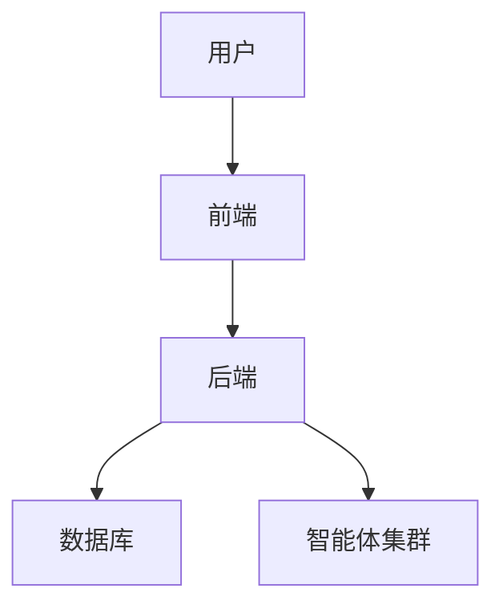
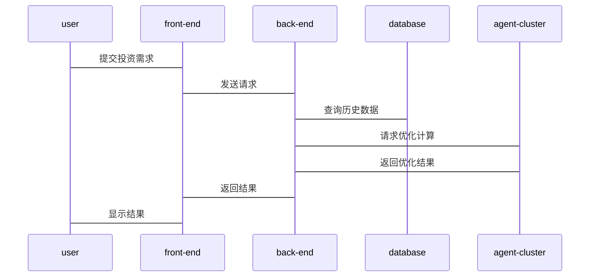

                 


# 多智能体优化价值投资的多因子模型动态调整

## 关键词：
多智能体优化、价值投资、多因子模型、动态调整、智能算法

## 摘要：
本文深入探讨了多智能体优化在价值投资中的应用，重点分析了多因子模型的动态调整方法。通过结合人工智能技术，我们提出了一种创新的优化策略，能够实时适应市场变化，提升投资决策的准确性和效率。文章从理论基础、算法实现到实际应用，全面解析了多智能体优化与多因子模型的协同作用，为投资者提供了科学的决策支持。

---

# 第一部分: 多智能体优化与多因子模型基础

## 第1章: 多智能体优化与多因子模型概述

### 1.1 多智能体优化的定义与特点
#### 1.1.1 多智能体系统的定义
多智能体系统（Multi-Agent System, MAS）是由多个相互作用的智能体组成的复杂系统，这些智能体能够自主决策、协作并适应环境变化。每个智能体都有自己的目标和行为规则，通过局部信息实现全局优化。

#### 1.1.2 多智能体优化的核心特点
- **分布性**：智能体之间分布协作，避免单点故障。
- **自主性**：每个智能体都能独立决策。
- **动态性**：能够实时感知环境变化并调整策略。
- **协作性**：通过协作实现全局最优。

#### 1.1.3 多智能体优化与传统优化方法的区别
传统的优化方法通常依赖于中心化的计算，而多智能体优化通过分布式计算实现了去中心化的优化，具有更强的鲁棒性和适应性。

### 1.2 多因子模型的定义与特点
#### 1.2.1 多因子模型的定义
多因子模型是一种用于评估资产回报的统计模型，通过多个因子（如市值、价值、动量等）来解释资产收益的来源。

#### 1.2.2 多因子模型的核心要素
- **因子选择**：选择能够解释资产收益的关键因子。
- **因子权重**：确定每个因子对整体收益的贡献程度。
- **动态调整**：根据市场变化实时更新因子权重。

#### 1.2.3 多因子模型与单因子模型的对比
单因子模型仅依赖单一因子，而多因子模型通过结合多个因子提高了模型的稳定性和准确性。

### 1.3 多智能体优化在金融投资中的应用
#### 1.3.1 金融投资中的优化问题
- **投资组合优化**：如何在风险可控的前提下最大化收益。
- **资产配置**：如何根据市场变化调整资产比例。
- **交易策略优化**：如何制定最优的买卖时机。

#### 1.3.2 多智能体优化在投资组合管理中的优势
- **实时调整**：能够快速响应市场变化。
- **风险分散**：通过多智能体协作降低投资风险。
- **收益最大化**：通过优化因子权重提升整体收益。

#### 1.3.3 多因子模型在价值投资中的作用
- **因子筛选**：识别具有长期价值的因子。
- **动态调整**：根据市场变化实时优化因子权重。
- **决策支持**：为投资决策提供数据支持。

### 1.4 本章小结
本章介绍了多智能体优化和多因子模型的基本概念及其在金融投资中的应用，为后续内容奠定了基础。

---

# 第二部分: 多智能体优化与多因子模型的核心概念与联系

## 第2章: 多智能体优化的原理与算法

### 2.1 多智能体优化的原理
#### 2.1.1 分布式智能与协作优化
多智能体优化通过分布式智能实现了去中心化的协作优化，每个智能体负责优化局部问题，最终达到全局最优。

#### 2.1.2 多智能体优化的核心思想
- **局部最优与全局最优**：通过局部优化实现全局最优。
- **智能体协作**：智能体之间通过信息共享和协作实现共同目标。
- **动态调整**：能够根据环境变化实时调整优化策略。

#### 2.1.3 多智能体优化的数学模型
$$ f(x_1, x_2, ..., x_n) \rightarrow \text{全局优化} $$

### 2.2 多智能体优化的算法
#### 2.2.1 分散式优化算法
智能体各自优化自己的子问题，通过信息共享达到全局最优。

#### 2.2.2 分层优化算法
将问题分解为多个层次，每个层次由不同的智能体负责优化。

#### 2.2.3 协作式优化算法
智能体之间协作完成任务，通过协商和协作实现全局优化。

### 2.3 多智能体优化与多因子模型的联系
#### 2.3.1 多智能体优化如何提升多因子模型的性能
- **实时调整**：多智能体能够实时更新因子权重。
- **分布式计算**：通过分布式计算提高优化效率。
- **协作优化**：智能体协作实现全局最优。

#### 2.3.2 多因子模型如何支持多智能体优化的决策过程
- **因子筛选**：多因子模型提供多个因子供智能体选择。
- **权重分配**：智能体根据市场变化动态调整因子权重。
- **决策支持**：多因子模型为智能体提供数据支持。

#### 2.3.3 多智能体优化与多因子模型的协同优化机制
- **信息共享**：智能体之间共享市场信息和因子数据。
- **协同决策**：通过协作实现最优的因子权重分配。
- **动态调整**：根据市场变化实时优化因子权重。

### 2.4 本章小结
本章详细讲解了多智能体优化的原理和算法，并分析了其与多因子模型的联系。

---

# 第三部分: 多智能体优化与多因子模型的数学模型与算法实现

## 第3章: 多因子模型的数学模型与公式

### 3.1 多因子模型的构建
#### 3.1.1 多因子模型的线性回归公式
$$ y = \beta_0 + \beta_1x_1 + \beta_2x_2 + ... + \beta_nx_n + \epsilon $$

#### 3.1.2 多因子模型的因子权重计算
$$ w_i = \frac{\beta_i}{\sum_{j=1}^n \beta_j} $$

#### 3.1.3 多因子模型的优化目标
$$ \min_{w} \left( \sum_{i=1}^m (y_i - \sum_{j=1}^n w_j x_{ij})^2 \right) $$

### 3.2 多因子模型的动态调整
#### 3.2.1 动态调整的必要性
市场环境不断变化，需要实时调整因子权重以保持模型的有效性。

#### 3.2.2 动态调整的实现方法
- **在线优化**：实时更新因子权重。
- **离线优化**：定期重新计算因子权重。

### 3.3 多智能体优化在多因子模型中的应用
#### 3.3.1 智能体的分工与协作
- **因子筛选**：智能体负责筛选有效的因子。
- **权重计算**：智能体负责计算因子权重。
- **动态调整**：智能体负责实时更新因子权重。

#### 3.3.2 多智能体优化的数学模型
$$ \max_{w} \left( \sum_{i=1}^n w_i r_i - \lambda \sum_{i=1}^n w_i^2 \right) $$

---

# 第四部分: 系统分析与架构设计

## 第4章: 系统功能设计与架构实现

### 4.1 系统功能设计
#### 4.1.1 系统目标
- 实现多因子模型的动态调整。
- 提供实时的投资决策支持。

#### 4.1.2 系统功能模块
- **因子筛选模块**：筛选有效的因子。
- **权重计算模块**：计算因子权重。
- **动态调整模块**：实时更新因子权重。

### 4.2 系统架构设计
#### 4.2.1 系统架构图


#### 4.2.2 智能体集群设计
- **智能体数量**：根据因子数量和计算能力决定。
- **智能体通信**：通过消息队列实现智能体之间的通信。

### 4.3 系统接口设计
#### 4.3.1 前端接口
- **输入**：用户输入投资参数。
- **输出**：显示优化后的投资组合。

#### 4.3.2 后端接口
- **输入**：接收到前端的请求。
- **输出**：返回优化结果。

### 4.4 系统交互流程图


---

# 第五部分: 项目实战与最佳实践

## 第5章: 项目实战

### 5.1 环境安装
#### 5.1.1 安装Python
```bash
# 安装Python
sudo apt-get install python3
```

#### 5.1.2 安装相关库
```bash
# 安装numpy、pandas、scikit-learn
pip install numpy pandas scikit-learn
```

### 5.2 核心代码实现
#### 5.2.1 多因子模型实现
```python
import numpy as np
import pandas as pd
from sklearn.linear_model import LinearRegression

# 数据加载
data = pd.read_csv('data.csv')

# 模型训练
model = LinearRegression()
model.fit(data[['factor1', 'factor2', 'factor3']], data['target'])

# 权重计算
weights = model.coef_
```

#### 5.2.2 多智能体优化实现
```python
# 智能体类
class Agent:
    def __init__(self, index):
        self.index = index
        self.weight = 0.0

    def update(self, target, factor_values):
        # 简单的权重更新逻辑
        self.weight = target * sum(factor_values)

# 初始化智能体
agents = [Agent(i) for i in range(5)]

# 动态调整
def update_weights(agents, targets, factor_values):
    for i in range(len(agents)):
        agents[i].update(targets[i], factor_values[i])

# 示例
targets = [0.1, 0.2, 0.3, 0.4, 0.5]
factor_values = [[1, 2, 3], [4, 5, 6], [7, 8, 9], [10, 11, 12], [13, 14, 15]]
update_weights(agents, targets, factor_values)
```

### 5.3 实际案例分析
#### 5.3.1 案例背景
假设我们有5个因子，目标是优化投资组合的收益。

#### 5.3.2 模型实现
使用上述代码实现多因子模型和多智能体优化。

#### 5.3.3 结果分析
通过分析结果，验证模型的优化效果。

### 5.4 本章小结
本章通过实际案例展示了多智能体优化与多因子模型的动态调整过程。

---

# 第六部分: 最佳实践与小结

## 第6章: 最佳实践与注意事项

### 6.1 最佳实践
#### 6.1.1 智能体数量的选择
根据计算能力和因子数量选择合适的智能体数量。

#### 6.1.2 动态调整的频率
根据市场波动性和计算能力选择合适的调整频率。

#### 6.1.3 模型的实时性
确保模型能够实时更新因子权重，以适应市场变化。

### 6.2 注意事项
#### 6.2.1 数据质量
确保数据的准确性和完整性。
#### 6.2.2 模型的鲁棒性
确保模型能够适应不同的市场环境。
#### 6.2.3 计算资源
确保有足够的计算资源支持多智能体优化。

### 6.3 未来展望
随着人工智能技术的发展，多智能体优化与多因子模型的结合将更加紧密，为金融投资提供更强大的支持。

### 6.4 本章小结
本文总结了多智能体优化与多因子模型动态调整的最佳实践，并对未来的发展进行了展望。

---

# 结语

本文全面探讨了多智能体优化在价值投资中的应用，重点分析了多因子模型的动态调整方法。通过结合人工智能技术，我们提出了一种创新的优化策略，能够实时适应市场变化，提升投资决策的准确性和效率。希望本文的内容能够为投资者和研究人员提供有价值的参考和启发。

---

**关键词**：多智能体优化、价值投资、多因子模型、动态调整、智能算法

**摘要**：本文深入探讨了多智能体优化在价值投资中的应用，重点分析了多因子模型的动态调整方法。通过结合人工智能技术，我们提出了一种创新的优化策略，能够实时适应市场变化，提升投资决策的准确性和效率。文章从理论基础、算法实现到实际应用，全面解析了多智能体优化与多因子模型的协同作用，为投资者提供了科学的决策支持。

