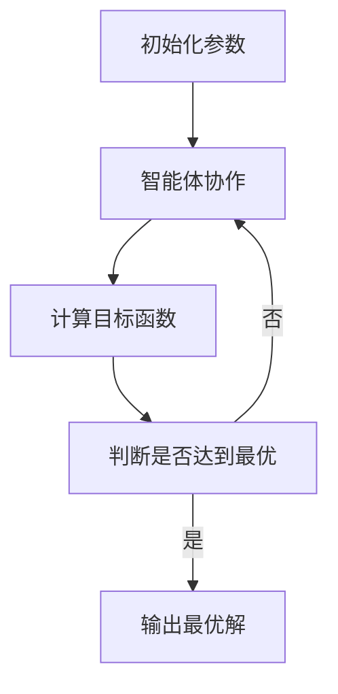
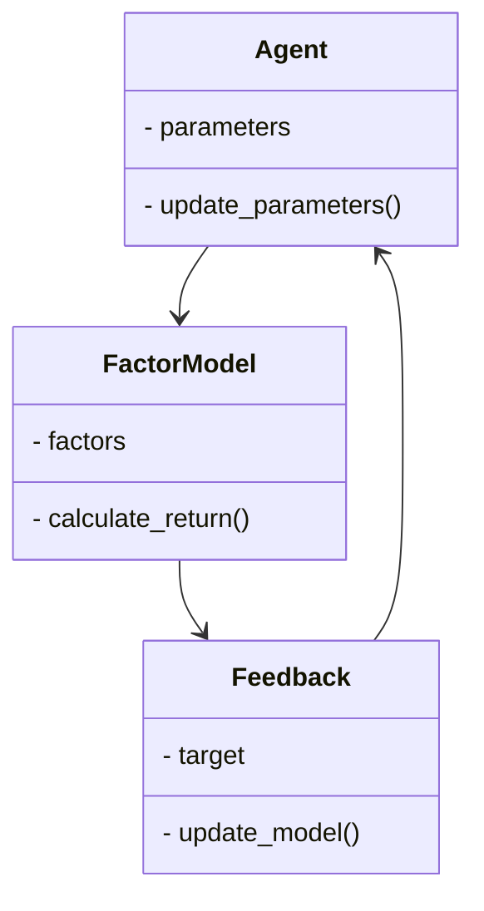
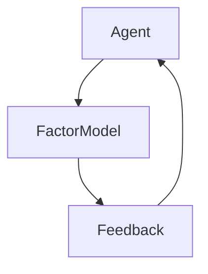

                 


# 多智能体优化价值投资的多因子模型自适应调整

> 关键词：多智能体优化，价值投资，多因子模型，自适应调整，智能体系统，投资策略

> 摘要：本文探讨了多智能体优化在价值投资中的应用，重点分析了多因子模型的自适应调整方法。通过结合多智能体系统与多因子模型，提出了优化投资策略的创新方法，为投资者提供了新的思路。

---

## 第一章：多智能体优化与价值投资概述

### 1.1 多智能体优化的背景与概念

#### 1.1.1 多智能体系统的定义
多智能体系统（Multi-Agent System，MAS）是由多个智能体（Agent）组成的分布式系统，每个智能体能够感知环境、自主决策并协同完成任务。

#### 1.1.2 多智能体优化的原理
多智能体优化通过智能体之间的协作与竞争，优化全局目标。智能体通过信息共享和策略调整，实现系统的最优性能。

#### 1.1.3 多智能体在金融领域的应用
在金融领域，多智能体系统被用于股票交易、风险控制和投资组合优化。通过多个智能体的协同，提升投资决策的效率和准确性。

### 1.2 价值投资的核心理念

#### 1.2.1 价值投资的定义
价值投资是一种以内在价值为基础的投资策略，寻找被市场低估的资产进行长期投资。

#### 1.2.2 价值投资的关键要素
- **基本面分析**：研究公司的财务状况、行业地位和盈利能力。
- **市场情绪**：分析市场波动对资产价格的影响。
- **长期视角**：注重资产的长期增值潜力。

#### 1.2.3 价值投资与多智能体优化的结合
多智能体系统能够通过数据挖掘和模式识别，帮助投资者发现价值低估的资产，提升价值投资的效率和精准度。

### 1.3 多因子模型的介绍

#### 1.3.1 多因子模型的定义
多因子模型是一种基于多个因子（如市值、估值、动量等）来解释资产收益的模型。

#### 1.3.2 多因子模型的特点
- **多维度分析**：考虑多个因子对资产收益的影响。
- **动态调整**：根据市场变化调整因子权重。
- **数据驱动**：基于大量历史数据进行分析。

#### 1.3.3 多因子模型在投资中的应用
多因子模型广泛应用于投资组合管理和风险控制，帮助投资者制定科学的投资策略。

### 1.4 自适应调整的必要性

#### 1.4.1 自适应调整的定义
自适应调整是指系统能够根据环境变化自动调整参数和策略，以保持最佳性能。

#### 1.4.2 自适应调整在投资中的作用
在复杂多变的金融市场中，自适应调整能够帮助投资者及时应对市场波动，优化投资组合。

#### 1.4.3 自适应调整与多智能体优化的关系
多智能体优化通过自适应调整机制，实现系统在动态环境中的最优性能。

---

## 第二章：多智能体优化的核心概念

### 2.1 多智能体系统的构成

#### 2.1.1 智能体的定义与特点
智能体是一种能够感知环境、自主决策并采取行动的实体。

#### 2.1.2 多智能体系统的架构
多智能体系统由多个智能体组成，通过通信和协作完成复杂任务。

#### 2.1.3 多智能体系统的通信机制
智能体之间的通信是通过消息传递实现的，确保系统内部的信息共享和协同。

### 2.2 多因子模型的构建

#### 2.2.1 多因子模型的构建步骤
1. 确定因子：选择影响资产收益的关键因子。
2. 数据收集：获取相关的历史数据。
3. 因子权重：确定各因子的权重。
4. 模型验证：通过回测验证模型的有效性。

#### 2.2.2 多因子模型的因子选择
常见因子包括市值、估值、动量、质量等，选择合适的因子组合能够提升模型的预测能力。

#### 2.2.3 多因子模型的评估方法
通过回测、风险调整后的收益和因子相关性分析，评估模型的性能。

### 2.3 自适应调整的实现机制

#### 2.3.1 自适应调整的算法选择
常用的自适应调整算法包括遗传算法、粒子群优化和模拟退火等。

#### 2.3.2 自适应调整的实现步骤
1. 确定目标函数。
2. 初始化参数。
3. 迭代优化：根据反馈调整参数。
4. 终止条件：达到最优解或迭代次数。

#### 2.3.3 自适应调整的效果评估
通过对比调整前后的模型性能，评估自适应调整的有效性。

---

## 第三章：多智能体优化与多因子模型的结合

### 3.1 多智能体优化在多因子模型中的应用

#### 3.1.1 多智能体优化如何提升多因子模型的性能
通过智能体的协作，优化因子权重和模型参数，提升预测精度。

#### 3.1.2 多智能体优化在因子选择中的作用
智能体能够识别出对收益影响最大的因子，提高模型的有效性。

#### 3.1.3 多智能体优化在因子权重调整中的应用
根据市场变化动态调整因子权重，适应不同的市场环境。

### 3.2 多智能体优化与自适应调整的结合

#### 3.2.1 自适应调整在多智能体优化中的作用
通过自适应调整，智能体能够快速响应市场变化，优化决策策略。

#### 3.2.2 多智能体优化如何实现自适应调整
智能体通过反馈机制不断优化自身的决策规则，实现系统的动态调整。

#### 3.2.3 自适应调整对多智能体优化的优化效果
自适应调整能够显著提升系统的鲁棒性和适应性，增强投资收益。

---

## 第四章：多智能体优化算法的实现

### 4.1 多智能体优化算法的原理

#### 4.1.1 多智能体优化算法的基本原理
多智能体优化算法通过智能体之间的竞争与协作，找到全局最优解。

#### 4.1.2 多智能体优化算法的步骤
1. 初始化：设置智能体的初始参数。
2. 信息共享：智能体之间交换信息。
3. 策略调整：根据反馈调整决策策略。
4. 迭代优化：不断优化参数，直到达到最优解。

### 4.2 多智能体优化算法的实现

#### 4.2.1 算法流程图



#### 4.2.2 Python代码实现

```python
class Agent:
    def __init__(self, parameters):
        self.parameters = parameters

    def update_parameters(self, feedback):
        self.parameters = self.optimize(self.parameters, feedback)

    def optimize(self, current, feedback):
        # 简单优化策略，可根据具体需求调整
        return current * (1 + feedback)

# 示例用法
def main():
    agent = Agent(initial_parameters)
    while True:
        feedback = calculate_feedback(agent.parameters)
        agent.update_parameters(feedback)
        if is_optimal(agent.parameters):
            break

if __name__ == "__main__":
    main()
```

---

## 第五章：数学模型与系统架构设计

### 5.1 数学模型的建立

#### 5.1.1 多因子模型的数学表达
$$ R_i = \beta_{i1}F_1 + \beta_{i2}F_2 + \dots + \beta_{ik}F_k + \epsilon_i $$
其中，$R_i$ 是资产 $i$ 的收益，$F_j$ 是因子，$\beta_{ij}$ 是因子的权重，$\epsilon_i$ 是误差项。

#### 5.1.2 自适应调整的数学模型
$$ \theta_{t+1} = \theta_t + \alpha \cdot (target - f(\theta_t)) $$
其中，$\theta_t$ 是当前参数，$\alpha$ 是学习率，$target$ 是目标值，$f(\theta_t)$ 是当前的函数值。

### 5.2 系统架构设计

#### 5.2.1 系统功能设计



#### 5.2.2 系统架构图



---

## 第六章：项目实战与总结

### 6.1 项目实战

#### 6.1.1 环境安装
安装必要的库，如numpy、pandas、scikit-learn等。

#### 6.1.2 核心代码实现

```python
import numpy as np
import pandas as pd

def calculate_return(factors, weights):
    return np.dot(factors, weights)

def optimize_weights(weights, feedback):
    return weights * (1 + feedback)

# 示例数据
factors = np.array([0.5, 0.3, 0.2])
weights = np.array([1, 1, 1])

# 优化过程
for _ in range(10):
    return_val = calculate_return(factors, weights)
    feedback = calculate_feedback(return_val)  # 反馈机制需要具体实现
    weights = optimize_weights(weights, feedback)

print(weights)
```

#### 6.1.3 案例分析
通过实际数据验证模型的有效性，调整因子权重，优化投资组合。

### 6.2 总结与展望

#### 6.2.1 总结
多智能体优化与多因子模型的结合，显著提升了投资决策的效率和准确性。通过自适应调整，系统能够更好地应对复杂多变的市场环境。

#### 6.2.2 展望
未来的研究可以进一步探索更复杂的智能体协作机制，以及如何在更多应用场景中实现多智能体优化。

---

## 第七章：注意事项与最佳实践

### 7.1 注意事项

#### 7.1.1 数据质量的重要性
确保数据的准确性和完整性，避免因数据问题导致模型失效。

#### 7.1.2 参数调整的敏感性
参数设置对模型性能影响重大，需谨慎调整，避免过拟合。

#### 7.1.3 模型的实时性
金融市场变化迅速，模型需要具备实时调整的能力，确保投资决策的及时性。

### 7.2 最佳实践

#### 7.2.1 定期回测
通过定期回测验证模型的有效性，及时发现并解决问题。

#### 7.2.2 多元化投资
结合多因子模型和自适应调整，构建多元化投资组合，降低风险。

#### 7.2.3 持续学习
金融市场环境复杂多变，需持续优化模型，提升适应性。

---

## 第八章：拓展阅读与资源推荐

### 8.1 相关书籍
1. 《多智能体系统》
2. 《多因子模型实战》

### 8.2 在线资源
1. 多智能体系统研究论文
2. 多因子模型开源代码

### 8.3 专业论坛
1. 量化投资论坛
2. 人工智能技术交流群

---

通过以上结构，您可以撰写一篇详细的、有深度的关于多智能体优化价值投资的多因子模型自适应调整的技术博客文章。

