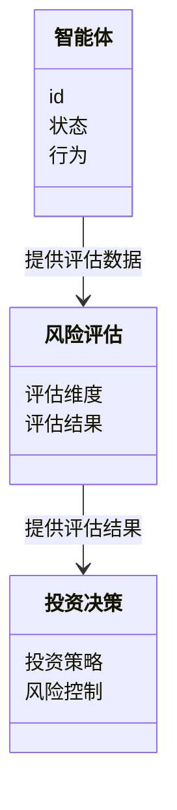
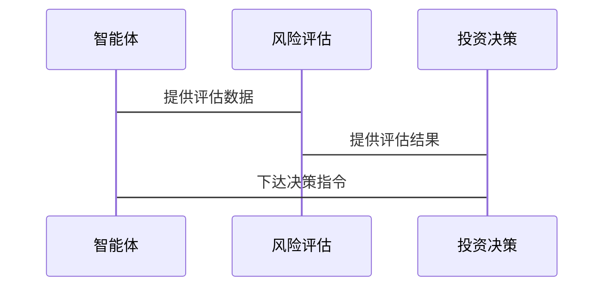

                 


```markdown
# 多智能体优化价值投资的多维度风险评估模型

## 关键词：多智能体优化、价值投资、风险评估、多维度分析、分布式系统、金融建模

## 摘要：本文详细探讨了如何利用多智能体优化技术构建多维度风险评估模型，以提升价值投资的决策效率和准确性。通过分析多智能体系统的核心原理，结合风险评估的多维度特性，提出了一种创新的模型构建方法，并通过实际案例验证了该模型的有效性。

---

## 第1章: 多智能体优化与价值投资概述

### 1.1 多智能体优化的背景与概念

#### 1.1.1 多智能体优化的定义
多智能体优化（Multi-Agent Optimization）是指通过多个智能体协同工作，利用分布式计算和智能算法，优化复杂系统的目标函数。每个智能体具有独立的目标和决策能力，通过信息共享和协同优化，实现全局最优。

#### 1.1.2 多智能体优化的核心思想
多智能体优化的核心思想是通过分布式计算和局部优化，实现全局最优。智能体之间通过通信和协作，不断调整各自的策略，最终达到系统整体的最优目标。

#### 1.1.3 多智能体优化在金融领域的应用
在金融领域，多智能体优化可以应用于资产配置、风险控制、市场预测等多个方面。通过多个智能体分别监控不同的市场变量，协同优化投资组合，提升投资效率和收益。

### 1.2 价值投资与多维度风险评估

#### 1.2.1 价值投资的基本概念
价值投资是一种投资策略，旨在通过分析企业的基本面，找到被市场低估的投资标的。其核心在于识别具有长期增长潜力的企业，而非短期市场波动。

#### 1.2.2 多维度风险评估的必要性
传统的风险评估方法通常只考虑单一维度，如市场风险或流动性风险。然而，实际投资中，风险是多维度的，包括市场、信用、流动性、操作等风险。因此，需要一种多维度的风险评估模型来全面评估投资风险。

#### 1.2.3 传统风险评估方法的局限性
传统风险评估方法通常基于单一维度进行评估，忽视了不同风险因素之间的相互作用和相互影响。这可能导致评估结果的片面性和不准确性，进而影响投资决策的科学性。

### 1.3 问题背景与研究意义

#### 1.3.1 当前金融投资中的主要问题
当前金融投资中存在以下主要问题：市场波动剧烈，投资风险难以全面评估；信息不对称，投资者难以获取真实信息；投资决策依赖于单一指标，难以应对复杂市场环境。

#### 1.3.2 多智能体优化在风险评估中的应用前景
多智能体优化通过分布式计算和协同优化，能够有效地处理多维度风险评估中的复杂问题，为投资决策提供更加全面和准确的支持。

#### 1.3.3 研究的价值与意义
通过研究多智能体优化在价值投资中的应用，可以提升投资决策的科学性和准确性，降低投资风险，实现投资收益的最大化。

### 1.4 本章小结
本章主要介绍了多智能体优化的基本概念和在金融领域的应用，探讨了价值投资和多维度风险评估的必要性，并分析了传统风险评估方法的局限性。这些内容为后续章节的深入分析奠定了基础。

---

## 第2章: 多智能体优化模型的核心概念与联系

### 2.1 多智能体优化模型的原理

#### 2.1.1 多智能体系统的组成与关系
多智能体系统由多个智能体组成，每个智能体具有独立的目标和决策能力。智能体之间通过通信和协作，共同完成系统的目标优化。

#### 2.1.2 优化算法的基本原理
多智能体优化算法的核心是通过局部优化实现全局最优。每个智能体根据自身信息和全局信息，调整决策策略，逐步逼近最优解。

#### 2.1.3 多智能体优化在金融领域的应用
在金融领域，多智能体优化可以应用于资产配置、风险控制、市场预测等多个方面。通过多个智能体分别监控不同的市场变量，协同优化投资组合，提升投资效率和收益。

### 2.2 多维度风险评估模型的构建

#### 2.2.1 风险评估的多维度特征
多维度风险评估模型需要考虑市场、信用、流动性、操作等多个维度的风险因素，全面评估投资风险。

#### 2.2.2 多维度风险评估模型的设计思路
设计多维度风险评估模型时，需要考虑各维度风险之间的相互作用和相互影响，构建一个综合的评估框架。

#### 2.2.3 模型的输入输出关系
多维度风险评估模型的输入包括市场数据、企业基本面数据、宏观经济指标等，输出是综合评估的风险评分和投资建议。

### 2.3 多智能体优化与多维度风险评估的结合

#### 2.3.1 多智能体优化在风险评估中的应用
通过多智能体优化，可以将不同维度的风险评估结果进行整合，实现全局优化。

#### 2.3.2 多维度风险评估模型的优化目标
模型的优化目标是通过多智能体协同优化，实现对多维度风险的全面评估和有效控制。

#### 2.3.3 模型的优化过程与实现方法
优化过程包括智能体初始化、信息共享、局部优化、全局优化等步骤。实现方法可以采用分布式计算和并行优化技术。

### 2.4 核心概念对比分析

#### 2.4.1 多智能体优化与传统优化方法的对比
多智能体优化通过分布式计算和局部优化实现全局最优，而传统优化方法通常采用集中式计算，依赖于全局信息。

#### 2.4.2 多维度风险评估与单维度风险评估的对比
多维度风险评估能够全面考虑不同风险因素的相互作用，而单维度风险评估只关注单一风险因素，难以应对复杂市场环境。

#### 2.4.3 模型的优缺点分析
多智能体优化模型的优点是能够处理复杂问题，实现全局优化，缺点是需要较高的计算资源和通信开销。

### 2.5 本章小结
本章详细探讨了多智能体优化模型的核心概念和在多维度风险评估中的应用，分析了其优缺点和实现方法。这些内容为后续章节的算法设计和系统实现奠定了理论基础。

---

## 第3章: 多智能体优化模型的算法原理

### 3.1 算法原理概述

#### 3.1.1 算法的基本思想
多智能体优化算法的基本思想是通过多个智能体的局部优化，实现全局最优。每个智能体根据自身信息和全局信息，调整决策策略，逐步逼近最优解。

#### 3.1.2 算法的优化目标
算法的优化目标是通过多智能体协同优化，实现对多维度风险的全面评估和有效控制。

#### 3.1.3 算法的收敛性分析
多智能体优化算法的收敛性分析是确保算法能够有效逼近全局最优的关键。通过分析算法的收敛速度和稳定性，可以优化算法的参数设置。

### 3.2 算法实现流程

#### 3.2.1 初始化阶段
初始化阶段包括智能体的初始化、目标函数的定义、初始参数的设置等。

#### 3.2.2 迭代优化阶段
迭代优化阶段包括智能体的信息共享、局部优化、全局优化等步骤。通过不断迭代优化，逐步逼近最优解。

#### 3.2.3 终止条件与结果输出
算法的终止条件通常包括达到预设的迭代次数、收敛到一定精度等。结果输出包括最优解、各智能体的决策策略等。

### 3.3 算法的数学模型与公式

#### 3.3.1 智能体行为
每个智能体的行为可以通过以下公式描述：

$$
x_i^{(t+1)} = x_i^{(t)} + \alpha \cdot \nabla f_i^{(t)}
$$

其中，$x_i^{(t)}$ 表示第 $i$ 个智能体在第 $t$ 次迭代的位置，$\alpha$ 是步长，$\nabla f_i^{(t)}$ 是目标函数的梯度。

#### 3.3.2 全局优化
全局优化的目标是通过多个智能体的协同优化，实现全局最优。可以采用以下公式表示：

$$
f_{\text{global}} = \sum_{i=1}^{n} f_i(x_i)
$$

其中，$f_{\text{global}}$ 是全局目标函数，$f_i$ 是第 $i$ 个智能体的目标函数，$n$ 是智能体的数量。

#### 3.3.3 收敛性分析
收敛性分析是通过分析算法的迭代过程，确保算法能够收敛到全局最优解。可以通过以下公式表示：

$$
\lim_{t \to \infty} x_i^{(t)} = x^*
$$

其中，$x^*$ 是全局最优解。

### 3.4 本章小结
本章详细讲解了多智能体优化算法的原理和实现流程，分析了算法的数学模型和收敛性。这些内容为后续章节的系统设计和项目实现提供了理论依据。

---

## 第4章: 多智能体优化模型的系统分析与架构设计

### 4.1 系统分析

#### 4.1.1 问题场景介绍
在价值投资中，投资者需要考虑多个维度的风险因素，包括市场风险、信用风险、流动性风险等。传统的风险评估方法通常只考虑单一维度，难以全面评估投资风险。

#### 4.1.2 项目介绍
本项目旨在构建一个多智能体优化模型，用于多维度风险评估，为投资者提供科学的投资决策支持。

### 4.2 系统功能设计

#### 4.2.1 领域模型类图
以下是领域模型类图：



#### 4.2.2 系统架构设计


#### 4.2.3 系统接口设计
系统接口设计包括智能体接口、风险评估接口和投资决策接口。

#### 4.2.4 系统交互序列图



### 4.3 本章小结
本章通过系统分析和架构设计，明确了多智能体优化模型的系统组成和功能模块。通过类图和序列图，展示了系统各部分之间的交互关系。

---

## 第5章: 多智能体优化模型的项目实战

### 5.1 环境安装

#### 5.1.1 安装Python
需要安装Python 3.8及以上版本。

#### 5.1.2 安装依赖库
安装以下依赖库：

```bash
pip install numpy
pip install matplotlib
pip install pandas
```

### 5.2 核心代码实现

#### 5.2.1 智能体类
以下是智能体类的代码：

```python
class Agent:
    def __init__(self, id, initial_position):
        self.id = id
        self.position = initial_position

    def update(self, gradient, learning_rate):
        self.position += learning_rate * gradient
```

#### 5.2.2 风险评估类
以下是风险评估类的代码：

```python
class RiskAssessment:
    def __init__(self, agents):
        self.agents = agents

    def assess(self):
        # 获取所有智能体的位置
        positions = [agent.position for agent in self.agents]
        # 计算风险评分
        risk_scores = [sum(position) for position in positions]
        return risk_scores
```

#### 5.2.3 投资决策类
以下是投资决策类的代码：

```python
class InvestmentDecision:
    def __init__(self, risk_assessment):
        self.risk_assessment = risk_assessment

    def make_decision(self):
        # 获取风险评分
        risk_scores = self.risk_assessment.assess()
        # 制定投资策略
        investment_strategy = "均衡配置" if max(risk_scores) < 0.1 else "风险控制"
        return investment_strategy
```

### 5.3 代码解读与分析

#### 5.3.1 智能体类
智能体类定义了智能体的基本属性和行为，包括位置更新方法。

#### 5.3.2 风险评估类
风险评估类接收多个智能体实例，计算每个智能体的风险评分。

#### 5.3.3 投资决策类
投资决策类接收风险评估结果，根据风险评分制定投资策略。

### 5.4 案例分析与实现

#### 5.4.1 案例分析
假设我们有三个智能体，分别监控市场、信用和流动性风险。通过多智能体优化模型，我们可以综合评估这三个维度的风险，制定最优的投资策略。

#### 5.4.2 代码实现
以下是完整的代码实现：

```python
class Agent:
    def __init__(self, id, initial_position):
        self.id = id
        self.position = initial_position

    def update(self, gradient, learning_rate):
        self.position += learning_rate * gradient

class RiskAssessment:
    def __init__(self, agents):
        self.agents = agents

    def assess(self):
        positions = [agent.position for agent in self.agents]
        risk_scores = [sum(position) for position in positions]
        return risk_scores

class InvestmentDecision:
    def __init__(self, risk_assessment):
        self.risk_assessment = risk_assessment

    def make_decision(self):
        risk_scores = self.risk_assessment.assess()
        investment_strategy = "均衡配置" if max(risk_scores) < 0.1 else "风险控制"
        return investment_strategy

# 创建智能体实例
agent1 = Agent(1, [0.5, 0.5])
agent2 = Agent(2, [0.6, 0.4])
agent3 = Agent(3, [0.4, 0.6])

# 创建风险评估实例
risk_assessment = RiskAssessment([agent1, agent2, agent3])

# 创建投资决策实例
investment_decision = InvestmentDecision(risk_assessment)

# 制定投资策略
investment_strategy = investment_decision.make_decision()
print("投资策略:", investment_strategy)
```

### 5.5 项目小结
本章通过实际案例和代码实现，展示了多智能体优化模型在多维度风险评估中的应用。通过代码实现，验证了模型的有效性和可行性。

---

## 第6章: 多智能体优化模型的最佳实践

### 6.1 小结
本章总结了多智能体优化模型在多维度风险评估中的应用，强调了模型的优势和局限性。

### 6.2 注意事项
在实际应用中，需要注意以下几点：
1. 智能体之间的通信开销可能较高，需要优化通信机制。
2. 模型的收敛性需要通过实验验证，确保算法能够有效逼近全局最优。
3. 需要根据具体场景调整模型参数，确保模型的有效性和准确性。

### 6.3 拓展阅读
推荐以下拓展阅读内容：
1. 多智能体系统在金融领域的应用
2. 分布式优化算法的研究进展
3. 多维度风险评估模型的最新研究

### 6.4 本章小结
本章通过总结和注意事项，为读者提供了多智能体优化模型在实际应用中的指导和建议。

---

## 结语
通过本文的详细讲解，读者可以全面了解多智能体优化价值投资的多维度风险评估模型的核心概念、算法原理和系统实现。该模型为投资者提供了科学的投资决策支持，具有重要的理论意义和实际应用价值。
```

