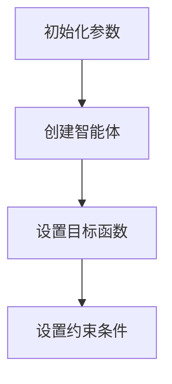
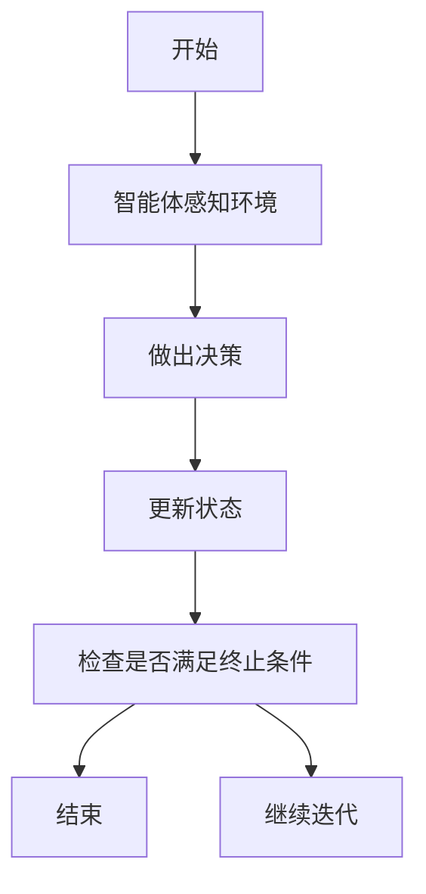
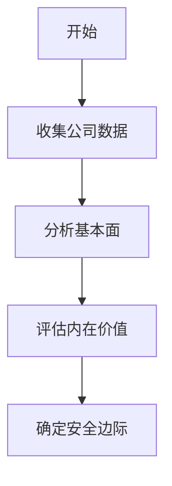
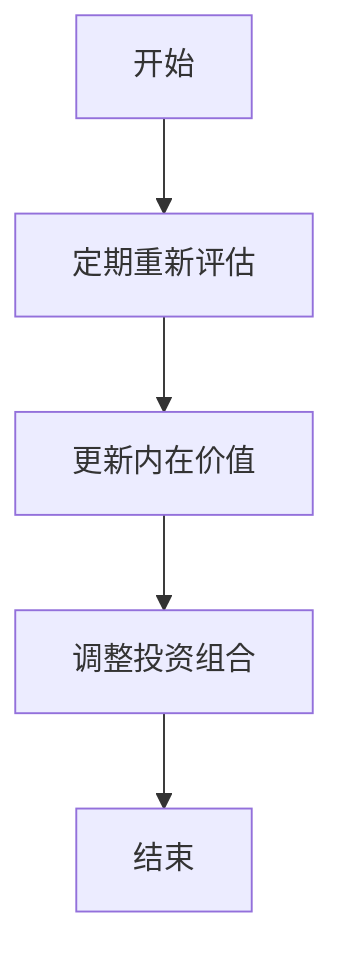
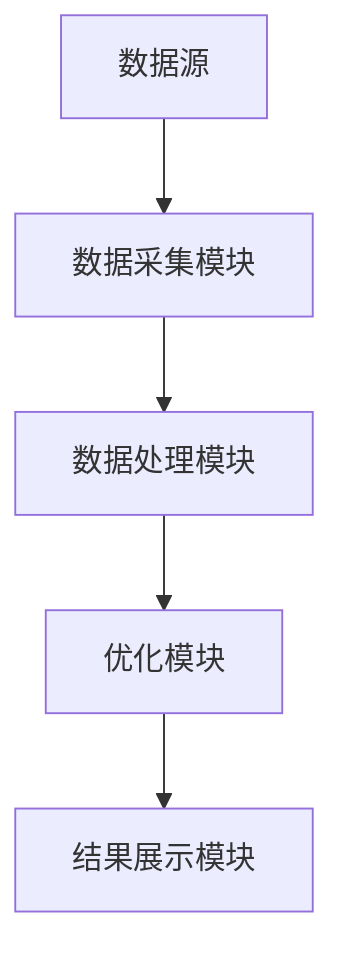

                 


### 第一部分: 多智能体优化与价值投资概述

#### 第1章: 多智能体优化与价值投资的背景介绍

##### 1.1 多智能体优化的基本概念

###### 1.1.1 多智能体优化的定义
多智能体优化是指通过多个智能体协同工作，以实现某个特定目标的优化过程。每个智能体都具有一定的自主性，能够感知环境并做出决策。

###### 1.1.2 多智能体优化的核心要素
- **智能体**：能够感知环境并采取行动的实体。
- **目标函数**：需要优化的函数或指标。
- **约束条件**：优化过程中需要满足的条件。
- **协同机制**：智能体之间进行信息交换和协作的方式。

###### 1.1.3 多智能体优化与传统优化方法的对比
| 对比维度 | 多智能体优化 | 传统优化方法 |
|----------|--------------|---------------|
| 决策主体 | 多个智能体协同 | 单一优化主体   |
| 信息共享 | 高度共享     | 低或无共享     |
| 稳定性   | 较高         | 较低           |
| 应用场景 | 复杂系统优化 | 简单系统优化   |

##### 1.2 价值投资的基本概念

###### 1.2.1 价值投资的定义
价值投资是一种投资策略，通过分析公司的基本面，寻找被市场低估的股票进行投资。

###### 1.2.2 价值投资的核心原则
- **安全边际**：买入价格低于内在价值。
- **长期视角**：关注公司的长期盈利能力。
- **分散投资**：降低风险。

###### 1.2.3 价值投资与其它投资策略的区别
| 对比维度 | 价值投资 | 其他策略（如技术分析） |
|----------|----------|------------------------|
| 分析基础 | 公司基本面 | 市场趋势和技术指标    |
| 投资期限 | 长期      | 短期或中期            |
| 风险控制 | 强调安全边际 | 依赖技术信号          |

##### 1.3 多资产类别相关性分析的背景

###### 1.3.1 多资产类别相关性分析的定义
多资产类别相关性分析是指研究不同资产类别之间的相关性，以优化投资组合的风险和收益。

###### 1.3.2 多资产类别相关性分析的重要性
- **风险分散**：通过相关性分析，可以找到低相关的资产进行投资，降低整体风险。
- **收益增强**：通过优化资产配置，提高投资组合的收益。

###### 1.3.3 多资产类别相关性分析的挑战与机遇
| 挑战 | 机遇 |
|------|------|
| 数据复杂性 | 数据多样性 |
| 计算资源需求高 | 计算技术进步 |

---

### 第二部分: 多智能体优化与价值投资的核心概念与联系

#### 第2章: 多智能体优化与价值投资的核心概念与联系

##### 2.1 多智能体优化的核心原理

###### 2.1.1 多智能体优化的算法原理
- 初始化：设置智能体数量、目标函数、约束条件。
- 迭代：每个智能体根据当前状态做出决策，并更新状态。
- 结束条件：达到目标或满足终止条件。

##### 2.1.2 多智能体优化的数学模型
目标函数：
$$ f(x_1, x_2, ..., x_n) \rightarrow \text{最小化或最大化} $$

约束条件：
$$ g_i(x_1, x_2, ..., x_n) \leq 0 \quad (i=1,2,...,m) $$

##### 2.1.3 多智能体优化与传统优化方法的对比
- **决策主体**：多智能体优化涉及多个智能体，而传统优化通常是一个优化主体。
- **信息共享**：多智能体优化强调智能体之间的信息共享，而传统优化通常不考虑信息共享。

##### 2.2 价值投资的核心原理

###### 2.2.1 价值投资的数学模型
$$ \text{内在价值} = \frac{\text{未来现金流}}{\text{折现率}} $$

###### 2.2.2 价值投资的实现步骤
1. 分析公司基本面。
2. 评估公司内在价值。
3. 确定安全边际。
4. 构建投资组合。

##### 2.3 多智能体优化与价值投资的联系
- **协同优化**：多智能体优化可以用于优化投资组合中的资产配置。
- **动态调整**：通过多个智能体协同工作，可以实时调整投资策略。

---

### 第三部分: 多智能体优化与价值投资的算法原理

#### 第3章: 多智能体优化与价值投资的算法原理

##### 3.1 多智能体优化的算法流程

###### 3.1.1 多智能体优化的初始化


###### 3.1.2 多智能体优化的迭代过程


##### 3.2 价值投资的算法流程

###### 3.2.1 价值投资的初始化


###### 3.2.2 价值投资的迭代过程


---

### 第四部分: 多智能体优化与价值投资的数学模型与公式

#### 第4章: 多智能体优化与价值投资的数学模型与公式

##### 4.1 多智能体优化的数学模型
- **目标函数**：
$$ \min f(x_1, x_2, ..., x_n) $$
- **约束条件**：
$$ g_i(x_1, x_2, ..., x_n) \leq 0 \quad (i=1,2,...,m) $$

##### 4.2 价值投资的数学模型
- **内在价值公式**：
$$ V = \frac{C F}{r} $$
其中，\( C F \) 是未来现金流，\( r \) 是折现率。

---

### 第五部分: 多智能体优化与价值投资的系统分析与架构设计

#### 第5章: 多智能体优化与价值投资的系统分析与架构设计

##### 5.1 系统分析

###### 5.1.1 系统目标
- 实现多智能体优化在价值投资中的应用。
- 优化投资组合的风险和收益。

##### 5.1.2 系统需求
- 数据采集：获取多资产类别的数据。
- 数据分析：计算相关性。
- 优化：使用多智能体优化算法进行优化。

##### 5.2 系统架构设计

###### 5.2.1 系统架构图


###### 5.2.2 系统模块划分
- 数据采集模块：负责获取多资产类别的数据。
- 数据处理模块：对数据进行清洗和预处理。
- 优化模块：使用多智能体优化算法进行优化。
- 结果展示模块：展示优化结果。

##### 5.3 系统接口设计

###### 5.3.1 接口设计
- 数据接口：数据采集模块与数据处理模块之间的接口。
- 优化接口：数据处理模块与优化模块之间的接口。
- 展示接口：优化模块与结果展示模块之间的接口。

---

### 第六部分: 多智能体优化与价值投资的项目实战

#### 第6章: 多智能体优化与价值投资的项目实战

##### 6.1 项目环境安装

###### 6.1.1 系统环境要求
- 操作系统：Windows/Mac/Linux
- Python版本：>=3.6

###### 6.1.2 依赖库安装
```bash
pip install numpy pandas scikit-learn
```

##### 6.2 系统核心实现源代码

###### 6.2.1 多智能体优化算法实现
```python
import numpy as np

class MultiAgentOptimizer:
    def __init__(self, n_agents, target_function, constraints):
        self.n_agents = n_agents
        self.target_function = target_function
        self.constraints = constraints

    def optimize(self):
        # 初始化智能体
        for _ in range(self.n_agents):
            # 每个智能体进行优化
            pass

        return result
```

###### 6.2.2 价值投资实现
```python
import pandas as pd

class ValueInvestor:
    def __init__(self, data):
        self.data = data

    def evaluate_value(self):
        # 计算内在价值
        return self.data['内在价值']
```

##### 6.3 代码应用解读与分析
- **多智能体优化算法**：通过多个智能体协同优化，找到最优解。
- **价值投资实现**：通过分析公司基本面，找到低估的股票。

##### 6.4 实际案例分析
- **案例背景**：假设我们有股票、债券、基金等多个资产类别。
- **优化过程**：使用多智能体优化算法优化投资组合。
- **结果分析**：分析优化后的投资组合的风险和收益。

---

### 第七部分: 最佳实践 tips、小结、注意事项、拓展阅读

#### 第7章: 最佳实践 tips、小结、注意事项、拓展阅读

##### 7.1 小结
- 多智能体优化与价值投资密切相关。
- 通过多资产类别相关性分析，可以优化投资组合的风险和收益。

##### 7.2 注意事项
- **数据质量**：确保数据的准确性和完整性。
- **算法选择**：根据具体问题选择合适的优化算法。
- **风险控制**：重视风险控制，避免过度优化。

##### 7.3 拓展阅读
- 多智能体优化：深入学习多智能体优化的算法和应用。
- 价值投资：进一步学习价值投资的高级策略和案例分析。

---

通过以上目录结构，文章将从基础到应用，逐步深入地讲解多智能体优化在价值投资中的应用，帮助读者全面理解和掌握相关知识。

