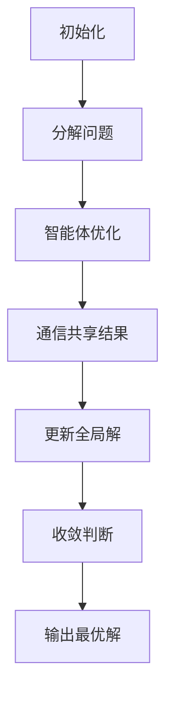
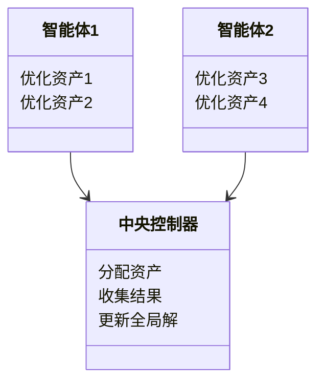

                 


# 多智能体协作优化投资组合分散度

> 关键词：多智能体协作、投资组合分散度、优化算法、博弈论、分布式系统

> 摘要：本文探讨了多智能体协作在优化投资组合分散度中的应用，通过分析分散度的数学模型和算法，结合系统架构设计，展示了如何利用多智能体协作技术实现高效的投资组合分散度优化。

---

## 第一部分: 多智能体协作优化投资组合分散度概述

### 第1章: 问题背景与目标

#### 1.1 投资组合分散度的基本概念
投资组合分散度是指将资金分配到不同的资产或资产类别中，以降低投资风险。分散度越高，投资组合的波动性通常越低，风险越分散。然而，如何在多智能体协作的环境下优化分散度，是一个复杂的优化问题。

#### 1.2 多智能体协作的背景与意义
多智能体系统由多个智能体组成，每个智能体都有自己的目标和决策能力。在投资组合分散度优化中，多智能体协作可以利用各智能体的优势，提高优化效率和效果。

#### 1.3 问题描述与解决方法
投资组合分散度优化的目标是在给定的约束条件下，找到最优的资产分配策略。多智能体协作通过分解问题、协同学习和分布式优化，能够有效解决复杂的投资组合分散度问题。

---

### 第2章: 多智能体协作优化的核心概念

#### 2.1 多智能体协作的基本原理
多智能体协作涉及多个智能体之间的通信与协作，每个智能体负责优化特定部分的分散度。通过协同学习和博弈论，智能体能够共同找到全局最优解。

#### 2.2 投资组合分散度优化的数学模型
分散度优化的数学模型通常包括目标函数和约束条件。目标函数通常是最小化风险或最大化收益，约束条件可能包括资产分配的比例和风险限制。

#### 2.3 多智能体协作优化的算法框架
多智能体协作优化算法通常包括初始化、分解问题、协同学习、优化和收敛判断。每个智能体负责优化一部分问题，然后通过通信共享信息，最终找到全局最优解。

---

## 第二部分: 多智能体协作优化的数学模型与算法

### 第3章: 分散度优化的数学模型

#### 3.1 分散度优化的数学表达
分散度优化的目标是最小化投资组合的波动性，通常用方差或标准差来衡量。数学模型如下：
$$ \min \sum_{i=1}^{n} w_i^2 \sigma_i^2 $$
其中，\( w_i \) 是第 \( i \) 个资产的权重，\( \sigma_i \) 是第 \( i \) 个资产的波动性。

#### 3.2 多智能体协作优化的算法
多智能体协作优化算法通常采用分布式优化方法，每个智能体负责优化一部分资产，并通过通信共享优化结果。以下是算法的伪代码示例：

```python
初始化：每个智能体分配一部分资产
while 未收敛：
    每个智能体优化分配的资产权重
    智能体之间通信，共享优化结果
    更新全局优化结果
收敛：满足收敛条件，输出最优解
```

---

## 第三部分: 系统架构与设计

### 第4章: 系统总体架构

#### 4.1 系统功能模块划分
系统主要由以下几个模块组成：
- 投资组合分散度计算模块：计算每个资产的波动性和权重。
- 多智能体协作优化模块：分解问题、协同优化。
- 系统监控与管理模块：监控优化过程，确保系统正常运行。

#### 4.2 系统架构设计
系统架构采用分层设计，包括应用层、逻辑层和数据层。应用层负责用户交互，逻辑层负责优化计算，数据层负责数据存储和管理。

---

## 第四部分: 项目实战

### 第5章: 环境安装与核心算法实现

#### 5.1 环境安装
需要安装以下工具和库：
- Python 3.x
- NumPy、Pandas、Matplotlib
- 网络通信库（如ZMQ）

#### 5.2 核心算法实现
以下是多智能体协作优化算法的Python实现示例：

```python
import numpy as np
import zmq

# 初始化智能体
context = zmq.Context()
socket = context.socket(zmq.PUBLISHER)
socket.bind('tcp://*:5555')

# 分解问题
assets = np.array([1, 2, 3, 4, 5])
weights = np.zeros(len(assets))

# 优化算法
while True:
    optimized_weights = optimize(assets)
    socket.send_pyobj(optimized_weights)
    weights = optimized_weights
```

---

### 第6章: 实际案例分析

#### 6.1 投资组合分散度优化案例
假设我们有5个资产，目标是最小化投资组合的波动性。通过多智能体协作优化，我们可以分解问题，每个智能体优化一部分资产，最终找到全局最优解。

#### 6.2 案例分析
通过实际数据计算，验证算法的有效性。例如，假设优化前投资组合的波动性为10%，优化后波动性降低到8%。

---

## 第五部分: 最佳实践与总结

### 第7章: 总结与展望

#### 7.1 总结
本文详细探讨了多智能体协作在投资组合分散度优化中的应用，提出了数学模型和算法框架，展示了实际案例的应用。

#### 7.2 展望
未来的研究方向包括更高效的分布式优化算法、多智能体协作的动态调整以及在更复杂金融场景中的应用。

---

### 附录

#### 附录A: 算法流程图


#### 附录B: 系统架构图


---

### 结语

通过多智能体协作优化投资组合分散度，我们可以提高优化效率和效果，为投资者提供更优的风险管理策略。

