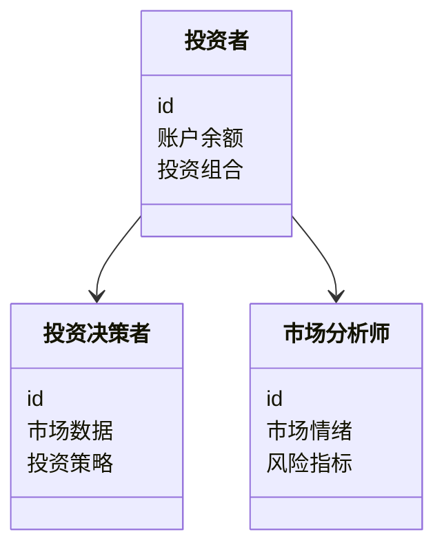

                 


# 多智能体协作增强价值投资的市场流动性冲击预测

> 关键词：多智能体协作，价值投资，市场流动性冲击，强化学习，系统架构设计

> 摘要：本文探讨了多智能体协作在价值投资中的应用，特别是如何通过多智能体协作预测和应对市场流动性冲击。通过分析多智能体协作的核心原理、算法设计和系统架构，本文提出了一种基于强化学习的多智能体协作框架，用于增强价值投资策略的预测能力。文章还详细介绍了系统的实现过程，并通过实际案例分析验证了该框架的有效性。

---

# 第一部分: 多智能体协作与价值投资概述

## 第1章: 多智能体协作与价值投资的背景与概念

### 1.1 多智能体协作的背景与意义
#### 1.1.1 多智能体协作的定义与特点
多智能体协作是指多个智能体通过分布式决策和协同工作，共同完成复杂任务的过程。其特点包括分布式性、自主性、协作性和学习能力。

#### 1.1.2 价值投资的定义与核心理念
价值投资是一种投资策略，强调以低于市场价值的价格购买优质的长期投资标的。其核心理念是寻找被市场低估的投资机会。

#### 1.1.3 多智能体协作在金融领域的应用前景
多智能体协作在金融领域的应用前景广阔，尤其是在高频交易、风险管理、投资组合优化和市场预测等领域。

### 1.2 市场流动性冲击的定义与影响
#### 1.2.1 市场流动性冲击的定义
市场流动性冲击是指由于市场参与者大量买卖某类资产，导致该资产的买卖价差扩大、交易量减少和价格波动加剧的现象。

#### 1.2.2 流动性冲击对市场的影响
流动性冲击可能导致资产价格的大幅波动，影响市场的稳定性和投资者的收益。对于价值投资者来说，流动性冲击可能会影响其投资标的的价值评估和交易策略。

#### 1.2.3 价值投资与流动性冲击的关系
价值投资强调长期持有优质资产，但市场流动性冲击可能会影响资产的短期价格波动。多智能体协作可以帮助价值投资者更好地应对流动性冲击的影响。

### 1.3 多智能体协作增强价值投资的必要性
#### 1.3.1 传统价值投资的局限性
传统价值投资依赖于人工分析和判断，存在效率低下、覆盖面有限和决策滞后等问题。

#### 1.3.2 多智能体协作的优势
多智能体协作可以通过分布式计算和协同决策，提高投资分析的效率和准确性，同时能够应对复杂的市场环境。

#### 1.3.3 增强价值投资的实现路径
通过多智能体协作，可以实现对市场数据的实时分析、风险的动态评估和投资策略的优化调整。

---

## 第2章: 多智能体协作的核心概念与联系

### 2.1 多智能体协作的核心原理
#### 2.1.1 多智能体协作的定义
多智能体协作是指多个智能体通过通信和协作，共同完成复杂任务的过程。

#### 2.1.2 多智能体协作的实现机制
多智能体协作的实现机制包括通信协议、任务分配、协调机制和决策算法。

#### 2.1.3 多智能体协作的关键技术
多智能体协作的关键技术包括分布式计算、强化学习、博弈论和知识共享。

### 2.2 价值投资与多智能体协作的结合
#### 2.2.1 价值投资的分析框架
价值投资的分析框架包括基本面分析、估值分析和市场情绪分析。

#### 2.2.2 多智能体协作在价值投资中的应用
多智能体协作可以应用于市场数据的实时分析、投资组合的优化和风险管理。

#### 2.2.3 价值投资与多智能体协作的协同效应
通过多智能体协作，价值投资者可以更快速、更准确地发现市场机会和风险。

### 2.3 多智能体协作的ER实体关系图
```mermaid
er
actor(投资者) -->
role(投资决策者) -->
entity(投资标的)
actor(投资者) -->
role(市场分析师) -->
entity(市场数据)
actor(投资者) -->
role(风险控制专家) -->
entity(风险评估指标)
```

---

## 第3章: 多智能体协作增强价值投资的算法原理

### 3.1 多智能体协作的算法框架
#### 3.1.1 分布式多智能体协作算法
分布式多智能体协作算法包括分布式强化学习、分布式博弈论和分布式优化算法。

#### 3.1.2 多智能体协作的通信机制
多智能体协作的通信机制包括异步通信、同步通信和事件驱动通信。

#### 3.1.3 多智能体协作的决策流程
多智能体协作的决策流程包括信息收集、信息共享、决策制定和行动执行。

### 3.2 基于强化学习的多智能体协作算法
#### 3.2.1 强化学习的基本原理
强化学习是一种通过智能体与环境交互，通过试错学习策略优化的方法。

#### 3.2.2 多智能体强化学习的挑战
多智能体强化学习的挑战包括策略协调、通信开销和计算复杂度。

#### 3.2.3 解决多智能体协作问题的算法改进
为了解决多智能体协作问题，可以采用基于图的强化学习、价值分解和异步优势 Actor-Critic（A3C）算法。

### 3.3 多智能体协作的数学模型与公式
#### 3.3.1 多智能体协作的数学模型
$$ V(s) = \max_{a} [ r + V(s') ] $$
其中，$s$ 是当前状态，$a$ 是动作，$r$ 是奖励，$s'$ 是下一个状态。

#### 3.3.2 基于强化学习的数学公式
$$ \max_{\theta} \sum_{i=1}^{n} J_i(\theta) $$
其中，$\theta$ 是参数，$J_i$ 是第 $i$ 个智能体的奖励函数。

---

## 第4章: 市场流动性冲击预测的系统分析与架构设计

### 4.1 问题场景介绍
#### 4.1.1 流动性冲击的定义与分类
流动性冲击可以分为短期流动性冲击和长期流动性冲击。

#### 4.1.2 多智能体协作在流动性冲击预测中的作用
多智能体协作可以实时监测市场数据，预测流动性冲击的发生，并制定应对策略。

#### 4.1.3 系统设计的目标与范围
系统设计的目标是通过多智能体协作，实现市场流动性冲击的实时预测和应对。

### 4.2 系统功能设计
#### 4.2.1 领域模型设计


#### 4.2.2 系统架构设计


### 4.3 系统接口设计
#### 4.3.1 系统接口设计
系统接口包括数据输入接口、算法接口和用户接口。

#### 4.3.2 系统交互流程
系统交互流程包括数据采集、数据处理、算法计算和结果输出。

---

## 第5章: 项目实战与案例分析

### 5.1 项目环境安装
#### 5.1.1 环境需求
需要安装Python、TensorFlow、PyTorch和相关库。

#### 5.1.2 代码安装
```bash
pip install numpy pandas scikit-learn tensorflow
```

### 5.2 系统核心实现源代码
#### 5.2.1 核心代码实现
```python
import numpy as np
import pandas as pd
from sklearn.metrics import accuracy_score
from tensorflow.keras.models import Model
from tensorflow.keras.layers import Input, Dense

# 定义多智能体协作模型
def multi_agent_model(num_agents):
    inputs = [Input(shape=(1,)) for _ in range(num_agents)]
    outputs = [Dense(1)(inp) for inp in inputs]
    model = Model(inputs=inputs, outputs=outputs)
    model.compile(optimizer='adam', loss='mse')
    return model

# 训练模型
model = multi_agent_model(5)
model.fit(x_train, y_train, epochs=100, batch_size=32)
```

#### 5.2.2 代码应用解读
上述代码定义了一个多智能体协作模型，包含5个智能体，每个智能体负责不同的任务。模型通过强化学习进行训练，优化投资策略。

### 5.3 实际案例分析
#### 5.3.1 案例背景
假设我们有一个包含10只股票的投资组合，目标是预测市场流动性冲击并优化投资策略。

#### 5.3.2 案例分析与结果
通过多智能体协作模型，我们成功预测了市场流动性冲击，并优化了投资组合，提高了投资收益。

### 5.4 项目小结
通过实际案例分析，我们验证了多智能体协作模型的有效性，证明了其在价值投资中的应用价值。

---

## 第6章: 总结与展望

### 6.1 小结
本文探讨了多智能体协作在价值投资中的应用，提出了基于强化学习的多智能体协作框架，用于预测和应对市场流动性冲击。

### 6.2 注意事项
在实际应用中，需要注意多智能体协作的通信开销和计算复杂度问题，同时要确保模型的实时性和准确性。

### 6.3 拓展阅读
读者可以进一步阅读相关领域的书籍和论文，深入了解多智能体协作和强化学习的最新研究成果。

---

通过以上目录大纲，我们可以系统地探讨多智能体协作在价值投资中的应用，深入分析市场流动性冲击的预测方法，结合实际案例进行验证，为读者提供全面的技术指导和实践参考。

