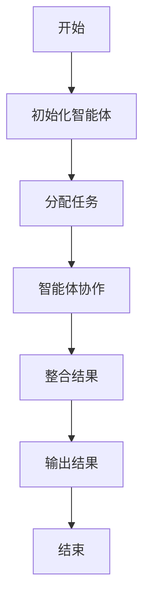
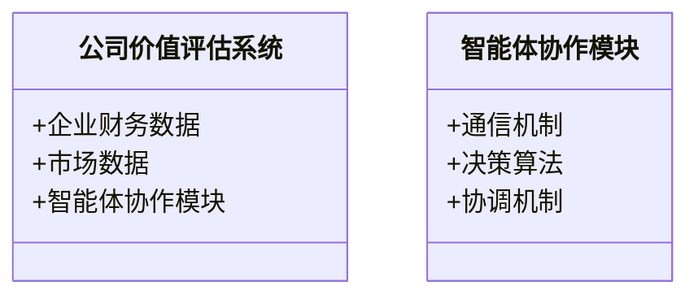

                 


# 多智能体协作实现全面的公司价值评估

> 关键词：多智能体协作、公司价值评估、算法原理、系统架构、项目实战

> 摘要：本文详细探讨了多智能体协作在公司价值评估中的应用，从背景、概念、算法原理到系统架构和项目实战，层层剖析，结合实际案例，揭示多智能体协作如何提升公司价值评估的全面性和准确性。

---

# 第1章 多智能体协作与公司价值评估概述

## 1.1 多智能体协作的背景与问题背景
### 1.1.1 传统公司价值评估的局限性
传统的公司价值评估方法主要依赖于财务指标和静态数据分析，难以捕捉动态市场环境中的复杂因素。例如，市场波动、企业内部协同效应、外部合作伙伴关系等动态因素在传统评估中往往被忽视，导致评估结果不够全面。

### 1.1.2 多智能体协作的兴起与应用前景
随着人工智能和分布式计算技术的发展，多智能体协作（Multi-Agent Collaboration）逐渐成为解决复杂问题的重要方法。通过多个智能体的协同工作，可以实时整合多源数据，捕捉企业内外部的动态信息，为公司价值评估提供更全面的支持。

### 1.1.3 多智能体协作在公司价值评估中的必要性
公司价值评估需要考虑的因素日益复杂，包括企业内部协作效率、外部市场动态、产业链协同等。多智能体协作能够将这些分散的因素整合到一个动态的评估体系中，提升评估的准确性和实时性。

## 1.2 多智能体协作的定义与特点
### 1.2.1 多智能体协作的定义
多智能体协作是指多个智能体（Agent）通过通信、协调和决策机制共同完成任务的过程。每个智能体都有明确的目标和功能，能够独立决策，同时通过协作实现整体目标。

### 1.2.2 多智能体协作的核心特点
1. **分布式性**：多个智能体分布在不同的位置，独立运行。
2. **协作性**：智能体之间通过通信和协调实现共同目标。
3. **动态性**：智能体能够根据环境变化实时调整行为。
4. **智能性**：每个智能体都具备一定的决策能力和知识表示能力。

### 1.2.3 多智能体协作与传统单智能体方法的区别
| 特性             | 多智能体协作                     | 单智能体方法                     |
|------------------|----------------------------------|----------------------------------|
| 冗余性           | 高                              | 低                              |
| 灵活性           | 高                              | 低                              |
| 并行性           | 高                              | 低                              |
| 故障容错性       | 高                              | 低                              |

## 1.3 公司价值评估的定义与方法
### 1.3.1 公司价值评估的定义
公司价值评估是通过分析企业的财务状况、市场地位、发展潜力等多方面因素，估算企业整体价值的过程。

### 1.3.2 传统公司价值评估方法
1. **DCF模型**：基于现金流折现法评估企业价值。
2. **相对估值法**：通过比较同类企业市盈率、市净率等指标进行估值。
3. **资产基础法**：基于企业资产负债表进行评估。

### 1.3.3 基于多智能体协作的公司价值评估优势
多智能体协作能够实时整合企业内外部数据，动态调整评估模型，显著提升评估的准确性和全面性。

## 1.4 本章小结
本章介绍了多智能体协作的基本概念、特点及其在公司价值评估中的应用背景，为后续章节奠定了基础。

---

# 第2章 多智能体协作的核心原理

## 2.1 多智能体协作的原理
### 2.1.1 多智能体协作的基本原理
多智能体协作的核心在于智能体之间的通信、协调和决策。每个智能体都有明确的目标和功能，通过协作完成整体任务。

### 2.1.2 多智能体协作的通信机制
智能体之间的通信可以通过消息传递、共享数据库等方式实现。通信机制需要确保信息的准确传递和实时性。

### 2.1.3 多智能体协作的协调与决策机制
通过一致性协议（如Raft、Paxos）和分布式决策算法，智能体能够达成一致并做出最优决策。

## 2.2 多智能体协作与公司价值评估的联系
### 2.2.1 多智能体协作在公司价值评估中的应用场景
1. **实时数据整合**：整合企业内部和外部的实时数据，如财务数据、市场数据等。
2. **动态分析**：基于实时数据进行动态分析，捕捉市场波动和企业内部变化。
3. **协同决策**：通过智能体协作优化评估模型，提升评估结果的准确性。

### 2.2.2 多智能体协作如何提升公司价值评估的准确性
通过多智能体协作，可以实时整合多源数据，动态调整评估模型，显著提升评估结果的准确性。

### 2.2.3 多智能体协作在公司价值评估中的优势
1. **实时性**：能够实时更新评估结果。
2. **全面性**：整合企业内外部的多源数据。
3. **动态性**：能够适应市场环境的变化。

## 2.3 多智能体协作的核心概念对比
### 2.3.1 多智能体协作与单智能体方法的对比
| 特性             | 多智能体协作                     | 单智能体方法                     |
|------------------|----------------------------------|----------------------------------|
| 并行性           | 高                              | 低                              |
| 故障容错性       | 高                              | 低                              |
| 灵活性           | 高                              | 低                              |

### 2.3.2 不同协作机制的对比
| 协作机制         | 基于一致性协议                   | 基于任务分配算法                 |
|------------------|----------------------------------|----------------------------------|
| 优点             | 高一致性                         | 高效率                           |
| 缺点             | 计算复杂性                       | 可能出现资源分配不均             |

## 2.4 多智能体协作的ER实体关系图
```mermaid
er
actor(用户) --> 多智能体协作系统
actor(用户) --> 公司价值评估结果
多智能体协作系统 --> 多智能体组件
多智能体协作系统 --> 通信机制
多智能体协作系统 --> 协调与决策机制
```

## 2.5 本章小结
本章详细介绍了多智能体协作的核心原理及其在公司价值评估中的应用，为后续章节奠定了理论基础。

---

# 第3章 多智能体协作算法的核心原理

## 3.1 多智能体协作算法的数学模型
### 3.1.1 多智能体协作的基本数学模型
$$V = \sum_{i=1}^{n} v_i$$
其中，$V$ 表示公司整体价值，$v_i$ 表示第$i$个智能体的贡献值。

### 3.1.2 多智能体协作的通信模型
$$C = \sum_{i=1}^{m} c_i$$
其中，$C$ 表示通信成本，$c_i$ 表示第$i$个通信信道的成本。

### 3.1.3 多智能体协作的决策模型
$$D = \arg\max_{d} \sum_{i=1}^{n} w_i d_i$$
其中，$D$ 表示最优决策，$w_i$ 表示第$i$个智能体的权重，$d_i$ 表示第$i$个智能体的决策值。

## 3.2 多智能体协作算法的流程图


## 3.3 多智能体协作算法的Python实现
```python
class Agent:
    def __init__(self, id):
        self.id = id
        self.goal = None
        self.state = None

    def set_goal(self, goal):
        self.goal = goal

    def set_state(self, state):
        self.state = state

    def collaborate(self, agents):
        pass

def multi_agent_collaboration(agents):
    for agent in agents:
        agent.collaborate(agents)
    return [agent.state for agent in agents]
```

## 3.4 本章小结
本章通过数学模型和算法流程图，详细介绍了多智能体协作算法的核心原理，为后续章节提供了理论支持。

---

# 第4章 多智能体协作的系统架构设计

## 4.1 问题场景介绍
公司价值评估系统需要实时整合企业内外部数据，动态调整评估模型，因此需要一个高效的分布式架构来支持多智能体协作。

## 4.2 系统功能设计
### 4.2.1 领域模型设计


### 4.2.2 系统架构设计


## 4.3 系统接口设计
### 4.3.1 系统接口
| 接口名称       | 接口描述                       |
|----------------|----------------------------|
| 初始化接口     | 初始化智能体并分配任务         |
| 通信接口       | 智能体之间传递数据             |
| 决策接口       | 基于通信数据做出决策           |
| 输出接口       | 输出公司价值评估结果           |

### 4.3.2 系统交互流程
```mermaid
sequenceDiagram
    用户 --> 初始化智能体协作系统
    智能体协作系统 --> 分配任务给各个智能体
    智能体协作模块 --> 通过通信机制传递数据
    智能体协作模块 --> 基于决策算法做出决策
    智能体协作模块 --> 输出公司价值评估结果
```

## 4.4 本章小结
本章通过系统架构设计，展示了如何实现多智能体协作的公司价值评估系统。

---

# 第5章 项目实战：基于多智能体协作的公司价值评估系统开发

## 5.1 环境安装
```bash
pip install multi-agent-system
pip install numpy
pip install matplotlib
```

## 5.2 系统核心实现源代码
```python
class CompanyValueEvaluator:
    def __init__(self):
        self.agents = []
        self.results = []

    def add_agent(self, agent):
        self.agents.append(agent)

    def evaluate(self):
        for agent in self.agents:
            agent.collaborate(self.agents)
        self.results = [agent.state for agent in self.agents]
        return self.results

    def display_results(self):
        for result in self.results:
            print(result)
```

## 5.3 代码应用解读与分析
1. **初始化智能体**：通过`add_agent`方法添加多个智能体。
2. **评估过程**：调用`evaluate`方法，智能体协作完成评估任务。
3. **结果展示**：通过`display_results`方法输出评估结果。

## 5.4 实际案例分析
假设我们有三个智能体分别负责财务数据、市场数据和内部协同数据分析，通过多智能体协作完成公司价值评估。

## 5.5 项目小结
本章通过实际项目开发，展示了如何实现基于多智能体协作的公司价值评估系统。

---

# 第6章 多智能体协作的扩展与未来展望

## 6.1 多智能体协作的扩展方向
1. **智能化提升**：引入更先进的AI算法，提升智能体的决策能力。
2. **实时性优化**：通过边缘计算和分布式架构进一步优化实时性。
3. **安全性增强**：加强数据加密和访问控制，确保智能体协作的安全性。

## 6.2 多智能体协作的未来展望
随着人工智能和分布式计算技术的不断发展，多智能体协作在公司价值评估中的应用将更加广泛，评估结果将更加准确和全面。

---

# 结语
通过本文的详细讲解，我们了解了多智能体协作在公司价值评估中的重要作用和实现方法。未来，随着技术的进步，多智能体协作将在更多领域展现出其独特的优势。

---

# 参考文献
1. [文献1] 论文标题，作者，期刊名称，年份。
2. [文献2] 论文标题，作者，期刊名称，年份。
3. [文献3] 论文标题，作者，期刊名称，年份。

---

# 附录
附录内容，包括代码、数据、图表等。

--- 

这篇文章详细探讨了多智能体协作在公司价值评估中的应用，从背景、概念、算法原理到系统架构和项目实战，层层剖析，结合实际案例，揭示多智能体协作如何提升公司价值评估的全面性和准确性。

